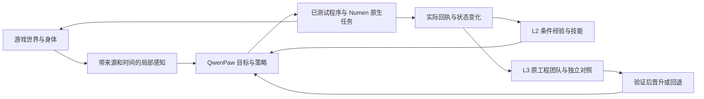

# 异世界千灯纪 · 本地整合项目

一个运行在本机的 **Minecraft 多 Agent 共生服务器**：真人玩家、房主女神、运营 Agent 团队、自主生存
Agent 与女仆妖精 Agent 共享同一个世界，各自有独立职责与入口。

项目以 Minecraft 为具身智能试验环境，目标是让 Agent 通过真实感知、身体行动、结果反馈和可验证的自我改进持续成长。
QwenPaw 管理认知、交流与工程角色，Numen 服务端假玩家承担身体控制；当前已部署具身基础，完整 RSI 收益仍待独立场景验证。

- 游戏版本：**Minecraft 1.21.1 / NeoForge 21.1.248 / Java 21**
- 项目目录：`D:\Projects\QiandengJi`
- 源码仓库：[jcs130/minecraft-ai-friend](https://github.com/jcs130/minecraft-ai-friend)，交付主干 `main`，隔离开发使用 `codex/*`；原世界源码已移入 `world/`
- 当前按 **13 个活动 Docker 服务** 管理；历史阶段验收日志见 [整合历史记录](docs/INTEGRATION-HISTORY.md)

> 本仓库保存源码、配置模板、构建工具与验证方法。运行状态、`reports/`、存档和成品链接指开发机上的本地文件，Git clone 不包含这些，也不等于已完成环境安装。首次拉取先读 [GitHub 开发与本机资源恢复](docs/GITHUB-WORKFLOW.md)。

---

## 设计与实现进展（2026-09-21）

### L1 / L2 / L3：从行动闭环到模块化自进化

| 层 | 职责 | 当前落点 |
| --- | --- | --- |
| **L1 快循环** | 感知 → 决策 → 行动 → 反馈 → 简短现场修正 | QwenPaw 选择目标和技能，Numen 原生任务与已测试的本地程序持续执行；状态、回执与会话按需传递 |
| **L2 经验沉淀** | 提炼有适用条件的经验、规则和可复用技能 | 复用个人 notes、学习目录、SkillLibrary 与 PracticeStore，保留来源、失败和失效条件 |
| **L3 模块化 RSI 慢循环** | 从多任务共性问题中选择一个模块改进，比较候选与基线 | 复用原运营工程团队、工单、隔离源码工作区、固定测试和交付回执；完整世界 A/B 与保留场景收益尚未验收 |

三层是本项目的分工；借鉴 ModularRSI 的轨迹对照、跨任务汇总、单模块修改和验证方法。
模型可以改进感知、工具使用、上下文、循环及完成判断，但一次实验的独立评分依据保持固定。
经验条目增加、代码提交或测试通过，都需进一步结合世界中的客观结果评价。详见 [RSI 落地设计](docs/RSI-AGENT-DESIGN.md)。



### 已实现的具身基础与世界功能

- **身体与感知**：桐人使用 Numen 服务端假玩家，移动沿原生输入和玩家物理执行。共享 `sense` 提供身体、场景、方块、容器、机器存储及菜单查询；模组信息以其实际暴露的能力为限。`move`、`interact_at` 与程序技能复用身体租约和任务回执，受理、完成、失败与未知分别记录。
- **上下文与交流**：行动按目标组织持久 session，复盘、学习、交流分开；首帧短约定，后续传已确认基线上的变化和新反馈。`status(detail="brief")` 按需省略背包槽位，旧经验已归档并移出当前默认检索。身体执行期间可以处理只读交流；同角色仍保持一次模型任务，真人语音/弹幕端到端效果尚未完整验收。应用层增量也不等于供应商仅处理新增 token。见 [具身架构与部署证据](docs/EMBODIED-AGENT.md)。
- **文字即接口与技能罗盘**：罗盘默认“我的技能”，学习图鉴分离，显示装备、魔力与冷却条件；铁魔法提供入门指南。Agent 通过 `skills --json`、`help <ID>` 和既有施法/回执工具按需学习与使用。运营角色已接入平衡与性能复盘指引，自动调参收益尚未验证。见 [技能系统修复](docs/SKILL-SYSTEM-REVIEW.md)。
- **可观察的运行状态**：QwenPaw 应用中心已接通 `evolution-board` 与 `gods-eye`，展示当前记忆代的行为分类、拒绝/未知、小时趋势与村庄画面。动作确认率和任务成功率分开，数据标明采样时间。见 [PawApp 实测记录](docs/PAWAPPS-OBSERVATION.md)。
- **持续运行恢复**：桐人查询模型任务遇到临时传输错误时，在原期限内继续查询同一任务；结衣复用已有对账机制解除旧未知任务占用，恢复原生活班次。实测发现的公会讨伐计数器条件错误已修正。真实新任务、失败回执与验收边界见 [持续运行修复](docs/AGENT-CONTINUITY-REPAIR.md)。
- **共享世界**：主城原址扩建为含街区、住宅、农场、池塘及探索入口的河湾镇；村庄恢复、安全区与主城建筑保护已部署，悬空残块已清理。见 [城镇布局](docs/TOWN-EXPANSION-DESIGN.md)、[主城保护](docs/TOWN-PROTECTION.md)、[清理记录](docs/TOWN-FLOATING-CLEANUP.md)。

### 下一阶段：可训练的本地快策略

已精读 [Neko / Cortico](docs/OPEN-SOURCE-AGENT-CODE-STUDY.md) 的运行机制，以及 Jev Minecraft 示例、Laya 和 Brain Doom 的决策/执行或训练实现。
拟在现有 L1 中评估“结构化感知 → 合法候选动作 → 本地小模型 → 有界原生输入”，让 QwenPaw 继续负责目标、聊天和技能创造。
Numen 已有移动、跳跃和视角驱动；统一 WASD/视角输入帧、逐 tick 训练记录及策略权重晋升仍需实现。

Jev 当前作为云端决策对照候选，不提供客户微调；自训优先评估开放编码器加决策头或 Laya，先行为克隆，再在隔离环境比较强化学习。
像素到键鼠路线可参考 STEVE-1/VPT，但需要另行准备第一人称帧与同步动作数据。
**目前没有接入 Jev、训练快策略或部署新的模型控制器**；参考项目的离线测试不能替代本项目游戏实测。来源、源码锁定版本与训练路线见 [Jev 与可训练快策略调研](docs/JEV-FAST-POLICY-RESEARCH.md)。

---

## 一、四类 Agent

整个系统的核心是四类自主 Agent，分工明确、互不替代：

### 1. 房主 · 灯语女神（世界管理权威）
世界的「房主」与管理员。以名为 `Goddess` 的观察者 bot 入驻服务器，通过受管世界工具掌管巡逻、分诊、
派发、内容审批与程序化咏唱→法术。其 LLM 神谕走 QwenPaw 角色 `game:mc-god`。最终所有权归人类「造物主」。
- 载体：`world` 服务（`world/bootstrap-world.mts`，TS 世界引擎，进程内装配 magic/social/saga/terra/worlddb/logwatch 等）
- 天神之眼（世界观察渲染）：宿主 **19092**

### 2. 开发运营 Agent 团队（QwenPaw 单实例 · 10 角色）
负责游戏的开发、运营、策划与协调，全部统一在**游戏 QwenPaw 实例**（控制台 **18089**），以原生 cron
班次串行运行（旧独立运营实例已归档）。canonical 角色源：`world/ops/world_team.py`。
- **天神 / 工程师**（`qd-engineer`）：读写 `engineering/repo` 源码、跑隔离测试、提交受审修复
- **司灯 / 协调**（`qd-steward`）：工单台账、风险派发、回执
- **公会策划**（`qd-guild-planner`）：剧情/任务/活动设计，提交内容包
- 另有 **灯语·玩家交流**（`mc-herald`）、**内测玩家**（`qd-survivor`）、村民/女仆对话角色、结衣、女仆角色
- 治理入口：管理台 **19091** `#operations`；统一 CLI `python tools/project.py ops status`
- 设计背景见 [运营组说明](docs/OPERATIONS-TEAM.md)、[世界团队架构](docs/WORLD-TEAM-ARCHITECTURE.md)

### 3. 自主生存 · 自我进化 Agent —— 桐人（survivor）
一个以自主游玩和可验证自我进化为目标的具身游戏 Agent：controller tick 主循环驱动感知→决策→动作，经 Numen 网关
落地到游戏。当前以具身 L1/L2/L3 架构组织状态、行为会话、程序技能、经验和工程改进；慢层模型选择目标，
快层复用原生控制与已测试程序。可训练快模型仍在研究阶段，长期自主成长与 RSI 收益需要实际对照验证。
- 载体：`survivor` 服务（`world/survival/service.py`），核心逻辑 `world/survival/controller.py`
- 当前设计见 [具身 Agent](docs/EMBODIED-AGENT.md)、[三层 RSI](docs/RSI-AGENT-DESIGN.md)；早期实现背景见 [快慢双系统](docs/FAST-SLOW-AGENT-SYSTEM.md)、[自我规划](docs/SURVIVOR-SELF-DIRECTED-PLANNING.md)

### 4. 女仆妖精 Agent —— 结衣 / Yui（车万女仆模组）
基于 **车万女仆（Touhou Little Maid）** 模组的辅助妖精伴侣：SAO 导航妖精结衣，承担陪伴/家庭与
管理救援职责，**不会死亡**（伴侣保护），与桐人组成两人小队（桐人自主游玩成长，结衣不替其游玩）。
- Java 模组侧：`world/maid-bridge-src`（Touhou Little Maid 1.5.3 扩展，站点 `qiandeng-qwen`）
- Python 侧：`world/sidecar/maid_agent_api.py`（OpenAI 形状适配器 → QwenPaw 角色 `qd-maid-dialogue`）+ 身份/注册/原生工具/对话收件箱
- 村民与女仆引擎：`npc` 服务（`world/sidecar/mc_npc.py`，走裸 RCON），启动时拉起 maid-agent（:8091）与 party-agent
- 设计见 [女仆 Agent 设计](docs/MAID-AGENTS-DESIGN.md)、[结衣自主生活](docs/YUI-AUTONOMOUS-LIFE.md)、[SAO 角色](docs/SAO-CHARACTERS.md)

---

## 二、服务与基础设施（13 个活动服务）

| 服务 | 镜像 | 职责 | 宿主端口 |
|---|---|---|---|
| `mc` | itzg/minecraft-server:java21 | MC 服务器，持 shadow 世界存档 | 25565(LAN) / 25567(本机兼容) / RCON 25577 / 语音 24455·udp |
| `world` | qiandengji-world | 房主女神世界引擎 + 天神之眼渲染 | 19092 |
| `gate` | qiandengji-world | vanilla↔NeoForge 握手代理，Agent 协议入口 | 25701 |
| `panel` | qiandengji-world | 只读管理台（#operations/#services/#survivor） | 19091 |
| `control` | qiandengji-world | 部署/重启回执通道（/plan+/execute） | 容器内 3090 |
| `inventory` | qiandengji-sidecar | 只读容器健康采集 → panel | — |
| `npc` | qiandengji-sidecar | 村民/女仆引擎（含 maid-agent、party-agent） | — |
| `resources` | qiandengji-sidecar | 女仆语音包静态服务 | 19090 |
| `qwenpaw` | qiandengji-qwenpaw-game:2.2.1 | 游戏 QwenPaw（运营团队 10 角色宿主） | 18089 |
| `survivor` | qiandengji-survivor | 自主生存 Agent（桐人） | — |
| `voice` | qiandengji-voice | 女神语音监听（god-voice-watcher） | — |
| `asr` | qiandengji-voice | 麦克风 ASR 监听 | — |
| `tts` | qiandengji-tts:kokoro | Kokoro 中文 TTS | 8100 |

> `qwenpaw-ops`（旧独立运营实例，18090）在 compose 中保留定义但**已归档、不在 13 个活动服务内**；运营角色已并入游戏 QwenPaw 18089。

**载入 mc 的自研模组（非独立服务）**：botgate（Agent 协议/技能箱/飞行/附魔/光环）、maid-bridge（车万女仆桥）、irons-bridge（原生铁魔法）、god-voice、chanting-items（自制言灵法杖）、client-controls（客户端控制器）。源码在 `world/*-src/`。

**外部 Agent 接入**：运行 stdio Python MCP 桥 `tools/run_numen_mcp.py`（配置示例 `config/numen-mcp.example.json`），默认 `MC_HOST=127.0.0.1:25567`、`MC_RCON=127.0.0.1:25577`，身体经 `numen_act summon` 召唤；或以原版 bot 经 gate 25701 接入。详见 [NUMEN-MCP](docs/NUMEN-MCP.md)。

---

## 三、开始使用

1. 打开 Docker Desktop，双击 `start-server.bat`，等待服务健康。
2. 双击 `start-client.bat`，输入原来的玩家名（**拼写和大小写保持一致**，离线模式相同名字才对应原 UUID/背包/进度）；客户端连接 `127.0.0.1:25567`。
3. 结束后运行 `stop-server.bat` 正常保存并停止；`check-health.bat` 检查服务与实际联调结果。

局域网玩家在多人游戏中手动添加 `192.168.3.133`（TCP 25565）；游戏端口与语音 UDP 24455 已开放给局域网，管理端口仅本机。QA 用专用测试角色，请用自己的原名继续玩。

---

## 四、本机地址

| 用途 | 地址 |
|---|---|
| Minecraft / Agent 直连（本机兼容入口） | 127.0.0.1:25567 |
| 局域网游戏连接 | 192.168.3.133:25565 |
| 原版协议 Agent 网关（gate） | 127.0.0.1:25701 |
| 本项目 RCON | 127.0.0.1:25577 |
| Simple Voice Chat | 127.0.0.1:24455/udp |
| 游戏 QwenPaw 控制台（本机免密码，运营团队 10 角色） | http://127.0.0.1:18089 |
| D 盘独立管理台（运营治理 / 服务维护 / 天神之眼入口） | http://127.0.0.1:19091 |
| 天神之眼（世界观察渲染） | http://127.0.0.1:19092 |
| 女仆语音包 | http://127.0.0.1:19090/packs/ |

管理台与游戏 QwenPaw 仅发布到 `127.0.0.1`、本机免密码。旧运营 18090 已归档停用。

---

## 五、开发与验证

```powershell
cd D:\Projects\QiandengJi
python -m unittest discover -s tests -v
python tools/project.py status
python world/ops/health/health_mon.py
python tools/export_pack.py
```

- 代码架构与模块拆分见 [ARCHITECTURE.md](docs/ARCHITECTURE.md)。
- 可独立复用的两个组件：容器编队控制面（`world/admin/fleet/control-core.mjs` + 项目拓扑 `world/admin/topology.qiandengji.mjs`）与 [Agent 安全提交工作区](docs/AGENT-SAFE-COMMIT.md)（`world/ops/engineering_workspace.py` + `world/admin/engineering-runner.mjs`），两者都不含 Minecraft 概念，绑定项通过构造参数注入。
- 部署/重启**必须**走 control 回执通道（`/plan`+`/execute`，自动 mc save-all、依赖序、健康门、持久回执），发布流程见 [部署 runbook](docs/deploy-release-runbook.md)。按受影响组件核对挂载源码、镜像或模组 JAR，精确部署并保留回退点；生产工作区有未提交改动时不得用整目录覆盖或强制切分支代替部署。
- 服务健康与扩展文件哈希见 [runtime-health.json](reports/runtime-health.json)；各专项验收证据在 `reports/`，以报告时间和 `ok` 字段为准。
- 源码、模板与报告不含密钥；`server/`、`client/`、`.env`、`dist/` 被 Git 忽略。

---

## 六、目录与备份

| 目录 | 内容 |
|---|---|
| `world/` | 世界端源码：`src`(TS 世界引擎/gate)、`admin`(panel/control/eye)、`ops`(运营/QwenPaw 治理)、`sidecar`(NPC/女仆/公会/语音)、`survival`(自主生存 Agent)、`*-src`(自研模组源) |
| `server/mc/shadow/` | 已迁入并实际运行的原存档 |
| `server/world-data/` | 技能、成长、人物、数据库和 AI 通道的权威数据 |
| `server/mcdata/` | 游戏模组与 NPC 的共享队列、状态镜像 |
| `server/agents/` | QwenPaw 角色、工作区、会话及本机配置与凭据（Git 忽略） |
| `config/` | 角色（`characters/`）、伴侣保护、技能目录、Numen MCP 示例等配置 |
| `tools/` | 构建、迁移、启动与实际冒烟工具 |
| `manifests/`、`reports/` | 文件锁、依赖检查及联调证据 |
| `dist/` | 可导入整合包 |
| `client/` | 可运行整合客户端（本机配置和日志，Git 忽略） |

备份个人进度：等 `stop-server.bat` 完成后备份整个 `server/`（只复制 region 会丢失其他维度、玩家数据与自研技能进度）。

---

## 七、客户端分发包（当前）

当前分发包：[`dist/QiandengJi-1.21.1-0.1.5-local.mrpack`](dist/QiandengJi-1.21.1-0.1.5-local.mrpack)，已导出并完成成品校验。

- 大小：383,651,079 字节；SHA256：`7d80d0bff7885153ffd11ac424f9369e5547c0646a12f854c4a8b66e4e5937a0`
- 88 个模组 JAR、自制言灵杖、基础优化设置、女仆语音包、原生 YSM 人物模型；Minecraft/NeoForge 由启动器安装
- 完整校验记录见 [pack-export.json](reports/pack-export.json)；旧包与历史明细见 [整合历史记录](docs/INTEGRATION-HISTORY.md)

单机存档使用相同模组时，可把 `dist/QiandengJi-content-fixes-1.21.1.zip` 放进该存档 `datapacks/`（独立于客户端 mrpack，不含地形扩展；源码 `content/datapacks/qiandeng_fixes/`，重建工具 `tools/prepare_content_fixes.py`）。客户端兼容与注册表差异见 [CLIENT-REGISTRY-COMPATIBILITY.md](docs/CLIENT-REGISTRY-COMPATIBILITY.md)。

---

## 八、延伸文档

- 当前具身与自进化设计：[EMBODIED-AGENT.md](docs/EMBODIED-AGENT.md)、[RSI-AGENT-DESIGN.md](docs/RSI-AGENT-DESIGN.md)
- 快循环参考与训练方向：[Neko / Cortico 源码对照](docs/OPEN-SOURCE-AGENT-CODE-STUDY.md)、[Jev / Laya / Brain 调研](docs/JEV-FAST-POLICY-RESEARCH.md)
- 运行观测与近期技能改进：[PawApp](docs/PAWAPPS-OBSERVATION.md)、[技能罗盘与 CLI](docs/SKILL-SYSTEM-REVIEW.md)
- 运行布局与验收边界：[GAME-RUNTIME-LAYOUT.md](docs/GAME-RUNTIME-LAYOUT.md)
- 技能与统一入口：[SKILLS-UNIFIED-CLI.md](docs/SKILLS-UNIFIED-CLI.md)、[言灵法杖](docs/STAFF-CHANTING-DESIGN.md)、[语言即接口](docs/LANGUAGE-INTERFACE.md)
- AI 共生世界设计（后续方案，非已部署）：[SYMBIOSIS-WORLD-DESIGN.md](docs/SYMBIOSIS-WORLD-DESIGN.md)
- 服务器管理：[SERVER-MANAGEMENT.md](docs/SERVER-MANAGEMENT.md)
- 历史阶段验收日志：[INTEGRATION-HISTORY.md](docs/INTEGRATION-HISTORY.md)
- Agent 协作约定（权威）：[AGENTS.md](AGENTS.md)
