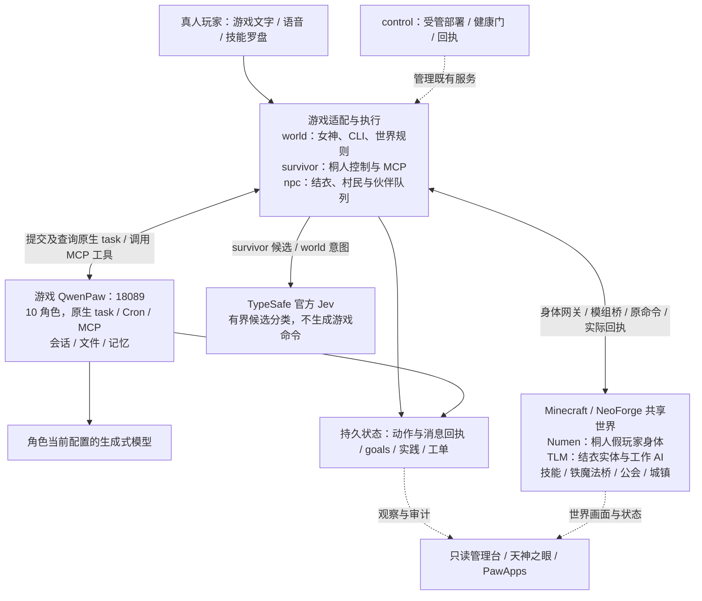
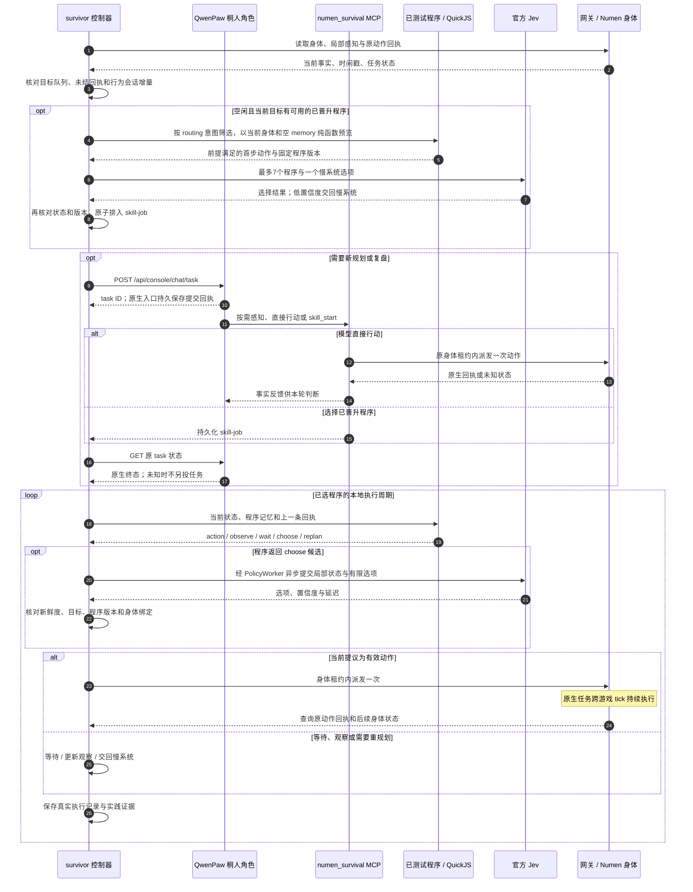
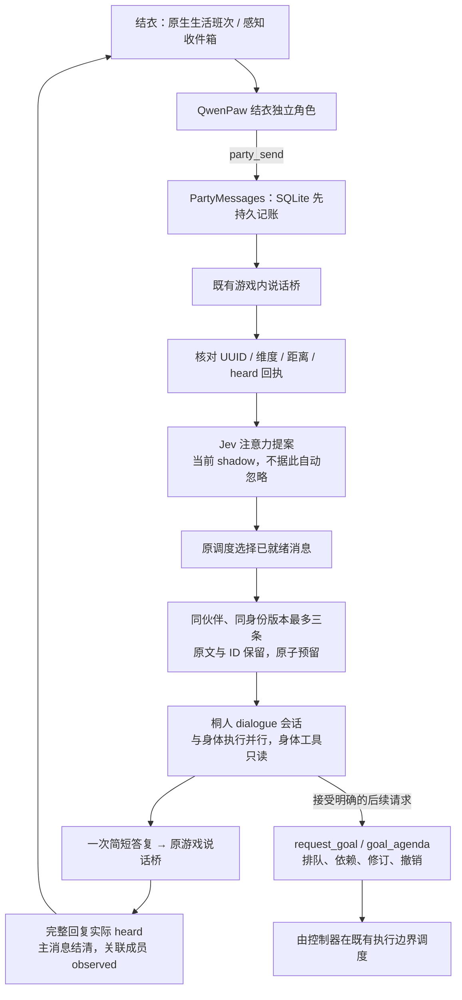
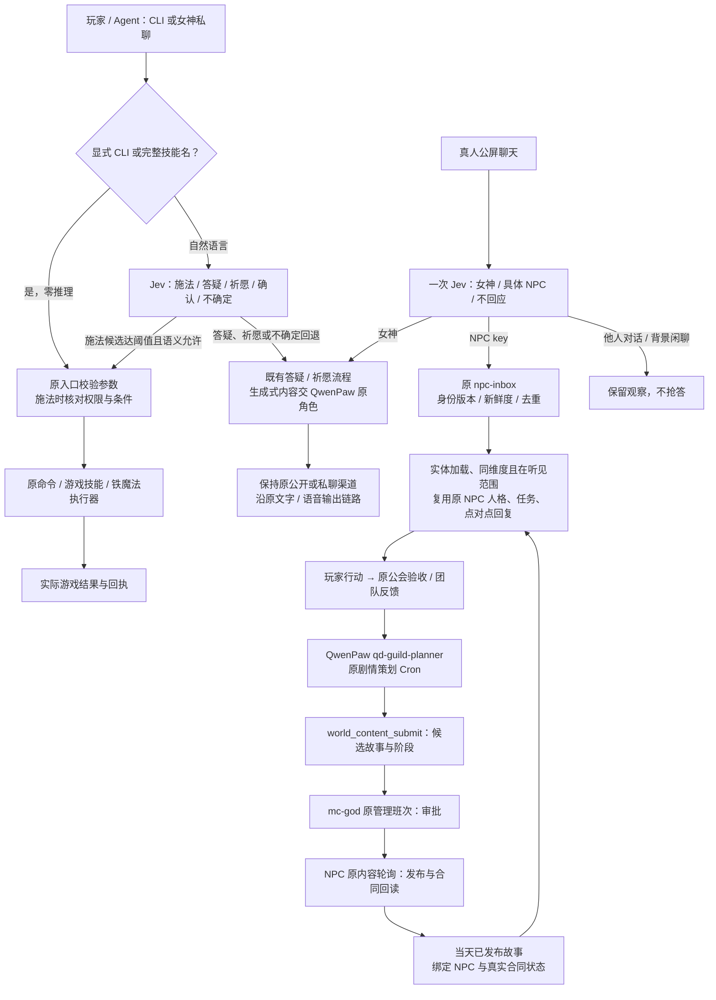
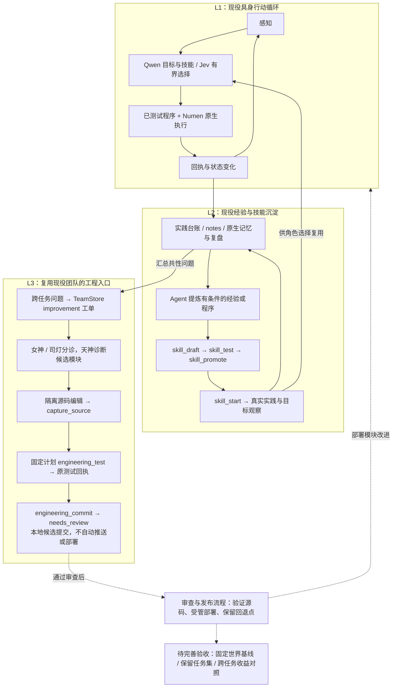

# 异世界千灯纪 · 本地整合项目

一个运行在本机的 **Minecraft 多 Agent 共生服务器**：真人玩家、房主女神、运营 Agent 团队、自主生存
Agent 与女仆妖精 Agent 共享同一个世界，各自有独立职责与入口。

项目以 Minecraft 为具身智能试验环境，目标是让 Agent 通过真实感知、身体行动、结果反馈和可验证的自我改进持续成长。
QwenPaw 管理认知、交流与工程角色，Numen 服务端假玩家承担身体控制；当前已部署具身基础，完整 RSI 收益仍待独立场景验证。

- 游戏版本：**Minecraft 1.21.1 / NeoForge 21.1.248 / Java 21**
- 项目目录：`D:\Projects\QiandengJi`
- 源码仓库：[jcs130/minecraft-ai-friend](https://github.com/jcs130/minecraft-ai-friend)，交付主干 `main`，隔离开发使用 `codex/*`；原世界源码已移入 `world/`
- 默认纳管 **13 个 Docker 服务**；历史阶段验收日志见 [整合历史记录](docs/INTEGRATION-HISTORY.md)

> 本仓库保存源码、配置模板、构建工具与验证方法。运行状态、`reports/`、存档和成品链接指开发机上的本地文件，Git clone 不包含这些，也不等于已完成环境安装。首次拉取先读 [GitHub 开发与本机资源恢复](docs/GITHUB-WORKFLOW.md)。

---

## 工作总览（截至 2026-09-21）

当前已把“能调用 Minecraft 工具的聊天 Agent”改造成有持续身体、行为会话、实践记录和工程改进入口的具身系统。**QwenPaw 管目标、交流和学习，已测试程序与 Numen 管持续执行，Jev 在限定候选中做快速选择。** 下一步要用真实任务的完成率、耗时和失败恢复验证成长，而不只统计调用次数或代码提交。

| 方向 | 已完成并部署 | 已有证据与当前边界 |
| --- | --- | --- |
| 具身身体与感知 | Numen 假玩家；移动、采矿、合成、进食、装备、农耕、交互等原生工具；结构化局部感知与按需语义图 | 已有真实导航、合成、装备、进食、采收/补种回执；语义图不是第一人称画面，也不保证能读取所有模组内部状态。[具身架构](docs/EMBODIED-AGENT.md) |
| 持续运行与上下文 | 原生 task 查询/丢失核验、退避、MCP 重连、启动依赖修复；action/review/dialogue 分会话，确认后发送增量；旧记忆归档 | 保留身体 UUID、背包和生活历史；未知动作不重放。应用层增量不等于供应商只计算新增 token。[原生连续运行](docs/SYSTEM-ONE-NATIVE-CONTINUITY.md) |
| 快慢控制 | 官方 Jev、持久 HTTPS、原服务内异步单槽；已测试程序产生候选，失效结果丢弃，必要时交回 Qwen | 连接复用样本中位 816.55→278.50 ms（各 6 次）；这只是 HTTP 延迟。历史本地 Decider 的装备/进食成功不能算官方 Jev 的成绩。[实测](docs/JEV-FAST-SLOW-CONTROL.md) |
| 伙伴交流与承诺 | 原 SQLite 队列、同伙伴最多三条合批、目标排队/依赖/修订/撤销、原生提交回执恢复 | 已验三条来信→一个任务→一次实际 heard 回复，随后两条合一也成功；社交 Jev 仍为 shadow，真人统一入口和全双工语音未完成。[调度与验收](docs/EMBODIED-SOCIAL-SCHEDULING.md) |
| L2 学习与 L3 工程改进 | 原生计划/记忆、程序 draft→test→promote→start、实践台账；复用司灯/天神、工单、隔离测试和受审候选 | 计划写入已恢复，但旧段落仍可能矛盾；程序结束、目标达到、技能掌握分开。完整跨任务 RSI 收益尚未验收。[RSI 设计](docs/RSI-AGENT-DESIGN.md) |
| 语言即接口与技能 | 技能罗盘整理、铁魔法指引、CLI 按需帮助；精确技能名直达，私聊意图与公屏回应者由 Jev 分流 | 公屏一次选择女神、已有 NPC 或忽略，原村民引擎复核身份和听见距离；施法保留等级/装备/魔力/冷却校验。[技能系统](docs/SKILL-SYSTEM-REVIEW.md)、[NPC 与剧情接线](docs/PUBLIC-NPC-STORY.md) |
| 世界与小社会 | 原村民/铁傀儡恢复、村庄安全区、街区住宅/农场/池塘/探索入口、悬空残块清理；主城固定建筑方块保护 | 空位可放床/建设，新放方块可拆；建筑、道路和区域火焰/流体规则保留。智能武装村民仅做隔离试验，未安装生产。[城镇](docs/TOWN-EXPANSION-DESIGN.md)、[保护更新](docs/JEV-SPELL-ATTENTION.md) |
| 可观测与运维 | PawApps 的 evolution-board / gods-eye、行为趋势、服务健康、control 部署回执和原 Docker 守护 | 本轮源码/生产各 181 项具身回归、生产 34 项实践测试通过；相关运行检查通过，全局其他历史验收失配仍保留。[观测应用](docs/PAWAPPS-OBSERVATION.md) |

最近一次公屏/剧情部署后，桐人、结衣均恢复新轮，10 角色配置和准入保持，按本次要求重新启用了原策划与女神班次。两原生角色已实际发布《秋夜四境》，只引用当天 4 条已有合同，任务数据保持；16:51 的女神定时班次也已自然完成。以上是 **2026-09-21 的观测记录，不是实时状态或长期成功率**。前序社交维护中误停结衣任务的失败和恢复记录继续保留。

## 当前架构与调用链路

可用程序现由持久化 `catalog.json` 索引管理，草稿/晋升/共享发布时更新，正常运行不扫描目录。只对匹配目标的已测试版本做首步预览，再交 Jev 分类。技能迭代指南吸收已下载的 Voyager、SkillOpt、ModularRSI 实现经验，通过现有 QwenPaw 技能按需读取；跨任务收益仍需真实对照验证。

9月22日实服验收：官方 Jev 已从目录选择木锄装备程序，原生回执及实际主手均确认成功，PracticeStore 完整保存。目录读取单次约3.4秒→27毫秒；本次冷连接分类1.38秒，入队到首个动作仍约11秒，尚不是80毫秒身体闭环。源码/生产各246项具身与34项实践回归通过。

技能库扩充与自动选择：新增27个可测试的初始程序，覆盖进食、装备、合成、导航、农耕和睡觉；15个支持按目标与实时前提自动筛选，其余需要慢系统提供真实坐标。Jev 现在也能从技能库选程序，随后复用原 skill-job、身体租约与 PracticeStore 执行和验收。Agent 新写的程序经测试、晋升并声明 routing 后，可进入同一候选库；一次选择或程序 done 不等于掌握技能。设计、部署与实机证据见[技能库闭环](docs/SKILL-CATALOG-LOOP.md)。

9 月 21 日晚追加修复：桐人装备不存在的铁剑触发未知动作暂停。网关现在在派发前检查实时背包，缺失物品返回可纠正错误，不消耗动作租约；具身探针也会识别未知动作阻塞，避免心跳正常掩盖停机。源码与生产各 226 项回归通过，旧未知回执保留并经人工核对解除阻塞，已恢复原循环。详细原因和验收边界见[连续运行修复](docs/AGENT-CONTINUITY-REPAIR.md)。

下面画的是现役代码中的职责与调用方向。生成式推理统一由游戏 QwenPaw 原生角色承接；Jev 是单独的有界分类调用。管理台的服务健康、世界回执和学习统计分别展示，不互相替代。

### 1. 系统架构



这是职责图，不是端口拓扑：身体工具由 QwenPaw 经 MCP 调用，原生任务在游戏中持续执行；`survivor`、`npc` 不各自另开一个生成式大脑。结衣使用绑定自身身份的独立角色，通用 `qd-maid-dialogue` 是兼容入口，不能当作结衣的全部执行链路。

### 2. 桐人：感知、慢规划、快执行与反馈



确定性步骤不用每次请求 Jev；只有已测试程序返回 `choose` 才走快分类。HTTP 超时、低置信度、绑定变化或过期结果不能直接派发动作。身体 Jev 与伙伴注意力共享 survivor 内一个推理槽；女神入口有自己的有界分类器，不共用这条槽。

**三个时间尺度不同**：Numen 按游戏 tick 执行；控制器在分类等待时目标轮询间隔为 250 ms、认知/动作在途时为 1 秒、普通空闲按观察配置；Qwen 规划和答复另有排队、推理、工具耗时。这些间隔均不是端到端延迟，也不能据此声称实现了 80 ms 身体闭环。提交响应丢失后的精确 task 回执接回目前用于对话；无法证明结果的身体动作继续保留未知保护。

### 3. 桐人与结衣：边行动边交流



合批不新增等待时间，也不把后来消息塞进已经提交的任务。同角色仍只有一个在途模型任务，因此“身体继续执行时聊天”已接通，“桐人规划与聊天任意双路模型并行”并未实现。未知提交只查询原生回执，不重发；世界 `heard` 不等于真人客户端音频播放完成。两条合一、三条合一已有实服证据，一条新来信的总响应样本仍约 88 秒，速度还受 Qwen 队列与生成时间影响。

### 4. 女神：文字即接口与 Jev 意图分流



自然语言施法候选限定在当前精选目录和支持的无参数技能/原生映射；带目标、距离等参数的操作使用明确 CLI。Jev 不生成任意命令，不绕过已学、等级、魔力、装备和冷却。公屏不直接施法；低置信时只对明确且不歧义的 NPC 称呼分派，其余沿原女神规则。真人麦克风转写沿 `voice-command-inbox → spoken-commands` 处理，保留原举杖授权与录音时间校验。

剧情复用已有策划角色与发布器。NPC 问候、近况和委托对话按需读当天已确认发布的故事：各发单人讲自己的阶段，岚提供活动全貌。普通闲聊仍以原模板和已发布台词线索为主；未全量开启逐句 LLM，也没有把剧情草案或预设结局当作已发生事件。原内容班次负责后续设计，玩家完成以原公会回执为准。[实现与验收边界](docs/PUBLIC-NPC-STORY.md)

### 5. L1 / L2 / L3：从实践到模块化 RSI



L1/L2/L3 是本项目的分工，借鉴 ModularRSI 的轨迹对照、跨任务汇总、单模块修改和固定验证思路。**现役工程角色有候选修改/测试/提交入口，尚不能据此宣称完整自主 RSI 已跑通。** 经验增加、程序 `done`、目标实际达到、技能掌握和跨任务能力提升，是不同层次的证据。工程角色的具体班次是否启用以原生配置为准，部署不会把原来关闭的班次一律开启。

### 从图定位源码

| 调用环节 | 主要源码与说明 |
| --- | --- |
| 桐人主循环、提交与终态查询 | [service.py](world/survival/service.py)、[controller.py](world/survival/controller.py)、[behavior_context.py](world/survival/behavior_context.py) |
| MCP 身体入口、感知与回执 | [mcp_server.py](world/survival/mcp_server.py)、[sensors.py](world/survival/sensors.py)、[numen_gateway.py](world/survival/numen_gateway.py) |
| 程序执行、Jev 与实践 | [skill_library.py](world/survival/skill_library.py)、[policy_worker.py](world/survival/policy_worker.py)、[system_one.py](world/survival/system_one.py)、[practice.py](world/survival/practice.py) |
| 伙伴交流、承诺与丢失回执恢复 | [dialogue.py](world/survival/dialogue.py)、[social_attention.py](world/survival/social_attention.py)、[party_messages.py](world/sidecar/party_messages.py)、[goal_agenda.py](world/survival/goal_agenda.py)、[survival_submission_runtime.py](world/ops/survival_submission_runtime.py) |
| 结衣生活与身份适配 | [party_life.py](world/sidecar/party_life.py)、[maid_agent_api.py](world/sidecar/maid_agent_api.py)、[maid_native_tools.py](world/sidecar/maid_native_tools.py) |
| 女神语言与技能 | [mc-god.ts](world/src/mc-god.ts)、[jev-intent.ts](world/src/application/jev-intent.ts)、[player-commands.ts](world/src/application/player-commands.ts)、[spoken-commands.ts](world/src/application/spoken-commands.ts) |
| L3 工单、候选测试与提交 | [world_team.py](world/ops/world_team.py)、[engineering_workspace.py](world/ops/engineering_workspace.py)、[engineering-runner.mjs](world/admin/engineering-runner.mjs) |
| 运行观测与部署 | [health_mon.py](world/ops/health/health_mon.py)、[embodied_agent_health.py](tools/embodied_agent_health.py)、[部署手册](docs/deploy-release-runbook.md) |

### 研究来源与尚未落地的部分

- 已精读并结合现有实现吸收 [Neko / Cortico](docs/OPEN-SOURCE-AGENT-CODE-STUDY.md) 的持续任务、异步交流与事件调度；[后续社交研究](docs/EMBODIED-SOCIAL-SCHEDULING.md)记录固定源码版本与采用边界。
- [ModularRSI / Plan4MC / MineDojo / MineCLIP](docs/RSI-AGENT-DESIGN.md)用于分层与评测设计。当前感知仍是 Numen 结构化状态与语义图，MineDojo/MineCLIP 尚未成为现役沙箱和感知后端。
- 已核查 [7 个 Jev 控制参考项目](docs/JEV-CONTROL-REFERENCE-REVIEW.md)和 [Astra + Jev Minecraft 示例](docs/JEV-ASTRA-MINECRAFT-CODE-REVIEW.md)。固定种子、预先勘测或特定难度的演示不能代替本服自由探索验收。
- 通用 WASD/鼠标输入帧、逐 tick 训练轨迹、自训/微调快策略、任务内抢占、真人多人话轮与全双工语音仍属后续工作。见[快循环设计](docs/JEV-FAST-LOOP-DESIGN.md)与[可训练策略调研](docs/JEV-FAST-POLICY-RESEARCH.md)。

---


## 一、四类 Agent

整个系统的核心是四类自主 Agent，分工明确、互不替代：

### 1. 房主 · 灯语女神（世界管理权威）
世界的「房主」与管理员。以名为 `Goddess` 的观察者 bot 入驻服务器，通过受管世界工具掌管巡逻、分诊、
派发、内容审批与程序化咏唱→法术。其 LLM 神谕走 QwenPaw 角色 `game:mc-god`。最终所有权归人类「造物主」。
- 载体：`world` 服务（`world/bootstrap-world.mts`，TS 世界引擎，进程内装配 magic/social/saga/terra/worlddb/logwatch 等）
- 天神之眼（世界观察渲染）：宿主 **19092**

### 2. 开发运营 Agent 团队（QwenPaw 单实例 · 10 角色）
负责游戏的开发、运营、策划与协调，全部统一在**游戏 QwenPaw 实例**（控制台 **18089**），按各角色的原生 Cron
班次运行，同角色遵守在途任务与并发约束（旧独立运营实例已归档）。canonical 角色源：`world/ops/world_team.py`。
- **天神 / 工程师**（`qd-engineer`）：读写 `engineering/repo` 源码、跑隔离测试、提交受审修复
- **司灯 / 协调**（`qd-steward`）：工单台账、风险派发、回执
- **公会策划**（`qd-guild-planner`）：剧情/任务/活动设计，提交内容包
- 另有 **灯语·玩家交流**（`mc-herald`）、**内测玩家**（`qd-survivor`）、村民/女仆对话角色、结衣、女仆角色
- 治理入口：管理台 **19091** `#operations`；统一 CLI `python tools/project.py ops status`
- 设计背景见 [运营组说明](docs/OPERATIONS-TEAM.md)、[世界团队架构](docs/WORLD-TEAM-ARCHITECTURE.md)

### 3. 自主生存 · 自我进化 Agent —— 桐人（survivor）
一个以自主游玩和可验证自我进化为目标的具身游戏 Agent：controller tick 主循环驱动感知→决策→动作，经 Numen 网关
落地到游戏。当前以具身 L1/L2/L3 架构组织状态、行为会话、程序技能、经验和工程改进；慢层模型选择目标，
快层复用原生控制与已测试程序。可训练快模型仍在研究阶段，长期自主成长与 RSI 收益需要实际对照验证。
- 载体：`survivor` 服务（`world/survival/service.py`），核心逻辑 `world/survival/controller.py`
- 当前设计见 [具身 Agent](docs/EMBODIED-AGENT.md)、[三层 RSI](docs/RSI-AGENT-DESIGN.md)；早期实现背景见 [快慢双系统](docs/FAST-SLOW-AGENT-SYSTEM.md)、[自我规划](docs/SURVIVOR-SELF-DIRECTED-PLANNING.md)

### 4. 女仆妖精 Agent —— 结衣 / Yui（车万女仆模组）
基于 **车万女仆（Touhou Little Maid）** 模组的辅助妖精伴侣：SAO 导航妖精结衣，承担陪伴/家庭与
管理救援职责，**不会死亡**（伴侣保护），与桐人组成两人小队（桐人自主游玩成长，结衣不替其游玩）。
- Java 模组侧：`world/maid-bridge-src`（Touhou Little Maid 1.5.3 扩展，站点 `qiandeng-qwen`）
- Python 侧：`world/sidecar/maid_agent_api.py` 按已验证身份接入独立 QwenPaw 角色；结衣生活由 `party_life.py` 与持久感知收件箱衔接，`qd-maid-dialogue` 保留通用兼容入口
- 村民与女仆引擎：`npc` 服务（`world/sidecar/mc_npc.py`，走裸 RCON），启动时拉起 maid-agent（:8091）与 party-agent
- 设计见 [女仆 Agent 设计](docs/MAID-AGENTS-DESIGN.md)、[结衣自主生活](docs/YUI-AUTONOMOUS-LIFE.md)、[SAO 角色](docs/SAO-CHARACTERS.md)

---

## 二、服务与基础设施（13 个默认受管服务）

| 服务 | 镜像 | 职责 | 宿主端口 |
|---|---|---|---|
| `mc` | itzg/minecraft-server:java21 | MC 服务器，持 shadow 世界存档 | 25565(LAN) / 25567(本机兼容) / RCON 25577 / 语音 24455·udp |
| `world` | qiandengji-world | 房主女神世界引擎 + 天神之眼渲染 | 19092 |
| `gate` | qiandengji-world | vanilla↔NeoForge 握手代理，Agent 协议入口 | 25701 |
| `panel` | qiandengji-world | 只读管理台（#operations/#services/#survivor） | 19091 |
| `control` | qiandengji-world | 部署/重启回执通道（/plan+/execute） | 容器内 3090 |
| `inventory` | qiandengji-sidecar | 只读容器健康采集 → panel | — |
| `npc` | qiandengji-sidecar | 村民/女仆引擎（含 maid-agent、party-agent） | — |
| `resources` | qiandengji-sidecar | 女仆语音包静态服务 | 19090 |
| `qwenpaw` | qiandengji-qwenpaw-game:2.2.1 | 游戏 QwenPaw（运营团队 10 角色宿主） | 18089 |
| `survivor` | qiandengji-survivor | 自主生存 Agent（桐人） | — |
| `voice` | qiandengji-voice | 女神语音监听（god-voice-watcher） | — |
| `asr` | qiandengji-voice | 麦克风 ASR 监听 | — |
| `tts` | qiandengji-tts:kokoro | Kokoro 中文 TTS | 8100 |

> `qwenpaw-ops`（旧独立运营实例，18090）在 compose 中保留定义但**已归档、不在 13 个活动服务内**；运营角色已并入游戏 QwenPaw 18089。

**载入 mc 的自研模组（非独立服务）**：botgate（Agent 协议/技能箱/飞行/附魔/光环）、maid-bridge（车万女仆桥）、irons-bridge（原生铁魔法）、god-voice、chanting-items（自制言灵法杖）、client-controls（客户端控制器）。源码在 `world/*-src/`。

**外部 Agent 接入**：运行 stdio Python MCP 桥 `tools/run_numen_mcp.py`（配置示例 `config/numen-mcp.example.json`），默认 `MC_HOST=127.0.0.1:25567`、`MC_RCON=127.0.0.1:25577`，身体经 `numen_act summon` 召唤；或以原版 bot 经 gate 25701 接入。详见 [NUMEN-MCP](docs/NUMEN-MCP.md)。

---

## 三、开始使用

1. 打开 Docker Desktop，双击 `start-server.bat`，等待服务健康。
2. 双击 `start-client.bat`，输入原来的玩家名（**拼写和大小写保持一致**，离线模式相同名字才对应原 UUID/背包/进度）；客户端连接 `127.0.0.1:25567`。
3. 结束后运行 `stop-server.bat` 正常保存并停止；`check-health.bat` 检查服务与实际联调结果。

局域网玩家在多人游戏中手动添加 `192.168.3.133`（TCP 25565）；游戏端口与语音 UDP 24455 已开放给局域网，管理端口仅本机。QA 用专用测试角色，请用自己的原名继续玩。

---

## 四、本机地址

| 用途 | 地址 |
|---|---|
| Minecraft / Agent 直连（本机兼容入口） | 127.0.0.1:25567 |
| 局域网游戏连接 | 192.168.3.133:25565 |
| 原版协议 Agent 网关（gate） | 127.0.0.1:25701 |
| 本项目 RCON | 127.0.0.1:25577 |
| Simple Voice Chat | 127.0.0.1:24455/udp |
| 游戏 QwenPaw 控制台（本机免密码，运营团队 10 角色） | http://127.0.0.1:18089 |
| D 盘独立管理台（运营治理 / 服务维护 / 天神之眼入口） | http://127.0.0.1:19091 |
| 天神之眼（世界观察渲染） | http://127.0.0.1:19092 |
| 女仆语音包 | http://127.0.0.1:19090/packs/ |

管理台与游戏 QwenPaw 仅发布到 `127.0.0.1`、本机免密码。旧运营 18090 已归档停用。

---

## 五、开发与验证

```powershell
cd D:\Projects\QiandengJi
python -m unittest discover -s tests -v
python tools/project.py status
python world/ops/health/health_mon.py
python tools/export_pack.py
```

- 代码架构与模块拆分见 [ARCHITECTURE.md](docs/ARCHITECTURE.md)。
- 可独立复用的两个组件：容器编队控制面（`world/admin/fleet/control-core.mjs` + 项目拓扑 `world/admin/topology.qiandengji.mjs`）与 [Agent 安全提交工作区](docs/AGENT-SAFE-COMMIT.md)（`world/ops/engineering_workspace.py` + `world/admin/engineering-runner.mjs`），两者都不含 Minecraft 概念，绑定项通过构造参数注入。
- 部署/重启**必须**走 control 回执通道（`/plan`+`/execute`，自动 mc save-all、依赖序、健康门、持久回执），发布流程见 [部署 runbook](docs/deploy-release-runbook.md)。按受影响组件核对挂载源码、镜像或模组 JAR，精确部署并保留回退点；生产工作区有未提交改动时不得用整目录覆盖或强制切分支代替部署。
- 服务健康与扩展文件哈希见 [runtime-health.json](reports/runtime-health.json)；各专项验收证据在 `reports/`，以报告时间和 `ok` 字段为准。
- 源码、模板与报告不含密钥；`server/`、`client/`、`.env`、`dist/` 被 Git 忽略。

---

## 六、目录与备份

| 目录 | 内容 |
|---|---|
| `world/` | 世界端源码：`src`(TS 世界引擎/gate)、`admin`(panel/control/eye)、`ops`(运营/QwenPaw 治理)、`sidecar`(NPC/女仆/公会/语音)、`survival`(自主生存 Agent)、`*-src`(自研模组源) |
| `server/mc/shadow/` | 已迁入并实际运行的原存档 |
| `server/world-data/` | 技能、成长、人物、数据库和 AI 通道的权威数据 |
| `server/mcdata/` | 游戏模组与 NPC 的共享队列、状态镜像 |
| `server/agents/` | QwenPaw 角色、工作区、会话及本机配置与凭据（Git 忽略） |
| `config/` | 角色（`characters/`）、伴侣保护、技能目录、Numen MCP 示例等配置 |
| `tools/` | 构建、迁移、启动与实际冒烟工具 |
| `manifests/`、`reports/` | 文件锁、依赖检查及联调证据 |
| `dist/` | 可导入整合包 |
| `client/` | 可运行整合客户端（本机配置和日志，Git 忽略） |

备份个人进度：等 `stop-server.bat` 完成后备份整个 `server/`（只复制 region 会丢失其他维度、玩家数据与自研技能进度）。

---

## 七、客户端分发包（当前）

当前分发包：[`dist/QiandengJi-1.21.1-0.1.5-local.mrpack`](dist/QiandengJi-1.21.1-0.1.5-local.mrpack)，已导出并完成成品校验。

- 大小：383,651,079 字节；SHA256：`7d80d0bff7885153ffd11ac424f9369e5547c0646a12f854c4a8b66e4e5937a0`
- 88 个模组 JAR、自制言灵杖、基础优化设置、女仆语音包、原生 YSM 人物模型；Minecraft/NeoForge 由启动器安装
- 完整校验记录见 [pack-export.json](reports/pack-export.json)；旧包与历史明细见 [整合历史记录](docs/INTEGRATION-HISTORY.md)

单机存档使用相同模组时，可把 `dist/QiandengJi-content-fixes-1.21.1.zip` 放进该存档 `datapacks/`（独立于客户端 mrpack，不含地形扩展；源码 `content/datapacks/qiandeng_fixes/`，重建工具 `tools/prepare_content_fixes.py`）。客户端兼容与注册表差异见 [CLIENT-REGISTRY-COMPATIBILITY.md](docs/CLIENT-REGISTRY-COMPATIBILITY.md)。

---

## 八、延伸文档

- 当前具身与自进化设计：[EMBODIED-AGENT.md](docs/EMBODIED-AGENT.md)、[RSI-AGENT-DESIGN.md](docs/RSI-AGENT-DESIGN.md)
- 快循环参考与训练方向：[Neko / Cortico 源码对照](docs/OPEN-SOURCE-AGENT-CODE-STUDY.md)、[Jev / Laya / Brain 调研](docs/JEV-FAST-POLICY-RESEARCH.md)
- 运行观测与近期技能改进：[PawApp](docs/PAWAPPS-OBSERVATION.md)、[技能罗盘与 CLI](docs/SKILL-SYSTEM-REVIEW.md)
- 运行布局与验收边界：[GAME-RUNTIME-LAYOUT.md](docs/GAME-RUNTIME-LAYOUT.md)
- 技能与统一入口：[SKILLS-UNIFIED-CLI.md](docs/SKILLS-UNIFIED-CLI.md)、[言灵法杖](docs/STAFF-CHANTING-DESIGN.md)、[语言即接口](docs/LANGUAGE-INTERFACE.md)
- AI 共生世界设计（后续方案，非已部署）：[SYMBIOSIS-WORLD-DESIGN.md](docs/SYMBIOSIS-WORLD-DESIGN.md)
- 服务器管理：[SERVER-MANAGEMENT.md](docs/SERVER-MANAGEMENT.md)
- 历史阶段验收日志：[INTEGRATION-HISTORY.md](docs/INTEGRATION-HISTORY.md)
- Agent 协作约定（权威）：[AGENTS.md](AGENTS.md)
