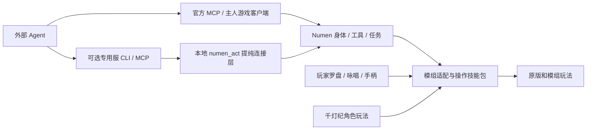

# 基于 Numen 的 Agent 扩展套件构思

用户后续决定先不新增 AI Agent 功能。当前工作转为现有代码的职责拆分和玩家玩法，见 [代码架构](ARCHITECTURE.md)；本文保留套件长期方向，不作为本轮 Agent 开发清单。

结合用户后续提供的 AI 共生与演化项目计划，整体世界玩法与开发顺序见 [AI 共生世界设计](SYMBIOSIS-WORLD-DESIGN.md)：继续保留当前 NeoForge 底座与 shadow 存档，将真实物品工会合同提前为首个社会玩法切片。本文继续定义通用套件与 Numen 的职责边界。

2026-09-07 修订。查阅 Numen 官方源码后，方案收敛为 **Numen 扩展模组、玩法技能包与可选专用服务器连接层**。Numen 已有身体、动作、工具、Markdown 技能及外接 MCP，直接复用；原 AgentBridge 暂名只指我们补充的连接与适配部分，不再表示独立重写一个 Agent 核心。拟议发行组合和 CLI 尚未实现，本次只改文档。依据及版本差异见 [Numen 上游审查](NUMEN-UPSTREAM-REVIEW.md)。

## 当前实际运行方式

Minecraft 1.21.1 / NeoForge 21.1.248 / Java 21 服务端运行于本机 Docker Desktop 的 `qiandengji-mc-1` 容器。Docker 仍使用这台电脑的 CPU、内存与磁盘，不代表另有一台远程服务器。

`mc`、`world`、`gate`、`npc`、`resources`、`qwenpaw`、`voice`、`asr` 共 8 个服务当前运行。游戏客户端在 Windows 宿主机运行；容器中的 voice 还调用宿主机 8100 端口的 TTS 推理服务，模型服务也可能使用外部接口，因此不是所有计算都装在 MC 容器里。

存档在 `D:/Projects/QiandengJi/server/mc/shadow`，通过 `./server/mc:/data` 挂载；技能与 AI 数据在 `server/world-data`、共享状态在 `server/mcdata`。客户端连接 `127.0.0.1:25567`，转发至容器的 25599。依据：[compose.yml](../compose.yml) 与本次 `docker compose -p qiandengji ps`。

当前已有可构建 JAR：服务端 `botgate.jar`、`qiandeng-irons-bridge-0.1.0.jar`，客户端 `qiandeng-controls-0.1.0.jar`。Numen 及其本地扩展也是已有基础，但 Numen 是上游项目，不能把整个上游当作本项目原创模块。自研入口仍依赖 TypeScript/Python 服务，直接复制这几个 JAR 还不能获得完整千灯纪功能。

## 产品形态

建议做一套“服务端模组 + Agent 连接程序 + 可选适配与玩法”的套件，并提供两种发行组合：

- **通用扩展版**：在 Numen 上提供选定模组的工具与 Markdown 操作说明。有主人客户端时优先复用官方外接 MCP；专用服无人值守时，通过提纯后的本地 numen_act 与轻量连接程序接入。
- **千灯纪完整版**：在通用版上增加技能罗盘、角色招式、女神、NPC、探索设定、模型与配音；附现有整合包和可选 Docker 一键部署。

Docker 是部署方式，不是模组协议。目标是同一套服务端 JAR 能在兼容的宿主 JVM 或 Docker 内运行；部署脚本分别配置地址和数据目录。第一版明确只支持本项目已验证的 Minecraft/NeoForge 版本，不承诺 Forge、Fabric、其他版本通用。



图中是拟议结构。当前玩家技能主要仍经 world 服务，本阶段不会声称已经迁入核心。

## 模块职责与现有代码去向

以下名称暂定，模块表示职责边界，不要求第一版每项都发一个独立 JAR。

| 模块 | 职责 | 可复用基础与需要拆除的耦合 |
|---|---|---|
| 专用服务器连接层 | 无主人客户端时的身份绑定、工具访问、任务回执和执行预算 | 提纯本地 numen_act，衔接 Numen 已有工具/任务；不能依赖 Goddess、固定路径或铁魔法 |
| Numen 身体与通用工具 | 移动、挖掘、战斗、背包、感知、任务与常规交互 | 复用上游实现与所需本地补丁；不另外实现同类工具注册表或寻路引擎 |
| Numen 玩法说明 | Markdown 技能与必要辅助文件 | 复用上游加载机制；我们的游戏招式不是 Markdown 本身，仍需真实动作实现 |
| 模组专用适配 | 铁魔法施放/取消、Pufferfish 成长查询，后续机器等 | 当前 Iron 桥直接可复用；安全传送应移出 Iron 硬依赖，成长适配也应独立加载 |
| 千灯纪玩法扩展 | 罗盘、咏唱别名、技能目录、传送点、角色招式、NPC/剧情 | 从 botgate 的玩法部分与 mc-magic/mc-god 提取；已保存奖励按明确迁移规则保留 |
| 可选客户端扩展 | 快捷键、手柄入口、HUD、动画/特效，以及需要时的真实客户端感知 | 复用 qiandeng_controls；Controlify、YSM 等保持独立依赖，客户端部分不装入专用服 |
| 外部 Agent 连接程序 | CLI、可选专用服 MCP 与部署设置 | 玩家在线模式优先官方 MCP；提纯现有 Python 桥支持专用服，模型与记忆可用外部 Agent 或原有内置大脑 |

botgate 目前同时含协议兼容、RCON 修复和技能/书/装备逻辑，不能整包搬入“通用核心”后宣称完成解耦。已有原版协议 Agent 网关可作为特定兼容模式保留；不把强制跳过模组握手、过滤注册信息作为新套件的默认办法。

## Agent 为什么更容易玩模组服

主要入口采用**服务端 Numen 身体**：外部模型发结构化请求，由服务端身体调用游戏动作。它在服务端具有实际玩家对象、物品和世界状态，减少依靠原版客户端猜模组协议的需求。它仍不是完整图形客户端，也不自动满足所有模组对真实玩家或客户端的假设。

身体运行在服务器，不等于全部接入 API 都能在专用服运行。官方 NumenActuator/MCP 入口依赖主人的游戏客户端；本地 numen_act 才是我们现有的服务器补充。两条路径分别验证，不能直接在服务端加载官方客户端 API。上游已有工具 schema 和 SkillRegistry 等机制，下述能力目录、说明和动作接口优先基于它们扩展。

本地参考源码依据为 [NumenPlayer.java](C:/Users/lzl19/.copaw/workspaces/default/numen-reference/api/common/src/main/java/com/dwinovo/numen/entity/NumenPlayer.java)、[NumenActCommand.java](C:/Users/lzl19/.copaw/workspaces/default/numen-reference/actuator/neoforge/src/main/java/com/dwinovo/numen/actuator/NumenActCommand.java) 与 [GuiOps.java](C:/Users/lzl19/.copaw/workspaces/default/numen-reference/core/common/src/main/java/com/dwinovo/numen/core/tools/GuiOps.java)。这些参考仍在原 C 盘目录，独立发行前需建立明确的上游源码/版本依赖；本次没有移动或修改它们。假玩家受到的领地、交互等限制需要随具体模组组合验证。

Agent 先查询“本服支持什么”，再查询“我现在能做什么”，最后执行：

1. 握手返回核心协议、Minecraft/加载器版本、适配器版本及可用功能。
2. 查询实际身体的背包、装备、附近对象、法术和任务状态。
3. 每项动作给出参数 schema、前置条件、作用范围、可能消耗与结果语义。
4. 需要玩法知识时按需读取适配器附带的操作说明，不把整套模组百科每轮塞进上下文。
5. 执行后读取回执和游戏状态；移动、挖掘、施法等长动作按 taskId 跟踪。

例如，装了铁魔法时能发现原生施法能力；没有装时不出现这项工具。发现施法能力也不等于角色已经拥有所有法术：实际装备、法力、冷却仍由原生模组决定。

**不能自动覆盖的边界**：识别某个物品 ID，不等于知道整套科技生产链；读到机器槽位，不等于知道每个按钮作用。NeoForge 1.21.1 的标准物品、流体、能量 capability 有助于查询共同能力，但不能替代机器玩法适配，也不能直接借自动化接口绕过玩家交互限制。[官方 Capabilities](https://docs.neoforged.net/docs/1.21.1/inventories/capabilities/)

菜单后端与客户端画面有独立结构，特殊按钮、自定义网络交互、客户端按键或渲染可能需要专用适配，必要时使用安装相同模组的真实客户端。第一版可先支持标准容器并明确返回 `unsupported`，不用虚假的成功掩盖缺口。[官方 Menus](https://docs.neoforged.net/docs/1.21.1/gui/menus/)、[官方 Sides](https://docs.neoforged.net/docs/1.21.1/concepts/sides/)

## 统一动作与技能接口

建议 CLI 采用少量稳定领域，首批为 `actor`、`observe`、`inventory`、`action`、`task`，映射到选定版本的 Numen 工具；适配器新增 `spell`、`progression`、`waypoint` 等能力。它们是面向用户的命令组织，不替换 NumenTool/ToolRegistry 契约。能力列表可报告仅识别、可读取、通用交互、专门适配等支持程度。

拟议 CLI 示例，**以下 mcagent 命令尚不存在**：

```text
mcagent capabilities
mcagent actor status
mcagent inventory list
mcagent spell list
mcagent spell cast irons_spellbooks:chain_lightning
mcagent task status <taskId>
```

Agent CLI、MCP、玩家菜单与咏唱都汇入同一动作实现。咏唱和图标只负责把意图转换为明确技能 ID，服务器统一执行装备、资源、距离和冷却判定，避免每种入口各写一套施法。

螺旋丸、影分身、星爆气流斩应在“角色特色玩法”中单独评估修复。仅当效果吻合时才能做原生法术别名；有独特弹道、分身或连击的招式要作为真正的扩展实现，复用可用的原生施法框架。不能把音爆改名就宣布螺旋丸复原；需要新增注册法术、实体或视觉资源时，还要明确客户端依赖。当前螺旋丸主动技能仍处于归档待修复状态。

## 执行与运行方式

Numen 负责已有工具调度与身体执行，扩展负责新增玩法语义；连接程序仅补充 CLI 和专用服务器访问。玩家客户端模式优先复用官方 MCP。专用服模式第一阶段可保留受控 RCON/文件通道作为迁移适配，随后增加带版本的本地结构化接口。传输层不改变动作定义，远程模型无需直接拿管理员 RCON 或读写整份玩家存档。

核心将请求关联到授权的 actorUuid 与 worldId，操作前检查实际角色和游戏状态。服主绑定权限不由 Agent 任意自选。能力文档描述可调用操作，不能替外部 Agent 扩大权限。

请求至少带 `requestId`、动作 ID、参数和目标身体；回执区分 accepted/running/succeeded/failed/outcome_unknown。原生施法的 `casting_started` 只表示已开始，不表示命中；进程在副作用后、写回执前崩溃时，无法保证严格“恰好一次”，应记录不确定结果并查询实际状态，不自动重放。

慢任务用可取消的任务句柄，资源与重复请求以角色为单位协调。感知采用有界范围、事件订阅和增量状态，避免每轮扫描全世界；需要在服务端主线程操作的世界状态排队执行，LLM/语音和耗时计算不阻塞游戏 tick。NeoForge 的网络处理有主线程/网络线程之分，跨线程提交工作要显式处理结果。[官方 Payloads](https://docs.neoforged.net/docs/1.21.1/networking/payload/)

分发可以提供 `agentbridge-server` 发行 ZIP、连接程序发行件、适配器清单和千灯纪整合包。上游 Numen、铁魔法、Controlify、YSM 等保留独立版本与来源；分发前逐项核对依赖许可、资源来源和所需声明，不能用单个 world/LICENSE 代替所有第三方文件的归属。

## 建议开发顺序与验收

| 阶段 | 可交付结果 | 验收标准 |
|---|---|---|
| 1：最小扩展版 | 锁定 Numen 与本地补丁，复用工具，提纯 numen_act 和 CLI | 干净同版本服不带千灯存档和女神也能接入；区分主人客户端与专用服路径；两个身体不串身份，断线不盲目重放 |
| 2：首个模组适配 | 移出 Iron 硬依赖的通用定位/安全传送，独立 Iron 施法与成长适配 | 未装 Iron 核心照常工作；装后沿用真实装备、法力、冷却、效果、取消和卷轴消耗测试 |
| 3：统一玩家入口 | 现有罗盘、咏唱、快捷键调用同一动作协议 | 玩家和 Agent 的相同动作遵守一致规则；客户端扩展可选范围明确；实体手柄单独验收 |
| 4：特色与更多适配 | 螺旋丸等角色招式、选定机器或任务模组 | 每个功能有实际行为测试和兼容矩阵；不把读到注册表当作完整可玩 |

性能应在固定场景比较接入前后 TPS/MSPT、CPU、内存，并分别测 1/4/8 个身体；这是拟议测量方案，当前没有通用套件的性能数据。探索感知、寻路和区块加载通常比查询技能目录更值得限制预算。

旧服迁移保留当前 JAR/数据备份，增加数据 schema 和导入记录，维护旧名字到原 UUID 的显式关联。原有同名身体不能按名字自动合并；原技能记录、永久奖励、传送点和账本需要分别迁移。先在独立干净服证明通用，再在本项目副本验证旧档，不为此重建用户世界。

当前实测基础是罗盘 10 组、原生铁魔法 12 组、传送 8 组，以及已有 Numen 接入；这些报告支持复用现有部件，不代表新套件已实现。记录见 [当前里程碑](../reports/skill-compass-milestone.json)。

建议第一个里程碑定为：**同版本模组服安装 Numen 与我们提纯后的专用服扩展，配置身体授权，外部 Agent 能列出能力并使用现有生存工具；加装 Iron 工具适配后，用同一 CLI 正常施法。** 千灯纪作为 Numen 扩展套件的首个完整玩法示例。
