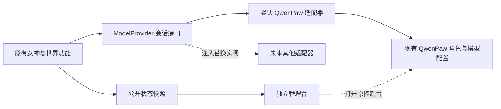

# QwenPaw 可替换边界与独立管理台

> 本文为接口拆分阶段记录。后续旧 9090 游戏面板已停用，19091 已加入天神之眼及保留预览确认的服务器管理。2026-09-08 起，19091、18089 和 18090 均本机免密码访问，仅发布到 127.0.0.1；最新使用入口及内部鉴权边界见 [服务器管理](SERVER-MANAGEMENT.md)。QwenPaw 的可替换边界仍保持。

2026-09-07。保留 QwenPaw，整理现有调用边界并恢复独立管理入口；不新增 Agent 身体、工具注册、寻路或生活调度。

## 使用地址

| 页面 | 地址 | 当前用途 |
|---|---|---|
| D 盘项目管理台 | http://127.0.0.1:19091 | 总览、众生技能档案、村务工会、共享传送点、当前 Agent 后端与控制台入口 |
| D 盘游戏 QwenPaw 控制台 | http://127.0.0.1:18089 | 本机免密码管理游戏会话的模型、角色与对话 |
| D 盘运营 QwenPaw 控制台 | http://127.0.0.1:18090 | 本机免密码管理独立运营团队 |
| 原 C 盘管理页（已退役） | http://127.0.0.1:9090 | 不再作为当前使用入口 |
| 女仆配音资源 | http://127.0.0.1:19090/packs/ | 当前资源下载目录 |

`start-server.bat` 已包含新 panel 服务。单独启动可用 `docker compose -p qiandengji up -d --no-deps panel`。管理台是独立容器，具有 restart 策略和自身 `/healthz` 探针，没有对 Minecraft 或 QwenPaw 的启动依赖。

## 保留与替换 QwenPaw



- `world/src/providers/model-provider.ts`：中立请求、回复、能力，以及 chat 和可选 task 接口。
- `qwenpaw-provider.ts`：QwenPaw 专有 HTTP、认证、图像请求、SSE 和后台任务轮询。
- `world-model-provider.ts`：现有默认工厂；传入 provider 实例时优先使用替换实现。
- `provider-info.ts`：只投影实际实例的名称、标识和能力。世界心跳的 agentProvider 来自正在使用的实例，不用默认常量猜测运行状态。
- `mc-god.ts`、`mc-saga.ts`、`mc-evolve-review.ts`：保留人物提示、会话标识、玩法处理和失败回退，调用 deps.modelProvider 或默认工厂。

更换 QwenPaw 内部模型，仍在原控制台进行。更换整个运行时，需要实现 ModelProvider，在装配处注入，再调整部署依赖和控制台链接。当前没有第二个已部署后端，也没有网页一键切换按钮。

接口保留图像顺序、角色/会话标识、认证、超时和正式回复语义。模型内部推理和工具消息不作为最终回复。

后续玩家命令改造已解除 world 对 QwenPaw 健康的启动依赖，普通命令执行进入独立应用服务，见 [当前实现](PLAYER-COMMAND-SERVICE.md)。world 仍保留女神化身和原监听生命周期，模糊咏唱与对话仍需要模型。Python NPC 模型路径当前关闭，旧 `_hearth_reply` 在未来启用前仍需单独适配。Numen、MCP、TTS 和 ASR 不随会话接口重写。

## 管理页面的独立边界

沿用旧页面“众生、村务、世界”的栏目语义，新增总览和 Agent 入口，重建数据边界。

1. 现有 world 中的 `world/admin/publish.mts` 每 15 秒读取固定玩法文件，经 `read-model.mjs` 输出明确字段到 `server/panel-state/world.json`；不调用任务生成器或游戏命令。
2. HTTP 服务 `world/admin/server.mjs` 只读公开快照并提供固定路由。容器没有世界目录、RCON 密钥、Agent 配置、Docker socket 或写入卷权限。
3. 既有健康巡检将容器检测公开结果写到 `server/panel-state/health.json`；超过 5 分钟按历史记录展示。页面刷新只重读状态，不调用 Docker。
4. 页面、世界心跳、NPC 心跳和工会轮询分别判断过期。世界停止后页面仍可打开，旧数据不会被标成当前在线情况。

众生页展示旧技能档案，不能代替实时装备、原生属性或全服在线名单。专用 QA 和不符合玩家名格式的旧键仅在展示时排除，原存档不删除。世界页目前展示共享传送点，旧 WebGL 地图和人物背包实况尚未恢复。

技能目录复用已有校验，显示 8 项精选、57 项归档主动技能和 7 项被动。工会 open 显示为“开放记录”，实际接取仍由游戏校验；历史地点/首领记录不因此变成可玩任务。

本轮提供状态查看和原控制台入口。旧页面的管理员传送、世界改写、皮肤写入及观察者跟随接口没有迁入；后续管理操作应通过明确的应用接口接入。

## 验证与回退

```powershell
node --test world/tests-ai/model-provider.test.mjs world/tests-ai/qwenpaw-auth.test.mjs
node --test world/tests-ai/admin-panel.test.mjs
python -X utf8 -B -m unittest discover -s tests -p test_npc_health_flags.py
node tools/check_architecture.mjs
python -X utf8 -B world/ops/health/health_mon.py
```

结果见 [本轮汇总](../reports/agent-provider-panel.json)、[页面实际验收](../reports/admin-panel-smoke.json)、[真实游戏对话](../reports/goddess-smoke.json)。模型替换用离线注入夹具验证，真实游戏对话使用默认 QwenPaw，二者分别记录。

本轮验收：provider/认证 13 项、管理 HTTP 与状态边界 12 项、NPC 生效开关 5 项通过；浏览器 6 组验收通过。原玩法回归 70 项通过，1 项 POSIX 权限测试在 Windows 跳过；实际游戏帮助/罗盘/工会 9 项检查和 QwenPaw 对话成功。9 个服务及整体健康巡检通过。31 份非本轮测试角色的既有技能档案、传送点和任务板核对无变化。

备份在 `runtime/backups/provider-boundary-20260907-143837/` 和 `runtime/backups/agent-panel-20260907/`。未改变模型配置、角色提示、模组 JAR、存档 schema 或客户端发行包。回退时先停止 D 项目的 world/panel/npc，按备份恢复对应源码和 compose，再重新加载服务；不覆盖运行存档。原 9090 页面保持原状。
