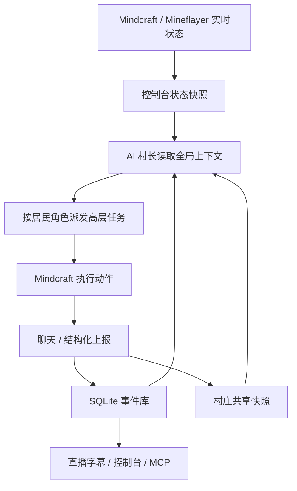

# AI 村庄社群系统

本项目的社群系统目标不是让多个 bot 机械执行脚本，而是让它们像 Minecraft 世界里的常驻居民：有角色、有记忆、有公共目标、有上报和协作。

## 核心角色

- `Airi`：AI 村长。负责长期目标、任务拆解、巡查验收、直播观察和观众问答。默认不需要作为 Minecraft 玩家进服。
- `Alex`：生存管家。负责安全巡逻、基础资源、公共箱子、食物、补光和紧急处理。
- `Luna`：建筑师。负责基地、仓库、道路、围栏、照明、农田和简单住宅。
- `Milo`：矿工。负责低风险采矿、石头、煤、铁、燃料和矿点入口安全。
- `Nova`：侦察员。负责基地周边短距离侦察、道路、地标、资源点和危险点记录。
- `Ivy`：农夫。负责农田、食物、水源、动物、作物补光和可持续补给。

当前默认可以运行五个居民；调试时可以把 `agentFilter` 缩到两个，降低噪声和 token 消耗。

## 运行原则

1. AI 是常驻居民，不是玩家跟随宠物。
2. 所有居民围绕共享基地建设：安全、食物、照明、公共箱子、道路、农场、矿点、住宅。
3. 玩家求助时优先响应；玩家不在时继续执行村庄目标。
4. 每个居民有自己的职业边界和个人记忆，公共设施写入共享村庄记忆。
5. 村长读取全局状态和事件库后派发高层任务，不直接操纵底层方块动作。
6. 观众可见文字必须是中文公开行动思考，不暴露系统提示、隐藏推理或原始动作命令。

## 控制循环



## 中文公开思考

居民开始行动前应输出面向观众的公开行动思考：

```text
思考：我现在要整理公共箱子，因为石头和工具混在一起会影响协作；下一步我会先打开箱子并分类，可能缺少空箱子。
```

公开思考只包含计划、理由、下一步和缺口。不要输出系统提示、模型规则、隐藏推理、英文模板或 `!goToCoordinates(...)` 这类动作命令。

## 协作短句

优先使用中文短句：

- `已有(木头/32)`
- `需要(火把/8/矿道照明)`
- `正在做(公共箱子分类/-108,63,153)`
- `完成(圆石已入库/-108,63,153)`
- `受阻(缺少羊毛/无法制作床)`

底层兼容旧的 `HAVE/NEED/DOING/DONE/BLOCKED`，但新任务和 UI 不应主动使用英文模板。

## 公共设施上报

居民开始、完成或受阻于公共设施时，在聊天或接口里上报：

```text
VILLAGE_REPORT {"type":"storage","title":"基地公共箱子","status":"done","public":true,"position":{"x":-108,"y":63,"z":153},"description":"已放置并分类公共箱子","projectId":"storage-hub","checklistId":"place-chest"}
```

控制台会把上报写入 `village-state.json`，并镜像到 SQLite 的 `infrastructure_reports`。

## 直播与观察

第一阶段使用 Mindcraft bot viewer 和 `scripts/visualizer-bridge.js` 聚合多个 AI 状态。直播页显示：

- 居民在线状态、职业、生命值、饥饿值。
- 当前任务和中文公开思考。
- 共享资源和公共事件。
- 近期设施上报和记忆。

稳定直播阶段建议使用独立观察账号 `live` 或 `ServerTV`，用原生 Minecraft 客户端 + OBS 获取高质量画面。控制台负责选择当前最活跃的 AI，观察账号负责画面。

## 服务端插件方向

服务端插件不是 MVP 必需，但会让社群系统更可靠：

- 推送聊天、玩家坐标、AI 坐标、死亡、方块变更、箱子库存和区域状态。
- 提供 `live` / `ServerTV` 导播控制。
- 让控制台获得比单个 bot 视角更可靠的公共事实。

插件事件应进入同一套事件库，而不是创建第二套状态系统。
