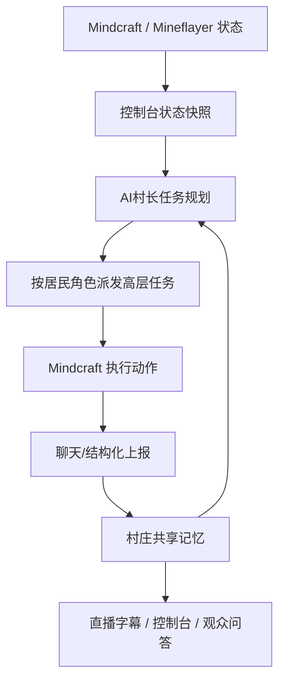

# AI 村庄社群系统

本项目参考多 Agent 协作、旁观导播和长期记忆的通用思路，但不照搬任何外部项目的命名、角色或实现。产品形态仍然是“我的世界AI陪玩 / AI村庄”。

## 核心角色

- `Airi`：AI村长。负责长期目标、任务拆解、巡查验收、直播观察和观众问答。
- `Alex`：生存管家。负责安全巡逻、基础资源、公共箱子、食物、补光和紧急处理。
- `Luna`：建筑师。负责基地、仓库、道路、围栏、照明、农田和简单住宅。

后续可以再扩容出农业、采矿、探索、战斗等专职居民，但当前默认只运行两个，降低噪声和 token 消耗。
## 运行原则

1. AI 是常驻居民，不是玩家跟随宠物。
2. 所有居民围绕共享基地建设：安全、食物、照明、公共箱子、道路、农场、矿点、住宅。
3. 玩家求助时优先响应；玩家不在时继续执行村庄目标。
4. AI 完成公共设施时必须上报，控制台记录为共享事实。
5. 村长可以是控制台/直播观察者，不一定要作为 Minecraft 玩家进服。

## 控制循环



## 上报协议

居民开始、完成或受阻于公共设施时，在聊天或接口里上报：

```text
VILLAGE_REPORT {"type":"storage","title":"基地公共箱子","status":"done","public":true,"position":{"x":-100,"y":66,"z":167},"description":"已放置公共箱子","projectId":"storage-hub","checklistId":"place-chest"}
```

控制台会把这些上报写入村庄状态，并自动更新相关项目清单。

## 直播与观察

第一阶段使用 Mindcraft bot viewer 聚合多个 AI 视角。稳定直播阶段再引入独立观察账号 `ServerTV`，用原生 Minecraft 客户端 + OBS 获取更稳定画面。控制台负责显示当前镜头、AI 思考字幕、任务事件和村长解说素材。

## 后续插件

服务端插件不是必须起步，但它是工程化的关键能力：

- 推送聊天、玩家坐标、AI 坐标、死亡、方块变更、箱子库存和区域状态。
- 提供 `ServerTV` 导播控制。
- 为控制台提供比单个 bot 视角更可靠的公共事实。