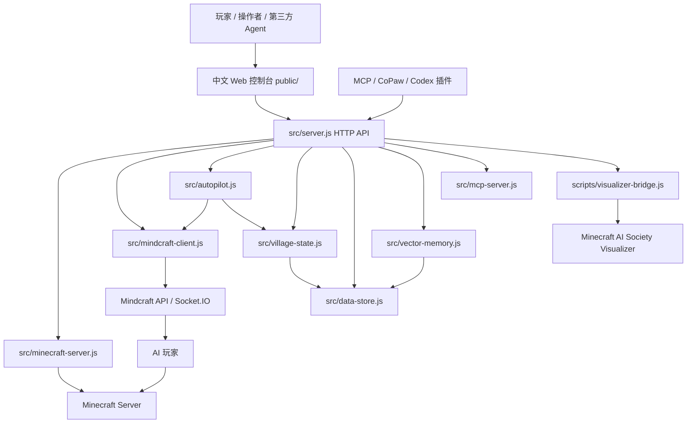

# 架构说明

本项目是一个本地优先的 Minecraft AI 陪玩控制台。核心目标是把 Minecraft Server、Mindcraft、AI 居民、村庄状态、直播可视化和第三方 Agent 接入收敛到一个中文产品界面，同时保持默认安全边界保守。

## 当前架构总览



## 组件边界

| 组件 | 职责 | 不应该负责 |
| --- | --- | --- |
| `src/server.js` | 组合根、HTTP 路由、进程编排、依赖注入、API DTO 拼装 | 复杂领域规则、持久化细节、Mineflayer 动作细节 |
| `src/minecraft-server.js` | Minecraft Server 进程管理、端口检测、日志读取、控制台命令白名单 | AI 决策、网页 UI、Mindcraft Profile 解析 |
| `src/mindcraft-client.js` | Mindcraft HTTP 与 Socket.IO 通信、Agent 状态摘要、任务下发 | 任务规划、村庄领域状态、数据库写入 |
| `src/autopilot.js` | 自动陪玩循环、高层任务生成、LLM 调用、短期任务记忆 | HTTP 路由、进程启动、数据库 schema |
| `src/village-state.js` | AI 村长、居民角色、基地、公共箱子、项目、设施上报和共享记忆快照 | 外部 API 调用、LLM 请求、文件之外的数据库查询 |
| `src/data-store.js` | SQLite/JSONL 事件存储、查询最近事件和记忆 | 业务决策、AI prompt、服务器进程管理 |
| `src/vector-memory.js` | 记忆 embedding、SQLite 向量检索、可选 Qdrant 检索、词法降级 | 原始记忆创建、任务派发、UI 展示 |
| `src/mcp-server.js` | MCP 协议适配、工具 schema、工具调用到内部 handler | 直接操作 Minecraft 世界、绕过安全边界 |
| `src/model-providers.js` | 模型供应商预设、密钥环境变量检测、Mindcraft 子进程环境映射 | 保存密钥、直接调用 LLM |
| `src/mindcraft-config.js` | Mindcraft `settings.js` 与 profile JSON 的读写和密钥字段过滤 | 运行 Mindcraft 进程、任务规划 |
| `public/` | 中文控制台 UI、状态展示、表单和 API 调用 | 直接读写本地文件、保存密钥 |
| `scripts/visualizer-bridge.js` | 把控制台状态投喂给直播可视化站，清理观众可见文案 | AI 决策、服务器控制、长期数据存储 |

## Mindcraft 接入原则

本项目把 Mindcraft 当作“Minecraft 具身执行层”，而不是无限制聊天机器人。常驻居民使用 `!goal(...)` 保持长期自治，控制台在居民空闲、卡住或需要短动作心跳时优先下发稳定内置命令；`!newAction(...)` 会触发代码生成，允许在复杂小动作、高级建造、复合采集和脱困场景中受控使用。详细规则见 [MINDCRAFT_USAGE.md](MINDCRAFT_USAGE.md)。

## 高内聚低耦合原则

1. `server.js` 是组合根，可以知道所有模块；其他模块不要反向依赖 `server.js`。
2. 领域状态由 `VillageState` 管，事件持久化由 `DataStore` 管，向量增强由 `VectorMemory` 管。
3. AI prompt 和任务策略集中在 `Autopilot`、`buildSocietyResidentTask`、`buildCommanderSystemPrompt`，不要散落到 UI。
4. 第三方 Agent 只调用高层意图 API 或 MCP 工具，不直接发送底层 Mineflayer 动作。
5. 观众可见文字必须经过中文化和清理，避免暴露内部提示词、系统规则或原始动作命令。
6. 密钥只来自环境变量或 Mindcraft 自己的 `keys.json`，仓库、网页配置和 profile 写入都不能保存真实 key。

## 已生效能力

- 本地 HTTP 控制台：`npm start` 后监听 `127.0.0.1:4177`。
- Minecraft Server 托管：启动、停止、重启、日志、控制台命令。
- Mindcraft 整合：启动、停止本控制台托管进程、Agent 创建/进服、Socket 状态。
- Autopilot：可并发给多个居民派发高层任务，支持云端 OpenAI-compatible 和本地 Ollama 风格配置。
- AI 村庄：村长、五个默认居民、基地、公共箱子、项目、资源目标、公共设施上报。
- 数据层：SQLite 优先，JSONL 降级；已覆盖任务事件、设施上报、观察、状态上报、记忆和记忆向量。
- 向量记忆：支持 OpenAI-compatible/Ollama embedding，SQLite 向量检索，Qdrant 可选，失败后词法降级。
- MCP：同时支持旧式 SSE 和新版 streamable HTTP，默认 localhost；可配置允许局域网私网地址给 CoPaw/主播端使用。
- 直播可视化 bridge：将控制台状态转换成直播站可消费的中文任务、库存、公开思考和事件。

## 当前技术债

- `src/server.js` 仍然偏大。短期可以接受，因为它是组合根；中期应拆出 `routes/`、`services/commander.js`、`services/society.js`。
- AI 输出仍依赖 Mindcraft 模型遵守 prompt。直播层已经清理内部推理和动作命令，但长期应通过更严格的 agent output schema 固化。
- 公共设施和箱子状态主要来自 AI 自报，缺少服务端插件的真实方块/库存事件源。
- SQLite 是单机优秀方案；如果做多人直播和远程协作，需要 Postgres/pgvector 或 Qdrant 作为共享服务。
- 控制台默认 localhost；局域网开放时必须增加鉴权、只读模式和危险操作确认。

## 变更影响面判断

| 修改区域 | 必须同步检查 |
| --- | --- |
| `src/server.js` 路由或状态结构 | `public/app.js`、`integrations/openapi.yaml`、MCP 工具、README |
| `src/autopilot.js` 或村长 prompt | `docs/AGENT_SOCIETY.md`、直播可视化文案、中文输出扫描 |
| `src/village-state.js` | `docs/DATA_MODEL.md`、`docs/AGENT_SOCIETY.md`、SQLite 镜像字段 |
| `src/data-store.js` | `docs/DATA_MODEL.md`、`/api/storage`、数据迁移说明 |
| `src/mcp-server.js` | `docs/COPAW_MCP.md`、`docs/INTEGRATIONS.md`、OpenAPI/插件说明 |
| `scripts/visualizer-bridge.js` | 直播页面状态、观众可见文案、局域网访问说明 |

## 验证命令

```powershell
npm run check
node --check scripts\visualizer-bridge.js
```

涉及运行中服务时，再检查：

```powershell
Invoke-RestMethod http://127.0.0.1:4177/api/status
Invoke-RestMethod http://127.0.0.1:3010/api/status
```
