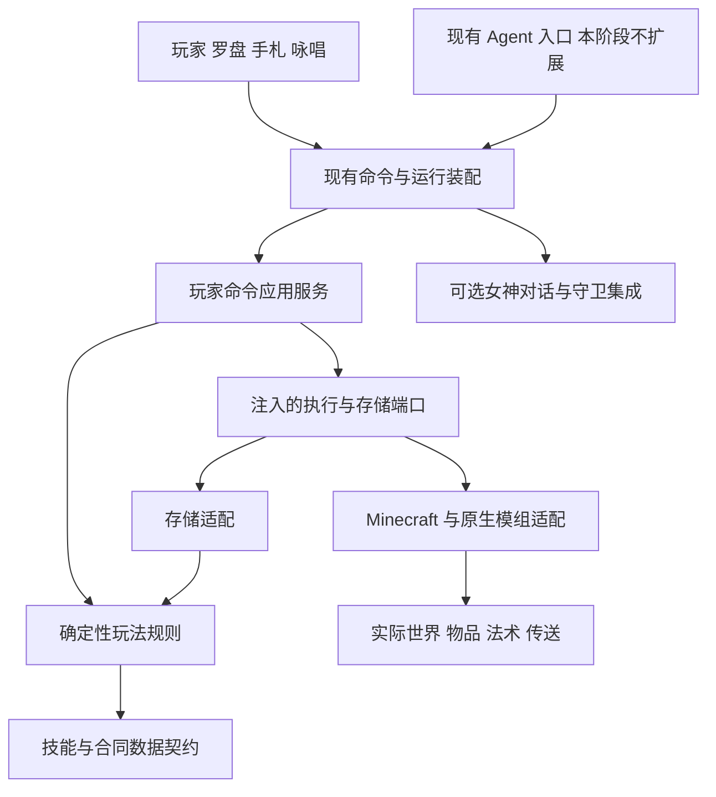

# 千灯纪代码架构与拆分记录

2026-09-07。按用户最新要求，**暂缓新增 AI Agent 功能，先整理现有实现并拆分玩法职责**。Numen、外部 Agent/MCP、模型配置与连接兼容继续复用。

同日后续已按补充要求保留 QwenPaw 并提取可替换会话接口，新增独立管理台。当前地址、实际边界与限制见 [QwenPaw 与管理台](AGENT-PROVIDER-AND-PANEL.md)。下面第一轮冻结范围按该补充调整：允许抽取现有调用，仍不新增 Agent 能力或修改模型/角色配置。

本轮采用同进程内的模块拆分，保留现有命令、导出路径、数据格式和发行组合。没有建立第二套 Agent 框架，也没有直接迁移旧世界或改换加载器。

## 当前架构决定

代码按“玩法规则、存储与游戏适配、运行装配、玩家界面”组织；Agent 是已有入口和决策调用方。依赖应从装配与适配指向规则，纯规则不反向导入女神、网络、文件或模组连接。


```mermaid
flowchart TD
    P[玩家 罗盘 手札 咏唱] --> H[现有命令与运行装配]
    A[现有 Agent 入口 本阶段不扩展] --> H
    H --> U[玩家命令应用服务]
    U --> G[确定性玩法规则]
    U --> I[注入的执行与存储端口]
    H --> Q[可选女神对话与守卫集成]
    I --> S[存储适配]
    I --> M[Minecraft 与原生模组适配]
    S --> G
    M --> W[实际世界 物品 法术 传送]
    G --> C[技能与合同数据契约]
```

图中的运行装配目前仍包含 `mc-god.ts`、`mc-magic.ts` 和 `mc_guild.py`。玩家命令执行已进一步提取到应用服务，world 启动不再等待 QwenPaw 健康；女神化身仍承载现有聊天和队列生命周期，尚未拆为单独的玩家进程。模型不可达验证与保留限制见 [玩家命令应用服务](PLAYER-COMMAND-SERVICE.md)。

## 本轮已落地的代码边界

| 模块 | 实际文件 | 职责 |
|---|---|---|
| 技能契约 | `world/src/gameplay/magic/contracts.ts` | 技能定义、施法结果、玩家视图、旧状态结构和兼容服务类型；不连接游戏或模型 |
| 技能默认内容 | `world/src/gameplay/magic/defaults.ts` | 原有默认原子表、造物白名单与默认数量；继续让现有配置覆盖 |
| 技能目录规则 | `world/src/gameplay/magic/catalog.ts` | 目录完整性、精选/归档分类、图标与只读投影 |
| 输入解析 | `world/src/gameplay/magic/spell-input.ts` | 既有咏唱前缀、中文数字、方向、物品、精确名称与参数校验；没有向量调用 |
| 技能规则与展示 | `world/src/gameplay/magic/rules.ts` | 成本计算、平衡字段边界、技能投影、鉴定报告 |
| 玩家命令协议 | `world/src/gameplay/commands/player-cli.ts` | 命令树、解析、帮助、状态/技能列表；通过契约取得数据 |
| 玩家命令应用服务 | `world/src/application/player-commands.ts` | 普通 CLI、明确施法和既有队列请求执行；只调用注入端口 |
| 应用端口 | `world/src/application/player-command-ports.ts` | 游戏、进度、地点、私密回执和可选女神扩展契约；不导入具体适配器 |
| 原生与传送契约 | `world/src/gameplay/native/contracts.ts`、`gameplay/travel/contracts.ts` | 原生法术、成长、地点与回执数据；旧适配器保留同名导出 |
| 技能状态存储 | `world/src/infrastructure/magic-state-store.ts` | 旧 version 1 格式、惰性回蓝、原子替换与共享镜像的既有实现 |
| 技能目录文件读取 | `world/src/infrastructure/skill-catalog-file.ts` | 文件读取、重复键检查、调用目录规则；损坏目录继续拒绝开放 |
| 工会纯规则 | `world/sidecar/guild_rules.py` | 既有功勋等级、领取身份兼容、旧单校验、暂停规则、看板/我的委托/声望文案 |

技能拆分通过语法树精确提取声明，并保留修改前备份。这里的“规则”包含现有技能服务的兼容类型，并不意味着原有女神专属方法已全部移除；本轮不改这些调用者的行为。

### 旧入口如何兼容

- `mc-cli.ts` 保留原导出路径，转发到玩家命令模块；已有 `/mycli`、`/myhelp`、Agent CLI 与调用方不用换命令。
- `skill-catalog.ts` 保留原导出，分别转发到目录规则和文件加载器。
- `mc-magic.ts` 保留 `createMagic`、旧导出与实际施法装配；导入提取后的规则和存储，不改变装备、消耗、冷却或执行顺序。
- `mc_guild.py` 保留原函数签名、环境开关、文件读取和游戏执行，只把规则/展示交给 `guild_rules.py`。收购单仍在每次判定时读取当前柜台货单。
- `magic-state.json`、传送点、当天任务板、原功勋与玩家 UUID 的数据语义不变；此次不实施 schema 迁移。

工会的生成器、领取、组队、交易、结算和线程没有迁入新规则模块；它仍是原工会，**尚未成为实物托管的 GuildCore**。新规则模块也不负责发奖或修改任务状态。

## 研究后确认的剩余耦合

| 位置 | 当前事实 | 下一步应怎样拆 |
|---|---|---|
| `mc-god.ts` | 普通 CLI 执行已委托应用服务，仍持有输入监听、授权解析、队列与女神生命周期 | 后续独立输入/队列生命周期，保留女神化身和旧通道兼容；旧手札另有状态展示路径 |
| `bootstrap-world.mts` / `compose.yml` | world 仍创建 God，但已解除 QwenPaw 健康启动依赖，心跳标识玩家命令服务 | 进一步独立生命周期时保留玩家服务健康，不用停 world 来关闭模型功能 |
| `mc-magic.ts` | 保留原有向量建议预热和模糊施法适配 | 后续通过可选匹配器端口接入；精确施法内核不需要模型。`MC_MEMORY_ENABLED=0` 目前不能关闭这段向量预热 |
| `MagicStateStore` | 兼有旧资源规则与文件持久化；部分读写失败沿用原降级行为 | 在独立兼容测试中进一步分开状态计算与仓储，另案修复数据损坏处理，避免结构整理夹带存档行为变化 |
| `mc_guild.py` / `mc_npc.py` | 仍通过全局 NPC 模块使用 RCON、文件和角色记录 | 新合同按独立端口接实物交付；旧 `clear/give` 不作为新托管权威 |
| Java Iron 桥 | 安全传送没有 Iron API，但角色定位和注册借用 Iron 主类 | 先抽角色解析与通用传送注册，再考虑独立 JAR；仅移动源码不等于解除 Iron 硬依赖 |
| botgate | 17 个 Mixin 混合协议/RCON与书、罗盘、飞行、装备、光环玩法 | 先按职责整理源码和构建清单，保留类名、注入点与注册时机；后续再物理拆包 |
| Java 构建 | Iron 构建借用 botgate helper，并把全部已装模组加入 classpath | 提取共用只读构建工具、明确各模块依赖；用最小 classpath 和缺依赖启动证明隔离 |

这些耦合有实际运行原因，不能仅按文件夹名称批量搬走。尤其 `botgate` 里有现役玩家技能，`mc-god` 里有现役命令，均不能整体停用。

## Java 和客户端的后续目标

职责划分为四块，但本轮仍使用原有 JAR：

1. **通用服务器玩法**：角色解析、安全传送、共享合同及实际物品交接。
2. **原生模组适配**：Iron 的装备/法术/取消，Pufferfish 成长读取，随后是女仆和厨具；按实际能力独立加载。
3. **千灯纪内容**：技能罗盘、角色招式、任务文本、传送阵表现、NPC 与世界设定。
4. **可选玩家客户端**：手札、快捷键、Controlify 接入、字幕、动画；普通玩家命令继续作为通道。

首轮物理拆 JAR 必须保留 `/qdspell`、`/qdwarp`、`/qdlocation`、JSON 回执、权限和稳定 UUID 语义。当前 Iron 模组声明仍是硬依赖，不能把源码拆分描述为“现在不装 Iron 也能传送”。Pufferfish 的可选性也要通过实际缺依赖组合验证。

`tools/deploy_skill_compass.py` 同时准备 QA 技能和传送夹具，不能作为这次架构整理的通用部署器。后续 JAR 更新应使用只替换已验证制品的流程，测试夹具独立准备、恢复。本轮不调用该部署脚本。

## 当前冻结范围

后续用户授权了自研言灵道具、8 槽编辑和语音释放交互。仅为这些玩家功能更新 botgate 的菜单类、原 god-voice 录音区间及新增双端 `qiandeng_chanting`；Numen 身体、MCP 调用、QwenPaw 角色配置仍维持原边界。当前交互与验证见 [LANGUAGE-INTERFACE.md](LANGUAGE-INTERFACE.md)。

“冻结”表示不新增、不升级、不重写；维持现有可用入口与部署依赖。

| 范围 | 文件/资产 |
|---|---|
| 身体与控制 | Numen 与 numen_act JAR，原 C 盘 Numen 参考源码 |
| 外部 Agent/MCP | `world/sidecar/guard/`、`tools/run_numen_mcp.py`、`tools/skill_cli.py` 与 MCP 示例配置 |
| 模型与大脑 | `server/agents/`、QwenPaw 配置/初始化、`mc-god.ts` 的模型与守卫调度、`mc-saga.ts`、`mc-evolve-review.ts` |
| 网络兼容 | `world/src/neoforge-handshake/`、`mc-bot.ts`、botgate 协议相关 Mixin |
| 部署与版本 | 当前加载器、镜像、依赖锁和客户端包；不因架构整理直接换版本 |

共享玩法服务仍保留对现有调用方的接口，Agent 将来可以继续调用它。这里不会为外部模型再建设一套工具注册表、寻路、常驻居民或任务调度。

## 验证与防止重新混杂

`tools/check_architecture.mjs` 检查玩法层和应用层的依赖边界、独立严格类型检查与无运行环境构建，包括只在类型中出现的导入。`gameplay` 只能依赖自身，`application` 只能依赖应用层和玩法层；文件、网络、模型和游戏连接由外层注入。当前覆盖 12 个文件，检查器有 24 个正反例。

常用开发检查：

```powershell
cd D:\Projects\QiandengJi
node tools/check_architecture.mjs
node --test --test-reporter=dot world/tests-ai/magic-core.test.mjs world/tests-ai/magic-summary.test.mjs world/tests-ai/skill-cli.test.mjs world/tests-ai/native-progression.test.mjs world/tests-ai/waypoints.test.mjs world/tests-ai/waypoint-travel.test.mjs
python -X utf8 -B -m unittest discover -s world/tests-ai -p 'test_guild*.py'
```

虽然既有测试位于 `tests-ai`，其中这批验证的是技能、传送和工会行为，不会启动 Agent 大脑。后续可再统一测试目录，本轮先保持入口。

备份位于 `runtime/backups/architecture-split-20260907/`。技能迁出声明、旧运行函数和旧接口分别核对；工会核对原生成器/交易/队伍/线程函数。部署验证另记入 `reports/architecture-split.json`，不把旧的技能里程碑报告当成此次重启后的验收。

### 本轮验收结果

2026-09-07 14:31（北京时间）完成验收，汇总见 [架构拆分验证报告](../reports/architecture-split.json)。

- 技能、命令、成长与传送回归：70 项通过，1 项依赖 POSIX 文件权限的检查在 Windows 跳过；工会与相关兼容检查 37 项通过。
- 玩法依赖边界：6 个文件通过独立检查，检查器自身的 13 个正反例全部通过。54 个迁出声明与原实现一致，26 个保留的运行声明及 CLI 实现保持一致。
- 重新加载 `world` 和 `npc` 后，[游戏内验证](../reports/architecture-live-smoke.json) 9 项通过，覆盖 `/myhelp`、技能目录、27 格罗盘、工会看板与旧任务拒绝规则。罗盘验证覆盖打开和关闭，没有点击施法或实测物理手柄。
- 32 份既有玩家技能状态未变（排除专用 QA 角色），传送点和任务板文件内容一致；Minecraft 服务未重启，未替换 JAR 或重新导出客户端包。
- [运行健康报告](../reports/runtime-health.json) 整体通过，新增架构检查已接入既有健康巡检。

## 接下来的顺序

| 顺序 | 交付 |
|---|---|
| 已完成第一步 | 纯技能规则、输入、存储与工会规则提取；兼容回归与依赖检查 |
| 当前步骤 | 真人语音优先：明确咒语进入同一玩家命令服务、真实 ASR 到技能验证、PTT 默认绑定；见 LANGUAGE-INTERFACE.md 与 PLAYER-COMMAND-SERVICE.md |
| 后续 | 开发玩家可用的实物工会合同：发布者预存报酬、实际交付、稳定合同 ID、对账恢复；先不新增 Agent 协作功能 |
| 再后 | 通用 Java 角色/传送与 Iron 适配解耦，补玩家界面与生活/探索内容，验证后再拆发行件 |
| 暂缓 | 新 Agent 身体、控制租约平台、常驻生活调度、多模型编排、自动世界导演与自动代码发布 |

社会玩法目标仍见 [AI 共生世界设计](SYMBIOSIS-WORLD-DESIGN.md)，本文件按用户最新决定覆盖其当前实施顺序。通用模组套件的方向见 [Numen 扩展设计](AGENT-MODKIT-DESIGN.md)。

2026-09-07 用户最新补充：女神技能的核心为“语言即接口”。优先完成按住说话到施法的玩家闭环；CLI 是并列传输入口，不能要求真人打字作为主流程。仅为此调整客户端输入资源和语音适配，冻结范围内的 Agent 身体/调度/模型配置继续保持。
