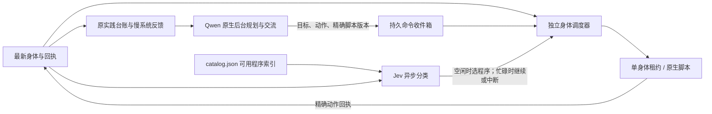

# 独立快循环与规划收件箱

原实现存在两个串行门：规划回合占身体租约，主调度器见 active 就只轮询 Qwen；目录自动选择每个慢决策只能一次。Jev 因而仍要等慢模型。本次用 asyncMotor 开关拆开，复用原 survivor、PolicyWorker、skill-job、Numen 网关和 PracticeStore，无新增服务。

- 规划授权保存在 cognition-lease，不能覆盖身体租约。普通动作工具透明入队；skill_start 保留测试/晋升/版本与实践契约。
- 收件箱至多8个未结请求，每轮6个、最长5分钟有效。相同回合/内容稳定编号去重，目标版本改变或过期时丢弃待执行请求。感知不排历史积压，只使用最新快照。
- 单执行器先持久认领，再调用原网关。重启只核对原回执，认领无回执属于未知；不能猜测“应该没执行”而重投。
- 快循环不以 active Qwen 或复盘待办为前置门。目录分类在相关事实变化时进行；同目标非自理程序的自动重复有界，规划者可明确排队重复。确定性脚本步骤不调用 Jev。
- 当前原生 goto/eat 支持任务内精确中断。Jev 低置信、过期或任务改变则继续原行为；有效中断绑定 actionId/task_id/epoch，复用原停止日志，一次发送，原生终态确认后才接续。其他动作等边界。停止 ACK 不等于已停止。
- 原生 Qwen 回合完成只关闭规划授权；语音和只读伙伴交流保留原通路。status.motorQueue 和面板 motor 展示待办、回执及两个系统状态。

控制器分类等待时目标轮询间隔250ms，其余快循环1秒。原生身体由游戏 tick 持续推进；HTTP、RCON、SQLite和上下文准备仍有耗时，此设计不等于80ms端到端闭环。motor.timingMs 分项记录观察/回执、交流/生命周期、身体调度、慢系统交接耗时，用实际样本判断瓶颈。

部署和实服验证记录见后续验收段；离线测试中的模拟选择不冒充官方 Jev 或世界成功。
