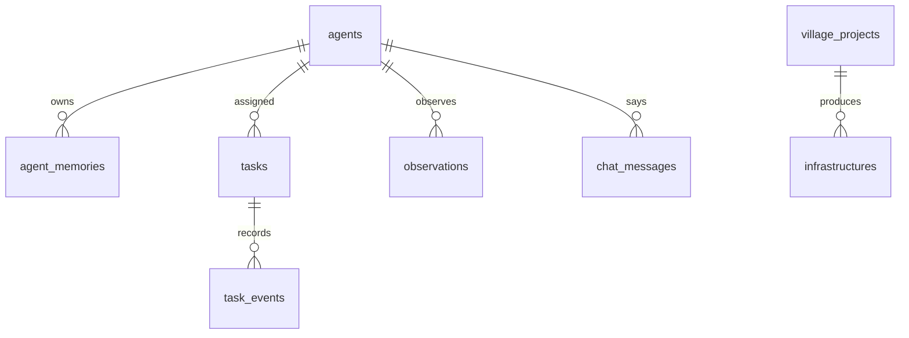

# 数据模型

## 当前状态

当前版本使用“JSON 快照 + SQLite 事件库”，适合快速验证和单机运行：

- `data/config.json`：控制台配置、服务器目录、Mindcraft 地址、模型供应商。
- `data/autopilot-memory.json`：Autopilot 的世界目标、最近任务、最近输出。
- `data/village-state.json`：AI村长、居民角色、基地、公共箱子、资源目标、项目、公共设施和最近任务事件快照。
- `data/ai-friend.sqlite`：任务事件、公共设施上报和居民状态观察。
- `data/events.jsonl`：Node SQLite 不可用时的降级事件日志。

JSON 的优点是简单、可读、容易回滚；SQLite 承担事件查询和长期追踪。后续如果直播和多人使用变多，再升级到 Postgres + pgvector。

## 推荐演进

第一步已经接入 SQLite，不引入额外数据库服务。当前已落地 `task_events`、`infrastructure_reports`、`agent_observations`；下一步补 `agents`、`agent_memories`、`tasks` 和 `chat_messages`。

## SQLite 表

`agents`

- `id`：内部 ID。
- `name`：Minecraft/Mindcraft 名字，例如 Alex。
- `role_id`：当前默认 steward、builder；后续可扩展 guard、farmer、miner、scout。
- `persona`：角色人设。
- `status`：online、offline、lost、disabled。
- `last_position_json`：最近坐标。

`agent_memories`

- `agent_id`：所属居民。
- `scope`：working、personal、shared_ref。
- `content`：记忆文本或 JSON。
- `importance`：重要度。
- `created_at`、`updated_at`。

`tasks`

- `id`：任务 ID。
- `agent_id`：负责居民，可为空表示全村任务。
- `project_id`：关联村庄项目。
- `title`：短标题。
- `description`：高层任务。
- `status`：planned、active、blocked、done、cancelled。
- `source`：commander、manual、autopilot、plugin、viewer。

`task_events`

- `task_id`：关联任务。
- `agent_id`：事件主体。
- `type`：assigned、progress、completed、blocked、note。
- `payload_json`：原始事件。
- `created_at`。

`village_projects`

- `id`：storage-hub、safe-lighting、starter-farm、starter-mine 等。
- `owner_role`：默认负责角色。
- `priority`：P0-P3。
- `status`：planned、active、blocked、done。
- `checklist_json`：项目清单。

`infrastructures`

- `id`：设施 ID。
- `type`：storage、lighting、road、farm、mine、house、wall、landmark。
- `title`、`position_json`、`public`、`status`。
- `reported_by_agent_id`。

`observations`

- `actor`：玩家、AI、插件或 ServerTV。
- `type`：position、inventory、chest、death、block_changed、viewer_frame。
- `payload_json`：观察数据。
- `created_at`。

`chat_messages`

- `speaker`：玩家或 AI。
- `channel`：public、private、system、stream。
- `message`：消息内容。
- `created_at`。

## 记忆分层

- 工作记忆：最近几分钟的状态、当前任务和危险。
- 个人长期记忆：每个居民自己的职业经验、失败记录、偏好和关系。
- 共享村庄记忆：基地、公共箱子、设施、项目、资源缺口和村规。

## 任务系统原则

任务不是只发一段 prompt。每个任务都应该产生事件流：创建、派发、执行中、受阻、完成、验收。这样控制台、直播字幕、AI村长和第三方 Agent 都能看到同一套事实。