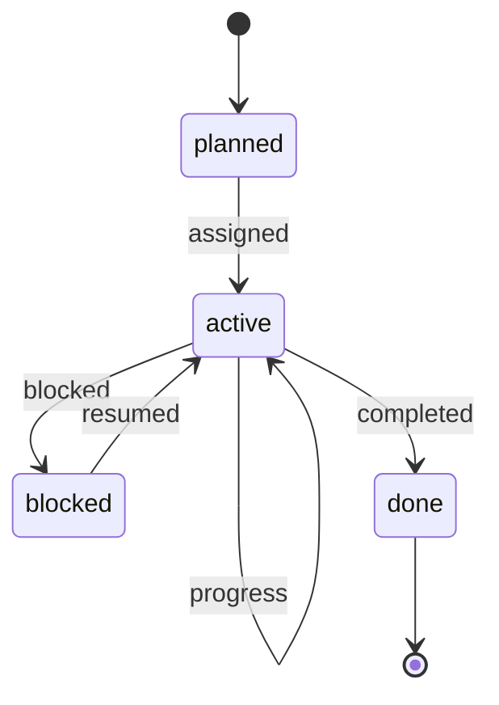

# 数据模型

当前版本使用“JSON 快照 + SQLite 事件库 + 可选向量索引”。目标是本地优先、易备份、可调试，并能逐步升级到直播级长期记忆。

## 存储文件

- `data/config.json`：控制台配置、服务器目录、Mindcraft 地址、模型供应商、长期世界目标。
- `data/autopilot-memory.json`：Autopilot 的世界目标、最近任务、最近输出和冷却记录。
- `data/village-state.json`：AI 村长、居民角色、基地、公共箱子、资源目标、项目、公共设施和最近任务事件快照。
- `data/ai-friend.sqlite`：工程化事件库和记忆库。
- `data/events.jsonl`：Node SQLite 不可用时的降级事件日志。

`data/` 不提交到 Git。需要复盘时优先看 SQLite，其次看 JSON 快照。

## 已落地 SQLite 表

`task_events`

- 任务派发、进度、完成、受阻和系统事件。
- 关键字段：`id`、`at`、`type`、`status`、`source`、`agent`、`title`、`description`、`project_id`、`payload_json`。

`infrastructure_reports`

- AI 居民或接口上报的公共设施事实。
- 关键字段：`id`、`type`、`status`、`public`、`agent`、`title`、`description`、`project_id`、`checklist_id`、`position_json`、`payload_json`。

`agent_observations`

- 周期性记录 AI 在线状态、动作和坐标。
- 关键字段：`id`、`at`、`agent`、`online`、`action`、`position_json`、`payload_json`。

`agent_status_reports`

- AI 自主上报的任务状态、需求、库存和坐标。
- 关键字段：`id`、`at`、`agent`、`status`、`task`、`needs_json`、`has_json`、`position_json`、`payload_json`。

`agent_memories`

- 每个居民的长期文本记忆。
- 关键字段：`id`、`at`、`agent`、`kind`、`importance`、`text`、`source`、`payload_json`。

`agent_memory_vectors`

- 记忆 embedding 的本地 SQLite 向量缓存。
- 关键字段：`memory_id`、`agent`、`model`、`dimension`、`vector_json`、`payload_json`、`updated_at`。

## 记忆分层

```mermaid
flowchart TD
  Live[Mindcraft 实时状态] --> Working[工作记忆]
  Reports[AGENT_STATUS / MEMORY_NOTE] --> Personal[个人长期记忆]
  Village[VILLAGE_REPORT / 村庄项目] --> Shared[共享村庄记忆]
  Personal --> Vector[向量索引]
  Shared --> Commander[AI 村长上下文]
  Working --> Autopilot[Autopilot 任务决策]
  Vector --> Search[/api/memory/search]
```

- 工作记忆：最近几分钟的动作、库存、坐标、生命值和当前任务。
- 个人长期记忆：每个居民自己的路线、资源点、失败原因、偏好和风险。
- 共享村庄记忆：基地、公共箱子、公共设施、资源目标、项目和村规。

## 向量记忆

`VectorMemory` 支持三种模式：

- `sqlite-vector`：embedding 写入 SQLite，搜索时在本地计算 cosine similarity。
- `qdrant`：embedding 同步到 Qdrant，搜索优先走 Qdrant。
- `lexical-fallback`：embedding 或向量库不可用时，按关键词、重要度和时间排序。

推荐本机 3090 场景：

- embedding provider：`ollama`
- embedding model：`nomic-embed-text` 或 `bge-m3`
- vector store：先用 `sqlite`，直播规模变大后再切 `qdrant`

## 任务事件流原则

任务不是一段 prompt。一个任务应形成事件流：



控制台、MCP、直播字幕、AI 村长和第三方 Agent 必须尽量读同一套事件事实，避免各自维护影子状态。

## 后续演进

- 增加 `tasks` 主表，把当前 `task_events` 的 active 状态聚合成可查询任务列表。
- 增加 `chat_messages`，区分 public/private/system/stream 频道。
- 增加 `agents` 主表，显式保存角色、人设、启用状态和模型配置。
- 引入服务端插件事件源，写入方块变更、箱子库存、死亡、维度和玩家坐标。
- 多机部署时升级到 Postgres + pgvector 或 Postgres + Qdrant。
