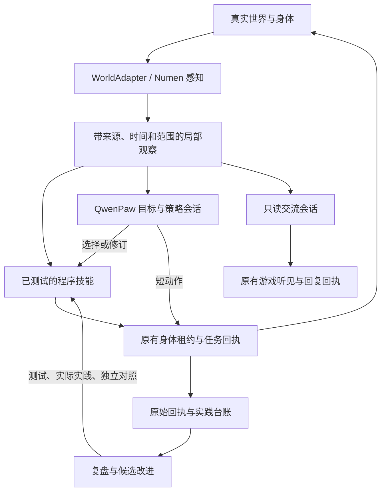

# 桐人的具身 Agent 架构

2026-09-20。目标是可迁移的感知—行动—学习闭环。Minecraft 提供身体、物理规则和可验证任务；本次是架构基础，不能据此声称已经实现通用智能、学到预测世界模型或证明 RSI 收益。

后续演化采用 [L1 快循环 / L2 经验沉淀 / L3 模块化 RSI](RSI-AGENT-DESIGN.md)。具身基础与首个 L1 状态输出优化已部署；原工程师工作区也已接入当前具身基线及固定测试计划。此前“工程副本落后、未覆盖生存模块”是研究阶段的状态，升级记录见文末。原生工程任务已完成固定测试与本地提交，工单已交待审，候选未推送、未部署；独立世界 A/B、保留场景与完整 L3 收益尚未验收。

## 运行结构

没有新增模型提供商、后台调度进程、身体仲裁器或语音队列。既有 survivor 进程仍由 Docker restart 策略守护；QwenPaw 负责全部生成式推理。固定身体 UUID、主人、物资、权限、供应商选择和用量账本保持。

三种节奏分别是原生游戏控制、本地技能的观察/行动检查，以及事件驱动的模型决策。本地技能等待仍是现有 15–300 秒，外层观察仍默认 15 秒；即时控制由 Numen 原生任务处理。本次没有把 Python/RCON 往返称作逐 tick 控制。

## 状态和会话

`embodiment.wake` 只组装已有观察：`self` 为本体实测，`scene` 为有界局部环境，`intent` 为 Agent 的工作意图，`events` 为新反馈。`observations` 单独携带来源/时间/可用性，支持值不变时只更新新鲜度；未知、过期、跨身体/维度的数据不能冒充当前事实。这里的世界状态是部分观察，不包含未经实现的预测能力。

沿用 `behavior_context` 的原生持久 session 与精确确认：只有模型终态确认后推进增量基线；丢失响应不推进，不重投未知任务。行动按目标分 session，复盘/学习/交流分开，首次输入带短约定和参考入口；后续只发变化与新证据。供应商实际网络请求仍由 QwenPaw 组装，不能把应用层增量等同供应商只收到新增 token。已消费的思考省略仍使用现有原生格式化接口。

轮内状态读取支持按需投影：`status(detail="brief")` 每次仍读取真实身体及行动状态，保留安全字段、物品总量和终态证据，省略背包槽位细节；需要槽位或物品元数据时使用 `full`，旧调用默认仍为完整结果。它不缓存游戏状态、不把字段省略解释为物品不存在，也不以减少输出代替行动验收。新行为会话的短约定提示按需选择，已有有效回执不重复查询。

2026-09-20 的首个离线对照使用新记忆代 11:11–12:31 的 14 轮真实轨迹：187 次工具调用中有 40 次 `status`。同样的 JSON 编码下，投影前后为 335,928 → 220,552 UTF-8 字节，减少 34.35%；全部非 inventory 字段逐项一致。导航、合成及其他查询分别覆盖，独立 fixture 验证新鲜状态、导航失败、未知动作不重放、租约保持和合成后物品更新。该结果仅证明这批状态输出的字节减少，不能推导模型 token、响应延迟或游戏成功率已经改善。原始轨迹及逐项 hash 留在本机 `runtime/embodied-references/status-projection-comparison.json`。

交流由原控制器的 `dialogue` 路径驱动，身体忙或程序执行时可以处理已听见的伙伴消息。使用原生请求级 `subagent_allowed_tools` 限定四个只读感知工具；不领取、关闭或借用身体租约。原生终态与游戏听见回执分别保存；未知提交不重发，维护排空须等交流终态。仍保持同角色一次模型任务，身体执行与模型交流可并行；这不等于提高供应商并发，也不证明真人语音端到端延迟。

身体死亡是新的执行经历。具身模式保留固定伙伴接收地址，通过 `bodyEpisode` 让内部行为会话换新；旧模式继续原有语义。顺便修正生命周期检查引用未定义 `control` 导致异常被吞的问题，避免用新架构掩盖此缺陷。

## 原生感知与程序能力

新增一个共享 `sense` 接口，目录明确列出 self、scene、block、container、storage、menu。前四项复用已有查询；后两项接已有 `inspect_block_storage` / `inspect_gui`，限定当前身体、近距工作范围和只读行为。机器库存、流体与 FE 能量依模组公开的 capability；菜单同步数值需具体语义适配。当前两者保留来源明确的原生文本，未伪造通用结构化机器进度。

MCP 与 QuickJS 程序使用相同入口和校验。程序仍不能直接访问 Java、文件或网络。高层动作和原生 interact_at 都保留，技能版本与当前内核须重新测试。所有感知并不默认塞进提示词，由当前任务决定读取哪些信息。

## 记忆代与旧经验归档

`tools/archive_survivor_memory.py` 默认预览，实施要求游戏 Qwen、survivor、NPC 已自然排空并停止。按实际安装版 ReMe 路径校验，完整复制原 workspace 和执行状态并逐文件 SHA256 验证；随后把旧 memory/digest/notes、会话、Scroll 数据库、ReMe 索引/会话缓存等移到 Qwen 挂载之外的 `runtime/embodied-agent-archives/`。

人物人格、身份配置、当前模型、身体物资、可复测技能、原始动作/实践台账与用量保留。新 `memoryEpoch` 绑定工作记忆、会话代和健康状态；旧 memory.json 不能通过默认上下文重新成为当前目标。清空旧认知提示与待处理感知，保留事件游标以免旧聊天重放。旧资料作为离线档案留存，不加入新默认检索；历史程序是可复测能力资产。

新记忆从真实观察开始，按来源区分事实、意图、假设和待验证项。旧强制产出班次、停滞改目标提示与启发式模型跳过不进入具身路径；学习用实际回执、失败和复用需求决定。

回退须再次排空并停止上述服务，先另存新代工作区和状态，再从归档的 workspace/survival 完整恢复；恢复对应源码和内核测试资格后核对模型、身份与任务终态。不可把新旧会话/索引混合恢复，或删除旧未知回执。归档收据记录绝对路径及代号。

## 验收

`smoke_embodied_agent.py` 使用禁网容器验证：旧记忆隔离、首帧与增量、新鲜度/维度、共享感知、程序查询、只读交流与身体并行、未知提交重启不重放、排空等待、归档哈希/幂等。`embodied_agent_health.py` 检查部署代号、归档隔离、当前提示词、受监督心跳、公开状态和同源测试报告；加入既有 panel_smoke。

真实技能效果、模组机器的具体数值语义、真人语音表现与跨场景改进收益必须分别验收。测试通过、接口数量增长、模型写出总结都不替代这些证据。实际部署与回归结果见本页后续实施记录。

## 首次具身部署（2026-09-20，历史记录）

已在原 `D:/Projects/QiandengJi` 部署，QwenPaw 仍为游戏 2.2.1，survivor 复用现有镜像和源码挂载。Minecraft、身体 UUID 与物资未替换；十角色 profile 与全部十六个 Cron 的 spec/启用状态读回一致，其中十三个原本启用。维护已结束，自主控制与 NPC 准入已恢复。

旧工作区及执行状态共 4,903 文件、570,671,762 字节，完整复制并逐文件校验。归档为本机 `runtime/embodied-agent-archives/20260920T025702870319Z-embodied-651f2cba207e4ada97fdcd2d91097bfd`，当前经验代 `embodied-651f2cba207e4ada97fdcd2d91097bfd`。人格、profile 原字节相同；旧经验和索引移出默认检索，历史任务原始回执保留。运行数据和归档不提交 Git。

角色提示词从 24,049 字节降到 3,873 字节，约减少 84%；这是文件大小，不是供应商 token 节省率。新增的原生调度 tick/时间信息与状态值分别编码，避免计数变化导致背包和场景整体重发。应用层首轮输入实测 7,835 字节；后续供应商请求仍包含 Qwen 原生会话及工具定义。

冷启动暴露旧工具配置丢失鉴权绑定的问题：原生 console client DTO 无法往返表达 `env:SURVIVOR_MCP_TOKEN`，保存 DTO 会清掉 card 的凭据引用。已恢复原环境凭据绑定；单工具配置器改用原生 policy 和 whitelist 接口，保留 card 的 endpoint/credentials，并新增回归。现役 Qwen handler 已发现并启用 48 工具，默认拒绝策略保留。真实 MCP 调用确认 `sense` 的 catalog/self/menu/storage 成功，身份和感知时间有回执；storage 在本次草方块上返回未暴露库存/流体/能量，不代表已验收所有机器模组。

首个新代任务 `task-05d5be3fb162` 在新行动 session 中于 11:11:56–11:14:55 完成，实际调用 23 次工具（包括两次 sense），完成一次导航；尝试吃小麦被原生明确拒绝，另一次导航失败、合成未满足条件，失败均保留。模型写入本代目标和下一步，控制器确认原生终态并推进增量基线。原生返回的 task usage 为 input 49,340 / output 575，未独立确认它是否汇总全部推理迭代，不能用来宣称总成本、延迟或任务成功率已提升。

首次部署时，同版禁网容器相关回归 107 项通过；当时的部署源具身 smoke 13 项、既有实践 smoke 34 项通过。两个原晋升程序各重新测试七个 fixture，版本与晋升指针保持，当前内核包含 adapter 合约哈希。新增健康探针七项通过，panel 的 embodied_agent/survivor/survival_practice 通过。后续 L1 变更后的现役同源验收见下一节，不能复用这批旧源码哈希代替。

首次部署的全项目 panel_smoke 未全绿；Qwen 健康检查首先失败于原 `mc-god` 学习 Cron 的 `text_drift`，该提示在维护前已存在，未改写为模板来掩盖差异。其他历史验收/来源漂移见本机 `runtime/embodied-refactor/panel-smoke.json`。宽泛 survivor 测试在当时的基线与最终代码各运行 870 项，两者均有相同的 51 个失败测试标识，无新增失败；不能把针对性通过说成全仓通过。交流并行、未知提交与归档恢复边界已离线验证，真人语音/弹幕和长期 RSI 收益尚未实测。

## L1 部署与工程工作区升级（2026-09-20）

线上采用情况必须与接口验收分开：13:00–14:02:49 的九轮已完成真实轨迹共 43 次工具调用，八次 `status` 都未传 detail，brief 采用数为零，仍返回完整背包。九个模型任务均正常完成（不等于九个游戏目标成功），增量输入都有 `baseTurn` 且没有重复 bootstrap，原行动/复盘 session 的确认游标正常推进；另一个 submitted 任务未计入完成数量。尚不能把投影测试的字节降幅写成当前自主运行收益，后续须验证调用默认、提示与按需详情的实际采用效果。

13:00 已在原生产目录部署 `status` brief 投影、按需读取提示、policy_draft 证据交接和工程提交诊断。维护排空后仅重启原 survivor 和游戏 Qwen，Minecraft 保持运行。13:04 的恢复核验确认十角色完整 profile、十六个 Cron 定义及启用状态与维护前一致（十三个原本启用），NPC 准入和自主控制已恢复。这是随后工程工作区切换前的检查点。

| 当前验收 | 结果与证据 |
| --- | --- |
| 具身与状态投影 | 生产 `reports/embodied-agent-smoke.json`：20/20 通过，12 个源码哈希与现役文件一致；禁网、非 root、源码只读容器执行 |
| 实践台账与原循环 | 生产 `reports/survival-practice-smoke.json`：34/34 通过，15 个源码哈希一致；旧报告因本轮源码变化失效后，已对真实生产字节重跑 |
| 原生 MCP | 48 个工具就绪，detail 默认 full、可选 brief；一次只读实测 full 9,121 → brief 6,211 字节（减少 31.904%），保留 counts 和真实行动回执 |
| 当前相关健康项 | embodied_agent、survivor、survival_practice、navigation_sense、companion_ticking 均通过；以上 smoke 的模型调用、游戏动作和生产修改计数均为 0 |

实时单次读取与前述 40 条历史轨迹投影是两类证据，不是独立世界 A/B，也没有证明供应商 token、延迟或任务成功率改善。完整本机记录在开发目录 `runtime/rsi-engineering-upgrade/` 的 `live-embodied-smoke.json`、`live-practice-smoke.json`、`live-status-probe.json` 和 `panel-smoke.json`。

后续 13:28 复核中，十角色 profile 仍一致，十五条 Cron 定义未变；桐人学习 Cron 的提示和对应 input 增加既有 `learning_policy_draft` 说明，频率及启用状态未变。原生学习 session `b994619f51864a9e91f729f69b414be6` 的工具回执确认：桐人于 13:22 调用 `learning_schedule(enabled=true)`，旧实现从 `managed_job()` 重建整份 spec，因此连同已有模板说明一起刷新。这不是维护过程主动改写，也不能继续声称十六条定义始终相同；原始对照和后续差异保存在 `postdeploy-native-verification-before-workspace.json`、`postdeploy-native-verification.json` 与 `survivor-cron-delta.json`。

原工程师 `qd-engineer` 的隔离工作区已完成升级：可信基线为 `67283d9ac9e018c2ad11b0af3d62a9e27ffd620b`，迁移提交为 `b4b9a0424c50dfc191e6ce5c42102d3f04567f4a`，父节点分别是旧 HEAD `36de676` 与新基线 `67283d9`。原 11 条未提交/未跟踪改动经合并保留，其中两处真实冲突按三侧源码哈希复核；旧工作区和原始文件完整备份。42 条历史 unknown 保持未知及禁止重投，未改写为成功。

固定镜像中的原团队计划 `team-guild-admin-python` 为 331/331 通过，扩展计划 `embodied-team-python` 为 456/456 通过；两者有重叠，不相加为独立案例总数。升级工具另有 24 项 recovery 回归通过。应用回执确认旧记录保留、历史未重写、业务代码未部署；随后工程角色 profile 与原 Cron 状态恢复。证据为 `runtime/rsi-engineering-upgrade/apply-result.json`、`test-result.json`、`engineer-resumed.json`，完整备份为生产 `server/engineering/migrations/20260920T051644-32e782f4/`。工程源码候选不会因此自动部署到游戏服务。

原工程师已通过工单 `case-a7b7f2916f0992c04101` 实际修改独立副本、增加回归并按审查意见修订 `_pending_publications`：流式遍历最多处理 256 个目录项，额外窥看一项判断截断；返回最多 30 行、最多 50 条错误诊断，坏回执明确标记终态未知。既有列表字段、权限及发布规则保持，公开 context 前序 proposal/receipt 索引的旧故障明确留在此次范围外。此次任务由维护者发起并提供独立审查，不能冒称自主发现跨任务问题。

最新快照 `9f15483c85fef816e2ef6d6acd26b6903e2a4429ea3190d37fc2ffdaced74c47` 的正式作业 `mc-god-20260920-pending-pub-bounded-test-03` 已 482 次测试执行通过、exitCode=0，结束后源码核验通过且容器已删除（`containerRemoved=true`）。旧两版 479/481 次执行也各有独立回执，只证明各自快照。首个模型任务因响应流中断失败，确认终态后沿原工单 session 续接，失败记录保留。

原生提交任务 `task-d0b86246fe30` 随后执行 `mc-god-20260920-pending-pub-bounded-commit-02`，在 `read-tree` 阶段报 `EngineeringGitError`、exitCode=128；该提交 journal 保持 `unknown`，没有改写为成功或重投原请求。现场发现空 `.git/index.lock`，隔离副本可复现同一阶段与退出码，能够解释此次失败；这不是旧 42 条 unknown 的根因证明。

锁维护已完成：工程角色停用后，归档经核验无主的空锁；操作前后 HEAD、index、2,310 个源码文件与 61 条 journal 完全一致，随后 profile 与全部原 Cron 精确恢复。旧 42 条 unknown 以及本轮 commit-02 unknown 的原字节均保留。维护没有替角色提交或自动重试原请求，证据为本机 `runtime/rsi-engineering-upgrade/lock-recovery/recovered.json` 与 `resumed.json`。

最终原生任务 `task-bbb8d3c78dbe` 已 completed，新事务 `mc-god-20260920-pending-pub-bounded-commit-03` 返回 `committed`，提交为 `81c41e95a3c7ec3cb94ba18790fabac8767ce7a7`、父节点为迁移提交 `b4b9a042`。提交绑定上述 `9f15483c…74c47` 快照与 test-03 的 482 项通过回执；`git --no-optional-locks` 核查 HEAD 相符、工作树干净。提交共 12 个路径，包含原 11 项 dirty 内容的保留及本轮修订，另增加 `tests/test_world_content_pending_publications_bounded.py`，不能把全部路径算成本轮新创造。工单现为 v10、`needs_review`，候选 `pushed=false`，未部署。交付核验在本机 `runtime/rsi-engineering-upgrade/native-engineer-delivery.json`；正式测试及提交原件位于生产 `server/engineering/receipts/` 与 `server/engineering/state/`。

全项目健康仍有旧问题：Qwen 在 `mc-god/qd-learning-mc-god` 的 `text_drift` 处失败（实际 572 字符、校验期望 700 字符）；NPC 的 `hesu` 为 `missing_in_loaded_chunk`，`guild_lan` 在线，导致 `guild_npc_identity_not_ready`。修复实践报告后，面板组件的通过/失败状态与此前具身部署基线一致。工程链已接通到新基线，但完整 L3 仍需自主候选、受控世界对照与保留任务的收益证据。
