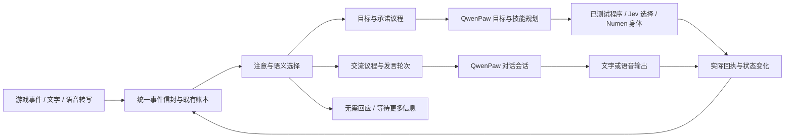

# 具身数字人的交流与行动调度

2026-09-21。设计基线为 `fdb35f3`，首阶段实现与验收见本文末尾。下文总体架构和交互样例包含后续阶段，不能全部视为现役能力；不把参考项目演示或论文实验当成本服验收。主要对照文件的固定版本与 SHA-256 见[阅读清单](research/embodied-social-scheduling-20260921.json)。

## 运行改进：分类过期、对话积压与计划失联（2026-09-21）

14:44–14:51 的观测发现，最近 11 次伙伴分类全部回退，其中 10 次被主循环判为过期。HTTP 本身约 256–1019 ms，但服务只识别身体策略的 pending，没有识别 pending_social；普通认知状态下会等到 15 秒观察周期，超过分类的 5 秒有效期。旧对话也出现多条重复询问位置、身体恢复情况，单条排队数分钟。memory/goals.md 仍停在早前阶段，而恢复进食、获救等已有独立回执。

- `service.control_interval` 将 pending_social 纳入 250 ms 轮询，普通原生认知在途时按 1 秒查询，空闲仍用原观察周期。该值是调度间隔，实际周期还包含身体读取、文件发布等耗时，不能当成 Jev 或整段回答延迟。
- 原分类账本同时记录 `latencyMs`、`controllerElapsedMs`、`messageAgeMs`，区分 HTTP、控制器交接与积压年龄。生产仍为 shadow；没有据此启用自动忽略，也未声称分类准确率提升。
- 原 PartyMessages 增加小型关联表，一次原生推理最多处理三条同伙伴、同身份版本、已听见且已就绪的消息；总原文不超过 8000 字符，不截断。收到的后来消息不并入已有任务，不为凑批增加等待。候选与实际预留不一致就重新选择，不能提交上下文里没有的消息。
- 组成员与主消息在同一个 SQLite 事务中预留，重启/超时仍等待原任务。只有主答复的全部分段实际 heard 后，成员才成为 observed，并记录 `answered_together:<主消息ID>`；它不表示生成了多份回复或多次听见。已知失败或确证未提交时释放成员，保留尝试记录；未知结果不释放、不重发。当前合批只接桐人的既有伙伴入口，并非多人弹幕系统。
- 增量整理原来会删除通用 instruction，连带删掉复盘里更新长期计划的提醒。现在复盘提供 `reviewGuidance` 具名字段，经确认后作为增量基线保留；普通行动不重复带入。原生文件工具维护 memory/goals.md、短索引及工作记忆，工程代码不替 Agent 编造或完成目标。

部署继续复用原 survivor/NPC、QwenPaw tracker/Cron 与 Docker 守护。健康探针校验 `socialProgressVersion` 和实际源码回归报告。源码与生产字节各 176 项具身测试通过，另有 169 项通信回归、生产 34 项实践测试；Windows 首轮缺 QuickJS/MCP 依赖的失败和测试期间源文件变化导致证据拒绝均保留，最终使用断网 Linux 容器重跑。运行证据保存在被忽略的 `runtime/social-progress-20260921/`，不重放一次性维护脚本。

### 实测发现的原生提交响应丢失

15:19:54 一条新对话的原生 POST 出现 ReadTimeout，控制器未拿到 task ID，停在 reserved/unknown。旧代码只保持这个状态，连下一次复盘也被阻塞。不能由 HTTP 超时推断请求未受理，不能简单重新 POST。

增加 `survival_submission_runtime`，在已核对 SHA 的现役 QwenPaw 原生后台任务入口外记录具身请求引用。原入口仍负责准入、tracker 和模型执行；返回原任务 ID 后，先持久保存回执，再返回 HTTP。记录限定桐人/原生 user/session/turn，保存请求摘要而非对话原文；相同 turn 再提交会拒绝。控制器在未知对话上每十秒只读查询，身份全等才接回原任务继续轮询，404、未知或身份冲突均不会重发。该接回逻辑当前用于对话通道，不把所有未知身体动作都视为可自动恢复。

实测中的旧请求产生于补丁之前，没有可追溯的原生任务 ID；在相关进程全部停止后归档原 controller/SQLite 前像，记录 `operator_closed_unknown_no_replay`，未标作已回答、未制造任务 ID、未重投。该人工对账不是自动恢复成功案例。第二次维护中，空闲检查失败但串行 shell 仍执行了停止命令，打断了结衣在途任务；原失败照留，后续由既有原生缺失句柄核验恢复，不宣称全程无中断。维护证据为 `runtime/social-ack-20260921/`。

第一轮上线后的真实样本：一次 Jev HTTP 693.88 ms、控制器接回 1124.22 ms，stale=false，confidence 0.30 仍正确回退；新收到的一条伙伴消息排队 43.72 秒、生成 41.27 秒、生成后到实际 heard 3.38 秒，总计 88.37 秒。旧积压消息跨越维护停机，不能作为可比延迟样本。当前仍受同角色认知槽和原生模型生成时间限制；后续也出现过 `policy_observation_stale`，不能宣称全部过期问题消失。

### 最终实服验收与未解决边界

- 真实三条结衣来信由一个 `task-6ed72f0e947c` 生成一次答复，主消息 `2c925805-1d40-56b0-a329-6f0e5d6bcf2b` 实际 heard；两个关联成员成为 covered/observed。随后又完成一次两条合一。证明了合批链路，未做整体成本或延迟 A/B 测试，未验证真人音频播放。
- 原生回执 GET 与实际落盘内容、身份及后台 task 状态全等。离线覆盖了丢失提交响应后接回同一 task、零重投；本次没有故意打断生产 HTTP 来制造丢包实验。
- 第一版复盘指导随增量输入送达，但 `task-8406753c6443` 只写了工作摘要，没有更新计划。最后修订为先读/改计划、核对保存，最后才 remember/finish；经维护者从实际 MCP 发送一次复盘信号，`task-9a70d7188707` 完成，`goals.md` 在 15:47 实际改变。当前阶段已更新为满血满饱食、骷髅任务 0/2；文末仍留着过时的缺食/脱困步骤，部分刷怪原因也只是模型推断。因此仅验收计划写入链路，长期记忆的一致性与事实质量仍需后续改进，不能称完全自主 RSI。
- 15:49 只读观测：桐人 enabled=true、无暂停/未知任务阻塞，HP 20、hunger 20，位置约 (-1.50,65,1184.24)。结衣先前被维护打断的 `task-577f2159b3ca` 保留 `native_task_lost` 失败，后续新任务 `task-7f79a73e0e19` 已启动；没有将失败重标成功。

最终源码及生产字节各 **181** 项具身回归、生产 **34** 项实践测试通过；此前通信 **169** 项通过，分组有重叠，不相加为独立用例数。现役原生工具为桐人 49/3、结衣 7/3，10 profiles、16 Cron 和准入均按前像恢复。第二阶段完整 panel 的具身、系统一、实践、Qwen 和 survivor 项通过，全局旧来源/资产/历史游戏传输证据失配继续如实保留。

最终仅重启 survivor 前已确认所有在途任务结束。`runtime/social-progress-20260921/`、`runtime/social-ack-20260921/`、`runtime/review-order-20260921/` 三次维护均已结束，禁止重放；生产报告来自真实重跑。维护脚本必须检查上一步退出码，禁止用 PowerShell 分号把失败的就绪检查与停服务操作串起来。

## 结论

边玩边聊需要事件驱动的注意力与任务调度。队列负责保存、合并、排序和恢复；模型判断一句话的意义；执行器确认实际发生了什么。至少分开三个问题：**何时回应、是否改变身体行动、是否形成后续承诺**。一句“挖完这些陪我建房”同时需要现在回应和稍后行动，单个互斥分类标签不够。

优先扩展现有 survivor、QwenPaw 原生任务和消息账本，不引入新的常驻脑、Redis 或第二套身体控制器。调度机制提供可核实的事实与选择，不用大量关键词规则替代角色判断。

## 这次具体读了什么

### Cortico：合批与有限抢占

固定版本 [7d20a102](https://github.com/Pal-AI-Lab/Cortico/tree/7d20a1029d69e5f8b3a968d476419d0ddfe6b786)。

- [WakeBus](https://github.com/Pal-AI-Lab/Cortico/blob/7d20a1029d69e5f8b3a968d476419d0ddfe6b786/src/core/bus.ts) 按到达顺序向单消费者交付一批事件，支持 `debounce / flush / preempt / piggyback`。合批同时限制最短积累、安静间隔、最大等待和最大条数，连续聊天不会无限延后投递。`piggyback` 不单独唤醒。
- [MainLoop.abortCurrentRound](https://github.com/Pal-AI-Lab/Cortico/blob/7d20a1029d69e5f8b3a968d476419d0ddfe6b786/src/core/loop.ts#L331) 只取消尚未产生外部效果的模型轮；已经输出或执行工具不能假装没发生。事件投递与模型取消不是身体停止回执。
- [WakeManager](https://github.com/Pal-AI-Lab/Cortico/blob/7d20a1029d69e5f8b3a968d476419d0ddfe6b786/bots/corti-soulmate/persona/rhythm.ts) 用持久定时器和投递闸门表达“稍后再处理”，到期可把提醒与积压一起交给角色。

借鉴合批、搭便车、明确唤醒和迟到结果隔离；其总线本身不是语义优先级分类器，也不能据此声称具有完整的多人语音轮次控制。

### mc-agent-neko：聊天与游戏任务有不同入口

固定版本 [23f59712](https://github.com/wehos/mc-agent-neko/tree/23f5971203e3f4d15ef416ff8e5cc67965845d82)。

- [agent.js:189–241](https://github.com/wehos/mc-agent-neko/blob/23f5971203e3f4d15ef416ff8e5cc67965845d82/src/agent/agent.js#L189) 先过滤自己、非在线玩家和系统回执；有命令前缀时，明确指令交给 `AdminMission`，其余真人聊天默认 **3 秒合一批**。
- [ws_server.js:825](https://github.com/wehos/mc-agent-neko/blob/23f5971203e3f4d15ef416ff8e5cc67965845d82/src/websocket/ws_server.js#L825) 将这批消息作为 `ingame_chat` 发给外部客户端，由外部端决定接话或下发任务。因此它的聊天能力需要外部对话端配合，MC 仓库并不独自完成整个语音闭环。
- [admin_mission.js](https://github.com/wehos/mc-agent-neko/blob/23f5971203e3f4d15ef416ff8e5cc67965845d82/src/agent/admin_mission.js) 有任务覆盖与 epoch；[tool_lanes.js](https://github.com/wehos/mc-agent-neko/blob/23f5971203e3f4d15ef416ff8e5cc67965845d82/src/agent/framework/tool_lanes.js) 管理互斥资源。不能把 Promise 超时或本地取消视为旧动作已经停止。

该版本的 `docs/ingame-chat-as-admin.md` 描述了较旧的“聊天全当指令”措施，与实际新路由不同；以源码为准。也不能照搬“点名即 admin”：我们的发言对象、请求含义和调用权限要分开。

另核对了 **Project N.E.K.O. 主项目**的[官方 Agent 架构](https://project-neko.online/architecture/agent-system)：对话归 Main Server，后台任务归 Agent Server，结果回到对应会话，语音结果可等合适边界再注入；回调不会再次触发任务分析。它还提供外部 QwenPaw 适配。这是独立的架构参考，不能把其文档当作上述 MC 仓库已接通全部能力的证明。本轮未拉起或端到端验证主项目。

### 具身交互研究：排队之外还有话轮和共同注意

[Microsoft Situated Interaction](https://www.microsoft.com/en-us/research/project/situated-interaction/) 将注意、参与、可打断性、多方话轮和情境协调列为机器人及虚拟人的关键能力。这支持本项目同时跟踪“正在和谁交流”和“身体正在做什么”。

[TurnGPT（EMNLP 2020）](https://aclanthology.org/2020.findings-emnlp.268/) 研究利用对话上下文及语用完整性预测换人说话；[实时 VAP（2024）](https://arxiv.org/abs/2401.04868) 根据双通道对话音频预测后续发声活动。这些方法回答“对方是否说完、是否该接话”，不直接回答“是否接受建房任务”。[多语言 VAP](https://arxiv.org/abs/2403.06487) 包含普通话实验，也指出单语言模型跨语言迁移不佳。因此语义分流可以研究 Jev，语音话轮需要音频信号与独立验证，不能只看 ASR 句号或照搬英文模型。

本轮论文核查以作者摘要及官方项目说明为依据，未复现实验；不宣称选定了本服的最佳音频模型。

## 本项目已有能力与实际缺口

| 位置 | 已有能力 | 此次确认的边界 |
| --- | --- | --- |
| `world/sidecar/party_messages.py`、`world/survival/party.py` | SQLite 预约、身份绑定、期限、未知投递保护、消息及回复回执 | 两名队员专用。`next_pending` 对已听见消息按 `created,rowid` 取最早项；没有语义紧急度和多人交流议程 |
| `world/survival/dialogue.py` | 身体执行原生任务/技能时可跑只读交流，工具不授予身体租约 | 普通 Qwen 认知活跃时不能再提交交流任务；一次同角色模型任务。不是任意两路 Qwen 并发 |
| `world/survival/behavior_context.py` | action、review、dialogue 分会话，确认后推进增量基线 | session 分离不等于计算并行，也还没有多人话题与发言轮次状态 |
| `world/survival/mcp_server.py::submit_goal` | 接收对话目标，控制器在动作边界切换 | 写同一个 `conversation-intent.json`；连续输入可能覆盖尚未消费目标，不是多目标承诺队列 |
| `world/survival/controller.py` | `goalSwitchPending`、身体租约、未知动作阻断、规划与交流让位 | 不宜把每条聊天都变成 mission；当前普通交流仍受规划时长影响 |
| `world/src/voice-command-inbox.ts`、`mc-god.ts` | 录音时间/身份核验，最终 ASR 文件去重和原命令分派；已有女神文本→语音队列入口 | 这里是最终转写入口，不是已验证的全双工流式话轮控制；女神语音入口也不等于桐人、结衣都已接通 |
| `world/sidecar/party_world.py` | 附带人物 UUID、距离、维度的游戏内 heard 回执 | 表达世界内消息被接收，不证明真人客户端已播放完音频，更不证明理解了内容 |

因此保留现有可靠投递语义，在上面增加选择与承诺管理；不把真人伪装成队伍成员，也不改写原消息历史。

## 目标结构

这是一个角色的不同活动，不要求新增多个角色。身体可以继续已有任务；听取新事件、准备简短回应、记录后续目标都可异步进行。头部朝向若用于瞄准，就属于身体冲突资源，不能为了“看着聊天对象”随意抢占。

### 1. 统一事件协议，复用既有账本

事件信封包含 `eventId / source / speakerId / addressedTo / occurredAt / receivedAt / conversationId / revision / replyTo / evidenceRefs`。身份与权限来自可信入口，模型只解释正文；语音保留录音起止及最终转写标识。空间、同伴关系、当前承诺是有时间戳的上下文，未知就标未知。

统一的是关联与调度协议，不是把已有消息、动作和语音账本重写进一个新系统。原 PartyMessages 保留队伍身份约束和未知状态；真人交互使用独立作用域，按需扩展现有 SQLite 存储及迁移机制。原始回执继续作为事实来源。

### 2. 分开选择回应、行动和记忆

语义判断输出一个可校验的提案，必要时允许一句话产生多个关联意图：

| 维度 | 选择示例 | 不代表什么 |
| --- | --- | --- |
| 交流 | 现在回应、简短确认后等待、合并回应、不回应、需要澄清 | “紧急”不会自动获得管理员权限 |
| 行动 | 保持当前任务、在安全边界切换、请求停止、提出后续目标 | 回复“收到”不代表身体已经停止或任务已完成 |
| 承诺 | 无、候选、接受、修改、撤销；附目标引用与条件 | 聊天提到一个愿望不等于角色已承诺执行 |
| 记忆 | 临时上下文、偏好候选、经验候选 | 每条弹幕不自动写永久记忆或触发 L3 |

Jev 适合试做有界候选的语义分流，例如是否立即回应、是否包含任务请求。它不负责生成整段答复，也不能凭分类结果直接提交身体动作。复用现有异步客户端、预算与新鲜度检查；请求只带当前发言、必要的最近几句、任务状态和对话对象，不重传历史思考。

当前 Jev 单槽服务身体选择，社交分类不能无界插队占满它；增加用途时需要有界等待与身体选择的服务保障。低置信、超时或过期分类交给已有 Qwen 会话或保留待处理，不因网络失败默默丢弃请求。可信显式控制命令沿本地既有控制入口处理，不等待远端分类器；普通自然语言告警结合当前感知判断。

### 3. 三类待办，共享事实但不互相堵塞

- **及时事件**：明确控制、近身危险、新输入纠正正在生成的回答。唤醒处理，不跟刷屏合批；具体授权与身体状态仍经原网关核验。
- **交流议程**：可以等待的提问、聊天、弹幕。保存最早回应时间、回应截止、话题、发言者和可合并关系。合批有最大等待；同等条件等待越久越优先，并限制单个来源持续占用。保留关联消息 ID，不能跨玩家胡乱拼句。
- **目标与承诺议程**：接受的请求、依赖、完成条件、优先次序、版本和状态。后续任务不会因为旧聊天过期就消失。明确“取消建房”才撤销对应承诺；新闲聊不会覆盖它。

截止时间表示应何时回应；TTL 表示信息何时失效；两者不能混用。未能如期完成的承诺进入待重协商状态。队列达到容量时，重复观察可合并、过期闲聊可结案，控制事件与已接受承诺不能静默丢弃。异步提交结果未知时继续按原 ID 对账，不另开副本绕过阻塞。

这几类可以是现有存储上的逻辑视图，不需要三个消息服务。语义优先次序由角色/Jev 提案决定；去重、期限、公平性和权限是调度器保障。

### 4. 身体、发言和推理分别占用资源

身体仍只有一个有效执行所有者；文字/音频输出有自己的发言所有权与 `utteranceId`；模型任务受 QwenPaw 原生准入和共享预算管理。

“别说了”可以取消发言，“先别挖了”请求停止身体，“不是石头，是木头”修改意图版本。取消之后仍需区分：模型已停止、音频已停止、身体已停止、动作效果未知。只修改 Python/JS 状态不构成这几种证明。

先利用已有“原生执行 + 只读交流”并行能力，缩短普通规划持有模型槽的时间，在原生轮边界让出。如果实测规划仍造成对话长时间等待，再验证 QwenPaw 是否能在同一角色下提供受控的只读对话并行。不能只增加 `maxConcurrency`：会话、工具、记忆写入、取消与预算必须相互隔离，身体控制权仍唯一。未完成这一步前，不承诺规划期间任意时刻都能生成自由对话。

### 5. 说话需要可中断的实际输出

已有文字交流先落地；全双工语音作为单独阶段验收。ASR 中间结果只能帮助预判，最终转写与修订要能替换同一发言的旧假设，不能反复创建任务。

后续语音链需要流式分句、播放队列、实际播放进度与取消确认。用户“嗯”“对”通常是附和，不应一律取消整段回答；有效插话应让角色停止或让出发言。只把已经发送的文字或实际播放的部分记录为对方可获得的信息，未播出的尾句不能当作已作出的承诺。无音频回执时明确标为播放未知。

响应内容也应考虑别人是否在场、是否对自己说话、是否仍在同一话题。危险时可以先处理身体，再回复；普通聊天不用停止走路或挖矿。短确认必须真实，不能用反复播放“收到”掩盖目标从未入队。

## 交互样例（期望行为，尚未实测）

| 输入与情境 | 对话处理 | 身体与承诺处理 |
| --- | --- | --- |
| 走路时问“你现在干嘛？” | 根据新鲜任务事实简短回答 | 继续走路，不新建任务 |
| “前面是岩浆，小心！” | 尽快确认并读取当前危险事实 | 由身体控制入口处理危险；不把发言者赋予管理员权限 |
| “这批矿挖完，陪我建房” | 表达接受或说明条件 | 先记录依赖当前任务的承诺，当前挖矿继续 |
| “刚才说错了，建在湖边” | 关联并修订同一个目标 | 增加目标版本，使旧规划失效，不开两个建房任务 |
| 玩家彼此聊天，没有叫桐人 | 判断参与关系，可不接话 | 不修改目标、不写长期经验 |
| 连续几十条相似弹幕 | 合并同题，选取有意义的问题回应 | 不抢占所有规划时间 |
| 结衣反馈“木头收齐了” | 已在讨论该任务时可简短接话 | 结合物品/任务回执推进依赖，不把一句话当全部效果证明 |
| “我不喜欢蜘蛛” | 结合语境回应，可形成偏好候选 | 不自动生成永久猎杀/逃跑规则 |
| 回答中用户说“嗯，继续” | 视作附和，通常继续说 | 不停止身体任务 |

## 与 L1 / L2 / L3 的关系

L1 同时记录交流和动作的短闭环：感知新话语 → 选择注意对象与处理方式 → 说话/行动 → 取得回执。保持人物身份与承诺连续，不要求每次传整套人设和历史。

L2 从多次真实交互沉淀有条件的策略，例如某种合批窗口减少重复答复却没有增加漏答、在危险解除后主动补答更合适。保存反例、来源和有效期。用户的一次情绪表达或模型自行打分不足以证明通用经验。

L3 由已有工程与验收角色在原 TeamStore 工单中比较单个模块，例如分流上下文、合批策略、目标修订协议或话轮模型。保留独立场景与固定评分，不让候选改自己的验收口径；也不自动启用原先关闭的工程 Cron。响应速度提高但任务失败或抢话增加的候选不能仅凭一个总分晋升。

## 实施顺序与验证

1. **先补事件关联与观测**：复用原只读交流，记录收到、选中、提交、生成、投递、播放（若可观测）的独立时间；区分同伴、真人文字和语音入口。只观测不会改变现役行为。
2. **再补交流选择及承诺保存**：替换“只按到达顺序”的调度决策，给 `submit_goal` 接上可修订的目标议程；保持原未知任务与身体租约约束。先用记录回放比较，再让 Jev 影子分类对照 Qwen/人工标注。
3. **最后处理规划并行与全双工**：基于实际阻塞时间验证原生并行方案，再补 TTS 播放/取消回执、话轮预测与多人场景。各入口分别验收，不拿女神语音成功替代桐人验收。

必须记录以下指标，不把合成确认语当完整答复：

- 最终输入到首次有意义回复的 p50/p95，语音另统计首次实际可听声音；拆分排队、Jev、Qwen、TTS、网络和播放时间。
- 紧急事件漏处理、错误打断、过期答复、说错对象、重复回应、承诺丢失及修订失效次数。
- 聊天负载下游戏进度、身体动作成功、恢复耗时、各参与者等待分布、token 与成本。
- 任务运行、规划运行、多人刷屏、语音附和、用户纠正、断网、重启、旧结果迟到和未知动作等场景分别报告。

Jev 此前复用连接的 278.50 ms 中位数仅来自 6 次有效影子请求；不是新分流任务的实测，更不是人听见答复的端到端时延。先测现有基线，再确定预算和验收阈值。服务健康探针、队列积压观测与用户可见行为冒烟沿既有机制补齐。

前次研究只形成方案与固定源码阅读清单，当时 Docker/磁盘故障阻止实服验收，故障记录见 [上一轮研究](JEV-ASTRA-MINECRAFT-CODE-REVIEW.md)。下列是随后实施的独立记录。

## 首阶段实现（2026-09-21）

`goal_agenda.py` 复用 `reviews.sqlite3`，按身体、所有者与记忆代隔离承诺。`request_goal` 默认 queue；稳定 request_id 去重，同 ID 不同内容返回冲突。`goal_agenda` 支持 list/revise/cancel/finish，修订必须匹配版本。最多 32 个活动/待办目标，达到上限明确拒绝，不覆盖旧承诺。旧 conversation-intent 文件保留，仅做一次幂等迁移，已消费的目标不重放。

queue 等当前规划与整个已运行技能结束后激活；replace 显式替换当前承诺并在原动作安全边界退休旧技能，其他待办保留。after_goal_id 只有在前置目标被明确 finish 后才就绪，前置取消/被替换不会偷偷放行。没有绑定承诺的旧技能仅能证明“已结束”，不能表示挖矿成功；要求成功后再做的约定必须建为显式目标依赖。finish 要求观察/回执说明，状态仍是 completed_reported、completionVerified=false；它是角色报告，不是独立验收。未知动作、人工暂停、调用预算不被目标入队解除。控制文件写入后崩溃也能重建尚未应用的切换。

`social_attention.py` 只为桐人已听见的伙伴来信提议 now/later/observe；语义判断复用现有 PolicyWorker 和持久 HTTPS 客户端，候选 action 全为 null。仅在原生任务或 Qwen 规划进行时利用槽位，不排在已有身体分类前。沿用 confidence≥0.75、新鲜度 5 秒；暂停、目标/身体身份/生命条件变化或超时退回普通交流。完整话语超出上下文上限不截断分类，不重复请求。SQLite 中每条消息至多一次分类尝试，重启后固定期限退回；已被 Qwen 领取的消息不能被迟到分类结案。

settings.socialAttentionMode 默认 shadow：记录提案，实际仍交 Qwen 回复。live 才会按有效提案调整顺序或把无须回复的信息记为 observed；observed 不生成答复或完成任务证明。later 最多延迟 3 秒且不晚于收到后 30 秒，等待满 30 秒的消息优先，防止连续新消息一直插队。现有消息 TTL 仍适用，因此时限是调度规则而非回复延迟保证。语义分类尚未有代表性线上准确率证据，不能把单元测试或小样本影子命中率作为自动忽略玩家请求的依据。

只读交流会话开放 request_goal/goal_agenda 两个意图工具，仍无身体租约、不能驱动身体。具身上下文最多附 6 个简短承诺，完整详情按需读取；不传历史思考。public.socialScheduling 提供议程计数、分类模式/结果及最近交流的收到、模型提交、生成与结算时间。worldHeard 与 audioPlayedAt 分开，当前后者未知。已有具身健康探针和 panel-smoke 检查新版本心跳与测试源码哈希，沿用原容器守护。

本阶段没有新增守护进程、模型角色或 Redis。结衣仍用原生活调度；真人多人输入、话题合批、一般 Qwen 规划与对话的原生并发、ASR 修订、可中断 TTS 播放留待独立验收。

### 实测与部署

最终源码及生产字节各通过 137 项具身冒烟，包含 21 项新增社交/承诺回归；生产另通过 34 项实践测试，Linux 控制器/网关/消息回归 235 项通过。这些集合有重叠，不相加成独立总数。此前宿主 220 项回归有 3 项 Windows 跳过；首次宿主冒烟缺 mcp/quickjs，随后临时 WSL 环境又缺 Pillow/nbtlib，失败记录保留。最终使用生产同款镜像、禁网、隔离状态重新执行，零模型调用与世界动作。

实际 survivor 容器对真实身体快照做了 30 次官方 Jev 影子推理，话语为固定合成样例，未投递到角色。第一版 12 条中选项匹配 10 条，两条分享风景的话被高置信判成 observe。明确“分享观察/感受也是聊天邀请”后，18 条匹配 17 条；其中 10 条达到原有 0.75 阈值且选项都符合预期，另 8 条应退回 Qwen，包括唯一误选。沿用的开发样例不属于独立评测，因此生产保持 shadow。第二版冷连接 1226.88 ms，后续 17 次复用连接的中位数 298.64 ms；是 API 耗时，不是人听见回复的延迟。原始合成文本、结果和源码哈希见[影子测量](research/embodied-social-shadow-20260921.json)。

13:21–13:30 经原管理器先停启 NPC/survivor，再仅停启 survivor 部署语义修订；这两次部署没有重启 Minecraft/QwenPaw。此前 Docker/WSL 故障恢复曾使整个容器组重新启动，不能与本次局部部署混为一谈。所有改动精确比对生产基线并备份，保留生产其它未提交文件。原生 workspace ETag 更新角色指引，工具白名单更新为 49 项，连接卡及凭据不改；首个同步脚本使用了错误的工具路由返回 400，修正为 /mcp/tools/numen_survival 后成功。NPC 重启后的四个现有连接经同值白名单 PUT 重连，桐人 49/3、结衣 7/3 工具可读。

另通过实际官方 MCP HTTP ClientSession，在自主暂停期间验收两条目标的入队、去重、依赖、修订与撤销；两条验收目标保留 cancelled 历史，零未结测试目标、零身体动作，不冒充实际建房/挖矿成功。10 个角色 profile、16 条 Cron 与 NPC 准入精确恢复，原禁用班次仍关闭。恢复后桐人身体在线并进入原生 planning，结衣等待原生活调度。具身/实践/Jev 的 panel 检查通过；完整 panel 仍有来源、资产和历史验收失配，伙伴旧实服证明也不能冒充新源码验收。尚未证明新机制在真人聊天负载下改善端到端延迟或游戏进度。

本轮维护与失败回执保存在被忽略目录 runtime/social-scheduling-20260921/；维护已恢复，一次性脚本不要重放。
