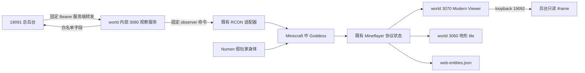

# 天神之眼：原链路审计与恢复接线

2026-09-07。本报告的原系统调查只读访问 `C:/Users/lzl19/.copaw/workspaces/default/minecraft-ai-friend` 与相邻 `numen-reference`，未打开旧页面、聊天或玩家私密内容，未启停服务、登录 Minecraft 或执行跟随。随后按本轮授权，在 D 项目新增内部观察服务并修复已有 viewer 的连接生命周期。整体后台、资产部署、真实跟随和浏览器画面由主任务统一验收；下文不把源码可用当作已上线。

## 结论

旧“天神之眼”是观察身体、实时数据、地图渲染、三维画面和管理员操作组成的一条链路。旧页面不是一个可以直接搬过来的纯只读 iframe。D 已保留大部分世界侧源码和实际镜像资产，最小恢复应复用这些能力，在新后台添加观察工作区，并把观察者控制放到单独的固定接口。

必须区分三件事：所选目标、真实摄像机身体 Goddess，以及当前已加载区域。浏览器切换第一人称/第三人称/2.5D 是本地镜头模式；跟随目标则会通过 RCON 移动 Goddess，改变已加载区块和服务器上的观察者位置。它不是读取另一个玩家的原生客户端画面，也不能自动获得其完整背包或 YSM 渲染。



Numen 到 Goddess 的箭头表示观察者可以靠近/跟随身体，并不表示 Numen 负责网页渲染。地图 3060 本轮已完成请求/缓存加固，但仍需后台接入和画面验收，不能仅因三维画面恢复就宣称地图完成。

## 原页面和服务的真实能力

来源：[旧 web-panel.mjs](C:/Users/lzl19/.copaw/workspaces/default/minecraft-ai-friend/web-panel.mjs)、[保留的 bootstrap-world.mts](../world/bootstrap-world.mts)、[Modern Viewer](../world/src/mc-modern-viewer.mts)。

| 能力 | 原实际实现 | 恢复边界 |
|---|---|---|
| 三维观察 | 现代 viewer `3070`，`/` 第一人称、`/third/` 环绕、`/dungeon/` 2.5D；Socket.IO 两个路径 | 复用世界/实体流和已有资产，浏览器验证 worker、区块几何和实体，不以 `/healthz` 成功代替画面验证 |
| 老版兜底画面 | Prismarine viewer `3050` 与 `3150`，穿越者另可自带 viewerPort | 首批只维护现代入口，避免恢复多个未登记端口和不透明回退；D `MC_VIEWER=0` 可继续保持 |
| 目标选择 | 旧页面混合 status 档案、在线 bot、技能档案；选人后调用 `/api/eye` | 用当前 Mineflayer tab-list 作为候选在线目标，历史角色档案不冒充在线 |
| 跟随 | `/api/eye?name=...&follow=1` 发 `gamemode spectator Goddess`、`tp Goddess ...`；旧定时器 250ms，静止最多退到 3s | 是游戏侧写操作；改专用 POST、租约、串行和限流，离开显式停车 |
| 坐标地图 | `3060/map.png?cx=&cz=&r=` 用 Goddess 已加载区块扫描顶层方块；1 像素/格，半径 8–128 | 不是全存档卫星图；未加载区块是深色空区，需要覆盖范围、维度和新鲜度标识 |
| 地图叠加 | 附近实体、村民 RCON 补录、共享地点、SQLite discoveries | 坐标来源与时间要分开；村民缓存失败时可能保持旧值，不能据此宣称此刻在线 |
| 附近实体 | `web-entities.json` 每 1.5s 写出观察范围内实体；村民补录约每 4.5s | D 调查时文件存在且持续更新；原 schema 无维度、非原子写，不能直接公开原对象作为全服事实 |
| 生命/饥饿/经验/背包 | 旧 `/api/inspect` 对目标发 6 组 `data get entity`，大 Inventory 用多包 RCON 聚合，再手写 SNBT 解析 | 真实远程查询能力存在，但要在独立只读适配器中做固定字段投影、限流和超时；新观察服务先只公开 Goddess 自己确有的 slots/equipment |
| GM 传送 | `/api/tp?as=...&to=...` 直接移动指定玩家 | 不属于观察；不能随恢复天眼把它带入只读页 |
| 世界与外观修改 | 旧 `/api/world` POST 改天气/规则/时间，`/api/skins/assign` 写皮肤注册表 | 独立管理权限、审计与确认语义，首批观察服务不包含这些动作 |

旧“TA 的眼睛”在目标没有自己的 viewer 时实际回落到 Goddess；第一人称模式旧跟随使用上方 9 格，不等于目标真实视线。新 UI 应明确显示“Goddess 观察画面 / 正在跟随谁”，避免角色名称与摄像机实际身份混淆。

## D 可直接复用的部分

调查开始时的 [compose.yml](../compose.yml) 使用 `mc-world:2.1.38`，世界服务已经创建 Goddess，`MC_OBSERVER=1`；`MC_VIEWER` 和 `MC_MODERN_VIEWER` 都为 `0`，没有 viewer/map 对宿主机映射。地图代码不受这两个开关控制，`serveMapTiles()` 在 bootstrap 末尾无条件启动内部 3060；它是既有 world 进程中的能力，不是一个单独容器。

可复用的 D 源码包括：

- `world/src/mc-modern-viewer.mts`：最多 4 个会话，WorldView 半径 6，化身状态每 100ms，物品上限 46 槽，特效距离/数量/每秒事件预算已有约束。
- `world/src/mc-bot.ts` 和 `world/src/neoforge-handshake/`：Mineflayer 与 NeoForge 握手、重新连接和观察身体生命周期。
- `world/bootstrap-world.mts`：实体快照、settlements 村民补录、地图 tile 和 discoveries。
- `world/botgate-src`：配置任务分流、物品/装备组件净化与 RCON 多包帧修正。对非 NeoForge 协议连接过滤不认识的组件，服务端装备和真实 NeoForge 客户端走原数据路径。网页可见的物品因此不代表包含所有模组组件。
- `world/sidecar/guard/mcp_numen.py`、`tools/run_numen_mcp.py`：现有 Numen 身体工具和 Agent 按需截图入口，可以继续存在，不需要在新后台再造 Agent 大脑。

调查时 D 没有独立 `world/modern-viewer` 资产树，也没有旧 `packaging/docker` 构建链。经授权，对正在运行的 D world 容器只执行了文件存在性/大小查询，确认镜像 `/app/modern-viewer` 内存在：

| 文件 | 字节数 |
|---|---:|
| modern-viewer.js | 11,405,925 |
| viewer.css | 25,605 |
| threeWorker.js | 3,840,205 |
| mesher.js | 1,093,933 |
| mesherWasm.js | 4,835,125 |
| wasm_mesher_bg.wasm | 94,412 |
| minecraft-renderer.js | 1,313,270 |
| mod-assets/mod-pack.json | 10,133,579 |
| mod-assets/mod-blocks-mcdata.json | 1,397,581 |
| character-assets/characters/naruto-uzumaki-shippuden.glb | 8,461,256 |
| character-assets/characters/kirito-black-swordsman.glb | 2,259,784 |

这是选定文件的存在性证据，不是完整资产校验。主任务可从当前 D 容器提取完整目录到 `vendor/modern-viewer`，记录 SHA 清单后只读挂载；不再依赖原 C 工作区。镜像内 GLB 是网页 Three.js 资产，不等于 Minecraft 内 YSM 模型，不能用网页模型预览证明游戏内角色外观。

调查时 `server/world-data/block-registry.json` 不存在。viewer 用它注入 NeoForge 方块 stateId；`mod-assets` 中旧登记不一定匹配 D 当前 71 个服务端模组。需用当前 D 服 `numen_act dumpregistry` 生成注册表并核对客户端 asset pack，不能凭相同 Minecraft 版本认为旧整数 ID 仍正确。

## Numen、截图与网页的区别

[NumenPlayer.java](C:/Users/lzl19/.copaw/workspaces/default/numen-reference/api/common/src/main/java/com/dwinovo/numen/entity/NumenPlayer.java) 的身体继承 `ServerPlayer`。本地 [NumenActCommand.java](C:/Users/lzl19/.copaw/workspaces/default/numen-reference/actuator/neoforge/src/main/java/com/dwinovo/numen/actuator/NumenActCommand.java) 注册 `numen_act list/summon/invoke/dismiss/skin/say/whisper/dumpregistry`，权限等级为 2；`invoke` 调已有 `ToolRegistry` 的 `onServerCall`。这是服务端身体动作桥，不是网页数据接口。异步工具可能只回 accepted，完成需另查 task_status。

`mcp_numen.py` 的 `render_view` 另启动临时 `QDRenderBot`（D 入口固定身份），调用 `guard-render-pure.mts` 或 `guard-render-webgl.mts`：登录、切观察模式、传送、等区块、输出 PNG/JPEG 后退出。依赖 `mineflayer/tsx/pngjs` 或 `prismarine-viewer/three/node-canvas-webgl`。它有临时身体和 CPU/GPU 成本，不能接到网页轮询中。该原实现固定复用输出文件且没有要求子进程 exit 0 或新 mtime，存在渲染失败后误读旧图的静态风险；应另行修复后再宣传 Agent 视觉可靠性。

## 原实现应避免沿用的问题

1. 旧 `/api/eye`、`/api/tp` 用 GET 改世界；旧 panel 没有清晰的观察控制授权边界。不能将其任意 RCON 能力下放到新 panel 容器。
2. 旧跟随依赖“任何 `/api` 活动”更新 `panelActiveAt`。后台别的卡片轮询也会维持跟随，不等于用户还在观察；旧 250ms tick 没有完整在途互斥。新租约只由显式 follow/renew 延长。
3. 旧现代 viewer 捕获首次 bot 对象，断线后 bootstrap 的新对象不能自动接管；`/healthz` 却固定返回 ok。此问题在本轮生命周期修复中处理。
4. 旧 Socket.IO 的 Host/Origin 只比较端口后缀，且 `frame-ancestors http:` 放行任意 HTTP 站点。此问题在本轮精确 origin 修复中处理。
5. 原地图忙时 `tileQueued = job` 覆盖之前等待请求，却未给被覆盖 HTTP 请求回应；完成第二个任务时也不会继续取新排队任务。本轮将旧代码等量提取到 `world/admin/map-service.mts`，忙立即 503、附 Retry-After，不再排队；8 秒响应超时、合作取消、半径取整，缓存包含维度与 world generation。重连/重生使缓存失效，渲染期间世界变化会拒绝结果。浏览器 Cache-Control 改 no-store，避免同 URL 的旧维度图片在浏览器缓存复用。扫描仍为半径 8–128、y=110 至 -16，没有扩大成本或声称全高度地形覆盖。
6. 旧地图只查询已加载区块；`web-entities` 无维度；村民缓存错误保留旧数据。需要单独来源/新鲜度说明，不应画成全世界已验证实体。
7. 旧镜像层/原 C 文件里的 worker 与模型资产若没有锁定到 D，重建镜像后可能消失。将 bundle、worker、wasm、mod 注册表、模型作为一个有哈希的资产集合验收。

## 本轮内部观察服务契约

新增 [eye-service.mts](../world/admin/eye-service.mts)。不持有 Docker 权限，不读模型配置，不调用模型；只通过注入的 `sendCommand` 使用已有 RCON 连接。整个服务仍在受管 world 进程里，无新增常驻进程。

```typescript
import { startEyeService } from './admin/eye-service.mts'
const eye = startEyeService({
  getBot: () => bot.getBot(),
  sendCommand: command => rcon.service.send(command),
  token: observerSecret, // 主装配处读取独立 secret 文件，不能公开给浏览器
})
await eye.ready
```

默认监听 world 内部 `0.0.0.0:3080`，无需宿主端口。三个路由均需 `Authorization: Bearer <专用 token>`；请求带浏览器 Origin 会拒绝，由已鉴权的后台服务端转发。

| 路由 | 契约 |
|---|---|
| `GET /healthz` | 观察者在线和当前控制错误状态；不是画面成功断言 |
| `GET /state` | schema 1、项目、生成时间；observer/follow/targets/entities/limits 明确字段 |
| `POST /observer` | `{action:"follow",target:"MengMeng"}` 创建 120 秒租约；返回 `state.follow.leaseId/expiresAt` |
| 同一路由续租 | `{action:"follow",target:"MengMeng",renew:true,leaseId:"..."}`，必须与当前目标、租约精确一致 |
| 同一路由停车 | `{action:"park"}`，终止租约，恢复初次跟随前位置和维度 |

目标必须是严格登录名或 UUID，且存在于当前协议在线名单；跟随使用解析出的实际登录名。不能传坐标、选择器、命令或额外字段。body 上限 2048 字节，每秒最多一次跟随，命令串行。Goddess 自己或专用内部探针不能作为跟随目标。合法命令仅 `gamemode spectator Goddess`、`tp Goddess <在线目标>`，以及停车时 `execute in <捕获的合法维度> run tp Goddess <有限坐标>`。玩家身体不被移动。

Goddess 处于既有观察模式。停车恢复位置和维度，保持 spectator，不宣称还原目标视线或原始朝向。离开观察页应显式 park；忘记退出会在租约到期时停车。目标离线或观察者重连会取消旧租约。停车失败最多自动尝试 3 次，保留明确错误，允许管理员再次 park。

首次停车位置只在进程内保存。正常关闭必须先 `await eye.dispose()`，再关闭 RCON/bot；原 bootstrap 的同步 dispose 后立即 `process.exit` 不足以保证停车完成。本轮 bootstrap 已改成共享关闭 Promise，依次等待 eye、viewer、map、publisher、原 world handles，最后才关闭 RCON/bot 并退出。token 固定读取 `/run/secrets/control-token`。容器的停止宽限时间也应足够覆盖这些异步清理。强杀整个进程不能承诺归位，此场景需后续持久停车位置/固定基地恢复策略，不能把租约称为跨进程保证。

`observer.inventory` 和 `observer.equipment` 只投影 Goddess 已有协议数据，不公开 NBT/组件/书本内容；没有实际 slots 就 `available:false`。`targets` 对远程背包明确 `inventoryAvailable:false`。`entities` 限制为当前已加载范围内最多 128 行，不表示全服实体总表。

## Viewer 接线和最小恢复范围

[mc-modern-viewer.mts](../world/src/mc-modern-viewer.mts) 本轮增加精确 Host/Origin 检查，配置采用：

```text
MC_MODERN_VIEWER=1
MC_VIEWER_PUBLIC_ORIGIN=http://127.0.0.1:19092
MC_PANEL_ORIGIN=http://127.0.0.1:19091
```

主任务将 `127.0.0.1:19092` 映射到 world `3070`；后台 CSP 只允许这个 iframe。现有 bundle 使用绝对 Socket.IO/资产路径，独立 origin 避免子路径代理重写。探针从容器内部访问时也须传公开 Host `127.0.0.1:19092`，不能因地址是 `localhost:3070` 绕过校验。

`startModernViewer()` 现在返回 `close()/dispose()/getHealth()/sync()`。bot 对象变更、断开时先 await 旧 listener/socket/session 关闭，再对新身体监听；未启用时仍返回安全空句柄。`/healthz` 报实际观察者、world、会话/已初始化会话和 generation；已初始化指服务端 WorldView 初始化完成，不等于浏览器已绘制帧。关闭时清理 respawn/game 及会话监听器。

最小可交付应同时包含：观察区三维画面、三种模式、真实在线目标、显式跟随/停止/续租、观察范围提示、观察者状态与自己的背包；页面身份授权与 token 服务端保管；两项内部服务健康登记和可用性降级。地图、远程背包读取、世界改写和角色操作分别有独立验收，不能用占位卡表示已恢复。

需要权限隔离的动作包括：移动观察者（本轮接口）、移动玩家、改天气/规则、生成/注销 Numen、换皮肤、操作背包/容器、使用技能、部署/启停服务。即使未来同在一个总后台，也应有不同的命令白名单、角色权限和审计回执，不能共享一个任意 RCON 或 shell 输入框。

## 验证与未完成项

本轮实际离线测试 **24/24**：观察服务 11 项，viewer 生命周期/来源校验 5 项，地图 6 项，bootstrap 关闭 2 项。包括本机临时 HTTP 端口、真实 Socket.IO listener 关闭、Host 拒绝、跨 bot 替换等待、鉴权、非法目标、续租、到期/离线停车、单个在途命令、字段投影及已为 spectator 时的跟随；地图并发都有应答、维度/重生缓存、渲染变更和超时；实际关闭函数在夹具上下文中验证 await 次序与重复信号幂等。使用夹具身体与假 RCON；没有执行任何真实跟随或模型调用。

```powershell
node --import ./world/node_modules/tsx/dist/loader.mjs --test world/tests-ai/eye-service.test.mjs world/tests-ai/viewer-lifecycle.test.mjs world/tests-ai/map-service.test.mjs world/tests-ai/world-shutdown.test.mjs
```

主任务上线还须验证：资产集合/当前注册表、浏览器 worker 与区块几何、鸣人/桐人网页 GLB、三视角切换、真实在线目标和一次受控跟随/停车、跨维度归位、实体离线、world 重连、租约超时，以及面板鉴权和原有玩家功能回归。既有 9 容器健康与 world 心跳不足以覆盖 3070/3080 的功能状态，应补专用探针；任何浏览器 WebGL 截图或录音/手柄结论均以该次实际报告为准。
