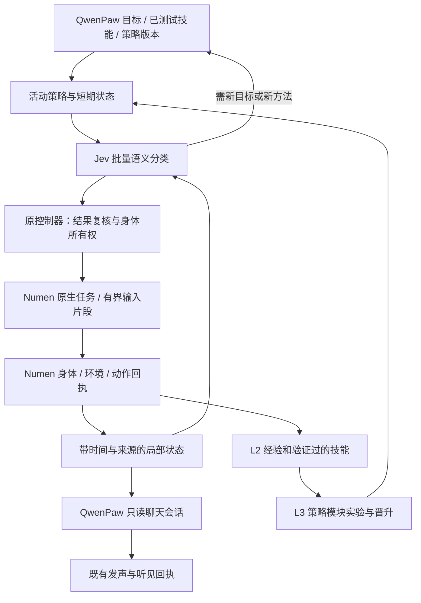

# Jev 作为具身快循环分类器

研究日期：2026-09-21；核对源码基线：`d2068ea`。状态：**设计及有限 API 实验，尚未实现或部署下面的新调度器**。生产仍使用[已部署的官方 Jev 适配](SYSTEM-ONE-OFFICIAL-JEV.md)。

## 结论

将 Jev 从“技能中偶尔选择一个完整动作”扩展为**有目标的、事件驱动的短周期策略分类器**。QwenPaw 提出目标、构建技能与修订策略；Jev 判定眼下适合继续、局部修正、补感知还是重规划；Numen 在游戏 tick 中连续执行输入和原生任务。一次 Jev 请求不等于一次按键，HTTP 等待也不能让身体执行与消息接收停止。

持续运行是始终能推进、等待结果和响应变化，不是始终移动或不断调用模型。保持原 survivor 服务、Qwen 原生任务/交流通道、技能库和身体网关，不增加第二套 Agent 守护。

## 当前实现为什么还不是这个快循环

下列判断来自现有代码，不以旧设计文档代替实现核查。

| 现有位置 | 实际行为 | 对新设计的影响 |
|---|---|---|
| `world/survival/system_one.py:choose` | 单个 Choice；2–8 个预先生成的动作候选；只投影身体、goal 和上条执行摘要 | 适配器能复用，但不是持续策略；候选文字存在，当前请求没有完整的局部路线/目标实体/技能阶段 |
| `controller.py:tick_skill` | 同步调用 Jev；任意失败或低于 0.75 都令技能 replan | HTTP 阻塞该轮控制器工作；补观察、暂等和真正换计划被混在一起 |
| `controller.py:tick` | active Qwen、未结算动作或 busy 原生任务分支先于 `tick_skill` | Jev 不能持续监督一个正在运行的原生任务；Qwen 规划与技能推进并非独立执行通道 |
| `service.py` | 仅 `executing_skill` 且有 systemOne 记录时选 1 秒间隔；其他取 observationSeconds；一次 tick 后至少再等 1 秒 | 不能把配置“1 秒”说成已达 1 Hz。仓库配置 observationSeconds=15；生产值需部署时重新读回 |
| `controller.py` 的程序 observe | `nextRunAt = now + max(15, observationSeconds)` | 专项感知可能再等至少 15 秒，不适合眼前短修正 |
| `fast_execution.py` | 已有执行反馈、带年龄的观察、技能等待、快慢状态投影 | 继续扩展，避免另建状态/回执系统 |
| `dialogue.py` | 已有独立只读交流任务，可与原生/程序执行同处一个主循环；与普通 Qwen 认知任务互斥 | “边玩边聊”的基础已经存在；要消除控制器阻塞并维持权限隔离，不重建聊天 Agent |
| `numen_gateway.py:TOOLS` | 现可组合 goto、mine、eat、装备、交互等；无通用 WASD 输入片段入口 | 不应声称只改 prompt 就能逐键控制 |
| `InputDriver.java` | 现有逐 tick 前进、视角、跳跃、潜行、载具和停止；下层有移动输入与物理 | 将来原语入口复用此实现及既有任务调度；不能让两个执行器同时写输入 |

紧急停止、未知结果对账、身份/维度、人工暂停、身体租约等现有边界继续有效。它们与“模型决定生活方式”不冲突；吃什么、走哪条路、学什么技能不写成一套永久硬编码玩法。

## 官方能力与可借鉴代码

Jev 提供 Choice、Noul、Score；同一状态可以批量提出独立问题，某问题的答案不会自动成为另一问题的上下文。对于真正依赖前一步获取新证据的判断才发第二次请求。参考[官方 primitives](https://docs.typesafe.ai/primitives)及[批量代码实验](https://docs.typesafe.ai/cookbooks/parallel_questions)。使用英文短问题与机器字段作为初始实验条件，玩家聊天仍保留原文；官方说明英文目前表现更好，中文负载需单独验证。[State](https://docs.typesafe.ai/concepts/state)

已检查官方 [Skill suggestion 的 rank/rerank/suggest 实现](https://docs.typesafe.ai/cookbooks/skill_suggestion)：适合在**技能启动或目标切换**时筛选描述，再读取候选的详细条件，不适合每个移动 tick 都扫描完整技能库。该示例以候选中最大 fits 分数作为门槛，但 Choice 的 winner 可能与最大 fits 项不同；我们需要核验**被选中的具体技能**及其前置条件，不直接照搬门槛逻辑。

已检查 [AutoResearch feature discovery](https://docs.typesafe.ai/cookbooks/autoresearch_feature_discovery) 的问题提议、答案特征化和开发/测试划分：可借鉴让工程角色根据失败提出更好的分类问题，再在独立样本上评价。该例训练的是下游 CatBoost，不是 Jev 权重；也不是 Minecraft 实验。

[官方 Models](https://docs.typesafe.ai/models) 当前明确不提供按客户数据微调/LoRA。我们可以演化问题、候选生成器、状态投影及下游小策略，日后也可用独立数据训练自有本地模型；不能把 API 使用记录积累说成官方 Jev 正在自动训练。目前 Jev 只接受文本/结构化文本，不直接输入视频或像素。

模型标识必须记录实际返回版本。后续校准后可考虑固定版本；现在 `health()` 仅检查模型列表是否包含配置名，而官方列表只列 alias、推理接受具体版本。**先修正具体版本的 readiness 语义再切配置**，避免新版本固定后被错误判不健康；GET 列表本身也不能证明某个任意版本一定可推理。

## 决策接口：选择当前短策略，而非复述整段计划

活动技能由 Qwen 提供并经原 draft/test/promote 流程发布，含：

- `goalRevision`、技能版本/策略 hash、适用阶段和完成的客观检查。
- 需要的传感器及其字段、允许的数据年龄、缺失数据处理。
- 少量**当前适用**候选：一个已测试技能分支、原生任务或有界输入片段；ID 映射到确定的参数，模型不能编造 UUID/坐标/命令。
- 原子判断问题、独立校准记录、持续条件和可中断点。
- 一小段工作记忆：活动阶段、最近失败、已尝试的修复、下一观察时间。没有历史思考链。

基础执行分类可表达 `continue / local_repair / observe / slow_plan / urgent`，只是调度协议；具体玩法与修复从技能动态产生。模型每次不必选这五项；只保留当前问题有意义的选项及 `unknown/none` 出口。`continue` 对已经在跑的任务表示保留任务，**不是再次发送 goto/mine**。

按需在一次请求中放入几个互不依赖的问题：

| 问题 | 推荐形式 | 结果用途 |
|---|---|---|
| 当前阶段应继续还是换一种已验证处理？ | Choice | 决策模式或适用动作分支 |
| 这个具体修复适用于眼前障碍吗？ | Noul | 选中修复的适用性证据，不代替原生权限和前置条件 |
| 哪个真实可达目标更符合当前短目标？ | Choice | 从传感器解析的目标 ID 中选，几何合法性本地复核 |
| 已听见的消息是闲聊、问进度还是换目标？ | Choice，仅消息事件时 | 只读回复或提交目标变更；不让分类器直接发言 |
| 这次失败与哪类已记录经验相近？ | Choice，失败边界时 | 按需检索 L2，避免反复召回整本记忆 |

HP、氧气、库存计数、距离变化、任务是否完成，本来能从数值/回执知道，就直接计算。不给 Jev 一堆简单算术浪费延迟。Score 可用于暂时无法直接计算的语义匹配度，但不能当游戏奖励或任务成功真值。多个答案不是独立证据来源，也不能相乘伪造更高可靠度。

批量问题不承诺互相一致：例如 `local_repair` 被选中但所选修复 fits 不足，控制器执行已声明的“补感知/交回规划”，而不是选择另一个没被验证的动作。任何时候都不能先猜未来状态、串出十个动作再无反馈执行。

## 状态与“增量”的准确含义

服务内维护短期状态，用事件和回执增量更新；每次请求重新物化**足以独立判断的最小当前状态**。官方已公开 API 没有 session/delta-baseline 字段，不假设上次发送的状态会被服务端记住。只传变化而省略必要基线会使分类失去上下文。

拟定状态包含当前目标/阶段、目标实体或方块候选、当前任务、局部几何事实、必要库存、近几次位移/失败的摘要及已听见消息。每一组感知标明来源、年龄和 unknown；不能将扫描失败当空场景。按技能声明取字段并限制总大小，地图/技能全文按需另读，不增加默认所有状态。

本地另存 `requestId / bodyUuid / lifeEpoch / goalRevision / skillVersion / policyHash / nativeTaskId / relevantStateRevision / observationTimes / deadline`。这些是结果归属与过期校验用的数据，大部分无需送给模型。已获得的答案只对匹配的技能阶段、目标及有效身体状态适用。

相关性指纹不把每个坐标浮点变化都当失效，否则走动时所有网络结果都会被抛弃；对目标消失、地形关键变化、危险、维度/生命更换、所有权切换、物资前置失效则立刻失效。有效期按动作影响制定：装备与路线提示的寿命可以不同，不能统一允许所有新动作使用 5 秒旧状态。

## 调度：本地持续，网络异步，结果只由一个地方执行

1. 复用 survivor 的主控制器，按服务端反馈/事件推进；Numen 原生物理按 tick 执行。目标健康节拍约 20 TPS，不是 Jev 请求频率；实际 TPS 需观测。
2. 主循环不再同步等待 Jev。一个受 survivor 生命周期管理的有界 IO worker 持有连接池，仅做请求并返回不可变结果；它不调用身体网关、不写技能工作记忆、不更新任务状态。连接复用能否降低尾延迟需测量，不能预报收益。
3. 每具身体最多一个在途 Jev 请求，额外变化合并为一个最新待评估状态；不排队积压旧状态。完成后由主控制器重新验证上下文、前置条件和租约，再决定接受或丢弃。
4. 队列中的结果不能直接继承过期 lease。任何替换动作都在原 `action_lock` 和精确任务对账边界中执行，使用既有持久 intent/receipt。未知效果只查询，不重放。
5. 按事件触发：阶段完成、障碍/威胁变化、收到有关消息、局部进展停滞。正常长期原生导航只在监督间隔复评；稳定无变化可降低至几秒一次。先将活跃语义分类约 0.3–1 Hz 作为测量范围，不保证1 Hz，也不对静止空闲身体持续花费。
6. 快任务监督读取小感知投影；完整环境扫描维持独立较慢节拍。先测 RCON/网关读取负担，不能简单把现有全量15秒轮询改成50ms。
7. 总请求截止期使用单调时钟并约束整次工作；现 `httpx timeout=2` 是各阶段限制，不能当严格2秒总预算。网络超时/429/529不重试旧动作决策；按响应或有限退避推迟下一次**新鲜状态**评估。
8. 期间已授权且自带终止条件的原生任务可以继续；原始按键必须具有本地 TTL，到期释放输入。威胁反射/人工停止无需等官方HTTP返回，不能靠一个“urgent”分类保证逃生。
9. 人工 pause/drain、退出、重生和版本替换使在途结果失效；维护继续沿原边界。worker 卡住时不无限新增线程。服务重启后恢复任务与回执，旧网络分类不恢复为待执行动作。

原 `maxSkillSteps=32`、`maxSkillSeconds=900` 是技能作业预算，不能为了“永不停止”简单取消。长目标在这些边界形成检查点，重新核验后启动下一段；等待、观察、分类不应全算作物理动作步数，但都有明确调用/耗时预算。

## 和慢规划、聊天的并行关系

原 dialogue lane 可以复用。聊天只读状态并通过已有 speech/heard 回执送达，不借用身体写租约。Jev 根据已听见内容分类，Qwen 生成自然语言；不增加弹幕的第二条后台收件通道。

慢规划正在运行时，旧活动技能可在剩余已授权范围内继续；**此时慢规划任务只能提交计划提案或只读查询**。现有带身体写权限的 Qwen 任务不能直接与快系统共用控制权。旧模式先按原排他逻辑运行，再逐步迁移到“提案 → 边界移交”；切换时撤回旧策略、结算当前动作、确认单一所有者。

新的闲聊不打断行走；明确“现在停下”由现有用户命令权限路径处理；“下一步换目标”成为带 revision 的待接纳目标。Qwen 长推理不阻塞本地身体安全执行。当前 Qwen 并发/额度不因这个设计自动放大。

## 置信度：先测覆盖率和错误代价

当前统一0.75只是已有保守阈值，不能永久作为所有行为的标准，也不能凭几个正确样本立刻调低。官方 confidence 是分布统计量，不是“这个动作有75%机会成功”；见[官方说明](https://docs.typesafe.ai/confidence)。

按问题版本和行为类型分别评价接受覆盖率、错误执行率、拒绝后的停顿时间。`observe`、已安全持续的 `continue`、替换任务和破坏性动作有不同代价。低置信度时可以补一次有界感知、等待原生反馈，或交回慢系统；无法确认当前行为安全时，不因“保持连续”继续危险动作。

稳定状态可以设置短期决策保持条件，抑制左右来回切换；威胁、所有权和目标变化立即打断该保持。阈值、保持条件、候选数量都属于可版本化策略，不用全局大开关绕过身体网关。

## 本轮实测：只证明接口组合可行

证据文件：[合成输入与完整响应](research/jev-fast-loop-20260921.json)。8个先写期望值的英文合成场景：行走聊天、关门、感知丢失、缺氧、任务过期、采矿聊天、工具损坏、未来目标变更。每场景单问题和四问题各一次，交替调用顺序；16次请求，无重试、无游戏动作。使用当前官方适配的HTTP实现，每请求新连接；没有部署新分类器。

| 指标 | 单问题 | 四问题同请求 |
|---|---:|---:|
| 有效响应 / 请求 | 8/8 | 8/8 |
| 主分类匹配预设 | 8/8 | 8/8 |
| 主分类 confidence ≥0.75 | 7/8 | 7/8 |
| 本机请求中位耗时 | 703ms | 735ms |
| 本机最大耗时 | 1110ms | 985ms |
| 合计输入tokens | 3878 | 5542 |

实际返回均为 `jev-1.13.0`。批量聊天分类8/8匹配；额外 Noul/Score 未作为有标签质量基准。关门停滞时进度Score为1.72（1=无进展、2=部分进展），换工具场景为1.23，说明模糊评分不能代替客观结果。任务过期正确选择 slow_plan，但confidence分别0.74/0.73；保留既有阈值也会回慢系统，不能算动作失败。

此实验比较的是同一个新语义问题的单独/批量形态，**不是旧生产候选器与新控制器A/B**，也不构成置信度校准或真实游玩成功率。只有8组，不能以最大值代替p95，不能宣称批量必然更快；它展示四项判断不必付四次串行网络往返。缺氧等明确数值场景在生产应先用已有本地能力处理，不把这份合成题逐题照搬进在线请求。

按[当前官方价目](https://docs.typesafe.ai/models)每百万输入token $0.042估算，本轮已报告9420输入token约$0.000396（非账单核验）。假设1000输入token/请求，持续0.5Hz约$1.81/天，1Hz约$3.63/天/身体；多角色与长上下文线性增加。成本和限流必须计量，不能把“模型单次便宜”当作无限轮询的理由。

## RSI 学什么、怎样证明有进步

L1保留状态摘要、问题/候选版本、全部概率、实际模型、时间、动作回执和目标检查；短反思优先由程序识别完成/停滞/失败，只在语义不明时请求模型。L2按具体失败场景沉淀技能和适用条件，保留反例及版本。

L3沿现有运营工程团队、工单与隔离工作区，把“问题拆分/状态字段/候选生成/局部组合策略”分别当改进模块。工程角色可依据错误提出分类器问题；后续可训练小型下游策略学习如何使用 Jev 特征，但初版不必引入训练栈。候选生成器能调用已接通的可组合原语，不永久锁死在几种内置游戏动作。

实验固定目标、初始存档、装备、模型版本、预算和评价器；按任务/区域拆开发集与未见场景，不能把同段轨迹相邻帧分到两边。比较现生产策略、只做确定性本地判断、Jev短策略三组，分别观察目标达成、伤害/死亡、无进展时长、未知结果、恢复耗时、消息响应延迟、API用量、服务器TPS。回放只能测分类；策略会改变之后的状态，必须另做独立世界闭环测试，不能从旧轨迹推断完整反事实收益。

评分来源必须为世界状态与原始回执，不能用Jev给自己评分后自行晋升。先影子记录、再独立副本、再限定真实任务发布；失败可回退到先前策略版本，旧原生任务仍按真实回执结算。

## 实施顺序与验收

1. **先改调度和状态接口。** 复用 SystemOne、controller、service、fast_execution；添加批量 typed evaluate、受控异步worker、策略revision/截止期、细粒度感知和现有panel状态。保留老choose协议，先影子运行。校验慢API不阻塞主循环、过期/乱序/重生/暂停后不执行、429无积压、unknown不重投。
2. **再接有意义的短策略。** 优先复用现有导航、交互、装备和进食，将“持续任务监督 → 小修复 → 恢复原目标”做成已测试的可学习技能；只在具体技能原语确实不足时补Numen接口。验收边走边聊、障碍解除、目标变化、模型短暂不可用后的恢复，而不是只看HTTP成功。
3. **最后补通用有界输入。** 在现有Numen任务类型中接 `input_segment` 概念：forward/strafe、jump/sneak/sprint、受限视角目标、交互/攻击语义、durationTicks、taskId。精确字段在原生实现审核后确定，不声称当前已存在。原子输入互斥/覆盖、TTL释放、暂停/死亡/任务替换释放必须在游戏tick内验证；RPC丢失不能导致持续按键。高层原生导航仍可复用。
4. **再开放模块化策略改进。** 用上述真实轨迹建立固定开发集和独立验收环境，经原技能/工程晋升机制发布；改内核需真实重测已晋升技能和source hash。原生输入如果改Java，还需隔离副本与实际部署验收。

新逻辑仍由原容器守护。健康探针区分 provider可用、快循环年龄/队列/过期率、实际动作闭环；panel展示有真实分母的任务进展、模型等待和预算。只有对应测试、正式部署字节、实地回执都齐全才能称已上线。本轮只交付设计与研究证据，没有修改生产阈值、Cron、角色、身体或服务。
