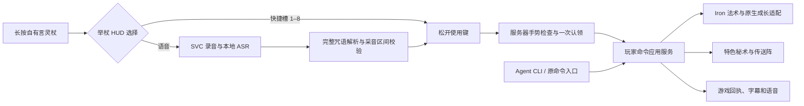

# 女神言灵：语言即接口

用户在 2026-09-07 明确：真人玩家应当像动漫角色一样说话施法。当前交互约定是**长按举杖、边瞄准边咏唱，松开使用键后施法**。语言和快捷槽都表达玩家意图，装备、等级、消耗与冷却由已有技能规则决定。

本文描述本轮实现约定。是否已经在当前游戏中生效，以文末对应版本和时间的部署、冒烟报告为准；源码和离线构建不等于实体麦克风或手柄验收。

## 玩家如何使用

1. 手持旅人言灵杖或千灯共鸣杖，长按“使用物品”。键鼠默认右键；手柄使用已有的使用物品绑定，通常是 LT/L2。
2. 举杖后显示 HUD：咒语示例、当前模式和 8 个快捷槽。它不打开菜单，不暂停游戏，也不夺走瞄准操作。每次新举杖默认进入**语音模式**。
3. 保持语音模式时说出咒语，例如“咏唱烟花术”或“女神，火焰弹”。举杖会接入现有 Simple Voice Chat 按住说话通道。
4. 想使用已配置的快捷技能时，按左右肩键在“语音、1–8 号槽”之间循环。键盘备用为 Page Up / Page Down；绑定可在控制设置中修改。举杖期间这两个肩键用于选择技能。
5. 保持瞄准并松开使用键。语音模式提交这段咏唱；快捷模式释放当前槽位的技能。空槽只提示，不施法。语音识别有延迟，因此松手不等于技能必定立刻生效；即使提前识别完成，也须等松手。

快捷栏的内容在**技能罗盘 → 编辑快捷栏**里修改：选择 1–8 号槽，再选择已学秘术；可清空单槽或恢复推荐排列。配置动作不释放技能。当前可配置的是已有精选主动秘术；原生 Iron 法术可以通过语音按装备规则调用，尚未进入这 8 槽编辑器。

第一次进入游戏需在语音模组中选择麦克风并完成设备向导。原有独立 PTT（F8 / 默认十字键左）仍保留，十字键上仍是技能罗盘、右仍是手札；十字键左不是本轮法杖快捷施法键。已有个人手柄配置不会被新默认覆盖。

| 说的话 | 游戏动作 |
|---|---|
| 女神，火焰弹 | 调用实际装备中的 Iron 火焰箭 `irons_spellbooks:firebolt` |
| 雷电 / 闪电术 / 咏唱落雷 | 调用实际装备中的 Iron 落雷 `irons_spellbooks:lightning_bolt` |
| 咏唱烟花术 / 千灯在上，烟花术 | 特色秘术烟花术 |
| 归乡 / 女神，回家 | 原归乡技能，保留等级、资源和落点规则 |
| 咏唱空间传送 向东五格 | 原空间传送，要求明确方向和距离 |
| 传送到完整地点名 / 八号哎 | 已登记的传送点；重名和不安全落点继续拒绝 |
| 打开技能罗盘 / 打开铁魔法 | 打开现有技能界面 |
| 取消施法 / 停止咏唱 | 取消可中断的原生施法；不能撤销已发生的效果 |
| 查看状态 | 读取实际等级和法力 |

持有言灵杖不解锁任何法术，也不恢复螺旋丸等已归档技能。Iron 法术仍须装备对应法术，使用原生法力和冷却；特色秘术保留原有进度与资源规则。

“不要施法”“火焰弹是什么”“如果我咏唱……”不触发技能。未知咒语只给短提示，不让模型猜一道魔法自动执行。明确的旧动漫前缀仍可使用；复杂且尚未支持的口语参数会提示未识别。

## 同一个技能入口



`gameplay/commands/spoken-intent.ts` 解释完整话语；`application/spoken-commands.ts` 将明确命令交给玩家命令服务。QwenPaw 可用于闲聊，明确语音施法不依赖模型。`voice-command-inbox.ts` 负责 ASR 文件输入，`mc-god.ts` 负责组装和生命周期；转写不会伪装成公屏发言再次进入模型赠物或关键词施法路径。

语音与快捷模式共用同一次服务器手势。选择快捷槽后，迟到的语音不能再释放另一发；从快捷模式切回语音，也不能复用切换前录下的咒语。打开菜单、失去有效操作环境、换手、换杖、死亡或离线会取消本次手势。角色重新举杖后，需要新的有效输入。

反馈使用真实回执：`casting_started` 表示原生施法开始，不表示已经命中；`outcome_unknown` 提醒查看效果，不自动重试。短字幕显示识别结果和当前操作提示，语音反馈沿用现有 TTS 队列。

## 录音协议和恢复边界

D 项目录音模组生成 schema 2 元数据：

```json
{"schema":2,"player":"MengMeng","ts":1000000,"recordingEndedAt":1001000,"emittedAt":1002300,"samples":16000}
```

`ts` 是片段首个有效音包的接收时间，`recordingEndedAt` 是最后一个有效音包的接收时间，`emittedAt` 是落盘时刻。三者在原 MC 进程里记录。ASR 不用 WAV 长度、文件修改时间或识别完成时间推测这些边界。

ASR 只接收 schema 2，要求正的安全整数时间、`开始 ≤ 结束 ≤ 落盘 ≤ ASR 当前时间`，且开始时间在 120 秒内。识别后输出 `{schema:2,id,player,text,ts,recordedAt,recordingEndedAt,emittedAt,wav}`：此处 `ts` 是识别完成时间，`recordedAt` 才是保留的首包时间。识别重试不能刷新采音区间。

服务器检查**完整采音区间**是否唯一对应一次有效举杖，跨越手势、取消或模式切换的旧录音会被拒绝。录音和手势同在 MC 主机计时，不能借用跨服务新鲜度容差，把举杖前的声音算到后来的一次举杖。旧 schema 的时间曾表示落盘时间，不能自动升级为新协议；旧待处理片段会归档拒绝。

world 在执行前持久认领片段，终态记录保留 ID、玩家、动作和结果，不保存全文语音。相同片段不会再次施法；进程在认领与执行之间崩溃可能丢失这一句。这是最多执行一次的取舍，不承诺可靠送达或跨进程事务。手势已被消费后，技能若因法力或冷却失败，也不会退还手势并自动重放。

当前真实录音名单仍只有 **MengMeng**。原模组仍是单一音频缓冲和解码器，不能直接扩大名单成为多人录音；多人支持需要按 UUID 隔离状态。QA 可临时对合成音频开放独立 ASR/world 名单，随后恢复；这不扩展实际采音名单。

## 证据与后续

录音源码位于 `world/god-voice-src`，独立构建命令为 `python world/god-voice-src/build.py`；自有道具位于 `world/chanting-items-src`，构建命令为 `python tools/build_chanting_items.py`。原 C 来源只读。录音模组中的播音、插件入口和资源保持原内容，区间改造不改变技能规则。

运行状态以 [法杖部署记录](../reports/chanting-items-deployment.json)、[录音构建与部署身份](../reports/recording-build.json)、[法杖手势冒烟](../reports/chanting-staff-smoke.json)、[语音施法冒烟](../reports/voice-casting-smoke.json) 和 [运行健康](../reports/runtime-health.json) 为准。应同时核对报告的时间、源码及 JAR 哈希、模式范围和 `ok`；旧版按键或旧录音协议的成功记录不能代表新版流程已验收。

合成音频经过真实 ASR 到游戏效果，可以证明这一条软件链路。[真实客户端截图](../reports/chanting-client-smoke.json) 单独记录两杖静态手持外观、物品图标和编辑器；须人工核对精确截图，并匹配当前双端 JAR，只有文件落盘不算视觉通过。实体麦克风、真实 SVC 采音、手柄长按/松开、肩键切换、举杖 HUD、声音听感和第三人称动作仍需各自验证。新 Agent 大脑和身体、多人录音、自由吟诗组合技能继续暂缓。

部署历史区分代码升级与模型资源修复：`chanting-items-deployment.json` 的 `previousDeployment` 保留旧阶段，`resourceOnlyUpgrade` 仅表示两份物品模型 JSON 改动且所有 Java 类逐字节一致。旧语音实测可以作为这类资源修复的既有代码证据，但不能称为新一轮实测；若之后修改录音或交互代码，应重新执行对应语音和客户端验收。编辑器的 set/clear/auto 另见 [编辑器冒烟](../reports/skillbar-editor-smoke.json)，只预置 QA 技能，不自动授予真实玩家进度。
