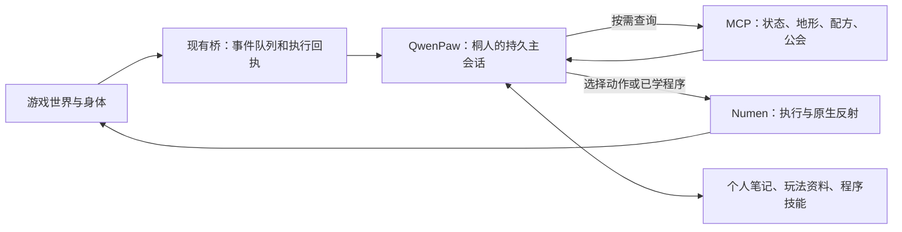

# 桐人：由 LLM 主导的连续生存会话

2026-09-08 调研与改造设计。本文核对旧 Numen 策略、当前千灯纪源码、已安装 QwenPaw 2.2 和作者公开资料；本轮没有修改在线生存循环、预算、身体或模型。下文目标方案尚未部署。

## 设计结论

后续视觉调研见 [服务端轻量感知与图像](SURVIVOR-VISION-DESIGN.md)：用户认为常驻完整客户端太重，采用Numen服务端信息为主、局部图像按需补充；透视图优先复用现有共享渲染，保留垂直FOV110°要求。图像工具尚未部署，天神之眼当前Goddess画面不能直接当作桐人视点，也不把图形客户端作为连续生存前提。

每个具身角色维持一个持久的生活主会话，由 QwenPaw Agent 自己决定目标、通过 MCP 查世界、选择并连续使用工具、依据结果调整计划、保存经验。Numen 负责真实身体与动作执行；现有桥保留事件转发、动作回执和运行管理。采矿、建房、交易、成长的选择应来自模型及其学到的技能。

同一 session 可以跨多个后台 task 和进程重启继续。它保持近期对话与工具结果的连贯性，长期资料则放在按需读取的笔记和技能中。会话不会无限无损地装入每次模型输入：Qwen 已有上下文压缩，仍会使用历史窗口和摘要，也会产生压缩的模型调用。

## 本机查到的差异

| 核查项 | 事实与影响 | 证据 |
| --- | --- | --- |
| 旧自主桥 | `guard_drive.py` 固定使用 `guard:kirito-default-20260824`；`autonomy_loop` 由 Agent 真正调用 MCP，桥不再解析和执行回答中的动作 JSON | 旧工作区 `sidecar/guard/guard_drive.py:105`、`:824`、`:1422`、`:1522`，本机原件位置与哈希见忽略提交的研究记录 |
| 当前会话 | 每轮生成新的 `survival-UUID`，并把这个 turn ID 传给原生 `session_id` | [controller.py:89](../world/survival/controller.py#L89)、[controller.py:727](../world/survival/controller.py#L727) |
| 运行记录 | 核查时 48 次自主任务对应 48 个不同 session；控制器处于 `budget_wait`，滚动24小时48个规划任务额度已满 | 本机 `reports/survival-session-research.json`；这是时点观察，不是未来状态 |
| 当前决策 | 目标、工具及其参数已由 Qwen 选择；模型也能编写和启动程序。没有控制器固定的“木→石→铁”生活路线 | [mcp_server.py:184](../world/survival/mcp_server.py#L184)、[controller.py:630](../world/survival/controller.py#L630) |
| 当前连续性 | 提示要求每轮一个直接动作，或启动技能程序，然后结束；单次动作额度也由执行器强制检查 | [controller.py:345](../world/survival/controller.py#L345)、[numen_gateway.py:349](../world/survival/numen_gateway.py#L349)、[numen_gateway.py:451](../world/survival/numen_gateway.py#L451) |
| 跨轮记忆 | 主要通过三个最多700字符的字段、两条短经验及少量近期证据重建上下文，控制器同时注入环境、公会、技能等固定摘要 | [controller.py:305](../world/survival/controller.py#L305) |
| 等待节奏 | 180秒间隔和每日额度限制的是规划 task 的预约；一次 task 内本来就可以有多次模型请求和只读 MCP 调用。24格直接步行与上述限制叠加会拖慢旅行 | [controller.py:702](../world/survival/controller.py#L702)、[numen_gateway.py:482](../world/survival/numen_gateway.py#L482) |

旧桥的固定会话值得恢复，但旧代码也有每轮感知/动作数量限制、20秒自主驱动和另一个5秒反射线程。反射线程会直接选择吃饭、攻击或移动，因此不整体恢复旧进程。只复用连续会话、真实工具反馈和主动感知思路。

本机保留的 Numen `EntityAgentLoop` 更完整地体现了这个方向：恢复 conversation 尾部、串行调用工具、把结果写回同一 conversation，再由模型决定下一步；最终回复后，下一次输入仍继续原会话。耗时任务的完成事件进入队列，再唤醒思考（`:260`、`:286`、`:614`、`:1795`、`:1840`）。其 `WorkBlockMemory` 记住使用过的工作方块并在可观察时重新核验；`SkillInjection` 按目录、正文、参考文件逐层读取。这些机制值得沿用，但由现有 Qwen 提供会话与模型调用，不再启动 Numen 客户端内置大脑。

旧指南读取、地点笔记和工作方块记忆并不证明旧角色已经自主生成并验证代码。当前已有的代码草拟、测试和晋升能力继续保留，作为连续会话里可由 Agent 选择的工具。

## Qwen 原生能直接复用什么

以下路径相对游戏 Qwen 容器的 `/usr/local/lib/python3.11/site-packages/`，核查版本为 2.2.0。

| 能力 | 核对结论 | 安装源码 |
| --- | --- | --- |
| 稳定请求身份 | 显式 session 原样保留；`from_agent` 成为 `user_id` | `qwenpaw/agents/tools/agent_management.py:211` |
| 找到既有会话 | 按 session、user、channel 查找 chat，同时处于同一角色工作区 | `qwenpaw/app/chats/manager.py:176` |
| 跨 task 和重启恢复 | 请求前恢复历史快照，响应后保存；task 完成不删除 session | `qwenpaw/hooks/session/session_hook.py:56`、`:103`；`qwenpaw/app/chats/session.py:220`、`:278` |
| 同 chat 后台任务互斥 | 同 chat 正在运行时返回409，不自动排队；完成后可以再提交 | `qwenpaw/app/routers/console.py:901` |
| 长上下文 | 桐人当前采用 native 压缩、触发比例0.8、保留比例0.1，工具结果裁剪开启；摘要由模型生成 | `agentscope/agent/_agent.py:434`、`:553` 及本机角色设置 |
| 普通文件与技能 | 原生文件工具、Skill、materialize_skill 及角色已有技能，承接经验和可复用流程 | [ROLE-LEARNING.md](ROLE-LEARNING.md) |

原生临时存储 fixture 验证了稳定请求键、跨新建存储实例恢复、连续保存、任务完成后再次进入，以及不同 user 的隔离；没有调用模型或创建生产聊天。它证明框架具备相关机制，不能当成千灯纪连续生存已经验收。

可重跑脚本为本机 `runtime/qwen-session-native-fixture.py`，真实回执为 `runtime/reports/qwen-native-session-fixture.json`：10项检查通过，包含安装源码定位与哈希。只验证临时存储、请求构造和内存任务跟踪；未进行真实 HTTP 并发请求、模型续聊、摘要生成或生产重启实验。这些本机证据不进入 Git 提交。

## 目标调用链

Agent 的一次工作过程可以连续完成：查背包和环境→查配方→判断前置条件→采集或制作→读取真实结果→装备或修正计划→保存必要经验。普通动作不应为了跨过“每轮只能一次”的限制而被迫先写一个程序。

需要重复、快速执行的流程，由 Agent 自己编写或选取程序；路径搜索、挖掘动画和战斗冷却继续交给原生实现。模型决定要达成什么、使用什么能力、是否改变办法；原生层处理执行细节和可核验结果。

### 会话身份与执行身份分开

| 标识 | 生命周期与用途 |
| --- | --- |
| `agentId`、身体 UUID | 持久人物与身体绑定 |
| `primarySessionId` | 持久化生成一次的生活会话；日常目标切换和进程重启不换会话 |
| `user_id` / channel | 固定 `survival-controller` / `console`，与 session 一起构成会话身份 |
| `chatId` | Qwen 的真实聊天 UUID，管理页打开会话、运行追踪和停止使用它 |
| `taskId` | 每次唤醒产生的新 Qwen 后台任务，用于本次任务轮询 |
| `turnId` / `actionId` | 每次执行授权及逐动作回执，继续保持唯一，不拿持久 session 代替 |

玩家点名、动作完成、模型安排的稍后检查都回到同一生活会话。玩家身份放在事件正文的结构化字段中；不能因为发言者变化就改变该主会话的 `user_id`。独立咨询可以有另一个聊天，但身体操作必须进入同一串行调度入口。

迁移时保留全部旧48个聊天及用量，选定并保存主会话，不伪造历史消息。首次主会话让 Agent 按需读取已有记忆、笔记和未完成目标，形成它自己的接续计划；后续传新事件和新回执。

### Agent 主动感知，桥只提供唤醒信息

每次唤醒只带：原因、未处理事件 ID、事件时间、当前执行授权、必要的即时状态和对应动作回执引用。地形、实体、物资、配方、公会、法术及历史经验由 Agent 选择现有 MCP / Skill / 文件工具读取，结果保留在会话中。

保留被动事件收集，才能知道什么时候有人叫它或动作已经完成。事件聚合和去重负责防止同一变化重复唤醒；是否接任务、改变住所、挖哪种矿等由模型判断。已收到哪些事件与实际读到哪些内容分别记录，省略的事件不能提前确认消费。

当前只接入了一部分世界状态和模组能力，`world_perception` 也有缓存范围；新设计不会自动获得所有模组内部信息。需要哪些新感知，先由失败或缺信息的实际任务暴露，再按真实模组 API 接入。

### 同一工作过程允许多步，但逐动作验收

同步动作有明确回执后可以继续。耗时移动、采矿等返回任务号时，通过完成通知或有界等待接续同一 session，保持一个身体动作在途。不能把 `accepted` 当完成，不能并发发两个身体动作。

不能只把 `actionLimit=1` 改大：当前 `poll_model` 只保留最后一个动作，并用整轮初始快照归因（[controller.py:568](../world/survival/controller.py#L568)）。必须改为逐动作起始状态、唯一回执、终态和未知结果记录，下一步以相应结果为依据。旧 turn/action ID 留在历史作证据；工具只接受当前有效执行授权。

模型可以主动结束本次工作、等待某个事件或安排下次检查。一次工作中的连续动作和无事可做时的复盘采用不同节奏；不要求每完成一个动作就等待180秒。

### 保留的执行约束

保留身体身份、游戏物资与属性规则、动作互斥、先落账再执行、未知结果不自动重放、人工暂停、保护区域与超时。这些维护执行正确性。采矿顺序、去哪建房、如何补给、优先做哪类任务、怎样改进技能则交给模型及其资料。

原生躲避、寻路和已验证程序承担快响应；不增加第二个付费规划脑。现有 `fast_execution.py` 没有隐藏的生活规划器，无需为减少规则把它整体重写。身体恢复只恢复既有 UUID 的连接，也不应自动替角色选择目标或取消人的暂停。

## 需要一起处理的接入细节

- **停止必须匹配真实会话。** 当前 `cancel(turn_id)` 依赖 Qwen 按 session 兜底查找 chat；改持久 session 后，继续传新 turn ID 会停止失败。应保存并使用主会话或真实 chat UUID（原生 `console.py:483–515`）。
- **Qwen task 不等于持久执行账。** `_bg_tasks` 在进程内，重启后查询旧 task 可能404。404不能证明从未执行；仍要查持久会话和动作回执，不能直接重投。
- **所有入口共享串行调度。** Console 的409只保护相应后台任务入口。Cron 直接调用 `workspace.stream_query`，还有自己的 job 信号量；它与 console 不天然共享同一互斥。沿用现有入口统一提交，避免 cron、网页聊天和世界事件同时改计划或操纵身体。
- **复用 cron 时显式指定会话。** 原生 `share_session=true` 才接续 dispatch target 指向的会话；false 的隔离分支会清空工作历史再合回。当前周维护应继续承担已有职责，不再加第二条生存模型循环。heartbeat 的 `target=last` 也不等于接续生活主会话，它的实际请求使用 `main` session。
- **经验由 Agent 写。** `notes/current-goal.md` 可保存长期目标与待办，其他主题笔记记录事实和失败条件；索引保持简短。普通说明使用 Qwen 原生技能，游戏程序继续经过现有测试。文件数量与上下文长度不作为成长指标。
- **预算与玩法解耦。** 用户已允许功能验证多用 CodingPlan。后续应按实际模型请求、token、单次工作时长和并发统计用量，给连续工作足够的工具轮次，空闲时由 Agent 选择等待。研究期间原48个规划 task / 24h与180秒限制未改；它们不能被当成当前模型套餐的实际余额。

## 参考项目取舍

| 来源 | 本次采用的机制 | 兼容边界 |
| --- | --- | --- |
| [Numen 外部大脑设计](https://github.com/Dwinovo/minecraft-numen/blob/1.21.1/docs/mcp-server.md)与[作者 README](https://github.com/Dwinovo/minecraft-numen/blob/1.21.1/README_EN.md) | 外部 Agent 自己感知和调用工具，原生身体返回真实结果，内置大脑让出控制 | 本项目继续由 Qwen 统一模型；上游客户端接管和新功能不能直接视为当前服务器已部署 |
| [Voyager 论文 §2](https://arxiv.org/html/2305.16291v2#S2) | 模型根据状态自主选任务，检索程序技能，依据环境反馈与执行错误改进方法 | 借鉴机制，不复制其实验环境、重生/物资安排或必设多个规划角色；游戏结算仍依据本服事实 |
| [Mindcraft SelfPrompter](https://github.com/mindcraft-bots/mindcraft/blob/stable/src/agent/self_prompter.js) | 连续自主工作、暂停与玩家介入、避免自身两个入口同时行动 | 其强制命令输出和短周期轮询仍是具体产品策略，不直接搬入本服 |

这些项目支持采用“模型选目标—调用能力—看反馈—改方法”的架构；上述 session 标识、回执和迁移方案是对本项目的设计判断，并非论文已经替本服完成验证。

## 实施顺序与验收

1. **会话接续。** 持久化主会话身份，分开 task/turn/chat，修正取消和重启恢复。先保持现有单动作执行规则，单独验证同一 chat 连续多轮、任务结束后再唤醒、服务重启后接续以及历史压缩。
2. **连续工具行动。** 逐动作账本和在途屏障完成后，允许同一次工作继续查询、行动、验收、修正。用真实物资完成一个小目标；注入一次材料不足或路径失败，观察是否由模型主动调整。
3. **按需感知与事件接续。** 缩短固定上下文，保留去重游标，统一玩家/事件/定时入口。验证在长期任务中收到新消息不会开启第二个身体控制流，未读事件不会丢失。
4. **模型学习与运行节奏。** 由 Agent 记录经验、创建或修订技能、提出下一目标和检查时间。用量策略独立配置，再做固定场景的对照实验。

会话 A/B 使用相同模型、初始世界副本、工具、预算及任务，仅改变“新 session / 持久 session”；随后单独比较单动作与连续动作。记录实际目标完成、遗忘/重复查询、无效动作、恢复能力、时间、token和压缩调用。先验证机制，再进行有人可介入的连续生活观察。接通会话和工具不等于已经证明长期自主生存。
