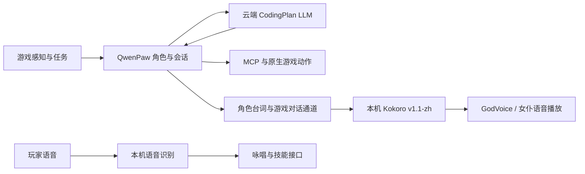

# 本地语音与云端 LLM

同日后续更新：用户指定改用 C 盘已有的 Kokoro，以降低游戏语音等待时间。当前 TTS 部署、实测和回滚入口见 [KOKORO-TTS.md](KOKORO-TTS.md)。本文的 IndexTTS 恢复过程及其 2.8–3.0 秒样本作为历史基线保留。

2026-09-13 起，千灯纪采用以下部署方式：游戏、语音识别和语音合成在本机运行；人物判断、对话内容、任务规划和代码创作统一由 QwenPaw 调用云端 LLM。本机 QwenPaw 负责会话、工具与调度，并不需要在本机加载通用语言模型。



## 硬件与运行分工

本次检测到 i9-13900K、64GB 内存、RTX 3090 24GB。GPU 用于游戏 TTS，CPU 计算线程环境变量设为 4，合成沿用单任务串行处理。IndexTTS 历史恢复使用 CUDA/BF16；后续 Kokoro 沿用其原生模型精度和 PyTorch CUDA 运算，不要求在启动时编译额外 CUDA 内核。

当前 WSL/Docker 配置仍限制为 14GB 内存、8GB swap，不能将整机 64GB 直接视为容器可用容量。本次没有修改这个全局上限；恢复完整游戏服务时应结合各服务占用重新核对。

历史 IndexTTS 显式传入 `use_qwen_emo=False`，不加载可选的文本情感 Qwen 模型。当前 Kokoro 同样不加载文本情感模型，旧声音 ID 只作为音色别名，且不支持情感向量。语音模型本身继续在本机推理，不把声音合成转给角色的云端 LLM。`/health` 提供实际 `device`、`textEmotionModelLoaded` 和能力字段，健康查询不会触发合成。

当前游戏工作区的十个启用角色均配置云端模型：八个阿里云 CodingPlan，女神与天神使用智谱 CodingPlan。未启用 QwenPaw 自动模型路由或本地 LLM 回退；项目现有任务用途路由仍用于选择负责的角色。ASR、语音生成和向量检索独立于通用 LLM；旧可选 Ollama embedding 代码不可达会跳过，不需要为此启用 Ollama。

宿主 QwenPaw 8088 保留原用途。不能把不明 Python 进程或 8000 端口当成本地 LLM 后停止；本次未改动这些服务。

## 历史：从空 Docker 引擎恢复 IndexTTS

此前的 `sha256:9da38721…` 镜像已不可用，不能靠重新标记其它镜像冒充恢复。新入口以审计过的 IndexTTS 推理源码和固定 Python 基座构建 `qiandengji-tts:2.5-qd1`，成功后记录真实新镜像 ID。既有权重和 47 个声音样本仍位于被 Git 忽略的 `server/tts-state`。

```powershell
# 先校验并暂存本地审计源码；不复制权重、声音、旧环境或服务状态。
.\run-python.bat tools/build_tts_runtime.py

# 构建依赖镜像；不启动服务，也不下载模型权重。
.\run-python.bat tools/build_tts_runtime.py --build

# 需要国内包索引时，可显式选择官方文档列出的镜像站。
.\run-python.bat tools/build_tts_runtime.py --build --index-url https://pypi.tuna.tsinghua.edu.cn/simple

# API 更新会先保存旧副本，只同步 API 与其来源记录。
.\run-python.bat tools/prepare_tts_runtime.py --sync-api

# 当前默认已是 Kokoro；显式回滚才启动历史 IndexTTS。
docker compose -f compose.yml -f world/tts/compose.index-rollback.yml up -d --no-deps tts

# 历史 Index 专用验收要求源码与当时构建回执一致；不用于 Kokoro。
.\run-python.bat tools/smoke_tts_runtime.py
```

构建默认来源是现存的已审计 `gpu-tts/repo`，可用 `--source` 指定保存同一修订的本地目录。推理源码 SHA 必须匹配 `9049c151…`；其它构建源码逐文件记录 SHA。上下文仅包含 Python 包、必要文本资源及小型 `pinyin.vocab`，不包含模型、参考音频、凭据和旧虚拟环境。

运行镜像证明保存至 `server/tts-state/runtime-image.json`，每次构建的原始上下文和结果保存在 `runtime/tts-build-*`。`source-manifest.json` 继续保留原模型与声音的来源及校验信息，不把旧镜像 ID 改写为新镜像。历史 `smoke_tts_ownership.py` 对旧镜像的验收保留，新镜像使用独立烟测工具。

## 接口与管理

- Compose 管理单个 `tts` 服务，保留 `restart: unless-stopped` 和 HTTP 健康检查。
- 宿主仅发布 `127.0.0.1:8100`，原游戏语音消费者继续使用 `host.docker.internal:8100`。
- `GET /tts` 支持 WAV / MP3；`POST /tts` 保持 WAV；`POST /tts/maid` 返回 TLM 解码器所需的 MP3。
- 原模型和声音挂载只读，生成音频在独立临时目录中，响应结束后清理。
- 现有运维清单、TTS 健康探针及 voice 消费者保持原职责，不添加宿主常驻脚本。

合成 HTTP 成功和音频可解码，只证明语音服务可用。游戏容器、实际人物语音请求、GodVoice 播放回执以及真人听觉仍应分别验证。重启游戏和恢复桐人原任务不能由 TTS 的启动成功代替。

## 2026-09-13 实测

已从空 Docker 引擎重建镜像并启动 `qiandengji-tts-1`，状态 healthy、重启计数 0。新镜像 ID 为 `sha256:2419c6efd2c3f0802cfa6cd39f1ad2073cc6b488f4c3c5c131bf9531869ed677`，API 源与部署副本 SHA 为 `1ea898771a2238d4b9464009ef15e653dbd567d6a8f177a30a81fda2b2bc7d46`。旧模型、声音及人物配置保持完整，79 项文件前后哈希验证通过。

实际健康接口返回 `device=cuda:0`、`textEmotionModelLoaded=false`；容器内访问原消费者使用的 `host.docker.internal:8100` 也成功。三次固定短句合成分别为：

| 接口 | 请求耗时 | 解码音频时长 |
|---|---:|---:|
| GET WAV | 2.812 秒 | 2.032 秒 |
| GET MP3 | 2.813 秒 | 2.142 秒 |
| POST 女仆 MP3 | 3.000 秒 | 2.168 秒 |

这三条为预热后的单次样本，不代表并发压测或长文本延迟。合成后容器内存采样约 3.19GiB；全机 GPU 已用 7,232MiB，包含桌面原有占用，不能当作 TTS 独占显存。实际安装的 TLM 1.5.3 解码器读到女仆 MP3 的 95,616 字节 PCM、22,050Hz；同时确认它拒绝 PCM WAV，因此保留专用 MP3 接口。

24 项离线单元测试、新烟测工具 10 项自检及实际运行烟测 10 项检查通过。新烟测共请求三次 TTS，没有生成式 LLM 调用、声卡播放或玩家队列写入。本机证据在 `runtime/cloud-tts-20260913/tts-runtime-smoke.json` 和该目录的独立音频记录；这些运行文件不进入公开仓库。当前仅恢复 TTS，Minecraft、游戏 QwenPaw 与语音队列服务仍未启动。

资料：[IndexTTS 官方项目与安装说明](https://github.com/index-tts/index-tts)、[PyTorch 官方历史版本](https://pytorch.org/get-started/previous-versions/)。本次沿用原审计推理源码，没有用最新分支覆盖模型实现。
