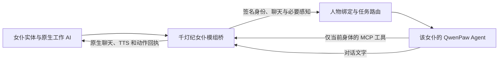

# 每个女仆独立人格，复用原生能力

2026-09-08 设计核查。用户希望每位女仆拥有独立的 QwenPaw Agent、名字和人格，并把模组已有能力作为 Agent 的感知与 MCP 工具。本文件记录已经核实的接口与拟实施的结构；本轮没有部署新模组、创建人物 Agent、改名或调用模型。当前在线入口仍是 `qd-maid-dialogue` 的共享文本适配器。

## 已有能力与当前缺口

本机安装 Touhou Little Maid 1.5.3 / Minecraft 1.21.1 / NeoForge，另有 Maid Spell 和 Affection。核查实际 JAR 的类与字节码，并对照作者的 1.21 分支源码；不能直接拿旧版 FunctionCall 文档作为当前接口。

原生 `ToolRegister` 注册七项工具：

| 原生工具 | 作用与接入方式 |
| --- | --- |
| `query_game_context` | 按分类读取装备、位置、附近实体、主人等上下文，适合成为 MCP 感知接口。 |
| `switch_work_task` | 切换已注册的工作模式；种植、采集、战斗等具体行为继续由模组执行，不能把模式切换成功当作工作完成。 |
| `switch_sit` | 切换坐下状态。 |
| `switch_follow_state` | 切换跟随状态。 |
| `switch_schedule` | 调整原生日程。 |
| `use_skill` | 读取技能说明；知识型技能会额外请求模型，不能原样导出，也不等于实际施法。 |
| `query_minecraft_wiki` | 游戏资料查询；不是女仆对当前世界的观测，初期不必启用。 |

附属模组还可注册工具、上下文和工作模式；已安装的两个附属模组没有注册额外 `ITool`，魔法与农业等能力须通过 `TaskManager` 的真实工作目录进一步核实。MCP 应读取当前运行的注册表并公布已验收的子集，不根据安装了某个 JAR 就宣称它的全部能力可用。`ILittleMaid.registerAITool`、`registerAIMaidContext` 是当前公开扩展点，旧 `registerAIFunctionCall` 自 1.5.1 起已失效。

现有文本适配器会转发各自的设定和历史，但并没有独立 QwenPaw 角色、实体绑定或实体工具。实际 OpenAI 请求中的 `ChatCompletion`、消息和站点头没有稳定女仆 UUID。名字、外观、聊天内容、请求摘要均不能充当角色身份；两位同名女仆或同一位换装时都会出错。

## 人物身份与人格

声音与快慢系统的具体接法见 [女仆发声链路调研](MAID-VOICE-PIPELINE.md)：预录事件音和 AI TTS 听众范围不同，独立人物需要明确的声音绑定；当前 PCM WAV 解码缺口应在新增语音接线前修复。该文为调研设计，未上线新的播放功能。

每位女仆的结构是：稳定人物标识 → 当前实体 UUID 与主人绑定 → 独立 QwenPaw Agent → 独立人格、会话和记忆。模型供应商可以共享，但人物资料和会话不能共用。

人物资料包含显示名字、自称、性格、说话习惯、职责、与主人的关系和经验记忆。原有自定义名字、设定和记忆优先导入；没有设定的女仆可以单独命名、编辑人格。换外观或声音不重建 Agent，改名不清空记忆。模型名只提供外观线索，不自动证明人物性格，也不把所有实体硬编码成同一个女性模板。

正常读档用实体 UUID 校验绑定；收纳、复活、主人转移等场景还须核实原生序列化行为，必要时使用随实体保存的 `characterId` 迁移映射。没有迁移凭据时不能根据相同名字接管旧记忆。绑定注册表属于被忽略的本地运行状态，不把 UUID、主人信息或聊天内容写进公开默认配置。

本次只读存档扫描找到三位女仆实体，另两座墓碑没有算作活女仆；实时只读检查确认其中两位处于加载状态。已加载的两位分别使用灵梦、霖之助模型，没有主人；旧酒狐模型的第三位已绑定主人，当前未加载。三者没有保存自定义名字、人格或聊天摘要，不能声称已迁移现成人格。不要为这次设计强制加载旧区域、重新召唤或自动改名。独立人物注册应在真实绑定与玩家交互时完成，未加载角色保留资料并休眠。

## 模组桥、MCP 与推理职责

优先增加独立 NeoForge 扩展，通过 `ILittleMaid.registerAIChatSerializer(SerializerRegister)` 注册专用 `LLMSite/LLMClient`。`LLMCallback.getMaid()` 可取得真实实体；桥从服务端生成身份与请求凭据，只送往项目内部适配入口。继续复用原生请求序列化和结果回调，避免整体重写女仆 AI。每次请求独立加入身份头，不能把 UUID 临时写进全站共享 `site.headers`，否则并发聊天会串人。

MCP 第一批以自身资料、分类上下文、工作模式目录、坐下/跟随/日程/工作模式为主。鉴权凭据在服务端固定映射到一位女仆，模型参数不提供可任意选择的目标 UUID。执行时重新检查实体、主人与加载状态，所有世界操作进入 Minecraft 主线程。回执区分“模式已切换”“进行中”“完成”“失败”和“结果未知”。

已有 `ITool` 的参数 Codec 和执行实现可以复用；不要直接调用 `LLMCallback.onFunctionCall` 来跑整条链，因为该回调会继续 `client.chat` 推理。`use_skill` 的知识型分支同样不能原样接入 MCP，第一批工具暂不导出它。QwenPaw 负责唯一的模型/工具循环，模组负责动作和最终文本显示，避免 QwenPaw 与女仆原生循环各调用一轮模型。上下文按需读取，持续寻路、种地、攻击和动画不逐 tick 请求模型。

原聊天入口通过 `maid.isOwnedBy(sender)` 检查主人，直接 MCP 调用不会经过它；桥需要补上同等绑定校验。`EntityMaid.setTask()` 本身不保证任务可用，执行前还要检查 `task.isEnable(maid)`。战斗目标不能继承成任意实体攻击权限。

聊天记忆应有明确归属：模组保留玩家可见历史与其原有存档内容，独立 Agent 保留自己的会话和经过选择的经验摘要。不要每轮在持久 Qwen 会话中重复追加完整模组历史。人物设定更新需要版本和同步回执；世界聊天是感知数据，不是修改其他人物设定、路由或权限的指令。

## QwenPaw 在线注册与额度

本机 2.2 已提供在线复制和更新 API，可避免为了每位女仆停服务。应复制现有受限模板，再写入这位人物的资料；不能裸创建后再补禁用默认工具，因为原生创建会立即启用并启动新 Agent。

- `POST /api/agents/qd-maid-dialogue/copy`：指定名字，复制受限 `agent.json`，不复制模板的 Markdown、技能、任务、会话或记忆。保存返回的真实 Agent ID，不假定它等于女仆 UUID。
- 人格文件通过 `/api/agents/{id}/workspace/files/{file}` 写入，设置 `/workspace/system-prompt-files` 后热重载。修改嵌套配置前读取完整原块，避免部分对象替换时丢失约束。
- 原生 `/api/agents/{id}/mcp` 注册单实体凭据和固定工具清单，再配置该客户端的 MCP 策略。工具出现在清单里不等于权限已允许或实机可执行。

`qd-maid-dialogue` 之后可以作为注册模板与未绑定文本入口；它不再代表所有女仆的共同人格。既有模型选择和原角色历史保留。需要扩展用途目录到经过注册的实体 Agent，不能接受聊天正文指定的任意 Agent ID。

独立 Agent 不代表独立常驻模型进程，也不应把额度按女仆数量翻倍。继续共享女仆用途的 12 次/滚动24小时、60秒间隔，并按人物记录用量、避免单人长期占满。工具接通后每次决策可能有多个模型回合，必须同时限定迭代和核对真实请求数；不能把 12 次任务写成 12 次模型请求。普通动作和只读感知不消耗模型调用。

## 上线验收

先用两位不同人物的测试夹具验证名字、设定、会话、回执、改名连续性和并发隔离，再在独立存档执行真实的上下文查询和一次可恢复的工作模式切换。验证缺失身份不会猜测路由、跨人物凭据不能操作、离线不会新召唤、超时不重放、重启后映射与共享额度保留。

生产接入还需要构建/部署专用模组桥、注册真实人物 Agent、接通原生 MCP 策略及健康探针，并完成聊天到身体的实机验收。这些尚未上线；不能把当前共享文本回复成功当作已完成独立女仆 Agent。

## 核查来源

本机实际安装 JAR、存档 NBT、实时只读实体查询与 QwenPaw 2.2 包源码是版本核查依据。下面是对应作者源码入口，分支可能继续变化，实施时仍须对照本机版本：

- [原生工具注册表](https://github.com/TartaricAcid/TouhouLittleMaid/blob/1.21/src/main/java/com/github/tartaricacid/touhoulittlemaid/ai/agent/tool/ToolRegister.java)
- [游戏上下文注册表](https://github.com/TartaricAcid/TouhouLittleMaid/blob/1.21/src/main/java/com/github/tartaricacid/touhoulittlemaid/ai/agent/context/GameContextRegister.java)
- [扩展接口 ILittleMaid](https://github.com/TartaricAcid/TouhouLittleMaid/blob/1.21/src/main/java/com/github/tartaricacid/touhoulittlemaid/api/ILittleMaid.java)
- [女仆聊天数据与记忆](https://github.com/TartaricAcid/TouhouLittleMaid/blob/1.21/src/main/java/com/github/tartaricacid/touhoulittlemaid/ai/manager/entity/MaidAIChatData.java)
