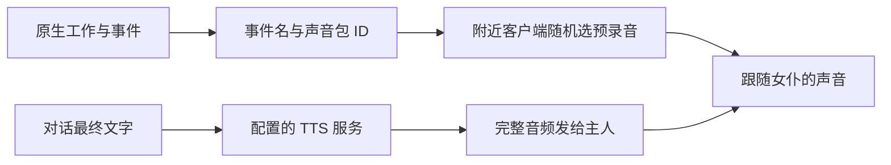

# 女仆如何发声，以及千灯纪如何复用

2026-09-08 调研。可以借鉴的核心是两条路径：原生事件触发预录音，复杂对话的文字再交给 TTS。QwenPaw 只承担必要的理解与表达，音色、合成、播放和打断由编码实现。本文是源码核查与接入设计，没有部署新语音功能。

核查对象为已安装的 Touhou Little Maid **1.5.3 / NeoForge 1.21.1**，JAR SHA-256 为 `ac7c07068be61216180a75e6845dc1e91f8c95a7c2e19ad241b81a127e7802dd`。关键调用用本机 JAR 字节码复核，并对照作者 1.21 分支固定提交 `207647c85740b1d0971de6040d6dd57cea62528c`。

## 两种发声

| | 预录事件语音 | 普通 AI 对话语音 |
| --- | --- | --- |
| 内容来源 | 声音包中预录的 OGG | 对话文字交给配置的 TTS 服务 |
| 触发 | 原生闲置、工作、受伤、驯服、拾取等逻辑 | LLM 回复成功后的 TTS 回调 |
| 是否需要 LLM | 不需要 | 生成台词需要，音频合成不再调用对话 Agent |
| 传输 | 事件、声音包 ID 和实体 ID；音频在客户端 | 服务端取得完整音频字节，再发音频包 |
| 接收者 | 同维度、实体方块坐标附近 16 格玩家 | 仅女仆主人 |
| 播放 | 客户端选音频并跟随女仆位置 | 客户端创建绑定女仆的空间音源 |

两条路径都使用 Minecraft 客户端声音系统，分类为 `NEUTRAL`，不依赖 Simple Voice Chat 麦克风通道。“有空间音效”不等于所有附近玩家收到了 AI 语音。[事件发送][network]、[AI 回调][tts-callback]、[事件音源][event-sound]、[AI 音源][ai-sound]。

## 预录语音如何工作

`CustomSoundLoader` 读取 `tlm_custom_pack` 下的目录或 ZIP，通过 `maid_sound.json` 与 `assets/<namespace>/sounds/maid/...` 建立缓存。`SoundPackId` 按女仆实体保存、同步；客户端按事件从对应池中随机抽一段。缺少本地包时，不会自动换成别的角色声音。工作池会加入 idle 音频，远程攻击池会加入 attack 音频，这不是仅在缺少专用音频时才回退。[加载器][loader]、[事件音源][event-sound]。

同一种工作可以使用不同人物的声音，无需改变工作 AI。项目已整理 **18 个自定义声音包、2304 个 OGG**，另有模组自带声音，素材校验见 [声音包与模型审计](MAID-VOICE-MODELS.md)。声音包与聊天 TTS 参考音是独立配置，外观模型也不自动保证两者音色一致。

原生已有节流，但不是完整播放调度：拾取音每 5 次成功拾取尝试一次；玩家伤害语音间隔 120 tick。客户端声音频率设置是概率过滤，不是统一秒级冷却，也不限制 AI TTS。客户端各自随机选片段，同一事件不同玩家可能听到不同内容。[频率过滤][frequency]、[实体事件][entity]。

工作模式语音不等于某次操作成功的回执。我们应在真实动作回执后才说“完成了”，普通工作语气则可沿用原生事件。新增女仆桥可复用 `maid.playSound(...)`；手工调用需要先尊重 `MaidPlaySoundEvent` 的取消结果，保留静音饰品等拦截，还需补每实体占用与冷却。

## AI 对话如何发声

普通链路为 `LLMCallback.onSuccess → MaidAIChatManager.tts → TTSClient.play → TTSCallback.onSuccess → TTSAudioToClientPackage → MaidAISoundInstance`。异步 HTTP 获取音频，回调把世界操作交回服务端主线程；客户端后台解码，声音跟随女仆。[AI 回调][tts-callback]、[AI 音源][ai-sound]。

显示文本与朗读文本可以分开。每位女仆保存 TTS 站点、模型和语言，但 GPT-SoVITS 适配器实际使用站点参考音频，没有用女仆的 `model` 字段切换参考音。多人物音色不能只改该下拉项，需要独立站点参考音或新的可信 voiceId 映射。[回复入口][llm]、[GPT-SoVITS 客户端][sovits]。

GPT-SoVITS 请求虽然设置 `streaming_mode`，普通实现仍用 `BodyHandlers.ofByteArray()` 收完响应后才发一个音频包。客户端从内存音频解码成播放流，不代表玩家能在合成完成前听到首句。本地 IndexTTS 也是完整合成后返回。[GPT-SoVITS 客户端][sovits]。

成功后显示头顶全文气泡，并向主人聊天栏发文字；TTS 失败也保留文字。默认普通气泡约 15 秒，不按音频长度对齐；Minecraft 声音字幕只是“AI 聊天声音”，不是台词时间轴。[气泡][bubble]、[AI 回调][tts-callback]。

普通音频包只有临时实体 ID 和音频，没有话语编号、分段序号、取消代次。没有每女仆共用的语音队列，也没有预录音与 TTS 避让，不能保证新回复打断旧回复。系统 TTS 是另一条客户端 Narrator 朗读分支。已装 Affection 附属的“早安吻”另有专用预生成缓存与版本失效保护，不能据普通聊天缺项断言整个整合包没有缓存。

## 发现的现役缺口

### 女仆 WAV 与客户端解码不匹配

本地 `server/tts-state/app/tts_api.py` 的女仆 `POST /tts` 兼容端点返回 WAV；底层是 **IndexTTS 2.5**，站点叫 `gpt-sovits` 只是协议兼容，不表示运行的是另一套模型。

当前 `Mp3AudioStream` 先调用 MPEG 专用读取器，不是自动探测所有格式的 `AudioSystem`。失败后 `MaidAISoundInstance` 只尝试 OGG Opus/Vorbis。[MP3 解码入口][mp3]、[后备分支][ai-sound]。

本轮用 JDK 内存生成的 PCM WAV 调用已安装 JAR 的读取器，实际得到 `UnsupportedAudioFileException: WAV PCM stream found`，JDK 通用 WAV 读取对相同数据成功。另仅读取 9 月 7 日隔离合成产物 `runtime/tts-ownership-qa-0ab1011def3e/post-maid.wav` 的格式头，确认是 22050 Hz、16-bit、单声道 PCM WAV。该历史产物不兼容当前原始解码链；本轮未重新合成，不能据此断言所有站点的当前输出都相同。

可复核的纯本地测试与结果位于被 Git 忽略的 `runtime/tlm-tts-audit/inspect_decoder.py`、`CheckTlmWav.java`、`result.json`。没有播放或读取历史音频样本。

**HTTP 合成成功不等于女仆客户端可播放。** 优先修复方案是在女仆专用兼容端点明确提供 MP3/OGG，或者增加客户端 WAV 解码；只改 MIME 类型无效。先做目标解码器验收，再做真实客户端听音。本轮没有修改返回格式或重启 TTS。

### 桐人尚未接通说话入口

| 现有能力 | 已确认状态 | 需处理 |
| --- | --- | --- |
| 女神发声 | `world/src/mc-god.ts` 写 text-queue；watcher 调本地 8100，再交 GodVoice/SVC | 对人回复目前绑定听者 UUID，属于神谕表现，不能照抄成桐人声源 |
| 桐人 MCP | 现役 39 项工具及 17 种程序动作中没有 say/chat/speak | 增加绑定自身身体的受限说话入口 |
| 旧守卫和 Numen 命令 say | 文字聊天广播 | 不会自动触发 TTS |
| GodVoice | `TtsQueueWatcher` 通过 SVC `EntityAudioChannel` 跟随实体 | 没有每角色播放串行、打断、过期淘汰；任务 text 未用于字幕 |
| 本地声音库 | 本轮只读查询 47 个 ID，有 goddess、cosy_male，没有 kirito/naruto | 先配置明确声音映射；不能只传人物名，当前云回退关闭 |

Numen 客户端 `VoicePipeline` 已有逐身体管线、分句、预取上限 2、按序播放、generation 作废旧回调、停止清队列，值得借鉴。但它由客户端自己的模型流驱动，当前 QwenPaw 服务端脑没有自动接入。应复用声音机制，不为发声再启动第二套推理循环。TLM 播放包也只接收 `EntityMaid`，不能直接使用桐人的玩家实体。

本轮只读检查确认 D 的 TTS、voice、ASR 容器健康及 8100 健康接口正常。服务健康不能覆盖格式与接线缺口，也不是玩家实际听音证明。

## 统一接法（待实现）

1. **人物固定声音档案。** 分别保存稳定人物标识、身体 UUID、名字、预录声音包、TTS voiceId、语言和音量。改名或换装不重建人格，参考音缺失不悄悄换成另一人物声音。
2. **快系统即时回应。** 受伤、收到指令、真实任务完成用预录或预生成短句，按真实事件触发、防连续重复并限频。不为一句“明白”调用模型或每次重新合成。
3. **慢系统生成必要台词。** 复杂对话由所属 QwenPaw Agent 给出文字，沿用共享预算；TTS 和播放不额外增加 LLM 决策。独立女仆身份未接通时不能按名字猜 Agent。
4. **统一说话任务。** 建议包含 `speakerUuid、voiceId、utteranceId、generation、dimension、scope、recipientUuid、priority、text、expiresAt`。服务端从绑定关系写入身份；普通角色用自身空间声，神谕和主人私语使用明确的不同范围。
5. **按人物排队并打断。** 同角色一次播一句；紧急提醒可中断闲聊，同时停止当前音频并作废旧合成结果。丢弃过期话语，限制分句预取，预录与 TTS 共用占用状态。不要因网络超时盲目重发整句。
6. **字幕随声音更新。** 实际开始/停止播放时更新带人物名的字幕。缓存键包含文本、声音与模型版本、语言及参数，限制容量和保留时间。本地 TTS 有推理锁，但没有这套缓存/取消，输出临时 WAV/MP3 也需补清理。

优先顺序：修女仆格式兼容 → 接桐人自身声音与队列 → 女仆独立人格桥接同一合同。保留已有女仆预录链，避免相同事件双播。后续验收覆盖人物隔离、近远听众、换维度/卸载停止、旧合成丢弃、字幕同步和客户端实际听音。

与 [女仆 Agent 设计](MAID-AGENTS-DESIGN.md)、[快慢系统](FAST-SLOW-AGENT-SYSTEM.md) 配套。玩家麦克风是输入链，继续遵守 [语言即接口](LANGUAGE-INTERFACE.md) 的身份、采音时间与施法边界，不与角色发声混为同一个入口。

[network]: https://github.com/TartaricAcid/TouhouLittleMaid/blob/207647c85740b1d0971de6040d6dd57cea62528c/src/main/java/com/github/tartaricacid/touhoulittlemaid/network/NetworkHandler.java
[tts-callback]: https://github.com/TartaricAcid/TouhouLittleMaid/blob/207647c85740b1d0971de6040d6dd57cea62528c/src/main/java/com/github/tartaricacid/touhoulittlemaid/ai/manager/entity/TTSCallback.java
[event-sound]: https://github.com/TartaricAcid/TouhouLittleMaid/blob/207647c85740b1d0971de6040d6dd57cea62528c/src/main/java/com/github/tartaricacid/touhoulittlemaid/client/sound/data/MaidSoundInstance.java
[ai-sound]: https://github.com/TartaricAcid/TouhouLittleMaid/blob/207647c85740b1d0971de6040d6dd57cea62528c/src/main/java/com/github/tartaricacid/touhoulittlemaid/client/sound/data/MaidAISoundInstance.java
[loader]: https://github.com/TartaricAcid/TouhouLittleMaid/blob/207647c85740b1d0971de6040d6dd57cea62528c/src/main/java/com/github/tartaricacid/touhoulittlemaid/client/sound/CustomSoundLoader.java
[frequency]: https://github.com/TartaricAcid/TouhouLittleMaid/blob/207647c85740b1d0971de6040d6dd57cea62528c/src/main/java/com/github/tartaricacid/touhoulittlemaid/client/event/MaidSoundFreqEvent.java
[entity]: https://github.com/TartaricAcid/TouhouLittleMaid/blob/207647c85740b1d0971de6040d6dd57cea62528c/src/main/java/com/github/tartaricacid/touhoulittlemaid/entity/passive/EntityMaid.java
[llm]: https://github.com/TartaricAcid/TouhouLittleMaid/blob/207647c85740b1d0971de6040d6dd57cea62528c/src/main/java/com/github/tartaricacid/touhoulittlemaid/ai/manager/entity/LLMCallback.java
[sovits]: https://github.com/TartaricAcid/TouhouLittleMaid/blob/207647c85740b1d0971de6040d6dd57cea62528c/src/main/java/com/github/tartaricacid/touhoulittlemaid/ai/service/tts/gptsovits/TTSGptSovitsClient.java
[bubble]: https://github.com/TartaricAcid/TouhouLittleMaid/blob/207647c85740b1d0971de6040d6dd57cea62528c/src/main/java/com/github/tartaricacid/touhoulittlemaid/entity/chatbubble/ChatBubbleManager.java
[mp3]: https://github.com/TartaricAcid/TouhouLittleMaid/blob/207647c85740b1d0971de6040d6dd57cea62528c/src/main/java/com/github/tartaricacid/touhoulittlemaid/client/sound/data/Mp3AudioStream.java
