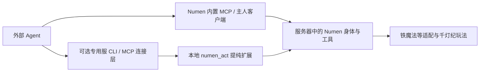

# Numen 上游与本地接入审查

2026-09-07。只读检查官方仓库、本地参考源码和 D 盘已部署 JAR；本次仅更新设计文档，未升级模组或改动存档。

## 结论与方案调整

应以 **Numen 扩展模组 + 玩法技能包 + 按需启用的专用服务器连接层** 为产品形态。Numen 已提供身体、感知、行动、工具契约、技能加载和外接 MCP；这些应直接复用。我们着重交付铁魔法/成长适配、玩家罗盘与咏唱、千灯纪角色玩法，以及不依赖玩家客户端常开的服务器运行方式。

这修正了前一版 AgentBridge 草案中“再做一层通用身体/工具/MCP 核心”的范围。连接程序仍可存在，但只是选定 Numen 版本的 CLI、部署与专用服务器适配，不重写其身体与寻路系统。

## 对照版本

| 对象 | 本次观察 |
|---|---|
| 官方项目 | [Dwinovo/minecraft-numen](https://github.com/Dwinovo/minecraft-numen) |
| 官方 1.21.1 分支查询结果 | `947f0064f3374adc0341e61687215ae32ea9765a`，通过只读 `git ls-remote` 取得；这是分支提交，不当作发行版号 |
| 本地参考源码 | `C:/Users/lzl19/.copaw/workspaces/default/numen-reference`，分支 1.21.1，HEAD `33bb7d06f78a3566b5a5d49ef61e0572bd1a399e` |
| 本地缓存的 origin/1.21.1 | `8a94cfd`，本地比此缓存多 9 个提交；没有 fetch，不能把这个差值解释为相对今日上游的完整差距 |
| 本地工作树 | tracked 修改 0、untracked 0；本地改动已经提交，工作树干净不等于未改版 |
| D 盘 Numen | `numen-neoforge-1.21.1-0.1.1.jar`，与 C 盘本地构建产物字节相同 |
| D 盘服务端动作扩展 | `numen_act-neoforge-1.21.1-0.1.1.jar`，与本地 actuator 构建产物字节相同 |

当前两个 JAR 的 SHA256：

```text
numen:     3a9af5420a5d40dcd6a24dd906d43fe4f67f25eea8ab6a082153bdcde7fae7af
numen_act: a0f18b280f524e419f975c0e4e1045b0c38dca3fc9ccc3cb15a9782b82a0f4ea
```

Numen JAR 内嵌的 `numen_api` 标记为 `0.0.8-SNAPSHOT`，不能仅凭外层文件名 0.1.1 就套用当前官方 API README 的 0.1.2 示例。当前运行的是经过本地修改并验证的组合。

## 已有能力与我们要补的部分

| 范围 | Numen 已有基础 | 我们的增量 |
|---|---|---|
| 身体和动作 | ServerPlayer 身体、移动、采集、合成、战斗、容器与任务 | 专用服身份/部署接入；修复具体不兼容点，不另写一套身体 |
| 工具 | NumenTool、ToolRegistry、参数 schema、TaskResult | 注册铁魔法、传送点、成长等工具，补充原生效果与消耗回执 |
| AI 行为说明 | Markdown 技能，配置目录与插件内资源 | 千灯纪及模组操作流程，明确可用技能和前置条件 |
| 内置大脑 | 模型接入、工具调度、对话记忆 | 保持可选；已有女神/剧情系统作为玩法层接入 |
| 外部大脑 | 内置 MCP 服务、直接驱动同伴的客户端 API | CLI 包装；需要无游戏客户端时保留服务器专用通道 |
| 玩家交互 | 上游自己的聊天与设置 UI | 我们的战斗罗盘、咏唱、手柄和角色技能入口 |

官方项目说明了 Markdown 技能和插件工具两条扩展途径；公共 API 提供工具契约。这里的“已有”表示文档/源码存在，不表示每项都在当前整合包逐一做过实机验收。[项目说明](https://github.com/Dwinovo/minecraft-numen/tree/947f0064f3374adc0341e61687215ae32ea9765a)、[API 文档](https://github.com/Dwinovo/minecraft-numen/blob/947f0064f3374adc0341e61687215ae32ea9765a/api/README.md)

“Skill”需要区分两种含义：Numen 的 Markdown Skill 是教 Agent 如何操作的工作流；我们的螺旋丸、闪电、传送等是游戏能力。发一篇 Markdown 不会凭空实现招式，发一个工具也不自动教会完整玩法；扩展包应同时提供必要实现和操作说明。

## 外接 MCP 与无人值守服务器不是同一条路径

官方 `NumenActuator` 位于 `api/common/src/client/java`，直接使用 `Minecraft.getInstance()` 与客户端同伴名册。官方源码明确要求在主人游戏客户端进程调用；其中 headless 指绕过内置 LLM 的调用方式，不能解释为不需要 Minecraft 客户端。[固定提交源码](https://github.com/Dwinovo/minecraft-numen/blob/947f0064f3374adc0341e61687215ae32ea9765a/api/common/src/client/java/com/dwinovo/numen/api/NumenActuator.java)

推荐保留两种运行方式，并明确工具支持范围：



第一条适合玩家开着游戏带 Agent 一起玩；优先复用官方入口。第二条面向 Docker 专用服持续运行，不要求图形客户端在线；现有 Python MCP → RCON → `numen_act invoke` 正是其基础。仅支持能在服务端执行的工具，依赖客户端状态、渲染或专用网络流程的工具不能原样全部搬过去。

本地新增的 `actuator/` 并不等于上游客户端类 `NumenActuator`：前者是本地服务器命令扩展，后者是官方公共接入 API。两者命名相近，运行位置与控制权机制不同。当前本地入口有 `summon/list/invoke/dismiss` 等命令，并关联已有身体和工具；新套件应提纯它并复核身份绑定、任务互斥、完成回执与重启恢复，不能把现有 OP/RCON 权限直接作为外部 Agent 权限模型。

本地 9 个提交还包含 `/mycli`、`/myhelp` 到 Goddess 的桥接、GodChannel、技能书/战利品通道、皮肤注册表增补，以及 NeoForge 网络与构建调整。`numen_act` 的部分路径依赖增加的 `CompanionRegistry.snapshot()`；用官方下载的 API 直接覆盖可能破坏本地扩展。当前已验证功能需要逐项迁移，不能只比外层版本号。

## API 文档与代码存在差异

当前 API README 仍示范 `acquire → invoke → release`；固定提交 `947f006` 的实际 NumenActuator 已直接提供 invoke，并通过外接大脑模式与身体任务闸门协调，同时提供事件和说话接口。不能未经编译/行为验证照抄旧示例。

本地实际 NumenActuator 同样已经没有 acquire/release，只有 companions/create/delete/invoke；本地 README 示例也滞后。新版的 takeEvents/awaitUrgent/say 不在当前本地类中。本次本地静态注册数为 37 个核心工具，这不是逐项实机通过数，也不把官方 README 的约数当作准确接口清单。

同样，概述把注册工具简写成通过 NumenGateway；实际 Gateway 负责输入消息，注册入口应对照选定版本的 `NumenTool` 与 `ToolRegistry.register`。新工具名称和 schema 需要遵守该版本约束。[Gateway 源码](https://github.com/Dwinovo/minecraft-numen/blob/947f0064f3374adc0341e61687215ae32ea9765a/api/common/src/client/java/com/dwinovo/numen/api/NumenGateway.java)、[ToolRegistry 源码](https://github.com/Dwinovo/minecraft-numen/blob/947f0064f3374adc0341e61687215ae32ea9765a/api/common/src/main/java/com/dwinovo/numen/agent/tool/ToolRegistry.java)

外接大脑文档还描述了 `get_events`、`say` 和断联接管设置；这些不能直接当作当前本地 MCP 已升级后的行为。本轮未启用或切换任何 MCP 入口。[官方 MCP 文档](https://github.com/Dwinovo/minecraft-numen/blob/947f0064f3374adc0341e61687215ae32ea9765a/docs/mcp-server.md)

## 模组兼容与资源

上游当前已经有 [plugins/ysm](https://github.com/Dwinovo/minecraft-numen/tree/947f0064f3374adc0341e61687215ae32ea9765a/plugins/ysm) 和 [plugins/tlm](https://github.com/Dwinovo/minecraft-numen/tree/947f0064f3374adc0341e61687215ae32ea9765a/plugins/tlm) 目录，后续模型/女仆接入应先对照。这里只确认了模块存在，没有安装或声称它们已兼容本地改版及原角色附件。

标准交互与玩法知识分别处理：能读机器库存，不代表完整支持它的生产链；部分模组能力需要新工具，部分只需 Markdown 工作流。兼容应按所选 Minecraft、加载器、Numen 和目标模组版本记录，不能从上游多版本支持推导本地扩展也全支持。

授权文件分开：主要源码 LGPL-3.0；指定公共 API 范围另有 MIT；美术资源另有保留权利的声明。发行扩展时应保留 Numen 依赖与来源，按实际文件核对授权范围，不把整个仓库统一当 MIT，也不把上游品牌和素材移作自研素材。[LICENSE](https://github.com/Dwinovo/minecraft-numen/blob/947f0064f3374adc0341e61687215ae32ea9765a/LICENSE)、[LICENSE-API](https://github.com/Dwinovo/minecraft-numen/blob/947f0064f3374adc0341e61687215ae32ea9765a/LICENSE-API)、[LICENSE-ASSETS](https://github.com/Dwinovo/minecraft-numen/blob/947f0064f3374adc0341e61687215ae32ea9765a/LICENSE-ASSETS)

本地发行还存在待整理项：numen_act 元数据写 MIT，JAR 内 LICENSE_Numen 为 LGPL。另 numen_api 完整 JAR 包含引擎及 ai/ui 类，目录或文件名中的 API 不等于整份 JAR 都适用公共接口的 MIT 声明。本轮只记录差异，没有发布新发行件。

## 下一阶段应交付什么

1. 锁定可复现的 Numen 基线与本地 9 个提交，逐项区分需要保留的服务器动作、皮肤、聊天与构建改动。上游更新先在独立环境验证，不直接覆盖正在使用的 JAR。
2. 把现有 Iron 桥包装成 Numen 工具，并随包带施法说明。CLI、原生 Numen Agent、玩家罗盘尽量复用同一服务端施法实现。
3. 从 numen_act 中拆出专用服所需的最小功能，把女神通道、技能书掉落、角色规则留在千灯纪扩展。
4. 将当前 Python MCP 收敛为薄连接层；有游戏客户端的场景优先官方 MCP，无客户端场景走独立服务器路径。
5. 先验证“纯 Numen + 扩展 + 铁魔法”可以运行，再迁入千灯纪角色技能和原存档。螺旋丸的修复作为独立玩法工作，不由本次查阅冒充完成。

这个顺序保留现有成果，同时把新开发集中在 Numen 尚未替我们完成的部分。
