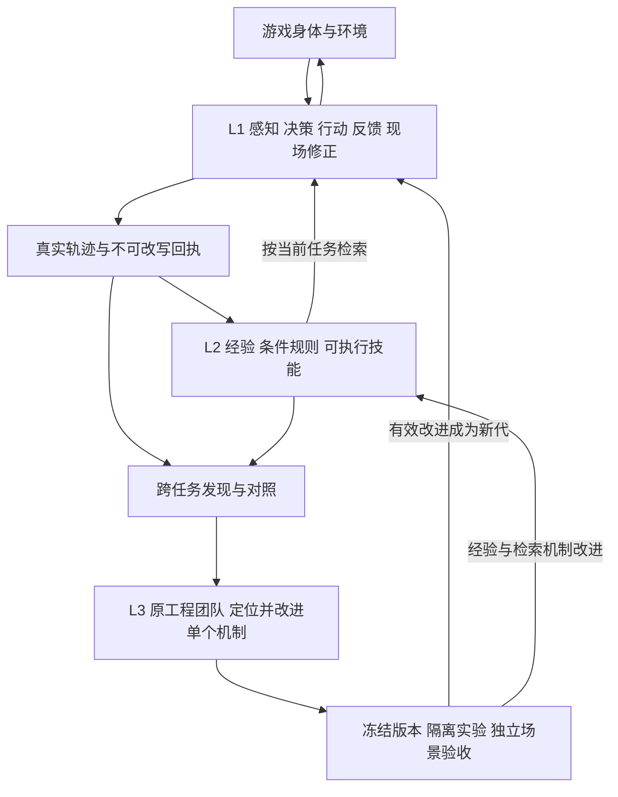

# Minecraft 具身 RSI：L1 / L2 / L3 落地设计

2026-09-20。本文按用户最新方向重写，替代旧“五层架构”和按草稿数量判定进化的方案。目标是在本项目 Minecraft Agent 上跑通可验证的自我改进；三层是本项目的设计，ModularRSI 论文并未提出这组三层命名。

研究开始时的具身源码基线为 `b1db1ce`；本轮已部署 L1 状态输出优化，并把原工程工作区升级到可信基线 `67283d9`、迁移提交 `b4b9a042`。后续原生工程任务已交付本地候选提交 `81c41e95`，工单待审，未推送、未部署。现役能力与部署证据见 [EMBODIED-AGENT.md](EMBODIED-AGENT.md)，工程应用记录见第 10 节。本文区分已应用机制与待验证的实验闭环，不把研究、技能发布或工具启用称为 RSI 成功。

## 1. 三层各自改进什么

| 层 | 触发与职责 | 产物 | 对应现有落点 |
| --- | --- | --- | --- |
| L1 Fast Loop | 感知 → 决策 → 行动 → 反馈 → 简短现场反思；响应当前世界和交流 | 行动、带来源的观察、原始回执、下一步选择 | survivor 原控制器、QwenPaw 行为/交流 session、Numen、本地技能程序 |
| L2 经验沉淀 | 任务结束、新失败证据或复用需求；提炼条件、经验、规则、技能 | 可检索经验、适用/失效条件、可复用程序及版本 | ReMe/notes、既有 learning catalog、SkillLibrary、PracticeStore |
| L3 Modular RSI 慢循环 | 不同任务出现同类机制问题；比较轨迹、定位模块、修改并检验 | 有来源、对照结果与回退点的新 harness 代 | TeamStore 工单、原工程师、独立源码工作区、受管测试与交付链 |

L1 反思通常是“哪里与预期不同、下一步怎么调整”，不要求每次动作后另开模型写长总结。L2 的学习成果按需检索，不能全部加入常驻提示。L3 修改运行机制，需要跨任务证据；一次失败可以提出假设，但不足以证明通用缺陷或改进收益。

保留三个不同概念：`memoryEpoch` 隔离工作经验；`skillVersion` 标识技能资产；拟补齐的 `harnessGeneration` 标识一次实验实际运行的机制版本。不能用更换记忆代冒充程序演化，也不能在一次对照运行中途换技能或机制版本。

## 2. ModularRSI：采用的方法及边界

精读来源：[论文 v1](https://arxiv.org/html/2609.14857v1)（2026-09-14，方法、实验、局限与附录接口/发现项）及 [代码 06fdcce7](https://github.com/IQuestLab/ModularRSI/tree/06fdcce711cb588f75630bc8ac847074ac80e13c)。

采用其“同任务轨迹比较 → 跨任务汇总 → 单模块修改 → 验证 → 模块整合”的方法。论文的五个模块是横向的可演化对象，不是另建五个后台 Agent：

| 论文模块 | 本项目拟议修改面 | 实验中固定的边界 |
| --- | --- | --- |
| Agent Loop | 唤醒、调度、等待、恢复、停止策略；原 controller 的相关函数 | 身体身份、动作所有权、未知任务不能重投 |
| Observation Management | 按任务选传感器、变化筛选、新鲜度和摘要 | 原始传感器记录、来源和实测值 |
| Tool Use | 工具选择、参数组织、前置条件、通用交互组合 | 物理规则、工具授权、服务端真实执行与材料结算 |
| Context Management | 行为 session、保留/压缩/检索、工具描述选择 | 记忆代隔离、原始轨迹、已确认增量游标 |
| Task Completion Detection | Agent 如何检查进度、建议结束或继续 | 独立评测器与最终客观成功条件 |

最后一项尤其需要分开：Agent 可以改进自己的“完成判断”，但不能同时修改给本次候选打分的评测器。Agent Loop 决定是否继续运行，外部观察才提供任务验收依据。

源码给出的具体启发：

- [k_roll.py](https://github.com/IQuestLab/ModularRSI/blob/06fdcce711cb588f75630bc8ac847074ac80e13c/src/harbor/agents/terminus_2_modular/self_evo/k_roll.py) 冻结首轮实际选择的模块与工具 helper，后续重复执行同一组合。我们的实验还须绑定实际源码字节、技能与初始世界快照，不能只记模块名字。
- [clustering.py](https://github.com/IQuestLab/ModularRSI/blob/06fdcce711cb588f75630bc8ac847074ac80e13c/src/harbor/agents/terminus_2_modular/self_evo/clustering.py) 按同类行为干预归并发现，并参考已有版本/改动历史。同一个任务重试一百次仍不能算一百个独立任务。
- [promotion.py](https://github.com/IQuestLab/ModularRSI/blob/06fdcce711cb588f75630bc8ac847074ac80e13c/src/harbor/agents/terminus_2_modular/self_evo/promotion.py) 在候选重基后重跑依赖源码树的检查。分别通过的模块合在一起，也必须重新验证。
- [online_evo.py](https://github.com/IQuestLab/ModularRSI/blob/06fdcce711cb588f75630bc8ac847074ac80e13c/src/harbor/agents/terminus_2_modular/self_evo/online_evo.py) 的 crash sanity 验证运行/协议，不比较 reward。论文 §3.5 描述从当前批次抽两个任务；此公开版本另有四个默认 sanity 任务。两者都不等于“每个保留改动已证明更好”。

论文报告 TerminalBench 准确率 47.57 → 52.43，同时平均步数 34.70 → 35.57；更可靠不必然更快。其结果来自终端/编程基准，不能移作我们的 Minecraft/Qwen 效果。论文也明确没有单独隔离轨迹对比贡献的消融。我们的收益需要自己测量。

仓库 `world/survival/KERNEL.md` 的“内核”是组件依赖声明；论文“固定内核”是实验期间不允许候选改变的契约。不能据此永久禁止改进现有学习/感知组件，也不能允许候选修改权限和评分事实。

## 3. L1：先用成熟运行机制建立可靠起点

参考 [Cortico / Neko 源码对照](OPEN-SOURCE-AGENT-CODE-STUDY.md)，复用已有 controller、WorldAdapter、NumenGateway、身体租约和程序库。当前协议允许本地程序与高层工具组合；原生输入的进一步开放须接原任务生命周期，并提供持续时间、停止确认与反馈。

一次行为的数据约定：

1. 观察携带身体/维度、来源、时间与状态版本；值与新鲜度分别处理。
2. 决策选择目标、技能/动作和需要核对的条件；变化不足时复用仍有效的计划。
3. 执行绑定原生 task ID、租约和执行代；受理、运行、停止请求、已停止、完成分别记录。
4. 反馈保留拒绝、失败、unknown 与客观状态变化。简短反思只说明偏差和下一步，不回传整段思考。

异步优化首先落实执行语义：

- 世界变化、动作终态、关键交流唤醒认知；读取观察、程序行动与只读聊天可以重叠。相同身体的冲突动作以及库存/菜单写入仍需协调。
- 提交动作前重新核对所有权、执行代与必要的新鲜状态。旧回调可以补记旧结果，不能驱动新任务。
- “取消了等待”不等于身体停止。Cortico 的任务连续性和 Neko 的 lane/owner 值得借鉴，但不能直接把 Promise 超时当作物理停止证明。
- 低优先级聊天可采用固定时间窗合并、队列上限和有序消费；不能丢失关键动作回执，紧急身体处置不等待聊天或长模型推理。
- 参考 Cortico `RoundOnceGate` 压缩同轮、同读数的重复只读结果，状态变化立即重新呈现。不能将这种缓存用于副作用动作。
- 工具描述按行为类别选择，通用能力通过目录按需发现；复用 QwenPaw 请求级工具范围，不能每轮加载所有规则、工具正文和经验。

现状限制：具身路径已具备增量确认、感知入口与只读交流，但外层默认观察仍为 15 秒、本地技能等待仍为 15–300 秒；逐 tick 控制在 Numen。供应商并发按 provider:model 共享，session 分开并不自动带来同时推理。下一轮要测量并改进原生事件到决策的链路，不能简单把 RCON 轮询调快就称为快速闭环。

本轮已经实施的最小优化是 `status(detail="brief")`，只省略背包槽位；每次仍读取新状态并核对原行动终态，保留 counts、安全信息和未知保护，默认 full 不变。没有实现同轮状态缓存，也没有取消外部 MCP 必需的任务轮询。40 条真实历史状态投影减少 34.345% 输出字节；部署后的单次 MCP 读取为 9,121 → 6,211 字节。两者均不是模型延迟或游戏成功率的受控实验，详细证据见具身部署记录。

分别统计排队、模型首 token、模型生成、工具等待、身体终态到下一次决策的时间；同时统计目标完成率、身体空闲时间、交流 p50/p95、重复上下文字节和供应商实际 usage。应用层提示变短不能直接换算 token 或费用节省。

## 4. L2：沉淀有适用条件的经验和技能

使用现有 ReMe/个人 notes 与 learning catalog 管理事实、规则和工作流；可执行程序继续走 `SkillLibrary`，实际练习落 `PracticeStore`。不新建平行记忆库或技能商城。

每个可复用结果需要能够回答：解决什么问题、何时适用、前置条件、预期结果、失败/失效条件、来源回执、适用身体/世界/模组与版本、目前验证到哪一步。复用后补充实际采用了什么、结果如何；“没检索到”与“用了也无效”应分别分析。

- 首次失败先形成有来源的观察或假设。成功/失败可比较时，提炼条件规则；多次复用可发展为程序技能。
- 工具前置条件可用后再组合技能，不为每种物品增加专用硬编码工具。
- Markdown validate/activate 只说明流程校验/安装；程序 fixture 通过不等于世界目标达成；程序 `done`、`objectiveObserved`、掌握程度继续分开。
- 对失败方法保留反例，不用无条件“禁止某动作”掩盖模型缺少配方、可食用性或空间信息的问题。
- 新任务只取相关短索引和必要条目；详细旧轨迹留待复盘，不进入每个快速动作上下文。
- 经验整理按新的有效证据触发并让位于当前身体与交流任务，不以每班产出草稿数量评价学习。

Plan4MC 提供的启发是将技能表达为前置条件、消耗、需求和产出，并在执行后的真实状态上重新规划。我们的计划图应由当前配方/原生能力和已验证技能生成或修订；模型提出候选关系，环境验证它。程序技能不要求全部替换为重新训练的 RL 策略。

已有具身控制器已去掉旧强制草稿配额；现存学习 Cron、`evolution_policy.py` 看板仍有旧班次/配额叙述。这是待对齐的实际配置与展示债务，不能只改一页文档就宣称运行机制已统一。

## 5. L3：复用 QwenPaw 原工程团队

2026-09-20 11:49–11:52（Asia/Shanghai）的只读核查确认：现役角色集中在游戏 QwenPaw 18089；旧 18090 运营环境不能按历史配置重新启动。依据包括原生 GET、现役配置投影、固定测试计划和已落盘回执，未触发模型任务。

| 现有角色/机制 | 可承担的 RSI 职责 | 核查到的边界 |
| --- | --- | --- |
| 桐人 `qd-survivor` 与其他具身角色 | 提供实际任务、失败、技能复用和改进需求 | 不直接改运行服务与独立评测器 |
| 女神 `mc-god` | 管理、判断优先事项、审查交付 | 管理意见不替代固定验收和真实游戏证据 |
| 司灯 `qd-steward` | 汇总跨任务问题、关联已有工单、协调推进 | 复用既有工单与原生求助，不创建另一套派工服务 |
| 天神·世界工程师 `qd-engineer` | 在独立源码工作区诊断和修改模块 | 逻辑身份仍为 `operations:mc-god`，有原生文件工具及五个工程工具 |
| 原受管测试 runner / engineering 工作区 | 捕获源码字节、固定计划测试、校验后本地提交 | 提交回执 `pushed=false`；没有自动部署权限 |

已有链路：`engineering_status → 原生文件编辑 → capture_source → engineering_test → engineering_test_status → engineering_commit → needs_review`。复用 `TeamStore` 的 `category=improvement`、原生 A2A/班次和工程回执，不新增“RSI 工程师”角色。

这里的原生协作是项目对 Qwen 后台任务的适配，不是标准 A2A wire protocol。身份映射见 `world/ops/world_team_hosts.py`，派工/去重见 `world_team.py` 与 `team_help.py`，源码/测试/提交绑定见 `engineering_workspace.py`，固定隔离执行见 `world/admin/engineering-runner.mjs`。工程师只能提交候选，女神/司灯才有工单分派与结案权限。

**研究阶段核查到的缺口（历史状态，已应用变更见第 10 节）：**

- 工程师角色和工程工具已启用，但 `qd-team-engineer` Cron 为 `enabled=false`、`next_run_at=null`，不能称正在周期自主改码。它的 `qd-learning-mc-god` 学习班次仍启用，角色未整体停用。
- 当时工程独立仓为 `baseCommit=600ffa3`、`HEAD=36de676`，缺具身重构的 `embodiment.py`、`dialogue.py`、`sensors.py` 和 `practice.py`。
- 当时唯一计划 `team-guild-admin-python` 只覆盖团队/公会/行政，未覆盖 `world/survival/*`；旧测试通过不能代替新大脑的验收。
- 存在 unknown 工程提交 journal；需要对原请求和实际 HEAD 核对，不能因状态未知重投提交。
- `learning_policy_draft` 已把有限配置旋钮提议转为工单，但填写 `would_change_outcome=true` 只是改进假设，不是因果证明，也不是任意模块源码修改授权。

上述核查确定了实施顺序：先保留旧工作区和未知回执，再对齐基线与固定测试。现在这次升级已完成，工程角色与原 Cron 状态已恢复；其 `qd-team-engineer` 仍保持原来的关闭状态，真实验证通过原生求助任务提交，不把它说成周期自主改码。

升级复用并扩展了 `tools/prepare_engineering_recovery.py` 的 prepare/test/quiesce/apply 路径；研究阶段的旧工具仅调整恢复计划，不能升级 baseCommit，这一限制已由本轮显式升级模式补齐。没有重跑首次初始化器覆盖旧仓库。恢复到可测试状态仍不等于候选已通过 RSI 晋升。

## 6. 从跨任务发现到新一代机制

以下流程是拟补齐的 L3 实验闭环，已有提案和工程链是它的载体：

1. **收集可比较轨迹。** 同一个任务实例在同一冻结版本下多次执行；混合成败作对比，全失败用于诊断，全成功查效率。429、环境不可用、日志缺失单列为基础设施问题。
2. **聚合跨任务发现。** 用不同任务/情境支持同一机制假设，记录分歧点、模块、证据引用、预期改变的指标、反例和已尝试版本。重复重试不能膨胀支持度。
3. **选择单模块候选。** 原工程师在原隔离工作区修改清晰范围；候选从同一基线产生。暂先串行验证，后续有必要再并行，不要求五个常驻演化 Agent。
4. **运行固定检查。** 语法/接口/依赖、差异审查、隔离运行；不能写入任务答案、固定测试坐标或更改评分事实。检查故障保留上一合格版本，不自动放行候选。
5. **验证改进。** 基线/候选使用匹配的初始条件和预算，比较真实成功率、代价与失败模式。在开发任务上选定候选后冻结，再评估未参与修改的场景。
6. **整合与晋升。** 多模块组合须重新检查整合后的实际源码树与行为。记录父代、改动、证据、测试和回退点；在运行边界切换，旧在途任务保留原绑定。

相同任务 K 次采样解决“同机制有时成功有时失败”的诊断；基线与候选的 A/B 解决“改动是否有效”的评估。这是两种实验，不能混为一谈。历史成功轨迹可用于提出假设，初始状态或版本不同则不能直接算受控对照。

拟将实验绑定加入现有工程/实践证据，至少包含：

`task/objective hash、初始存档与物资 hash、世界/模组/配方版本、身体与维度、harness 源码 hash、模块组合、skill 版本、memoryEpoch 与检索快照、模型/工具配置、预算、随机种子、评测器版本、原始回执引用`。

环境仍可能有随机性与外部扰动，须记录并多次采样；固定 seed 不等于完全复现。目标完成判断独立于候选，未知结果不伪造为成功；基础设施失败的数量与排除原因一起报告。少数试跑仅为初步证据。

现有独立 NeoForge QA 环境可复用，但不能直接把旧 `server_snapshot.py` 产物当作上述完整实验快照：其运行态映射仍从源目录 `data` 取数据，而现役项目使用 `server/world-data`，且未完整绑定新的具身日志、行为上下文、实践台账和 Qwen 记忆状态。本轮未调用它重置或复制生产世界。开展 A/B 前须先对齐实际路径和状态清单，验证恢复后的等价初始条件；这仍是下一阶段工作。

最终保留场景不回流给编辑 Agent 反复调参；若已用于修订，则转为开发材料并另建保留集。经验来自旧记忆档案时保持来源标签，不能重新混入新默认记忆。

## 7. Plan4MC、MineDojo、MineCLIP 的落点

三者官方代码已另行克隆阅读，兼容性和固定提交补充在 [源码对照](OPEN-SOURCE-AGENT-CODE-STUDY.md)。采用不同职责：

| 参考 | 采用什么 | 在本项目怎样接 |
| --- | --- | --- |
| Plan4MC | 技能条件/消耗/产出关系、技能图搜索、根据真实状态重新规划 | 扩展既有技能元数据与目标分解；使用当前配方和原生可行性，不导入旧版物品表 |
| MineDojo | 任务规格、环境观察与行动接口、可重复试验方法 | 作为独立研究 backend；先在本服版本的独立世界副本验收，再验证可迁移部分 |
| MineCLIP | 视频/文本表征与任务相关分数 | 可选的视觉传感器/学习信号；需真实 RGB 序列和模组域内校验，与原生状态感知融合 |

兼容边界必须进入实验设计：

- MineDojo 的源码基于 Minecraft/Forge 1.11.2；Plan4MC 还依赖定制 MCEnv。本项目是 NeoForge 1.21.1 + Numen + 模组，环境和动作词表不能直接互换。
- MineDojo 的 `fast_reset` 不会恢复所有世界修改和统计。重复实验必须明确重建/恢复了哪些状态；本项目对照使用受控副本，不重置生产世界。
- MineCLIP 给出视觉表征或相关分数，不提供确定的实体 ID、方块坐标、库存或任务完成证明。其预训练使用游戏 YouTube 视频及文本，论文在线实验使用第一视角 RGB 序列；当前 `view_scene` 是语义俯视网格生成的 PNG，尚未验证这种不同输入上的效果。
- 先为当前身体解决可信视角采集、帧时间/位姿对齐、空间与模组域差异，再验证视觉增益。服务端原生感知继续用于精确状态、物理反馈和客观验收。
- MineDojo 中成功的抽象策略可转到 Numen 再测；跨版本技能未测试时只算候选，不能直接继承“已掌握”。

## 8. 实施顺序与完成标准

| 顺序 | 最小交付 | 验收 |
| --- | --- | --- |
| 0：复用链对齐（已应用） | 工程师已接入基线 `67283d9` 与具身固定计划；旧改动和 unknown 保留 | 迁移两计划 331/456 项通过；原生候选另经 482 项测试并本地提交 `81c41e95`，工单待审、未部署 |
| 1：L1 基线与效率（部分完成） | brief 状态投影和按需读取已部署；继续测量事件到决策链路 | 输出字节减少已测；目标成功率、身体空闲及交流延迟仍需可比实验 |
| 2：L2 跨任务复用 | 在原台账/技能库补充适用条件、采用证据、反例和计划关系 | 在不同初始情境复用成功；能区分未采用、失败和已验证；不按草稿数验收 |
| 3：首个 L3 实验 | 从导航、合成或容器交互等不同任务中寻找同类观察/上下文/工具问题，选一个真实证据支持的模块候选 | 冻结基线与候选，独立存档 A/B 与保留场景，目标/代价/失败报告和可回退新代 |
| 4：扩大泛化范围 | 再加入视觉研究、MineDojo backend 与必要的多模块整合 | 本服模组任务与跨环境分别报告；不拿旧环境结果替代实际部署验收 |

重复背包槽位输出已经在本轮轨迹中量化并缩减；它是否造成延迟或任务失败、其余观察/上下文是否需要改动仍待检验，不能归为已经证明的共同根因。任务难度应覆盖可获得成功/失败反馈的场景，避免只有轻易成功或当前完全不可做的任务。

首轮闭环成功应能完整展示：真实多任务经历 → Agent 自主定位机制问题 → 既有工程师产生候选 → 固定实验显示收益 → 保留任务未明显退化 → 形成有来源的新代并可回退。单次闭环证明一次改进；新代再次产生并验证后继改进，才构成更强的递归证据。当前已有具身与实践基础、首个 L1 优化及工程工作区升级，尚无这条完整链路的收益验收。

## 9. 研究阶段交付（实施前记录）

研究阶段完成论文和关键实现研究、角色/工程权限及现役状态核查，形成上述三层架构、复用映射与实施验收条件。以下保留该阶段事实，不能读作最新部署状态；后续实施见第 10 节。当时未启动外部机器人、训练 MineCLIP/RL、重置游戏世界、开启工程班次或实施自动机制晋升。

另修复原 `LearningTools.policy_draft` 的证据交接：以前指标、反事实判断和来源证据仅返回调用者，没有完整进入工单；相同 changes 的新证据还会碰撞旧 request ID。现在沿用原 case 去重键，在既有事件中保存校验后的有界回执和原 changes，明确 `causalityVerified=false`，由实际提交内容生成请求标识。相同重试幂等，新理由/新证据形成同案新事件，历史事件保留；超出工单容量明确拒绝，不写入截断的审计记录。

沿用既有校验器的 note 600 字、metric 160 字、evidence 最多六条/每条 200 字限制，不能把该记录称为原请求字节归档。源码修复不改变模型、权限、班次或激活规则。研究阶段尚未部署；现已随 13:00 的维护应用，但证据交接修复本身仍不是 L3 收益证明。

当时验证：新增五项真实临时 TeamStore/SQLite 回归，覆盖重建后读取、历史保留、重复/新增证据、no_verdict 与容量拒绝。Windows learning 为 20 通过/2 个既有 Linux 专用跳过，TeamStore 10 通过；同版 Qwen 镜像的禁网、非 root、只读源码容器内 learning 为 21 通过/1 失败，TeamStore 10 通过。唯一失败 `test_ops_cron_and_delegate_share_existing_ledger_and_uncertain_reservation` 在 `b1db1ce` 原代码/原测试下同样复现（16 通过/1 失败），不归因于该补丁，也未改其旧断言凑绿。文档相对链接及 43 个固定 GitHub 路径均核对存在。这批历史结果不替代升级后的固定计划验收。

## 10. 工程链与首个 L1 候选的实施

部署后的采用观察：13:00–14:02:49 九个已完成回合、43 次工具调用中，八次 `status` 均省略 detail，brief 实际采用为零。行为 session 的增量和终态确认继续工作，但输出投影能力尚未在这批自主调用中发挥作用；后续应验证调用默认、提示与按需详情的实际采用效果，不能仅凭增加参数便宣称效率提高。此处统计原生模型回合完成，不等同游戏目标达成率。

原 `prepare_engineering_recovery.py` 增加可信本地提交升级模式：按真实 Git 共同祖先合并工程师已提交历史，再把实际未提交/未跟踪/删除内容三方合并回来。固定检查的许可基线与 Git 共同祖先分别核验，已合入主线后修正的代码不会被旧提交再次覆盖。合并提交保留旧 HEAD 与新基线两个父节点，冲突明确停在隔离目录。固定测试由可信提交产生，工程师不能通过改固定检查绕过验收；组合 Python 计划覆盖原团队业务和已选具身模块。独立 Node UI 测试明确列为另一运行环境的检查，不记作 Python 通过项。

升级分为 `--prepare --upgrade-source <本地仓库> --upgrade-ref <已提交版本> --unknown-review <复核记录>`、`--test <提案目录>`、`--quiesce <提案目录>`、`--apply <提案目录>`。准备和测试不改现役工程目录；暂停工程角色所有 Cron 并自然排空后，quiesce 用原生 API 停止该角色、关闭新任务准入，再允许 apply。应用前重新验证原目录/候选/配置/请求回执哈希和 runner 空闲，完整保存旧目录及记录；不会自行重新启用角色或班次。旧恢复模式仍保留，升级模式必须固定测试通过。

未提交改动确有冲突时，可由维护者精读后提供 `--working-resolutions <JSON>`：逐项绑定 old HEAD、目标提交、base/local/incoming 三侧字节及已复核结果的 SHA256，只能覆盖此次真实 dirty 冲突集合，不能覆盖固定检查或已提交历史冲突。审核原件、合并结果和旧工作区一并备份，合并内容仍是未提交工作；测试和应用阶段再次核验。该入口解决工作区升级冲突，不赋予工程 Agent 修改自己的验收门槛的权限。

维护工具按单操作者串行使用。离线 test 尚无常驻工程 runner 那样的运行中持久回执；已有同源 passed 后再次测试若中断，旧 passed 仍是历史证据，不能描述为最新重跑成功。test/quiesce 也不提供多操作者并发调度；本次按准备、测试、排空、应用依次完成，无并发维护。

42 条历史 unknown 已逐项复核，保留原始状态，维护记录只标注 `archived_unresolved_no_replay`，不改成成功、不重新执行。旧工程完整隔离副本在现役固定镜像通过 292 项测试并成功提交，当时未能复现旧 42 条记录的失败。原提交工具补受控失败步骤、异常类型及退出码，保留未知结果语义；分支更新后失败也不会自动回滚或重放。新诊断回归在现役 Qwen 镜像 38/38 通过。后续新事务的空锁复现见下文，不能回填为这批历史记录的共同根因。

首个 L1 候选来自导航、合成等轮次中反复返回完整背包的观察问题：沿用 `status` 增加可选 brief 投影和按需读取说明，同时使原健康检查识别新 schema。40 条真实输出的离线字节减少 34.35%，独立 fixture 保持真实终态、未知保护和物品变化；详情见 [具身部署记录](EMBODIED-AGENT.md)。这只是可测的感知输出改进，完整 L3 仍需要工程角色自主产生候选、独立世界 A/B 和保留场景验收。

2026-09-20 13:00 已部署 L1 状态投影、按需读取提示、policy_draft 证据修复及工程提交诊断。维护先暂停原班次/NPC 准入并排空，随后只重启原 survivor 和游戏 Qwen；Minecraft 保持运行。生产字节的具身 smoke 20/20、实践 smoke 34/34 通过，分别记录 12/15 个与现役文件一致的源码哈希；模型调用、游戏动作及生产修改计数均为 0。真实 MCP brief/full 读取成功（48 个工具），一次输出为 9,121/6,211 字节。生产报告为 `reports/embodied-agent-smoke.json`、`reports/survival-practice-smoke.json`；本机部署证据为 `runtime/rsi-engineering-upgrade/live-status-probe.json` 及同目录 `panel-smoke.json`。

工程升级随后已实际应用，不能再表述为“工程副本尚未同步”。现役工程基线为 `67283d9ac9e018c2ad11b0af3d62a9e27ffd620b`，迁移提交 `b4b9a0424c50dfc191e6ce5c42102d3f04567f4a` 保留旧 HEAD `36de676` 和新基线 `67283d9` 两个父节点。11 条原未提交/未跟踪改动经合并保留；两处冲突经显式源码哈希复核，旧原件仍在完整备份中。42 条 unknown 原状态及回执保留，未重新提交或标成成功。

固定计划 `team-guild-admin-python` 为 331/331 通过，新增 `embodied-team-python` 为 456/456 通过；两计划共享部分测试，不相加为独立案例数。升级恢复工具另有 24 项回归通过。两计划均使用固定 Qwen 镜像 `sha256:45dc7f061c09489b7d36d5b1499b830a3b14176835c0bc9afaa233d60df2299f`。应用回执 `candidateAcceptance=passed`、`historyRewritten=false`、`oldReceiptsPreserved=true`，同时 `businessCodeDeployed=false`：升级工程师的候选工作区不等于部署其业务改动。

应用及恢复收据在开发目录 `runtime/rsi-engineering-upgrade/apply-result.json`、`test-result.json`、`engineer-resumed.json`。完整旧工作区和工程记录保存在生产 `server/engineering/migrations/20260920T051644-32e782f4/`，其中固定测试日志记录上述 331/456 项结果。工程师 profile 与原 Cron 状态已恢复；原 `qd-team-engineer` Cron 仍关闭，未借升级开启新的周期任务。

原生工程验证已走到真实修改、独立审查和固定测试：工单 `case-a7b7f2916f0992c04101` 沿用原 `qd-engineer` 与同一 session；工程师修复 `_pending_publications` 的读取范围、坏回执未知标记和诊断体积，新增回归，并根据审查纠正 Python 3.11 目录 API 会提前完整枚举的问题。最新快照 `9f15483c85fef816e2ef6d6acd26b6903e2a4429ea3190d37fc2ffdaced74c47` 的正式作业 `mc-god-20260920-pending-pub-bounded-test-03` 已通过 482 次执行，exitCode=0，结束后源码核验通过且容器已删除（`containerRemoved=true`）。具体边界见具身部署记录，本次不宣称前序 proposal/receipt 全链路修复。

首次任务 `task-3f4239feaf34` 的模型响应流中断已明确记录 failed，后续在确认终态后通过新工单版本续接，没有重投旧 unknown。原角色提交任务 `task-d0b86246fe30` 随后调用 `mc-god-20260920-pending-pub-bounded-commit-02`，诊断确定失败阶段为 `read-tree`、异常为 `EngineeringGitError`、exitCode=128；原 journal 仍为 `unknown`。现场空 `.git/index.lock` 已在隔离副本复现同一阶段和退出码，可解释此次提交失败，但不能归因旧 42 条 unknown。

锁维护已完成：停用工程角色后归档经核验无主的空锁，操作前后 HEAD、index、2,310 个源码文件与 61 条 journal 完全一致；随后 profile 和原 Cron 精确恢复。旧 42 条 unknown 与本轮 commit-02 unknown 均保持原字节，不修改成功、不自动重试。核验记录在本机 `runtime/rsi-engineering-upgrade/lock-recovery/recovered.json` 与 `resumed.json`。

最终由原生任务 `task-bbb8d3c78dbe` 以新事务 `mc-god-20260920-pending-pub-bounded-commit-03` 完成提交，任务 completed、提交状态 `committed`，工单 v10 为 `needs_review`。提交 `81c41e95a3c7ec3cb94ba18790fabac8767ce7a7` 的父节点为 `b4b9a042`，绑定同一 `9f15483c…74c47` 源快照与 test-03 的 482 项测试；`git --no-optional-locks` 验证 HEAD 与回执一致、工作树干净。12 个提交路径包含旧 11 项 dirty 内容的保留及本轮修订，另有新回归 `tests/test_world_content_pending_publications_bounded.py`，不能把全部路径归为本轮新增。候选 `pushed=false`、未部署，交付证据为本机 `runtime/rsi-engineering-upgrade/native-engineer-delivery.json`。

该次验证由维护者给任务与审查意见，已验证原工程角色修改、测试、本地提交和工单交接的能力，不是 Agent 自主发现机制问题或完成世界 A/B 的证据。正式测试和原 unknown journal 保存在生产 `server/engineering/receipts/`、`server/engineering/state/`，原生派工与审查记录在本机 `runtime/rsi-engineering-upgrade/`。

13:04 的 L1 恢复检查时十角色 profile、十六个 Cron 定义及启用状态与维护前一致，自主和 NPC 准入正常。13:22 桐人在原学习班次再次调用 `learning_schedule(enabled=true)`，既有实现重建其完整 spec，补入原模板的 policy_draft 说明；13:28 复核其余十五条定义、全部 profile 与启用状态不变。该变化有原生调用和成功回执，不归为维护主动改写，细节见具身部署记录。

Qwen 仍有旧 `mc-god/qd-learning-mc-god` 的 `text_drift`（实际 572 字符、校验期望 700）；NPC 仍因 `hesu=missing_in_loaded_chunk` 报 `guild_npc_identity_not_ready`。实践旧报告的源码失效已通过真实重测修复；其余面板组件状态与此前具身部署基线一致，不能称全局健康全绿。完整 L3 仍缺独立世界 A/B、保留场景与后继代收益验证。
