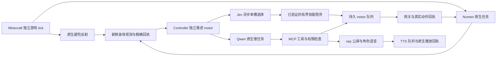

# 桐人持续游玩与直播链路复查（2026-09-24）

## 当前结论

已保留并验证现有快慢异步结构：Qwen 慢任务与身体执行能够重叠，Minecraft 原生 tick 独立运行。本轮修复了循环异常传播、已知/未知动作结果混淆、旧认知任务空转、技能资格缓存、重复输入和语音回执等多处具体阻断；修复已经部署，维护准入已恢复，观察者持续跟随且失焦不暂停。

**持续运行改善不等于智能直播已达标。** 最后 12 分钟出现 5 条自然公屏台词、5 次原生音频启动：4 条完整播放，1 条因角色死亡被取消；36.785 秒内连续两次发言正常提交并开播，原权限错误没有重现。同期两次被骷髅击杀，仍无采矿、合成或木材入包。当前重点缺口是有界持续探索、稳定子目标、扫描结果与下一动作的依赖，以及经验证的观众问答。

Mindcraft、mc-agent-neko、Cortico 与三个 Jev 游戏实现的代码对照见下文四份研究报告，均固定提交并区分源码事实、离线测试与未做的实服验证。全项目面板仍有未通过项，不能把专项门禁通过表述为全项目运营全绿。

## 复现与原因

现场链路为感知 → Controller → Qwen 原生任务 → MCP → 持久 motor 队列 → Numen → 动作回执 → 下一轮。

- 12:29 后控制器心跳停滞，后台重复 `runtime_retry/GatewayError`。原生身体仍在线，被避险行为带到工作区 `maxX=0` 外。`motor_loop.tick` 的区域预检异常逃逸，跳过模型终态对账与发布。限制动作的拒绝变成了整个循环停摆。
- 11:59:38 回合结束至 12:15:34 再次提交，间隔近 16 分钟。记忆允许 1800 秒复核，持续游玩缺少明确的空闲周期上界。
- 12:18:06 请求移动约 0.97 格，12:18:10 报完成但前后坐标完全一致。目标落在约 1.5 格到达容差内；逐格调用模型既慢，也可能没有实际位移。
- 两个真实模型输入中的 motor 数据占 65–72%。一轮 226 秒、14 次工具调用，累计输入计量 1,180,376 tokens；另一轮 91 秒、累计 670,187。此数值是多轮工具往返的累计，不能当作单次上下文长度。
- 工作记忆仍要求“向东”返回 `x=-544`，与当时接近 `x=0` 的位置矛盾；旧长期笔记残留探索东侧的阶段。方向应由当前坐标计算，不应沿用旧文字。
- 正常规划的最终回复留在控制台；近期三个会话共 49 次 Numen 调用而无公屏解说工具调用。伙伴 `party_send` 与音频回执是不同通道，音频失败不能推断伙伴没收到消息。
- 第一轮实测的补给阶段暴露了满背包问题：主背包 36 格全部占用，食物法术掉落的面包没有入包；角色反复拾取、进食却未明确看到空位为 0。缺食物的进食请求此前还会进入原生动作流程。
- 路由器的无候选缓存未包含程序目录版本，同目标下新晋升的程序可能一直不进入候选。现有 30 个程序中导航仍只有单段 `base_goto`；本次没有宣称已获得连续地形导航技能。
- 第二轮又触发 `motor_dispatch_uncertain`：`feed` 返回明确 `skill_archived` 拒绝，动作已记录 rejected，但回执归队时与 MCP 状态查询抢非阻塞锁，`GatewayError(action_busy)` 被误当派发不确定而暂停。真实锁竞争回归复现了同一调用栈。
- 顺带复现直接租约路径的旧缺口：下一动作内部结算发现前动作 epoch 消失并关闭租约后，仍会沿用进入函数时的 open 快照派发。已在结算后重验持久租约和 unknown，正常完成后的合法续动作不受影响。

## 修复设计

1. 区域拒绝留在 motor 层，继续处理精确回执、模型终态及心跳。工作区外只接受模型选择的短程回区移动：每个轴的越界量不得增加，总量必须减少，仍保留 24 格距离与落点高度检查。返回计算出的方向和未验证的建议步点，不自动传送或代选路线。
2. 可配置直播节奏：默认保持旧行为；启用后 ongoing 空闲复核默认 45 秒，blocked 按 45–180 秒退避。原有模型并发、预算、冷却、在途动作、未知副作用与真实休息优先。
3. 模型输入与 `status(detail="brief")` 精简历史回执；MCP 默认 brief，内部读取和显式 full 保留完整结果。相同历史 JSON 重放由 21,732 降为 12,722 字节、15,175 降为 10,173 字节。`game_skills(all)` 合并重复映射，真实样本由 30,008 降为 22,338 UTF-8 字节；42 项技能的事实及冲突源保留。brainProtocol=1 的唤醒输入不含全技能目录，因此首次缺资料时查询 all 是合理的。输入减量不等于已经证明实时延迟同比下降。
4. 指南要求使用当前 dx/dz、选择有意义且可站立的路段、核对实际位移；异步排队后保存意图并结束，避免模型反复等待查询。
5. 新 `say` 由角色自己写简短现场解说，发送给同维度附近玩家，默认可附带本人音频。先持久记录，再发送；未知结果只读原生凭证，不重发。文字、音频、伙伴输入分别报告，不虚构真人已阅读。
6. 实测 `inventorySpace` 进入精简身体状态；未持有食物时在派发前返回 `food_item_missing`，说明地面掉落不等于背包物品。释放哪些物品、如何补给仍由角色决定。
7. 已确认实际位移大于 1.5 格或物品变化的 motor 回执可立即触发一次后续决策；游标在真实模型任务预约时落盘，仍尊重休息、在途、未知、配额和冷却。目录缓存加入已发布程序版本与路由摘要，不因位置或草稿变化重试，不重置同目标程序次数限制。
8. 已知结果落盘等待本地短锁，未知结果仍暂停。角色收到 `autonomy_disabled` 等授权结束信息后直接结束本轮，避免在不可行动时换工具反复尝试。

## 部署与验证

针对性测试先复现失败再修复。角色指南通过原生带 ETag 的文件接口更新并触发原生重载；技能通过原生 disable/CAS/enable 流程同步。保留原身份、模型、生活会话与动作账本。

以下按现场观察和修复顺序记录。服务健康仅证明链路可运行，直播效果另行核对自主动作、真实位移、目标进展与聊天送达；早期轮次的失败记录保留。

### 第一轮现场观察（13:10–13:21）

采样文件：`runtime/survivor-livestream-samples-1790226630.jsonl`。

- 三轮原生自主任务继续执行。桐人从 `(86.70,64,941.70)` 向西自行回到工作区，未使用管理员传送。
- 首个移动得到约 16.11 格实际位移；下一轮在上一模型完成后约 2 秒提交，第二、三轮首次移动约在任务开始后 16 秒。
- 部分移动水平已有进展，却因沿用旧 Y 值得到失败回执；补充工具说明优先省略未验证的 Y，保留真实三维到达检查。
- 补给被满背包挡住，三轮仍无 `say`。此轮只验证恢复调度和自主返区，**未通过完整直播体验验收**。据此补上库存容量、缺食物拒绝、公屏发送历史及默认精简状态，启动第二轮。

### 原生聊天隔离验证

证据：`runtime/survivor-chat-qa-967ef9c758/result.json`。隔离 Minecraft 实例确认近处接收、30 格外排除、自身排除、文本按 JSON 字面量发送、同轮重复只发送一次、无接收者为 `0b`。没有改动生产世界或调用模型。跨维度选择器核对了命令语义，尚无异维度原生负例；原生 `1b` 只证明服务器发送，不代表客户端渲染、真人阅读或音频播放。

### 第二轮失败与修正（13:31–13:41）

采样文件：`runtime/survivor-livestream-samples-1790227877.jsonl`。角色识别了 36/36 满背包，并尝试 `drop_items`，但上述回执锁竞争使后续工具得到 `autonomy_disabled`。暂停期间 13:36:58 被女仆妖精击杀，不能把这一轮记为恢复成功。原生任务结束后，按原 actionId 的明确 rejected 回执完成本地对账，没有重发法术；部署修复后通过既有身份恢复流程重新上线。

观察者客户端日志确认 13:20:41、13:32:16 两条桐人对结衣的附近聊天进入 `ChatComponent`。这证明伙伴聊天已能到达观察客户端，但不等同于新 `say` 的自主使用。观察者跟随状态多次为 online、spectator、同维度、distance=0，客户端 `pauseOnLostFocus=false`。

本轮整体面板 `probe_panel_smoke` 返回 false，原始结果在 `runtime/livestream-panel-smoke-20260924.json`；多个既有子模块或证据记录未绿，不能据此宣称整个项目运营全绿。具身专项须在最终源码测试与部署后另行检查。

### 第三轮暴露的采矿协议缺口（13:41–13:53）

采样文件：`runtime/survivor-livestream-samples-1790228511.jsonl`。角色自行释放背包格、取得面包并两次进食，饥饿值从 4 恢复到 14；随后有两次确认完成的移动。13:50:05 的 `mine` 原生任务 `t557` 在约 124 秒后身体空闲，但外部异步调用的原生终态已被丢弃，网关只能记录 `observed_ended / completionConfirmed:false`，motor 按未知结果暂停。当前位置从工作区内走到 `(42.50,68,901.75)`，没有橡木库存增量。不能根据时间推断超时并补造失败回执；此轮仍未通过持续直播验收。

同时复现 `remember` 未传 `goal/lesson` 时默认空字符串抹掉意图。新合同中省略或 null 保留旧值，显式空字符串才清空；旧时代记忆仍先过滤，不回填丢失目标。54 项相关回归通过。直播解说指引已由原生实际读取，两个真实输入都包含 `pacing.narration`，但三轮均没有 `say`；增加简短的唤醒前置提示，实际采用效果待新观察确认。当前源代码 509 项全量隔离测试通过；另增加恢复入口拒绝 motor 队列未知结果的先红后绿回归，防止仅因不存在 `unknown.json` 就误恢复。

结衣未回复的一个原因是 9 月 22 日遗留 `async-motor-20260922` 维护准入一直暂停。通过既有控制入口恢复后，14:01 已观察到旧消息获得游戏 heard 回复，随后另一旧消息提交原生任务；新消息还在 FIFO 积压之后。伙伴消费循环独立于结衣的生活定时器，不以恢复聊天为由开启旧 timer。

按正常顺序先刷新运营快照、再调用的面板探针仍非全绿（`runtime/livestream-panel-smoke-final-20260924.json`），其中 runtime、operations、survivor、game_qwenpaw、companion_ticking、navigation_sense、embodied_agent 通过。`survivor_party` 的根生活 chatId 空值和 `world_team` 未接受合法 withdrawn 状态造成部分旧探针误判，另有历史构建证据和未启用的生活定时器；不能将这些全部说成当前服务故障或全部忽略。

### 采矿与伙伴链路修复

- 原生采矿 `block_ids` 默认搜索半径 512 格。新增桥只选择身体 16 格内已加载的真实目标，最多 64 个候选，仍使用原生权限、工具、挖掘、拾取与新入包数量判断；原生寻路可能绕行，此限制不冒称完整路径边界。
- 持久请求记录绑定原 actionId、nativeTaskId 和 epoch。原任务真实 SUCCESS/FAILED/TIMEOUT/CANCELLED 才确认终态；丢 ACK 只读原请求，重启中断不重放。重启前已持久保存的终态优先于导航 epoch 变化，不再丢弃已知结果。模型摘要提供真实原因和 gathered/requested。
- `t557` 已按精确原生认知回执、原 motor 请求与两次递增 tick 的空任务槽观测退休到 `operator_retired_unverified`。当时防御反射仍活跃，未写成身体完全静止；原动作回执及日志未改，未计采矿成功，也未重放。证据保存在 `server/survival-agent-state/survival/reconciled-actions/9d78bfca6e7740a7be9f452c88d09ee2/`。
- 新 JAR 仅改 WorldInteractionBridge 及其内部类，SHA256 `4d59bba0cd4ed89a52b31ccf5da5aaa2a8ec515454fae158862641bab5799ac4`。179 项 Java 断言及 16 项隔离原生检查通过；QA 不挂生产存档、不开放宿主端口。TIMEOUT 用隔离世界推进到原任务期限，由真实 TaskSlot 产生结果。最终通过报告 `runtime/interaction-qa-31c47c523765/result.json`，前一轮失败夹具不当成功证据。
- 结衣积压来信任务 `task-2c0dd0807aa7` 实际 41 次工具调用（7 次检查、28 次回执查询、6 次救援），6 次救援均因目标已移动拒绝，却不断新建检查，最终原生 600 秒超时。管理消费者每 45 秒处理一项，实际认领延迟约 27–43 秒，未发现死锁或单次模型等待 10 分钟的证据。
- 伙伴入口补 `messageAgeSeconds/contextAt`，明确旧位置和 HP 不能当当前事实；本来信最多一轮检查和必要救援，原请求一次有界等待，未确认或目标已移动拒绝后简短回复并结束，保留原请求。删除救援指南的无界等待措辞。82 项隔离伙伴回归通过；提示效果需实际来信验证，不能从测试推断模型必定服从。

14:12:45 核对 16 个原生角色全部无活动任务后，经既有管理器保存并停止 MC 及其消费者，安装上述已测桥；原世界未替换。观察客户端在维护断开后按原 PID/创建时间确认并关闭，日志已备份，恢复服务后重新进入同一观察身份。

### 同类回执边界复核

继续沿同一链路检查发现：Iron 法术受理返回 `casting_started`，没有 Numen 任务 ID。网关保留 `effect_unconfirmed` 本来是正确的，但 motor 没有对应状态，又将确定的受理错误映射成派发未知并全局暂停。直接法术、瞬发和旧技能映射均可复现。

| 证据 | 队列结果 | 是否计作游戏目标成功 |
| --- | --- | --- |
| 原生动作精确终态成功/失败 | completed / failed | 仍看实际数量与目标条件 |
| 原身份、原请求、原命令与法术匹配的明确施法受理 | dispatched，保留 effect_unconfirmed | 否，仅 dispatchConfirmed=true |
| 丢 ACK、身份不符、结果不可追回 | unknown 并暂停 | 否，不重放 |

新增 7 项施法回归先红后绿，相关 motor/fast execution 组合 62 项通过；已受理不冒充物理进展，不触发成功唤醒，正常 ongoing 复核上限仍为 45 秒。

将相同的持久终态优先规则扩展到既有进食和交互：6 项新回归先红后绿，相关 36 项及 2 项旧行为检查通过。跨重启能读到旧确切终态时可结算，即使身体已经在处理新任务，也不停止新任务；真正中断未知仍保留原记录。未改 Java 字节。

### 启动依赖与第四轮实测（14:37–14:53）

主修复批次 `d03a240` 在独立 Linux 源码归档运行 636 项全量回归通过；99 个门禁源文件在归档前、测试报告与运行后逐字节相同。隔离 main 合并树也独立跑完相同 636 项（339.526 秒），不是将分支报告套给合并结果。

维护恢复暴露管理器先等 world 健康、后开其依赖 gate 的顺序错误。改成 MC→gate→world；单独启动 world 要求 gate 在运行，gate 停止/重启纳入原来运行的 world/NPC 消费者，故意停止的服务不被唤醒。Python 17 与 Node 32 项通过。保留第一次启动失败日志；实际先恢复 gate，world 重新连通，随后恢复消费者，未再次重启或回滚世界。

观察客户端恢复时又遇到空 RCON 响应误判 spectator 失败。启动器统一使用按请求 ID 读取的 RconClient，并复用跟随器的重新附着及真实状态检查。原客户端已经重新加入，实际 spectator、同维度、distance=0，`pauseOnLostFocus=false`；原生同目标停止/重新附着逻辑保留。

第四轮采样 `runtime/survivor-livestream-samples-1790231873.jsonl` 持续 12 分钟，继续暴露以下问题，**仍不能作为完整直播质量通过记录**：

- `task-e25187880cf2` 十次 eat 中前九次参数完全相同，被 motor 的参数哈希永远当成同一次请求；真实只吃一次。更严重的是已 completed 仍返回 `motor_queued/executionConfirmed=false`，诱发反复查状态。此任务累计 21 次 status、219,525 UTF-8 字节工具结果，不能把累计字节当单次模型上下文。
- heal 与 regen 的真实拒绝是 `not_equipped`。模型把历史 learned 误当当前装备能力；补充本次查询的装备证据投影，并保留原生错误码、引擎和所需法术，不再只给模糊中文。
- 14:42:15 确有约 7 格导航成功；14:43:05 客户端记录被苦力怕炸死，14:43:09 既有身体恢复器按原 UUID 重新上线。HP 20 是恢复后的观察，不能写成治疗法术成功。旧 cognition 已关闭，但模型继续调用到 600 秒超时。
- 为精确匹配的 closed/expired cognition 返回已终止权限合同，既有原生回复适配器直接结束该次任务，保留游戏结果未知/失败，不修改其他任务或重新开放旧权限。包含实际 Qwen/AgentScope reply_stream 的 58 项隔离回归通过；原身份/会话校验、后续工具不丢弃与下一轮正常运行均验证。运行时合同升为 5，官方锁版本 ABI 探针通过。
- 输入第一行仍把旧 `nextFocus` 的“mine t557 running”当当前事实。改成有效目标与新鲜身体实测；旧意图保留原文本、来源时间和年龄，模型需与当前身体/原回执核对，不替角色重写记忆。
- 自主 say 已出现：14:49:39、14:53:09 两条新现场解说均有服务器 sent 与观察客户端 ChatComponent 记录。第一条仍受旧经历叙述影响，音频一次 unknown、一次 queued 待核验，不能当稳定音频/直播内容质量验收。

结衣新指南通过原生 ETag 更新与读回核验，身份、模型和原技能启用状态保留。两条积压求食消息分别约 32.5 秒和 19 秒完成，游戏 heard=true，队列已清空；其中无实际食物交付证据，不把回复承诺当给食。伙伴听见与世界效果在角色指南中明确分开。

## 快慢系统与外部项目的深入对照

用户补充要求：LLM 慢推理期间游戏仍持续，认真借鉴 Mindcraft、mc-agent-neko、Cortico 及 Jev 游戏实现。保持现有 Qwen 原生人格/会话、Jev 单槽与 Numen 身体执行器，不改成按一步等一次慢模型的串行结构。

慢任务活动与身体任务活动可以重叠，模型结束也不应取消已受理身体动作。但图中的并行结构本身不会生成下一段路线：需要当前合法程序继续提出动作，或由慢模型提供新计划；原生反射引起的移动也不能记为计划达成。

研究不止 README：分别读取入口、调度、模型/工具、状态更新、取消、回执、聊天与测试，固定提交并标注实现、离线验证和未验证推断。四份详细报告：

- [Mindcraft](research/MINDCRAFT-CODE-REVIEW-2026-09-24.md)：独立 modes 更新、ActionManager、持续采集/寻路、self-prompt、聊天和恢复。
- [mc-agent-neko](research/MC-AGENT-NEKO-CODE-REVIEW-2026-09-24.md)：内置/外置两条自主路径、goal commitment、真实变化判断、LLM 仲裁与独立状态公屏。
- [Cortico](research/CORTICO-CODE-REVIEW-2026-09-24.md)：事件批处理、工具循环、Minecraft 子进程、观测新鲜度、取消与官方 VTuber 流式语音。
- [Jev 游戏控制](research/JEV-GAME-CODE-REVIEW-2026-09-24.md)：Minecraft 后台规划、战术/反应双循环，以及 Street Fighter 独立游戏时钟与结果失效契约。

### 实质差距

| 问题 | 外部代码可借鉴点 | 我们的现状与选择 |
|---|---|---|
| 模型等待时身体继续 | Mindcraft modes 与长期动作；minecraft-agent 后台 planner 保留旧计划 | 当前 motor 先推进再 poll Qwen，Numen 游戏 tick 独立。主要问题是可执行程序覆盖与资格，不能只测线程活着 |
| 持续目标 | 采集/寻路内部多步、Neko commitment 与实测变化 | 我们有持久技能 memory、单步回执和预算，但现有导航只有模型给 target 的单段 base_goto；持续路线与子目标分解仍需补，不能从旧 nextFocus 猜下一坐标 |
| 失败收敛 | Neko 比对位置/库存而非函数无异常 | 新异步诊断只在独立已终结回执连续失败或确认无效果时建议重规划；在途、未知、合法休息不会被自动中断 |
| 解说互动 | Neko 独立事实状态通道；Cortico 事件选择、实时新鲜观测、语音队列/打断 | 我们已有 say/party/voice，依赖主模型主动 say，尚未获得稳定自然的主播节奏。应该复用真实事件和原语言通道，避免固定时间刷模板或公开内部推理 |
| 输入成本 | 每个判断只带相关状态、按事件唤醒 | 已压缩回执、伙伴回复和技能视图；应进一步衡量首次决策/工具往返总时延，输入字节下降不能直接当成模型速度收益 |
| 长时恢复 | 有界任务、旧结果失效、单执行者 | 我们的 exact-ID 未知结果保护比部分演示更严格，应保留；第三方 Promise 超时不等于取消，不能照搬自动重发 |

Mindcraft、Neko、Cortico 的所审 Minecraft 路径不是 Jev 集成；Cortico 的 Minecraft 是结构化工具控制，不是已验证像素视觉游玩。Cortico 本体 MIT 与其官方 VTuber 扩展 AGPL-3.0 分开处理；没有复制第三方实现或放宽原项目许可。

### 快系统程序“晋升了却不执行”的实证

15:11 的原始身体快照 HP 5、hunger 14、持有面包，`candidates=[]`。`base_eat` 的 active/promoted 为 true，但精确执行拒绝 `matching_passed_tests_required`。旧测试 kernel `bd6ada4ee…` 与当前 `b7b27434…` 不同，候选器吞掉异常，导致基础行为退回慢模型。

在已完成 drain 的维护边界，对原 **38 个晋升版本 / 200 个 fixture** 真重测全通过；所有源程序和 promotion head 字节未变，零模型/世界调用。相同快照随即恢复 `base_eat` 候选。归档：`server/survival-agent-state/survival/maintenance/livestream-program-revalidation-1790233944/`。

进一步修复资格缓存：有界 catalog 索引记录真实测试摘要及当前 kernel/engine，公开 stale/unknown/current 和拒绝原因；真正重测后，原无候选缓存会重新评估。重测相同凭证不会带来新重试，非 maintenance 的同目标/版本使用上限保留，最终执行仍读取原报告验签式比对，不把索引摘要当执行授权。新增资格测试 9 项，相关原有 62 项通过。最终 kernel `f695fd7a6f…` 下已再次对原 38 个版本 / 200 个 fixture 真重测通过，源程序和 promotion head 未变，零模型/世界调用；归档 `server/survival-agent-state/survival/maintenance/livestream-program-revalidation-1790235458/`。

### 第五轮现场观察（15:19–15:31）

文件 `runtime/survivor-livestream-samples-1790234395.jsonl` 及同号 `-evidence.json`。每 20 秒采样，共 37 条、720 秒：

- 观察到 4 个原生认知任务，9 个相邻采样窗口在**同一慢任务仍活跃**时实际移动超过 1.5 格。饥饿值 14→19，未出现 unknown 动作样本。
- 抽样轨迹累计约 41.82 格，起终点净距离只有约 8.71 格。它证明身体有活动，**不证明找到洞口或完成造剑目标**，局部绕路和读状态过多仍存在。
- 心跳最大观测年龄 7.8 秒；样本内新增一条 say 服务器 sent。该条音频仍失败，不能把文字送达写成有声直播成功。
- 本窗口期间正在编辑候选资格补丁，尚未部署最后批次；因此是问题定位样本，不能作为最终源版本的全部验收。

按 actionId→turn-actions→原生 task 的精确关联，16 个不同 motor 请求中有 12 次原生派发：11 次 goto（9 完成、2 失败）、1 次 eat 完成；其余 4 次是 `walk_height_unverified` 派发前拒绝。12 次派发和终态观测均在对应慢任务的 ACK→终态区间内；现有数据库时间戳不足以证明这些时刻供应商推理正在等待，不能把“慢任务活跃”直接等同于“模型推理中”。

最长相邻采样事实不变窗口约 100 秒（20 秒采样不能排除期间短动作）。净位移东偏北，不是口头计划的向西返回；无采矿/合成或木料新增证据。进食有独立面包减一及饥饿增加的回执。新增公屏文字有 sent，音频 `unknown / audio_submit_PermissionError`，零播放确认。

### 观察客户端与语音阻断

两种独立故障：

1. `speech-ce9…` 合成后原生失败 `no_voicechat_listeners`。客户端和服务端 debug 日志均证明 observer 认证成功但上报 `disabled=true`。SVC 2.6.22 的 `canEnable()` 因 `onboarding_finished=false` 拒绝开启；不是旁观模式天然不支持声音。启动器首次初始化按原生 finishOnboarding 设置 onboarding 完成、麦克风 muted、收听启用；以后保留用户自己改的声音偏好。确认原 PID/创建时间后正常关闭观察窗口，仅重开这一客户端。15:28:58 服务端已读回 `disabled=false, disconnected=false`，原跟随器验证 spectator、同维度、distance=0，失焦不暂停设置保留。
2. 后续 say 再次出现 `audio_submit_PermissionError`。只读证据显示 survivor drop ALL capabilities，音频队列归 uid1000/mode775，提交进程 uid0 无该目录写权限；过期清理先删旧 request/receipt，再删 MP3，后者失败阻断新台词。对应旧 ID 的 metadata 消失而 MP3 留存，且新台词无 speech-request。应修复提交与过期清理的耦合，不扩大运行用户权限、不重播旧台词。

实际容器只读计时又确认一个独立热路径问题：708 条历史请求的两次扫描分别耗时 8.828 / 9.072 秒，其中读取 JSON 占 99.4% 以上；当时没有活跃请求，所以未读任何回执，不能归因于回执查询。该扫描在 `say` 的动作锁内，原生游戏 tick 仍运行，但后续 Python 动作派发会被拖慢。原始记录：`runtime/speech-read-timing-20260924/report.json`。修复需要将提交所需的限流和活跃队列限制在本 actor 的近期状态，将历史清理移出提交路径，并保留精确 ID 幂等与崩溃保护。

### 第五轮后的补丁与验证范围

- **语音近期索引：** 原 actor 状态持久保存最多五条预留及最近接收时间。先保存预留，再保存请求，最后派发；跨进程沿原 actor 锁串行准入，活跃回执仍鲜读。任意写入边界中断只保留 unknown/expired，不补发。显式迁移不改 generation、不生成语音；旧状态只需一次历史扫描。
- **清理不占提交路径：** 过期音频仅由显式维护删除；权限错误延后清理并保留归属证据，原请求和回执长期保留。独立复核发现并修复了旧 GC 删除身份后同 key 可重播、仅预留落盘后原 ID 无法只读查询两条边界。没有宣称长期元数据磁盘占用已受限。
- **语音验证：** 最终两个副本 SHA256 均为 `4f4d0956dfe35ab8f52844750278f6088687488e0b4b1636f8aa0ec3811ae702`；Linux 相关 50 项通过，另有跨进程限流/同 ID/五槽竞争与只读崩溃、八天 GC 的独立检查。隔离 Windows bind mount 上 708 条合成历史，首次提交含迁移约 8.656 秒，第二次热提交 85.741 毫秒；这不是生产端到端声音延迟。生产两个旧 actor 的只读迁移预检通过，所有语音文件未变，零派发。
- **历史回执进一步精简：** 最近两条保留导航纠错细节，旧已终结动作保留身份、命令/目标、失败细码、数量/效果、完成依据和重复链；未知/在途不压缩，full 原样。第五轮 18 份真实 status 按相同解码 JSON 口径从 175,643 减至 154,465 字节（12.057%）；数据库原始 249,647 字节包含文本块及 JSON 转义，不能混用。相关 Linux 115 项通过，未推断模型时延同比改善。

导航复核还确认：9 次 `look` 均有局部方向与上下坡信息；四次地形预检中两次给出候选，模型曾选较近的平地点而非可见上坡点。不能把局部绕行全归因于缺乏方向工具，也不能断言底层寻路无法出洞。当前缺少带有限访问记录、失败边、重新观测与分段回执的持续探索程序；`base_goto` 必须已有 `memory.target`，不是自动探索器。18 次 status 返回时均已非 inFlight，只有两次队列仍待派发，因此 `wait_seconds=8` 参数不等于实际睡眠八秒。机械限制应按当前原生 reply、同一 requestId 和未变化结果设计，不能按查询次数一刀切终止。

### 第六轮前部署与维护保留（16:11–16:14）

本阶段部署源版本为 `33a90aa`。最终全量隔离报告 `runtime/livestream-source-qa-0fb8ecd53a/embodied-agent-smoke.json` 为 **745 项通过、零失败/错误**，记录零模型、生产变更及世界动作。逐个核对同目录 `source.tar` 中 110 个门禁源文件，归档字节 SHA256 全部与报告匹配；此报告属于本次源版本，未复用前一版投影的测试结果。

既有管理器在 16:11:12–16:11:41 成功重启 `survivor/npc/voice`，逐服务等待健康，没有重建依赖或重启 MC。原始回执为 `runtime/operations-actions/20260924T081141323550Z.json`。这里的 Python 语音近期索引部署不包含下文后来发现的 Java 原生回执权限修复。

- `runtime/livestream-loop-maintenance-20260924/20260924T081337844119Z/preservation.json` 比对维护前后 **16 个角色**：配置字段无变化，16 份 Cron 的规格和可用状态全部相同；原本禁用的 Cron 保持禁用，不因恢复直播全部开启。
- 该归档在 16:13:43 仍处于维护暂停，证明配置保留，不能用作恢复准入的凭证。管理工具在 16:14:05 实际返回准入 `paused=false` 并恢复 survivor；随后第六轮原生任务与身体 tick 提供恢复运行的现场证据。
- 两个旧 actor 已实际完成近期索引迁移，区别于上一阶段的只读预检。`server/survival-agent-state/survival/maintenance/livestream-speech-index-1790237548/result.json` 为 `applied=true`：桐人/结衣分别约 9.93/10.33 秒，generation 保持 12/1，预留均为 0，原语音文件全部不变；零模型、TTS、世界动作、语音派发及 GC。迁移耗时包含一次旧历史读取，不当作后续热提交耗时。

### 第六轮完整现场观察（16:14–16:26）

原始采样 `runtime/survivor-livestream-samples-1790237652.jsonl`，结构化核对 `runtime/survivor-livestream-samples-1790237652-evidence.json`。窗口为 **16:14:12.237–16:26:12.464，720.227 秒、37 条样本**，名义间隔 20 秒。证据文件 SHA256 为 `1a5721cf5590ae4ab0748c7127b69fab8360f0adf98d5bcf2d7ea668021c7bf5`；原生任务只提取工具、结果与时间元数据，不公开模型思考内容。

| 项目 | 实际证据 | 解释边界 |
| --- | --- | --- |
| 动作 | 11 个不同 motor 请求；3 次 goto、1 次 eat 实际派发并确认完成 | 其余 7 次均为派发前拒绝：5 次 `walk_height_unverified`、2 次 `walk_target_too_far`；没有把重复查询算新动作 |
| 慢任务 | 12 个原生认知任务，4 次派发均在各自所属任务活动期内 | 3 次终态也在所属任务内；首个 goto 跨到下一任务才结束，未因前一慢轮结束停掉身体 |
| 原生时钟 | gameTime 与 bodyTickCount 均增加 14,415；36/36 相邻区间递增，无倒退 | 其中 11 个区间保持同一活跃 Qwen 任务。未独立取得供应商推理起止跨度，不能称这些时刻都在等待推理 |
| 位移 | 抽样轨迹约 138.47 格，起终净距离约 21.61 格；dx=+13.95、dy=−2、dz=−16.39 | 净向东偏北且降低，轨迹包含未归属模型 goto 的运动，不能计作返区、出洞或取木进展 |
| 无变化样本 | 16:15:52–16:17:32 约 100.03 秒内，位置差不超过 0.05 格且 HP/饥饿相同 | 20 秒采样不能排除短动作，且没有每样本完整库存，不能称连续 100 秒绝对无行为 |
| 生存 | 窗口 HP 20→14.5、饥饿 12→14；末段一次 bread 使饥饿 9→14、库存 bread−1 | 该次 eat 自身 HP 20→20；维护后的 HP 20/bodyTick 69 是重连基线，不是治疗成功 |
| 目标 | 新鲜扫描发现 5 个 oak_log，未派发 mine/craft，无正向库存增量证据 | 发现资源尚未转化为取木/造剑结果 |
| 直播 | 5 条新 say 均有服务器文本 sent；3 条 `audio_completed`，2 条 `audio_submit_PermissionError` | 播放回执不是真人听见；连续有声解说仍失败。样本中的 unknown 动作数为 0，不代表两条音频未知已解决 |

精确身份关联使用 requestId→motor turn→actionId→turn-actions→cognition turn→原生 task。首个 goto 的 actionId 为 `9bd8a8d42315489cacc8845c22733b7a`：所属 `task-a14401969f93` 在 16:15:34.975 结束，而动作在 16:15:41.701 结算；下一任务 `task-d56855252cbb` 已于 16:15:40.854 获得原生 ACK。三个 goto 的完成依据是原任务结束后的实际位置与到达判断（`observed_from_body`），不是新增的原生持久导航终态；eat 则有原生持久终态。原始证据分别保留，未把两类完成来源混为一谈。

这轮原生工具结果元数据为 look 4、scan_blocks 10、move 10、remember 12、say 5、eat 1、view_scene 1，**status 为 0**。相较第五轮 18 次 status，反复查状态在本窗口没有重现；这是一次行为观察，不能从两轮差异证明输入压缩使模型加速或彻底消除了查询循环。

#### 找到橡木后为何没有形成采集进展

16:19:48.649 的新鲜 `scan_blocks`（SQLite seq9513）以 `(-33,95,1027)` 为中心，在 16 格已加载球内发现 `(-31,95..99,1025)` 的 5 个 oak_log，最近 2.83 格。随后 149 毫秒排队的 `move(-60,1025)` 距当前原点约 27.67 格，超过 24 格上限而拒绝；原生调用块元数据表明 scan 与 move 已相邻选出，不能据时间先后就说这个 move 是模型读到扫描结果后新规划的。

下一次 `move(-30,1020)` 也因当前身体已到较高位置而距离 27.86 格，派发前拒绝；再下一次 `move(-48,990)` 因 `target_body_collision`、无候选落点拒绝。三次均未提交导航，不能解释成这些动作把身体送回上坡。16:19:32 唯一一个 `holder=reflex / mob_defense` 样本记录原生避险活跃，身体随后下降至 y95，又回到 y107；两次采样间大量运动没有对应模型 goto，不能全部归功于模型路线，也不能仅凭这一条反射样本解释全部位移。16:21:40 新扫描中心已在 `(-36,106,993)`，16 格范围无匹配，之前树木不在当前局部扫描范围内。本窗口未出现 mine 请求，所以没有“采矿已成功/采矿原生失败”的证据；直接缺口是发现资源后未形成可执行的采集动作与持续路线。

进食候选并未失效：16:18:49.910、16:22:15.966 的快系统选择记录都有合格的 maintenance `base_eat(minecraft:bread)`；Jev 分别以 slow 0.79/0.83（eat 0.21/0.17）选择慢系统升级。直至末轮 `task-00c75d2315cb`，eat 才在 16:25:55.367 派发、16:25:58.327 完成。此处证明候选正常、食物可用及最终一次真实进食，没有 actor 拒绝食物的证据，也未从概率猜测模型内部动机。

#### 解说的送达范围

`runtime/livestream-speech-observation-1790237652.json` 另保留观察客户端事实：前两条 say 均有 `ChatComponent` 记录，第一条对应音频通道创建。三条确认播放的 speech ID 为 `d11a89a9cddcd8828226e05f75774618d4a746ce`、`c089107d67d383c163c4476cfa1472b2e385017c`、`8c90fdb170859141a961dbae8fefcf93ef21de50`；另两条没有形成新语音 request/receipt。第一句“终于爬出洞穴了”出现在维护重连之后，本窗口未覆盖它宣称的过程，不能把这句解说当自主出洞证据。

本轮面板记录 `runtime/livestream-panel-1790237893.json` 的整体结果仍为 false。runtime、operations、survivor、game_qwenpaw、navigation_sense、embodied_agent、system_one 通过，不消除其余历史证据或能力项的红项；本报告没有把专项改善写成全项目运营全绿。

### 原生语音回执权限缺口与候选验证（第六轮后，待部署验收）

第六轮暴露了与旧 MP3 清理权限不同的写入端问题：Java `SpeechReceipts` 通过 `createTempFile` 后原子改名发布回执，Linux 临时文件 mode **0600** 被保留，owner 为 uid1000。survivor 以 uid0 运行但 `CapDrop ALL`，无越过该权限的能力；16:18:24 的只读探针实际得到 `PermissionError`。同目录请求/状态为 0644、目录为 0777，限制点是回执文件本身。

第一条音频确已完成，但其尚未过期的近期记录仍需鲜读。第二条自然 say 在 `character_speech.receipt → read → pathlib.read_text` 刷新第一条回执时失败，新语音请求尚未提交；因此近期索引消除了旧历史全扫，却仍被原生活跃回执的读权限阻断。证据及栈位置保存在上述 speech-observation 的 `permissionDiagnosis`。不能捕获异常后假报成功，也不能自动重放这两条未知音频。

候选修复在发布前把每个回执临时文件设为 **0644**，再原子改名；POSIX 权限设置失败传播错误并移除临时文件，既有终态内容保持不可变。`runtime/speech-receipt-permissions-20260924/report.json` 已验证：

- 正式构建 **114 项 Java 断言通过**。候选 JAR SHA256 为 `850626ab9872fa59d69f085c2137b2f45d7b348ab8392e78ab4ed0acf3b19c02`，相对比较包仅 `dev/god/godvoice/SpeechReceipts.class` 变化。
- 隔离 Linux 双 UID 验证：uid1000 写、uid0 读、`CapDrop ALL`、网络关闭。旧包先以 0600 导致 writer 权限断言失败及 Python broker `PermissionError`；候选包为 0644，writer 2 项、POSIX contract 23 项通过，broker 读得 `completed/audio_completed/playbackCompleted=true/retryAutomatically=false`。
- 该验证零生产部署、模型、语音合成及现场音频。候选不会追溯改变生产旧 0600 文件；旧文件还需在维护边界按原所有者执行仅权限修复，内容与精确 ID 不变，不补发旧台词。

**本段冻结时仅确认候选离线通过，现场部署与连续新台词验收待追加。** 下一阶段应另记管理器维护/恢复回执、旧文件权限迁移的内容哈希保留、新原生回执实际 0644，以及恢复后至少两条自然新台词的独立文本与音频结果；不能用本段候选报告替代部署验收。

### 原生回执权限实际部署与恢复（16:28–16:44）

原生慢任务自然结束后，本轮 drain `0dfa1b6b00f8492a8eab04f4026b7b63` 于 16:29:23 完成；16 个角色均 idle/disabled、无运行任务，原 16 份 Cron 保持禁用。沿既有管理器保存世界并停止 MC、gate、world、NPC、voice、survivor；Qwen/TTS 保持运行。没有取消模型任务或重放动作。

16:36:53 专用部署完成，记录 `runtime/speech-receipt-permissions-deployment/20260924T083251880593Z-9cae7e4f/deployment.json` 为 `ok=true/phase=complete`。停服原世界完整备份逐文件哈希相等；只替换服务端、观察客户端、缓存三份 GodVoice JAR 及六份当前清单/构建记录，旧文件逐个留档。JAR 仍仅改变 `SpeechReceipts.class`。原世界、角色保护、历史 snapshot 和 source-origin 文件未改写。

随后在无网络、只挂载回执目录、uid/gid1000、CapDrop ALL 的一次性辅助容器中，按两个 canonical actor、schema2、已知终态、原 owner/mode、文件名与 ID 一致等条件，将 **601 份**旧回执由 0600 改为 0644。预检与实际修改集合完全相同，逐份内容 SHA256、mtime、属主不变；23 份其他 actor 和 109 份其他属主文件跳过，零错误、零派发。完整证据为 `runtime/speech-receipt-permissions-20260924/production-mode-{dryrun,apply}.json`。没有改写回执内容，也没有补播第六轮两条未知音频。

管理器按 MC→gate→world→NPC→voice→survivor 恢复，16:41:10 成功（`runtime/operations-actions/20260924T084110780421Z.json`）。实际运行的语音协议、安装包哈希、23 个构建源和 114 项 Java 断言已重新绑定核验；survivor 的 uid0 无特权进程现能读取原 uid1000 回执并返回原 `completed/audio_completed`。第一次诊断命令漏设 Python 模块路径导致导入失败，补正确 `/survival` 后只读验证通过，未修改生产包。

Qwen 严格健康通过，10 个启用角色、102 个技能绑定全部核对；恢复前 `20260924T084204678159Z/preservation.json` 再确认 16 个角色配置和 Cron 规格与基线相同。16:43:30 准入恢复、survivor 启用；`runtime/speech-receipt-permissions-20260924/resume-evidence.json` 保留实际读回，未将维护计划预览当执行结果。原观察客户端正常关闭后仅启动一份新进程；初次入服时桐人尚未在线，镜头附着报错，保留原错误并在身体回来后启动原跟随任务，实际 spectator、同维度、distance=0。`pauseOnLostFocus=false`，SVC 收听启用且麦克风静音。

本节验证部署、权限与恢复；新自然台词和自主目标进展由恢复后的独立观察窗口验收。

观察者启动边界另补最小修复：客户端已入服但桐人暂时离线时，先启动原受管跟随任务，明确报告 `waiting_target`；目标回来仍沿原监视器自动附着，不再先执行一次必失败的 spectate 并漏建监视任务。新启动立即保存进程创建时间，后续拒绝 PID 被复用后覆盖旧身份。6 项新回归先红后绿，连同原镜头测试，在 Windows 与隔离无网络 Linux 各 **7/7 通过**；不涉及具身门禁的 110 个源文件。证据 `runtime/observer-startup-qa-20260924/verification.json`；生产只读新状态检查为 `following/active=true/distance=0`，存于 `live-follow-status-verified.json`。当前已运行监视器保留原进程，新增启动流程的目标离线场景由隔离测试覆盖，没有为测试再断开真实客户端。

恢复后的全项目面板探针 `runtime/livestream-panel-1790239702.json` 仍为 **false**。runtime、operations、observer_view、game_qwenpaw、survivor、embodied_agent、system_one、voice_recording、voice_boundary_deployment 均通过。未通过项包含：历史源码验收与当前文件不一致（730 项中 667 项不匹配）、管理页模组/方块映射、旧技能栏/吟唱/女仆/练习/城镇保护验收与当前包不匹配，以及伙伴生活定时器/身份、剧情内容消费状态。没有重写旧验收哈希或开启原来禁用的定时器来消除红项；这些项目需要各自重新核验，不能全视为当前服务宕机，也不能忽略。

### 第七轮完整现场验收（16:43–16:55）

`runtime/survivor-livestream-samples-1790239417.jsonl` 覆盖 16:43:37.609–16:55:37.898，共 **720.289 秒、37 样本**。第一个样本仍为 body_offline，位置/体力基线取 16:43:57 的首个在线样本。动作证据 `runtime/survivor-livestream-samples-1790239417-evidence.json` 的 SHA256 为 `14db716f0ca03fabf6abcb06fddf78ad088475ae9fd946bd1dc4f2e88506194e`。

| 项目 | 本轮结果 |
| --- | --- |
| 动作请求 | 13 个不同 motor 请求：7 次 goto 完成、6 次 `walk_height_unverified` 派发前拒绝，精确 request/turn/action 关联均匹配 |
| 快慢重叠 | 9 个慢任务；7 次导航均在所属慢任务内派发，3 次在该慢轮结束后才结算。33 个身体 tick 递增区间中，19 个保持同一活跃 Qwen 任务；两次死亡计数重置另记，不冒充连续 tick |
| 目标进展 | 0 mine、0 craft、无正向资源扫描、无库存正增量；7 个动作前后 bread 均为 4，oak_log/planks/wooden_sword 均为 0 |
| 移动与停留 | 抽样轨迹 111.84 格，其中 14.02 格区间跨身体重建；净位移 52.04 格，包含原生避险运动。最长位置/体力不变样本段约 60.02 秒，20 秒采样不能证明期间完全无动作 |
| 生存 | 两次被 Skeleton 击杀，分别在 16:47:41、16:55:13；原身份在 4 秒、6 秒后恢复。HP 从首在线 15.833 到末 12，饥饿 17→15。复活 HP 回升不是治疗或进食成功 |
| 文字与音频 | 5 条自然 say 均服务器 sent、观察客户端 ChatComponent 可见，5 条音频开始；4 条 completed、1 条因第二次死亡取消，无新 PermissionError |

第一次恢复期间旧任务的 eat/say 均收到 `cognition_closed`，`dispatched=false/writePerformed=false/authorityEnded=true`；原任务于 16:48:05.855 结束，下一任务 16:48:12.030 获得 ACK，没有再次空转到 600 秒。第二次死亡后的 remember 也正确结束权限、零写入；控制器于 16:55:40.266 观察到该任务终态，比窗口末晚 2.37 秒，明确列作闭窗后跟踪。最终只读检查自主启用、维护准入未暂停，新原生任务已运行；观察者 `following/active=true/spectator=true`、同维度、distance=0。

语音独立证据 `runtime/natural-speech-observation-1790239410516.json` 的 SHA256 为 `23f582d57255d9b3f6411b0a3d7d0dda20a28f1dd3706f583c0a1c9ba67b7582`。5 份新原生回执均 uid/gid1000、0644、当前 generation12，实际 survivor broker 可读取；请求到原生启动为 1.807–2.230 秒，不能等同纯 TTS 合成耗时。最后两条 say 间隔 **36.785 秒**，第二条成功提交并开播，覆盖原先近期回执仍有效时的权限阻断场景；16:55:13.565 因 `entity_unloaded` 取消，与死亡日志同秒，不能计为完播。最后一次读取在闭窗后，仅追踪原 ID，所有上述台词创建和音频终态均在窗口内，未计入窗外新台词。未做真人扬声器听感验收。

最终具身核心的 745 项隔离门禁在源码批次及独立合并树各自跑过；后续 GodVoice 与观察客户端改动通过各自 Java/双 UID/Windows/Linux 验证，110 个具身门禁源文件字节未变，经归档、报告及合并树逐项核验后复用原 745 项证据，没有声称每次文档和清单提交都重跑 745 项。新观察者用例另有 7 项；这些结果不表示目标采集或全天直播质量已通过。

## 仍需单独验收的能力

修复循环阻断不等于已经达到“聪明的全天主播”。下一阶段应把稳定目标 identity、具体阶段与等待事项分开；优先推进有反馈的持续寻路/采集程序，再按真实事件组织短解说和观众响应。当前 router 以 nextFocus 优先构造意图和使用限制，文字改写可能误成新尝试；长期 mission 非空也可能遮挡具体目标，这是静态风险，未当作本轮已证实生产原因。

验收需同时看动作占用、目标净进展、最长无进度窗口、模型延迟、游戏聊天/音频送达和观众回复时间。随机走动、守护进程存活、工具调用变多、一次十分钟采样，都不能代替这些指标。单点故障和未测项目在上述原始记录保留。

后续实现优先级与验收边界：

1. **观察与动作的依赖。** 需要扫描结果才能选目标时，先返回观察，再产生动作；验证资源消失、身体被反射移走和仍有近处资源三种情况，分别重新观察、明确拒绝或合法采集。不能把同轮预先生成的 move 当成已经使用扫描结果。
2. **有界持续探索与稳定目标。** 同一 goalId/revision 下保存找树、接近、采集的阶段和有限访问点/失败边；每段重新观测并核回执，预算耗尽交回慢模型。改写 nextFocus 不应重置尝试额度；成功必须以实际木料入包判断。当前尚未实现这条完整程序。
3. **按事实组织解说。** 提供少量未解说的真实发现、失败和库存事件，由原角色措辞，并按事件 ID 去重。只看到树不能说已拿到木头；同时单独核对文字、原生音频和观众实际收听。
4. **独立观众问答验收。** 关联一条受控玩家问题的入站事件、原生任务、一次对应回复及客户端文字，记录真实耗时；重复事件不重复答，纯对话不取消身体动作。伙伴来信和主动 say 的证明不代替此项，本轮未完成真人观众问答测试。
