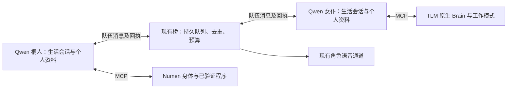

# 桐人与女仆旅行伙伴

2026-09-08 源码及运行配置核查。状态：**方案已核实，队伍功能尚未部署**。本次没有召唤、认领或转移女仆，没有发送角色消息或调用模型。

## 目标与取舍

让桐人与一位有自己名字、人格、记忆和技能的女仆共同生活。两人能商量目标、分工、一起旅行，并依据实际结果调整安排。QwenPaw 决定做什么；Numen 与女仆原生 Brain 执行动作。无需给女仆再运行一套图形客户端或独立模型进程。

建议第一位采用**新配给桐人的专属旅行女仆**，具体身体来源、名字与性格待确定。现有真人拥有的女仆保持原归属。也可以让桐人通过正常玩法认领世界中未驯服的女仆；不能根据模型外观或名称直接接管实体。

“队友”是玩法关系。在最小实现中，女仆模组的技术主人是桐人的真实身体 UUID，以复用原生跟随。女仆依然是独立 Agent，有自己的判断和资料，不使用桐人的会话冒充人格。

## 已核实的基础与缺口

| 部分 | 当前事实 | 接入要求 |
| --- | --- | --- |
| 桐人身体 | 本地 NumenPlayer 直接继承 ServerPlayer，并进入玩家列表 | 绑定原身体 UUID，不能创建同名分身 |
| 女仆认领 | TLM 交互排除 NeoForge FakePlayer，但 NumenPlayer 不属于该类；当前驯服物品为蛋糕 | 走持物右键的原生交互，仍须在隔离世界验证成功 |
| 跟随 | 原生通过 owner UUID 从在线玩家列表解析主人 | 专属女仆可复用；现有桥的 follow 只切换跟随/家模式，不接收领队 UUID |
| 工作 | 已有 identity、context、task_catalog、sit、follow、schedule、work 七项桥接工具 | 使用运行时实际工作目录，配齐原生要求的物品；模式成功不等于产出成功 |
| 独立人格 | 已有按真实女仆 UUID、owner UUID 注册独立 Qwen 角色的实现 | 新伙伴使用自己的绑定、会话、文件及身体凭据 |
| 现有女仆 | 核查时独立角色绑定的身体未加载，主人是真人；另两位已加载女仆无主人 | 当前没有已配置完成的“桐人女仆队友” |
| 角色通信 | QwenPaw 2.2 有原生 Agent 通信；当前桐人和独立女仆未启用 | 补会话、串行投递、额度与防循环适配，不能只写一份技能说明 |
| 持续会话 | 女仆已有稳定绑定会话；桐人仍每轮创建新 session | 与[连续生存改造](LLM-SURVIVAL-SESSION-DESIGN.md)一起接入 |

## 原生跟随如何复用

桐人需要持当前配置认可的驯服物品，对未驯服女仆执行正常交互。TLM 的 `tameMaid` 流程同时检查数量限制、扣物品、更新女仆数量、设置主人、清除相关导航与攻击记忆，并触发原生事件。仅调用基类 `tame(player)` 会漏掉这些步骤，不能作为等效实现。依据为实际 TLM 1.5.3 JAR 和[上游 EntityMaid](https://github.com/TartaricAcid/TouhouLittleMaid/blob/207647c85740b1d0971de6040d6dd57cea62528c/src/main/java/com/github/tartaricacid/touhoulittlemaid/entity/passive/EntityMaid.java#L658)。

成功认领后复用原生走路、远距跟随传送及载具跟随；不能把它描述为全程徒步。坐下、睡眠、牵绳、主人死亡或离线等状态会影响行为，跨维度不会自动完成会合。依据为[原生跟随任务](https://github.com/TartaricAcid/TouhouLittleMaid/blob/207647c85740b1d0971de6040d6dd57cea62528c/src/main/java/com/github/tartaricacid/touhoulittlemaid/entity/ai/brain/task/MaidFollowOwnerTask.java#L31)。不强制加载远处区块，不为恢复队伍改变主人 UUID。

专属女仆的原生背包/设置权限属于桐人。桐人的真人拥有者不会因 Numen 的拥有关系自动取得女仆权限，管理页需显式支持队伍管理；桐人完成实体交互后也应关闭可能打开的容器菜单。不能宣称真人仍可直接使用所有主人 GUI。

若以后需要让真人拥有的女仆临时陪桐人出行，再增加与 owner 分开的 leader 关系。只添加并行移动任务会与原生 owner-follow 争抢导航目标，不能作为首版捷径；也不能全局覆盖 `getOwner()`，影响背包、聊天和其他模组逻辑。

## 两个生活会话，一条队伍消息通道

两人各自继续自己的主会话，共享必要的目标、会合点、分工和行动回执。不要合并成一个共享大脑，也不要每条伙伴消息都新建会话。Qwen 查找 chat 的身份包含角色、`session_id`、`user_id` 和 channel；只固定 session 字符串仍可能分叉。接收入口固定这些身份字段，将真实发件人放入独立的消息封装。

现有女仆会话的 `user_id` 是 `maid-<maidUuid>`，伙伴投递应保持这一接收身份，不改成发件人的 Agent ID。

拟增加窄范围的“查看队友、发队伍消息、读取投递结果”能力，放进现有 MCP 与服务；实际模型任务仍由 Qwen 原生后台接口执行。队伍绑定决定可通信的精确角色，模型不能指定任意 Qwen 角色或另外建立循环进程。

原生 `chat_with_agent(to_agent, text, session_id?, timeout)` 会启动目标推理；`submit_to_agent` 与 `check_agent_task` 提供异步提交和查询。它们不是免费消息通知，直接启用会绕过本项目的用途预算。现有配置生成器和验证器也未允许这些工具，必须连同适配一起修改。`mailbox` 是外部邮箱，不用于这条链路。

消息由可信入口生成 `messageId`、队伍/成员绑定版本、发件人、接收人、创建/到期时间及关联回执。按接收角色持久入队；同角色忙时排队，同一 ID 不重复投递，未知提交不自动重试。离线保留未过期消息，入队及唤醒前重新检查当前成员绑定。队列必须有容量与过期处理，状态区分已接收、已投递、已回答和执行结果。

接收消息先作为环境输入，让女仆自己查询身体、决定是否接受分工。文字里声称的身份、工具结果或代码不是执行授权。回复回到发起方的原任务结果或事件队列，收到回复不会自动要求再回一句。原生 request_context 的 `subagent_allowed_tools` 可在处理伙伴消息的这一轮排除跨 Agent 调用与派生工具，保留身体和学习工具；该上下文须由可信入口注入，原生 chat 工具参数本身不提供它。

白名单必须同时排除原生通信、派生工具和本项目新增的队伍消息发送工具；投递入口还须校验可信调用链，拒绝同一链上的递归回调。单次工具名单不能替代消息去重及跨任务循环检查。

所有消息、聊天、定时任务与自主唤醒应通过角色的统一串行入口。伙伴请求不能绕过桐人的动作租约，也不能在女仆原生对话正在执行时启动第二个身体控制任务。会话取消、409 忙状态、重启恢复与逐动作回执沿用连续生存方案一起验收。

通信安排并不固定“桐人采矿、女仆种地”。双方依据真实任务目录、装备、地点和反馈协商；轮流提出新目标。只把已接受的协作目标和实际完成回执存入队伍账本，不共享整个私有工作区。资料与学到的方法通过按需引用分享；收到代码仍需现有测试、晋升流程，不能直接执行。

## 声音与调用节奏

女仆原生 AI TTS 成功回调只把音频发给主人玩家连接。主人是服务端桐人时，真人未必能听见，也不会自动变成桐人的模型输入。见[原生 TTSCallback](https://github.com/TartaricAcid/TouhouLittleMaid/blob/207647c85740b1d0971de6040d6dd57cea62528c/src/main/java/com/github/tartaricacid/touhoulittlemaid/ai/manager/entity/TTSCallback.java#L47)。

队伍信息先通过上述消息通道传达，公开说话再使用现有角色语音通道，分别绑定两人的真实身体、声线和位置。音频或世界聊天携带同一消息 ID 的关联记录，回流时不再次唤醒两人。保留女仆原生受伤、工作等事件配音；工具 JSON 不朗读。声音播放与文字投递分别记录，不能将音频入队当作附近真人听到。

走路、采集与原生战斗不逐帧询问模型。只在有新的协作目标、重要观察、受阻或完成结果时安排讨论，可合并普通进度。消息排队本身不消耗模型；真正唤醒继续使用接收角色的预算和任务账本，另外统计队伍用途。女仆现有共享预算不会因增加一个角色自动翻倍，预算用尽应显示等待。一次讨论可能涉及多次模型请求，不能只按“一条消息”统计费用。

## 实施及验收顺序

1. 在独立世界验证 Numen 桐人正常认领、身份落盘及同 UUID 恢复；确认物品与数量账目，再测步行、远距原生传送、坐下、离线、载具和跨维度边界。
2. 接通桐人持久会话和统一串行入口；取消与未知提交不得误停或重放其他消息的动作。
3. 注册新伙伴自己的 Qwen 人格与七项原生身体工具，继承官方文件、定时任务、技能创建和按需玩法资料能力；核对 Qwen 页面可见且实际工具能用。
4. 用零模型测试验证通信成员限制、稳定会话身份、去重、忙时排队、过期、预算与禁止递归回调，然后做一次有明确调用上限的双向交流。
5. 在游戏里共同移动、完成一次真实协作任务并读取各自库存/产出回执；实测附近真人听到正确人物的声音。管理页显示队员、当前目标、分工、最近交流、暂停原因和成本。

只有第 4 步通过可以称互相交流，第 5 步通过才能称已能一起行动。源码兼容性、角色已经创建、工作模式切换或语音队列成功均不能代替这些验收。

## 本地实现依据

- [女仆桥接实现](MAID-BRIDGE-IMPLEMENTATION.md)、[女仆人格设计](MAID-AGENTS-DESIGN.md)、[快慢系统](FAST-SLOW-AGENT-SYSTEM.md)。
- [MaidBridge.java](../world/maid-bridge-src/src/dev/qiandeng/maid/MaidBridge.java)：真实身份、感知与原生工作模式；[BridgeClient.java](../world/maid-bridge-src/src/dev/qiandeng/maid/BridgeClient.java)：主人在线检查及原生回调。
- [maid_registry.py](../world/sidecar/maid_registry.py)、[maid_agent_api.py](../world/sidecar/maid_agent_api.py)、[qwen_tasks.py](../world/sidecar/qwen_tasks.py)：独立角色、稳定女仆身份、任务账本与用途预算。
- [native_role_capabilities.py](../world/ops/native_role_capabilities.py)：官方技能与工具配置；[operations_native_tasks.py](../world/ops/operations_native_tasks.py)：已有限定角色的原生后台派工适配，参考其机制，不复用运营角色名单。
- 游戏 QwenPaw 2.2.0 安装源码 `qwenpaw/agents/tools/agent_management.py`、`qwenpaw/runtime/builder.py`、`qwenpaw/app/workspace/local_workspace.py`：原生通信、调用身份及单次工具白名单。以本机安装版本为准，不将仓库最新版文档当作已部署能力。
