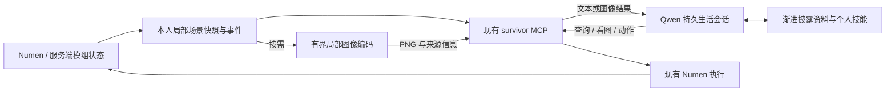

# 服务端 Agent 的轻量感知与图像链路

2026-09-08 调研。用户要求多模态图像输入、FOV110，并明确认为常驻完整客户端太重。本文按最新约束采用服务端优先方案；图像感知尚未部署。本轮没有启动新常驻进程、改动模型/自主预算或移动游戏角色。

## 推荐方案

**Numen 服务端身体与世界数据 → 现有 survivor MCP → Qwen 持久生活会话；模型需要空间图时，再用同一份局部快照生成图片。** 不把 Java 图形客户端作为自主生存的运行前提，不再为每个角色启动 RenderBot 或单独的视觉大脑。

图片是模型可以选择的感知工具。日常采矿、合成、农耕、交易和技能学习继续按需查询实际游戏状态；看布局、比较建筑形状、理解通路时再读局部图。去哪里、做什么、何时看图和怎样调整计划由 Agent 决定，原生执行层负责动作和真实结果。

这是基于现有服务组成和用户资源约束的设计选择，不是声称已有项目为本服提供了现成的全模组相机。

## 三层能力及取舍

| 层级 | 输出与适用场景 | 运行代价与当前选择 |
| --- | --- | --- |
| 服务端语义感知 | 自身、附近实体/方块、空间关系、配方、容器和动作回执 | 复用现有 Numen/MCP，作为主通道；控制返回范围，不把全量世界JSON灌入上下文 |
| 局部空间图 | 方块/高度/可通行信息与实体编号的俯视图、水平切片；可用真实方块ID关联查询 | 在现有容器内按需编码PNG，不需GPU、浏览器或新的MC连接。优先验证这一层是否改善建造/导航任务 |
| FOV110局部透视图 | 从本人眼位与朝向重建视锥内的几何及已适配的纹理 | 后续选项：优先复用现有modern渲染与资源，单个受管理实例按需取帧；成本仍高再评估CPU语义投影。不是完整Minecraft客户端画面 |

俯视/切片是空间地图，**没有相机FOV**，不能把它说成实现了110°第一视角。110°要求保留在第三层，实际设置投影并验证。语义透视图依据观测几何生成，不通过图像生成模型猜画面；能否改善任务必须用真实Qwen实验验证。

完整客户端的原生RGB更适合人物模型、粒子或界面的外观验收，但资源成本与本阶段约束不符，退出默认方案。BlueMap适合世界地图、Prismarine适合可选重建，两者也不会自动继承全部NeoForge客户端效果。

## 找到的可复用证据

| 一手来源 | 验证事实 | 用在本项目的范围 |
| --- | --- | --- |
| [Voyager action.py](https://github.com/MineDojo/Voyager/blob/main/voyager/agents/action.py) | 把环境、背包、装备及执行反馈组织成文本供模型决策 | 支持服务端事实驱动的工具循环；沿用本服Qwen/Numen，不换身体或恢复固定生活路线 |
| [Numen LookAroundTool](https://github.com/Dwinovo/minecraft-numen/blob/947f0064f3374adc0341e61687215ae32ea9765a/core/common/src/main/java/com/dwinovo/numen/core/tools/perception/LookAroundTool.java)与[外接大脑](https://github.com/Dwinovo/minecraft-numen/blob/1.21.1/docs/mcp-server.md) | 空间字符网格、结构化工具和事件出口；外脑控制时内脑让出 | 优先接现有身体与世界事实。原生上游MCP位于主人客户端；本项目已有服务端numen_act适配，不新开它的客户端大脑 |
| [awesome-mineflayer-mcp vision.ts](https://github.com/G0Osey99/awesome-mineflayer-mcp/blob/main/src/tools/vision.ts) | `render_map`从方块数据生成俯视/切片PNG及图例，`get_screenshot`另外使用Prismarine和无头浏览器 | 借鉴轻量图片与截图分开暴露；其surface扫描也有同步CPU成本，不照搬大半径或自由中心。小型项目的功能先例不等于本服稳定性背书 |
| [Prismarine Viewer](https://github.com/PrismarineJS/prismarine-viewer)及[headless.js](https://github.com/PrismarineJS/prismarine-viewer/blob/master/lib/headless.js) | Viewer/WorldView支持从已有world对象生成场景，headless可输出帧；实现仍需WebGL，视频模式另启动FFmpeg | 可复用场景层，按需截单帧；不把headless误解为零渲染依赖，不启动无期限视频循环 |
| [BlueMap 模组支持](https://bluemap.bluecolored.de/wiki/customization/Mods.html) | 能读取模组/资源包中的静态模型；运行时生成的模型仍可能无法解析 | 若以后做世界地图可另评估；不为Agent观察引入全世界预渲染，也不承诺准确还原YSM或动态效果 |
| [MineDojo 观测空间](https://docs.minedojo.org/sections/core_api/obs_space.html)与[MineStudio入口](https://github.com/CraftJarvis/MineStudio/blob/master/minestudio/simulator/entry.py) | 图像、动作和状态可以同时提供；MineStudio默认FOV70、观测缩放为224×224 | 借鉴状态对齐及评测，不启动它们的模拟环境、不照搬分辨率/FOV |

[2026年8月的 Screenshots or Tools? 预印本](https://arxiv.org/html/2608.03327v1)研究了MCP与截图互补、有限图像历史和重复截图成本。它的实验是桌面GUI，不能外推为Minecraft必然更成功或省固定比例费用；对本项目的启发是比较按需图像与强制每步图像，而非默认截图越多越好。

## 现有代码距离目标多远

[survivor MCP](../world/survival/mcp_server.py)目前43项游戏工具，没有图像工具。[NumenGateway.observe](../world/survival/numen_gateway.py)读取look_around文本及实体，截短地形至6000字符；这不是可直接渲染的完整体素快照。服务端局部场景导出仍需新增，不能从缺失几何的摘要里补画不存在的事实。

旧 [guard-render-pure.mts](../world/sidecar/guard/guard-render-pure.mts)已经用块色表和pngjs绘制地图，可以提取纯绘图部分。但它仍每次启动临时Mineflayer并用RCON传送RenderBot；旧 [WebGL版](../world/sidecar/guard/guard-render-webgl.mts)还重复登录、等区块、建网格。复用绘图思路，废弃临时登录/传送和固定旧图文件的运行方式，不恢复这些旧进程。

现代天眼已经有模组注册表与资源映射，默认垂直FOV110，但相机来自Goddess。[eye-service](../world/admin/eye-service.mts)的follow每秒传送观察者；它不是桐人的精确相机，也不能为了Agent看图争抢用户管理镜头。若以后复用Web场景，必须将区块数据源、角色相机和浏览器展示分开；Goddess未加载的区域不能说已被桐人看见。

[ClientQaBridge](../world/client-controls-src/src/dev/qiandeng/controls/ClientQaBridge.java)可截QiandengTest的原生客户端画面，保留用于外观验收，退出服务器Agent运行依赖。

## 局部快照与图像怎样做得轻

建议增设 `observe_scene()`：由当前身体UUID确定维度、眼位和范围，一次取得受限区域的方块状态调色板、局部位置/几何信息、实体和观测时间。优先保留服务端原生ID/属性和未知标记，不按方块名字猜危险程度或强行把模组块替换成石头。能力查询仍按实际模组接口逐步增加。

世界主线程只在预算内复制已加载数据，不能逐像素调用RCON或在主线程进行PNG编码。几何处理与编码放到现有服务内的有界工作队列；异步阶段处理不可变快照，不跨线程直接读Minecraft世界。一次快照可供多种视图复用，不能因截图请求强制加载/生成远处区块。碰撞形状也不等于最终可见模型，视图须注明近似范围。

建议 `render_scene(observation_id, view)` 引用已有快照，`view`先支持map/slice。本人位置、朝向、比例尺、实体编号和图例应固定清晰；按需读图后，Agent用实体/方块ID继续查详情。对应尚未实现的perspective能力，服务就绪前明确返回不可用，不伪装成成功。

第三层透视图优先复用现有modern渲染与资源，缓存区块网格，独立设置桐人相机，按需编码单帧。[Prismarine核心API](https://github.com/PrismarineJS/prismarine-viewer/blob/master/viewer/README.md)同样支持已有world/column和相机输入，重复登录是旧包装脚本的行为。现有 [viewer-stream](../world/src/viewer-stream.mts) 的已加载检查、背压与合并更新也可复用。视点或区块缺失必须报告，不传送Goddess凑图。

如果共享渲染实例仍太重，再比较局部几何的CPU射线投影。[prismarine-world](https://github.com/PrismarineJS/prismarine-world/blob/master/src/worldsync.js)有raycast可参考，但需另外处理颜色、实体和透明/流体视觉遮挡。两条路线都先基准测试，不能凭“CPU/无头”承诺低延迟：大像素乘大视距同样会昂贵。只保留足够表达空间关系的分辨率，避免实现一个新Minecraft渲染引擎。若透视图收益小，先完成连续生存和有价值的技能工具，不让视觉工程阻塞主任务。

视图附 `observationId/frameId、bodyUuid、dimension、position/eyePosition、yaw/pitch、capturedAt、尺寸、source、已加载范围、缺失信息`。地图的观测范围与透视图的遮挡规则分开说明；未观测格不能当空气，未知模型不能当不存在。客户端特有的YSM外观、粒子和GUI不属于这种服务端语义图的保证范围。

FOV沿用现有天眼的**垂直110°**，透视图保持16:9，对应水平约137°；[Three.js官方定义](https://threejs.org/docs/pages/PerspectiveCamera.html)也是垂直FOV。必须根据本人眼位与实际朝向设置投影，验证四方向及俯仰；不能把75°图拉伸成110°。转头由Agent选择并经身体动作入口执行，不让图片工具暗中移动身体。

## Qwen多模态链路已核验到哪一层

桐人当前仍是 `qd-survivor-codingplan / qwen3.6-plus`，通过既有CodingPlan接入。[阿里云官方说明](https://www.alibabacloud.com/help/zh/model-studio/add-vision-skill)确认该模型原生接受图像。未改成额外的视觉角色，也未新增供应商直连。

安装的QwenPaw 2.2.0与AgentScope 2.0.7.post1已经做过真实序列化fixture：**8项通过，0模型调用**。本机证据是 `runtime/qwen-mcp-image-native-fixture.py` 与 `runtime/reports/qwen-mcp-image-native-fixture.json`，运行资料不进入公开Git。

验证内容包括MCP ImageContent转Base64Source、PNG字节与文本保留、工具回执身份、图片提升为后续user消息中的image_url，以及能力字段未知时不剥图。直接Qwen图片内容块也能序列化。关键安装源码为 `qwenpaw/drivers/adapters/agentscope_tool.py:54`、`qwenpaw/agents/model_factory.py:2243`、`qwenpaw/agents/prompt.py:432`；完整路径与哈希在报告中。

因此新增图像工具应按[MCP规范](https://modelcontextprotocol.io/specification/2025-11-25/server/tools#image-content)返回TextContent + ImageContent，不能只有图片路径或JSON里的base64字符串。这个fixture未向供应商提交图片，也没有测试真实游戏取帧、FOV或模型看图效果，不能算视觉上线。

## 会话、用量和管理

图像和状态进入[同一生活主会话](LLM-SURVIVAL-SESSION-DESIGN.md)，延续目标和动作反馈。现有连续会话方案仍未部署；不能用每轮新会话加图片代替它。

观察和绘图本身不调用模型；Agent需要时读取图片，后台只合并事件和保留有界快照。不要每tick或每次图片变化都唤醒模型，水流与粒子会持续变化。读取同一快照不再次采集世界，同一帧不重复注入；是否重新观察由Agent与明确的时效限制共同决定。

长期session只向模型保留近期少量图片，旧图留文件引用、时间和Agent自己的观察笔记，必要时再读。后续通过Qwen扩展点实现图像窗口，保持工具调用与回执配对；当前native压缩并不等于已经实现图像窗口裁剪。

局部绘图归现有survivor/world容器管理，先一个共享有界队列，按身份隔离快照。不新增外部调度脚本，不为每位女仆启动浏览器或Java客户端。若将来确需WebGL，复用现有服务并显式列出受监督的渲染子进程、资源上限和错误状态；不能称它零进程或零GPU依赖。

## 实施与验收顺序

1. 优先完成持久会话、逐动作回执和连续工具行动；日常生存不以图片就绪为前提。
2. 新增有限局部快照，测试身份/维度、未加载数据、超时与主线程负担，再接map/slice图像。复用现有绘图/PNG库，不重写编码器。
3. 做一次真实Qwen图像工具实验；用同一张未知内容的局部图和对应游戏事实验证读图，不只问模型“是否能看图片”。
4. 在相同任务/模型/预算下比较结构化工具、每步图片、Agent按需图片。任务覆盖入口选择、建造缺口、农田布局和基础采集；记录成功率、重复动作、真实请求/token、图片数、CPU/RSS、PNG字节、主线程耗时及观察p50/p95。
5. 只有空间任务暴露需求后，再验证FOV110透视图；CPU投影与现有渲染复用分别测量。画面源、缺失模组外观和基准条件完整记录，不把参数设定说成性能验收。

本轮完成的是路线调查与Qwen图像序列化验证；未部署新增图片工具、取图服务或新的自主循环。
