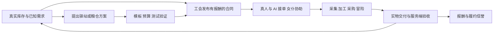
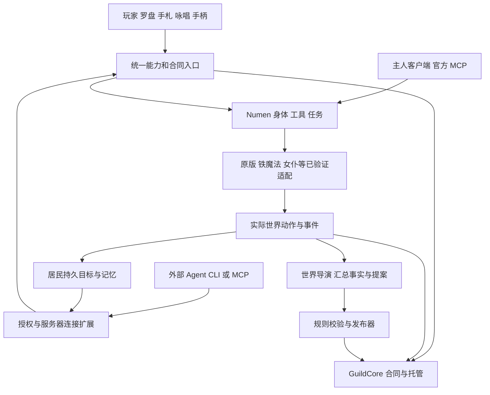

# 千灯纪：AI 共生世界设计

**当前实施顺序已调整（用户 2026-09-07）：AI Agent 相关新功能暂缓，先拆分现有架构与玩家玩法。** 已落地的代码边界、冻结范围和后续顺序见 [代码架构与拆分记录](ARCHITECTURE.md)。本文保留完整社会玩法目标，后面的 AI 优先里程碑不再作为当前一轮的排程。

2026-09-07。结合用户提供的《我的世界：AI 共生与演化服务器》v1.3 项目计划、现有千灯纪代码与运行报告，以及 Numen 上游审查。

**建议定位：以 Numen 为行动基础，让真人、AI 居民和女仆在同一个世界里生活、接单、冒险，再由真实需求推动城镇发展。** 通用的 Agent 模组扩展套件负责接入和操作；千灯纪负责具体的世界、人物与玩法。

本文是设计方案与开发顺序，新增模块、接口、自治行为和验收目标尚未实现。本次不更换运行版本、不安装候选模组、不修改存档，也不启用自动发布。

## 1. 对原计划的六项调整

| 原计划重点 | 结合当前项目后的决定 | 原因 |
|---|---|---|
| 优先“剑与王国”原包，Forge 1.20.1 | 主线继续 Rapid Optimization 基础的 MC 1.21.1 / NeoForge 21.1.248 / Java 21 | 用户首先要求原 shadow 存档、进度和自研功能继续使用；新计划中的底座建议不构成换服或降级旧档的决定 |
| 试验独立 AI 身体与 WorldBridge | 复用锁定版本的 Numen，提纯本地 numen_act；WorldBridge 只补权限、回执与模组适配 | 已有身体、工具和任务基础；避免再开发一套寻路、工具注册和模型循环 |
| P1 先小镇，P2 再工会 | 把“一笔真实委托”提前到第一个可玩里程碑 | 先证明居民生产、真人协作与奖励能够互相连接，再扩建城镇 |
| 大型城建、军队、外交同步进入原型 | 首期做一个公共工作区、两位 AI、两位女仆和一处冒险目的地 | 城建模组、军队与居民身份都需要额外适配，不应一起成为首个闭环的依赖 |
| 货币、成长、任务选用现成模组 | 成长继续使用现有原生系统；工会先实物托管，独立管理合同和信誉 | 当前已有成长和施法读取；现有离线身份模式不适合直接引入计划中的银行方案 |
| AI 自动开发并更新世界 | 先 L0 社会行为和 L1 模板任务，再有限 L2 规则组合，L3 先出提案和测试制品 | 发布新任务与修改运行中的模组代码，所需能力和恢复条件不同 |

“剑与王国”的包版本 1.20.2，在原计划中对应的是 Minecraft 1.20.1 / Forge。它的城建、材料请求、补给和远征设计可作参考；其 JAR、脚本和世界不能直接混入本项目。以后若评估这条路线，使用独立测试世界和安装目录，重新比较结果，不降级 shadow。

## 2. 玩家首先能玩到什么

第一版场景是一座有公共仓库、农田、简易厨房、工会柜台和出发点的小镇。两位独立 AI 分别承担生产协调与冒险采购；两位女仆按实际已支持的工作/战斗行为协助；真人可以加入同一队伍，也可以单独接单。接待员先由确定性的任务板提供，避免为了展示柜台再增加第三个模型常驻角色。

首笔验收合同可固定为“交付 16 个小麦，报酬为发布者预存的 6 个绿宝石”：真人与两个 AI 登记为三个成员，约定各分 2 个；两名女仆作为有主人授权的助手参与采集或搬运。这些数量是测试场景参数，不代表现有库存。女仆的归属和实际工作能力需要先验证，现有音包与外观记录不能证明两名合格助手已经就绪。

第一条完整体验：

1. 仓库登记的可用食物持续不足，扣除在途供货后仍有缺口。
2. 委托人把实际报酬交入工会托管，任务板出现供货单。没有预算时只显示需求，不能宣布有奖任务已发布。
3. 玩家通过柜台、手札或定向语音查看条款，与 AI 组成队伍，登记女仆助手。
4. 队伍采集、加工或采购食物，再把实物交到工会。首个技术切片可使用原版面包和熔炉；农夫乐事厨具适配通过后扩展为餐食链。
5. 工会确认收到的物品和领取身份，按预先约定分成释放托管报酬；供应物品转入公共仓库。队伍与各人界面显示同一份进度。
6. 需求被满足，未接取的重复补货单减少；AI 根据实际库存继续工作。下一次玩家上线，简报说明谁交了什么、改变了哪些库存。
7. 下一条冒险委托连接已经实地核验的遗迹或道路威胁。玩家、AI 和女仆使用现有法术与装备，带回真实战利品。

这条体验的重点是：玩家能看见 AI 的工作结果，也能改变小镇接下来的需求。第一版不以居民聊天次数或装饰建筑数量作为成功标准。



## 3. 现有基础与真实缺口

以下依据已有审查与报告，不表示本次重新进行了游戏实测。

| 能力 | 已有基础 | 接下来补什么 |
|---|---|---|
| 运行与旧档 | D 盘独立项目；Docker Desktop 服务端；原 59 份玩家记录及维度保留 | 新身份、合同、队列与账本纳入一致恢复点 |
| Agent 身体 | 本地修改的 Numen 与 numen_act；已有工具调用入口 | 两个独立身体长期运行、授权租约、离线恢复、按身体筛选可用工具 |
| 技能与传送 | 8 项特色秘术、原生 Iron 入口、27 槽罗盘、安全传送；已有 10/12/8 组对应检查 | 游戏能力统一命名与资源展示；特色招式恢复；真实手柄验收 |
| 成长 | 原版等级、Iron 属性、Pufferfish 成长读取 | 统一展示来源；新奖励只写一个选定的原生系统，旧奖励单独迁移 |
| 外观和配音 | 鸣人、桐人 YSM 实际显示记录；18 个女仆语音包 | 角色 UUID 与外观/声线配置统一；新增动作动画单独验证 |
| 工会 | 今日任务板、部分讨伐/远行判定、双人组队与旧进度 | 稳定合同 ID、持久队伍/助手、真实托管、分批交付、重启后对账 |
| NPC 与商店 | 35 份历史角色档案和既有消费链代码 | 退役实体类型、旧坐标和同名身份迁移；柜台实际交易 |
| 世界探索 | 已有群系/生物扩展及 457 项结构定义（含变体） | 自然生成地点实查、可达性、敌人/战利品与任务衔接 |
| 语音 | Simple Voice Chat、ASR/TTS 与既有桥接；部分链路已有记录 | 多角色定向会话、播放仲裁、打断、物理麦克风与实际听感 |
| 世界自治 | 旧事件、角色资料和后台服务 | 有预算的持续目标调度与基于事实的内容生成；现有自动重召/造景等开关不能直接视为完成 |

证据入口：[技能里程碑](../reports/skill-compass-milestone.json)、[世界内容状态](WORLD-CONTENT-STATUS.md)、[技能使用](SKILLS-UNIFIED-CLI.md)、[Numen 审查](NUMEN-UPSTREAM-REVIEW.md)。

## 4. 分发形态与模块边界

建议提供两个发行组合：

- **通用 Numen 扩展套件**：兼容版本的 Numen、专用服连接扩展、CLI/MCP 连接程序、能力适配和操作说明。普通模组服可以选装所需功能。
- **千灯纪世界包**：在通用套件上加入工会、人物、罗盘/咏唱、世界规则、模型与配音清单，以及现有优化整合包和部署配置。

模块名称暂定，先按职责拆代码，不要求每个模块单独发一个 JAR 或启动一个服务。

| 模块 | 负责 | 可复用位置 / 边界 |
|---|---|---|
| Numen | 身体、基础动作、感知、工具、任务；可选内置大脑 | 保留上游依赖和本地必要补丁；不将上游作为本项目原创 |
| 服务器连接扩展 | 无主人客户端的接入、UUID 授权、控制代次、请求与回执 | 提纯本地 numen_act；当前管理员 RCON 留在本机受控连接程序内 |
| 模组适配 | 铁魔法、成长、传送，以及以后厨具、殖民地或小队接口 | 扩展 Numen 工具契约，未验证的客户端专用动作明确不支持 |
| GuildCore | 合同、队伍、托管、实物证据和履约信誉 | 新增服务端结算能力；旧工会入口逐步改成它的调用方 |
| 居民运行器 | 持久目标、时间安排、工作承诺、事件唤醒、成本预算 | 复用现有后台与 Numen 的执行/记忆能力，只补持续生活部分 |
| 玩家与角色界面 | 手札、罗盘、快捷键、咏唱、字幕、人物表现 | 扩展现有 controls、Iron 桥、语音桥；客户端模块不装入专用服 |
| 世界导演与发布器 | 从汇总事实提出内容，验证模板、预算、版本和效果 | 导演不参与实物发奖；初期作为后台职责，不急于增加微服务 |



官方 NumenActuator 在主人游戏客户端内运行。它的 headless 调用绕过内置模型，仍依赖客户端进程；本地 numen_act 才是当前专用服补充。两条路径都应调用已有工具实现，分别记录支持范围，不能把 MCP 连通当作无人客户端常驻成功。[Numen 固定提交源码](https://github.com/Dwinovo/minecraft-numen/blob/947f0064f3374adc0341e61687215ae32ea9765a/api/common/src/client/java/com/dwinovo/numen/api/NumenActuator.java)

角色状态、工具调用与推理应解耦：MC 主线程只执行必须接触世界的有限工作，LLM、语音、数据库等待与大范围计算在外部或后台完成。Docker 是部署选择；通用套件应同时支持兼容的普通 JVM 服务端，不把 Docker 文件路径写进玩法协议。

## 5. 稳定身份与一个身体的控制权

统一角色登记至少包含 `world_id`、`actor_id`、`body_uuid`、`body_provider`、归属者与当前控制代次。角色名字只用于显示，不能作为跨角色授权依据。

| 对象 | 执行与控制方式 | 身份和结算 |
|---|---|---|
| 真人 | 本人操作，或明确授权的辅助功能 | 原玩家 UUID；本人决定接受合同 |
| 独立 AI | Numen 身体，外接或内置大脑择一控制 | 持久 actor_id 绑定身体；重启不创建新的领奖身份 |
| 女仆 | 原生工作/战斗行为，适配器提供高层指令 | 女仆 UUID 与主人/队伍助手身份；不会自动获得额外一份奖励 |
| 普通村民/工人 | 原模组规则 AI 执行 | 仅在需要合同或归属交互时登记，不为每个实体常驻一个 LLM |
| 世界导演 | 无需玩家身体，只读汇总事实与提交提案 | 独立工具权限，没有玩家背包或任意发奖入口 |

服务器按角色发放有期限的控制租约；会话带 `lease_epoch`。即使请求已排队，执行前也重新检查当前代次。交接时先停止接收旧控制者的新动作，并确认旧任务已结束或取消已完成，再接受新控制者；仅发送取消请求不算完成交接。无法确认旧任务状态时保持冻结并对账；紧急停止优先。Numen 现有单任务门控可复用，但它不能替代跨会话身份授权。

居民持久状态保存当前目标、承诺、下一次唤醒条件、地点、失败次数与记忆来源。重启后先核对身体、库存和未完成动作，再规划。事件有时间、可见范围和来源；聊天里的“我交完了”不成为库存事实。

旧 NPC 迁移一次处理一个角色：在停止的独立快照中核对 UUID、物品、交易和角色来源，建立显式映射。历史 23,526 条带角色 tag 的实体记录不能直接解释为唯一活跃人口，也不能按同名批量删除或重召。第一个新合同板可独立运行，不必等待全部 35 份历史档案迁完；旧合同继续按版本保留，不在新旧系统重复发奖。

## 6. Agent、玩家和女仆共享什么接口

动作名称使用少量稳定领域：角色与观察、背包与交互、法术、传送、合同与队伍、长任务。基础能力从 Numen 工具/schema 导出，适配器补充身体类型、权限、资源和版本要求；不同身体不假装拥有相同技能。

新协议请求草案：

```json
{
  "protocol_version": 1,
  "request_id": "client-generated-unique-id",
  "actor_id": "server-bound-role-id",
  "lease_epoch": 3,
  "action": "guild.deliver",
  "contract_id": "contract-uuid",
  "expected_revision": 4,
  "args": {"handoff_id": "server-created-transfer-id"}
}
```

这是拟议结构，尚未新增该命令。授权身份从连接会话取得；请求里的 actor_id 不能扩大权限。`handoff_id` 必须来自服务端登记的实物交接，客户端不能自行声称数量。任务状态区分 accepted、running、succeeded、failed、cancel_requested、cancelled 和 outcome_unknown；开始施法不等于命中，提出取消也不等于已经停止。

新 CLI 在现有 `tools/skill_cli.py` 和 `tools/run_numen_mcp.py` 上逐步收敛，先保留已用命令及兼容入口。以后才提供统一的 `mcagent` 发行命令；前一份设计中的示例不能作为现在的使用说明。

每次执行返回可核验的结果和后续查询方式。重复 request_id 返回原回执；超时或重启遇到未知结果时先对账，不自动再次扣料、施法或发奖。持久事件订阅支持游标与保留期限；游标过期要求重新观察，不补造已丢失的事件。

## 7. GuildCore：首期最值得开发的自研模块

现有任务板可保留展示和中文入口，但需要一个独立的合同与结算内核。Numen 的动作任务负责“角色正在干什么”；工会合同负责“谁承诺交什么、谁验收、谁出报酬”。两者分别保存 ID，通过证据引用衔接。

当前 `mc_npc.py` 的交付主要是 `clear` 收走物品后 `give` 奖励，并非供应物资进入仓库、报酬从委托人托管中支付；`mc-worlddb.ts` 的既有 ledger 是供奉记录，也不能直接视为交易托管。旧 `mc_guild.py` 组队仅支持双人，邀请保存在内存中。这三处必须扩展，不能仅给已有接口换名后宣称共同合同已完成。

一份合同至少保存：稳定 ID、版本、需求来源、发布者、地点、物品组件/标签匹配规则、数量、截止条件、领取者/队伍、助手、分成、实际托管报酬、已交付量、已消费证据及结算状态。

合同状态从草案、已发布、执行中、验收中到已结算；过期、撤销与部分完成按接单时锁定的条款处理。需求变化只直接调整未接取数量，不能单方面改变已接单承诺。

首个切片只实现实物供货。之后依次扩展：烹饪供货、指定区域清剿、护送和建设。普通供货允许采购；要求“亲自烹饪”时才检查可验证的加工事件。清剿必须核对真实击杀、对象、区域、时间及参与者，不能把模型叙述视为完成。

### 托管与恢复的最低实现要求

1. 发布前从发布者真实物品中接收报酬，形成服务端管理的托管记录；数量不足拒绝发布。
2. 领取使用合同 revision 和原子状态更新；混合队伍的成员、份额及助手在条款范围内登记。
3. 通过受控交付操作转移物品，记录来源、目标、物品组件和数量。普通箱子的数量变化本身无法证明是谁交付，不据此直接发奖。
4. 服务端结算日志保存动作 ID、交接阶段和证据；后台任务板/SQLite 展示数据是投影，不独立再结算一次。
5. 物品动作与账本可能跨越不同保存边界，不能假设两次写入原子成功。建立写前记录、受控交接与启动对账；无法确定结果的记录冻结并显示待核实，不盲目退还或重发。
6. 故障测试覆盖物品转移前后、托管写入前后、回执丢失和重复请求。只有能证明原物品与新物品去向时才自动补偿；已经被后续消费的交付不能直接撤销。

首期保留现有 SQLite 基础，不因原计划的技术候选立即迁 PostgreSQL；也不把 JSON 多文件写入当作交易。新的结算权威位于服务端管理的持久内核，具体日志格式与受控物品交接协议在实现时一起验证。数据库选型不能代替对 Minecraft 保存边界的处理。

经济第一版使用有限实物报酬，例如委托人实际存入的绿宝石或物资。旧功勋和历史余额保留，不与新托管静默兑换。若以后引入货币模组，只保留一个余额权威，GuildCore 记录结算引用和分成。

当前服沿用离线模式；Lightman’s Currency 官方明确不支持 `online_mode=false`，因此本设计将它从首期依赖中移出，而不是通过更改旧玩家身份硬接入。[作者说明](https://www.curseforge.com/minecraft/mc-mods/lightmans-currency)

### 魔法生产与反复刷单

现有造物术以秘术魔力换取白名单物资，它会影响农场和商店的价值。设计应把它作为明确的魔法生产来源，而不把产物说成自然采集。首期保留现有技能规则，普通供货可接受合规物品；劳动认证类任务另用服务端工作事件证明。

不依赖“追踪任意物品的完整历史”这种尚未实现的能力。通过有限托管预算、任务冷却、来源需求去重、扣除在途供货、限制搬空仓库制造新需求，以及公开的造物成本控制套利。粮仓补贴的循环流转检查属于后续 L2 的专门验收。

## 8. 技能、等级、咏唱和手柄

游戏能力保留三类：原生法术、千灯纪特色能力、生活/工会动作。玩家菜单、语音和 Agent 都只选择能力 ID 与参数，由同一个实际实现检查装备、法力、材料、目标与冷却。

| 范围 | 设计决定 |
|---|---|
| 普通攻击、治疗、增益 | 优先 Iron 原生法术；旧重复技能继续归档，目录不能直接解锁未拥有的法术 |
| 螺旋丸、影分身、星爆气流斩 | 作为少量角色特色扩展逐项实现；效果合适才采用原生别名。螺旋丸主动施放目前仍待修复，不能把音爆改名当作完成 |
| 传送阵 | 保留稳定地点 ID、私人/公共范围、安全落点与统一冷却；新增视觉阵法作为表现层。护送合同明确哪些传送符合条款，不暗中禁止所有传送 |
| 等级和属性 | 生命与装备读 MC，法力/法术读 Iron，技能树成长读 Pufferfish；工会信誉只表示履约信用，不再叠加一套战斗等级 |
| 旧进度 | 保留旧已学、永久奖励及秘术资源；后续若合并资源，提供一次性迁移记录与结果预览，避免永久加成重复入账 |
| 鸣人/桐人 | 角色 UUID 绑定已验收的 YSM 模型；外观不自动授予招式，新增技能动画与表现单独验收 |
| 女仆配音 | 保留现有音包；固定语音事件和动态 TTS 由同一播放仲裁安排，声线与身体关联 |

界面继续使用指南针右键和 F6。先保留现有三行菜单，把图标、冷却、无法使用原因和当前焦点显示清楚；再增设可选的八向快捷轮盘，复用已有八槽技能配置。手柄使用可重绑定的“打开、选择、确认、取消”，不把聊天输入框作为必经步骤；返回键优先取消菜单或蓄力，长按不重复发起技能。具体键位按用户设备与 Controlify 冲突检测决定。

技能图标优先使用法术本身或对应物品的图标，显示中文名、资源来源、冷却和目标。生活/工会界面另作手札页，避免战斗菜单塞满经营按钮。手柄硬件的焦点移动、打开关闭、蓄力取消和语音按键需要实测，当前客户端画面验证不能代替这些检查。

当前可用的原生闪电仍通过 `/mycli cast irons_spellbooks:chain_lightning` 等原生 ID 释放，并要求实际装备/卷轴。原生 Iron 法力与旧秘术魔力当前仍分别使用，统一入口不等于已经合并两套资源。详见 [现有命令](SKILLS-UNIFIED-CLI.md)。

## 9. 语音要能办事，并能及时退出

语音流程为：按键并选定对象 → ASR → 带身份和会话的意图 → 同一技能/合同接口 → 实际回执 → 字幕与 TTS。角色说“接取成功”必须发生在合同服务确认之后；多人同时讲话按玩家和会话分别排队。

Simple Voice Chat 提供实体位置音频和指定玩家的私有音频通道，因此角色回应与随身系统可分别呈现；中文理解、会话目标、任务执行和声线调度继续由桥接实现。[官方 API 示例](https://modrepo.de/minecraft/voicechat/api/examples)

咏唱采用可配置词典映射到已发现的技能，低置信或目标有歧义时展示候选。普通聊天不自动施法；玩家按住咏唱键并说出已知技能后可直接执行，降低手柄操作负担。任务接取先展示条款，用明确的语音或确认键接受。

提供字幕、静音、打断和超时文字回退。新会话作废旧播放代次，取消后迟到的模型回复不能继续执行动作。女仆内置聊天与自研桥接按会话选择一个应答方，避免同一段话回复两次。

原计划的两路语音 p50 ≤ 2.5 秒、p95 ≤ 5 秒和打断 ≤ 0.5 秒保留为目标；现有中文 TTS→ASR、客户端连接记录不代表物理麦克风和完整多人对话已达到该目标。

## 10. 城镇、群系、探索和军队的加入顺序

先把地点变成可用服务。每处地点登记 ID、维度、归属、入口、可达路径、工作点、床、容器及服务条件。只有真实能睡、能交付、能取餐，才显示为旅店/厨房/工会；生成一座建筑不会自动形成经营行为。

| 阶段 | 内容取舍 | 进入下一阶段的证据 |
|---|---|---|
| 已有世界起点 | 使用安全公共区与原有 Towns and Towers、WDA 等结构；核验一个地点作为任务目标 | 角色能到达，目标/奖励确实存在，镇区和野外规则明确 |
| 生活生产链 | 原版作物/合成先验证工会，再在独立副本试验农夫乐事厨具 | Agent 能实际加工、搬运、交付；不是仅能查到物品 ID |
| 规则居民主干 | 首期用少量现有可工作的实体；之后单独评估一种城建/生产体系 | 工人需求、物流、所有权、食品与任务对接通过 |
| 丰富地形 | Terralith、Tectonic、Nullscape 等旧资产先在独立测试世界核验 | 固定版本、生成耗时、结构分布和存档边界通过，再制定新区域或独立探索空间方案 |
| 城建扩展 | 基于实际材料需求建设驿站、粮仓或学院；使用验证过的蓝图 | 材料消耗、施工权限、路径和服务能力确实生效 |
| 军队与阵营 | 原计划的百年战争作为后续候选；先小队护送，再有限战役 | 跟随/驻守/集结/撤退、归属、补给、停战与友伤通过 |

MineColonies 的请求系统已有“需要材料→仓库/其他职业供货”的机制，可在后续作为工会需求适配来源；如果选用，就复用其物流与工人行为，不再为每个工人写一套 LLM 生产脚本。[官方请求系统](https://minecolonies.com/wiki/systems/request/)

MineColonies、MCA、百年战争工人、Living Villages 等在本设计中是不同方向的候选，不同时作为主干引入。特别是原计划中的 Recruits/Workers/Living Villages Forge 路线，不能按文档列名直接加入 NeoForge 当前包。首期不依赖它们来证明工会价值。

女仆、Iron 和万法皆通组合已在当前整合包安装，原计划对这三项的“候选”表述需要更新；具体女仆作战与工会助手行为仍另行验收。农夫乐事目前未安装，后续加入时需要复核现有因缺少其附魔而制作的掉落修复。农事还要检查 `mobGriefing=false` 和镇区保护的实际影响，不通过全局放开破坏规则解决单个工作兼容问题。

shadow 已探索区块和玩家建筑保持原样，任何地形包的中途加入都需要专门评估。新地形也不能只用“只生成新区域”一句话承诺无缝兼容；实际地形接缝、群系引用、种子与注册内容均需检查。当前 457 项结构定义不是 457 个已找到并测试的冒险点。[已有世界审查](WORLD-CONTENT-STATUS.md)

未来阵营应从一座城镇、一条商路和一个边境威胁开始。一个指挥官 Agent 决策，士兵沿用模组规则；战役有目标、范围、截止/停战和修复阶段。外交敌对不自动授予破坏私人领地的权限。远区抽象模拟如以后采用，要明确为模拟规则，不能与已加载实体同时产出两份库存或奖励。

## 11. 世界演化分四层交付

| 层级 | 允许发生的变化 | 设计范围 |
|---|---|---|
| L0 社会行为 | 交易、分工、承诺、关系和路线变化 | 居民使用已有工具；记忆引用实际事件 |
| L1 动态内容 | 补货、清剿等已验证模板生成新任务 | 程序检查需求、可达性、能力、库存、预算与去重，AI 生成叙事 |
| L2 规则组合 | 有限救济、押金、阶段补贴等机制 | 有版本的事件—条件—效果白名单；限制次数、地区、对象、有效期和总预算 |
| L3 引擎更新 | 新法术、实体、机器、维度或新 Java 逻辑 | 独立开发、构建和测试制品；按发布类别与恢复能力另行安排上线 |

首次“世界进化”选择公共粮仓：真实缺粮持续出现 → 导演提出有限救济方案 → 校验已有物品和基金 → 隔离测试重复领取、回流、断线和预算耗尽 → 在一个公共地点/周期内启用 → 观察缺粮时间和净供给变化。

L2 使用受限数据规则，不能包含任意 JavaScript、KubeJS、shell 或 RCON 字符串。新增原语经过代码审查与游戏测试后才进入能力清单。规则包保存来源事件、目标指标、制品版本、区域、预算、期限、退出条件与验证证据。

世界导演、开发者和运维可以复用同一个模型服务，但工具和凭据分开。居民能读到玩家聊天或书本，不因此获得部署权限。当前设计不自动新增管理员权限；L3 首期交付提案和测试产物。

停用新规则只停止后续触发，已承诺合同按条款继续履约或处理退出。代码回滚不能自动撤回玩家已经消费的奖励；可补偿的动作按证据补偿，严重问题恢复完整一致快照，并明确回档范围。

## 12. 持续运行与性能预算

使用现有 Docker Desktop/Windows 环境继续验证；计划中的 Linux 主机和显卡分工是以后部署候选，不为设计更换现有主机。JVM 内存、模型选择和并发按当前模组包测量，不直接照搬计划中的示例配置。

居民采用三种执行密度：

- **活跃居民**：身体处于预算内的加载区，执行短任务；有新事件或目标到期才申请规划。
- **等待居民**：任务受阻或模型不可用，保留状态，执行已验证的安全等待/停止；逐步延长重试间隔。
- **休眠居民**：保存目标与记忆，释放不必要区块和模型调用；没有实际执行就不登记采矿、交货或战果。

固定角色数量不等于固定模型实例数。普通士兵/工人使用规则 AI；危险处理、移动和战斗不逐 tick 调用大模型。空闲不持续轮询全世界，读取有界观察和增量事件。队列对身体、区块加载、寻路和推理各有限额；超预算时先降低非必要规划和生成任务。

验收先比较 0、1、2 个活跃 AI，再按结果扩展到 4、8 个，固定视距、区块和实体场景。报告 TPS、MSPT 分位数、CPU/内存、加载区块、任务成功率、人工干预次数、模型 tokens/调用和有效合同成本。不能只看 GPU 使用率或空服 TPS。

备份前停止新写任务、处理在途结算，再按支持方式一致冻结/停服保存世界、业务账本、身份、租约、请求回执、配置与制品清单。相同 snapshot_id 必须对应真正一致的恢复点。恢复后废止旧会话、递增控制代次，再核对未完成动作。事件日志用来诊断，不承诺逐 tick 完美重放 MC 世界。

## 13. 按结果推进的开发顺序

原计划的 16–22 周、160–245 人日是从当时起点估算的完整范围；当前已有部分基础，也有新增迁移约束。本设计先按里程碑验收，不把已完成部件重做一遍，也不承诺按原日历交付。

| 里程碑 | 具体交付 | 退出条件 |
|---|---|---|
| M0 稳定身体与身份 | 锁定 Numen、本地补丁和工具能力；两个身体、控制租约、断线恢复；单个 NPC 身份迁移试验 | 真人客户端全部退出后，两个授权身体仍能执行已验证动作；不会串角色或重建领奖身份 |
| M1 第一笔共同委托 | 服务端合同、实物托管、简单板、混合队伍和助手、交付与回执 | 真人单独、AI 单独和混合队伍均完成同一类供货；重复/并发/重启不会重复发奖；未知结果可见并冻结 |
| M2 小镇生活与冒险 | 两 AI＋两女仆；农田/厨房/仓库/工会与一个实查冒险点；有限事件唤醒 | 食物缺口能产生单据并被实际行动消除；完成供货和一次原生魔法冒险；无人客户端运行恢复通过 |
| M3 统一体验与通用发行 | 在前几阶段同步复用罗盘/CLI；补定向语音、字幕打断、手柄、通用套件安装说明 | 同一合同/技能在玩家入口和 Agent 中状态一致；另一份干净同版本测试服不带千灯存档也可接入 |
| M4 世界演化 | L1 自动模板任务；一个有限 L2 粮仓方案；实际缺口驱动功能设施扩建 | 模板校验、预算耗尽、循环流转、停用及恢复通过；变化有实际收益证据 |
| M5 长稳与扩展 | 固定场景多人/多 AI；再选择居民主干、军队与有限战役 | 负载、费用、物品对账、语音和恢复通过后才扩大人数/战争范围 |

M3 的基础 CLI、罗盘与语音代码可随 M0–M2 持续接入，不等到整座小镇完成才开始使用。军队和大型地形的选型不阻塞第一笔工会交易。

第一个开发切片应集中在以下可评审结果：

1. 角色 UUID 与控制租约；列出两个身体真实可调用的工具。
2. 稳定合同 ID、领取版本、队伍/助手、报酬托管和分批交付模型。
3. 服务端真实物品交接及故障恢复日志；旧 `公会 看板` 接入新合同展示。
4. 用原版食物跑真人、AI、混合三种交付；女仆先作为已有技能可完成的助手。
5. 在独立副本完成重试、并发领取、断线、死亡与重启检查，再接入 D 盘旧档并验证原有技能、传送和进度。

实现时优先复用的代码入口：

| 文件 | 用途与改动边界 |
|---|---|
| [mc_guild.py](../world/sidecar/mc_guild.py) | 保留中文看板与查询；新的领取/组队走持久合同服务，不继续依赖内存邀请 |
| [mc_npc.py](../world/sidecar/mc_npc.py) | 识别旧收货发奖链；新合同单独接真实交付，避免新旧两次结算 |
| [mc-transmigrator.ts](../world/src/mc-transmigrator.ts) | 为原名字索引建立显式身份迁移，不按同名自动合并 |
| [mc-worlddb.ts](../world/src/mc-worlddb.ts) | 复用数据库设施和旧记录；新增合同投影，区分历史供奉账与新托管权威 |
| [skill-cli-queue.ts](../world/src/skill-cli-queue.ts) | 借用请求 ID、回执与未知结果处理思路，不把施法回执直接用作交易证明 |
| [mic_asr_watcher.py](../world/sidecar/mic_asr_watcher.py) | 在现有语音输入上补目标 UUID、会话代次和播放仲裁 |

验收需包括背包满、错误物品组件、权限不足、资金不足和助手未授权；完整小镇切片还要记录各参与者的实际工作，不把跟随和聊天单独算作生产贡献。

### 保留原计划的验收目标，并标清状态

| 场景 | 目标 | 目前状态 |
|---|---|---|
| 首轮社会闭环 | 2 个 AI、2 位女仆、2–5 位真人；任务实物守恒 | 拟议目标，尚未完成共同委托实测 |
| 单据竞争与重试 | 20 次并发领取按合同容量只有合法赢家；重复交付/重启不重复结算 | 需要新 GuildCore 验证 |
| 生活链 | 5 次食物供货至少 4 次成功，失败可说明并恢复 | 待适配、待实际运行 |
| 长稳 | 初期连续 6 小时；封测 72 小时 | 原计划目标，不是当前服已达成记录 |
| 扩容 | 固定场景 8 个活跃 AI、5–10 位真人，TPS ≥ 19，p95 MSPT < 45ms | 待压测；居民/区块/兵员基线需同时记录 |
| 语音 | 20 句中文指令至少 18 句正确识别意图和目标；两路对话延迟与打断达标 | 有局部链路基础，完整人与设备场景待验收 |
| 恢复 | 封测 RPO ≤ 30 分钟、RTO ≤ 30 分钟 | 需要一致快照恢复演练，现有备份文件本身不代表达标 |

## 14. 与原计划的对应关系和依据

| 原计划章节 | 本设计对应 |
|---|---|
| 01–03 愿景与首发体验 | 第 1–2 节：保留世界连续性，以真实生产与协作形成体验 |
| 04–06 技术、运行与外部 Agent | 第 4–6、12 节：补入 Numen 的实际复用边界与服务端路径 |
| 07 随身系统、工会、语音 | 第 7–9 节：合同内核前置，统一操作与事实来源 |
| 08 模组、生活、城建、战争 | 第 3、8、10 节：区分已部署、待适配和另一版本候选 |
| 09–11 世界演化与管理员 | 第 11 节：L0/L1 优先，L2 受限组合，L3 隔离制品 |
| 12–15 数据、成本、计划、验收 | 第 12–13 节：一致恢复、按结果推进，保留目标而不当作实测 |

原始文件：[《我的世界：AI 共生与演化服务器》项目计划 v1.3](<C:/Program Files/Netease/GameViewer/Download/我的世界_AI共生与演化服务器_项目计划-2.docx>)。实际文件位于 Download 目录下，名称中包含下划线；用户消息中的目录分隔已自动定位修正。

读取覆盖正文、32 个表格、3 张内嵌示意图和 71 个外部引用地址；全文结构抽取并逐一查看示意图。本次未进行逐页排版渲染，因此按章节引用，不提供页码。原文件 SHA256：`a546c3768a48d17a64ce9f0bca7a2ba7a138b3f86ef4852671cf9696c87ed4fc`。原计划中的候选模组版本和作者包内容属于其调研结果，本次未重新下载、启动或逐项复核全部候选。

本项目关联设计：[Numen 扩展套件](AGENT-MODKIT-DESIGN.md)、[Numen 上游审查](NUMEN-UPSTREAM-REVIEW.md)、[世界内容状态](WORLD-CONTENT-STATUS.md)、[当前技能入口](SKILLS-UNIFIED-CLI.md)。本文件更新整体社会玩法和实施顺序，前述文件继续负责各自的技术边界与实际使用说明。
