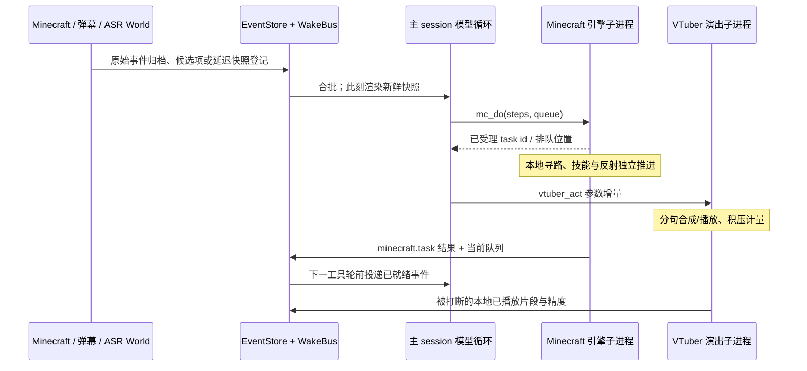

# Cortico 源码研究：持续游玩、事件调度与直播输出

日期：2026-09-24。研究对象是固定提交的源代码，研究目标是改善千灯纪桐人的持续游玩与直播效果。本报告不把上游 README、已有测试文件或我们的纯逻辑测试当成上游实机直播验收。

## 1. 版本、范围与结论

| 对象 | 固定版本 | 许可与本地副本 |
|---|---|---|
| Pal-AI-Lab/Cortico | `fb710ef01755a170186a8c940a0c9fd19015de0f`，提交时间 2026-09-23 19:12:59 -05:00 | [MIT](https://github.com/Pal-AI-Lab/Cortico/blob/fb710ef01755a170186a8c940a0c9fd19015de0f/LICENSE)；`runtime/research-20260924/Cortico` |
| 官方独立 VTuber 扩展 | `b9ac3da6a3aacf18f8572e5c043734f7b20bfe9a` | [AGPL-3.0](https://github.com/Pal-AI-Lab/cortico-world-vtuber/blob/b9ac3da6a3aacf18f8572e5c043734f7b20bfe9a/LICENSE)；`runtime/research-20260924/cortico-world-vtuber` |

标记口径：**源码**表示沿调用链核对；**实测**表示本次实际运行并保存结果；**推断/建议**表示尚未接到本项目实服验证。两个仓库只克隆与阅读；只执行了已审阅的 `WakeBus`、`RoundOnceGate` 纯逻辑，经自写 harness 去除日志依赖、注入假时钟。没有安装上游依赖、启动上游入口、调用模型、连接游戏或播放音频。

最值得移植的三点：

1. **新鲜状态在投递时形成，动作结果主动进入事件流。** 不让角色靠反复读取全状态来猜任务是否结束。Cortico 的分段快照、库存增量、当前队列与终态合并投递，直接对应本项目这次“旧计划在前、状态重复 21 次”的已知问题。[快照实现][snapshot]、[任务结果入口][task-report]
2. **身体执行、普通推理、演出分别推进，并且各有真实水位。** Minecraft 在独立子进程执行技能；直播工具参数流可以提前进入 TTS；输出积压过高会拒收新演出，而不是一直把新台词塞进队列。[Minecraft 代理][mc-proxy]、[流式演出][speech-stream]、[音频积压闸][speech-gate]
3. **它不是现成的 Jev/VLM Minecraft 快脑，更不是我们原生回执的替代品。** 当前 Minecraft 是 Mineflayer 技能/寻路/战斗反射，默认原版 1.20.6。主仓所见 VLM 是 QQ 辅助视觉；Minecraft 的 viewer 是给观众的画面。MC RPC 超时不取消已经交给子进程的动作，普通聊天的返回也没有服务器精确送达确认。[MC 配置][mc-config]、[QQ VLM][qq-vlm]、[RPC 超时][mc-rpc]、[聊天执行][mc-chat]

## 2. 完整调用链：事件如何变成一次行动



### 2.1 事件有统一信封，但不是全链路强类型业务协议

**源码：** `EventEnvelope` 统一 `cursor/run/type/ts/source/origin/tags/contextDelivery/text/senderKey/meta/blobs`。`type` 是 `string`，`meta` 是 `Record<string, unknown>`，World 自己拥有正文与业务语义；这不是每种业务 payload 都被判别联合类型完整约束的协议。`meta` 不渲染进模型正文，因而复杂身份绑定可以留在内部。[事件类型定义][events]

`Core.pushEvent` 先写 EventStore，再进总线；隐藏 World 仍可归档。`pushCandidate` 把原始事件保存为 `archive-only`，投递时 projector 决定哪些候选进入模型，并在新事件 `sourceCursors` 中保留来源；`pushDeferred` 只登记函数，实际投递时调用。后者本身不持久化、不跨重启重放。[Core 接入][core-push]、[投递投影][delivery]

**恢复边界：** 重启补投依据 `lastDeliveredCursor` 与投影来源游标；未曾投影的原始外部事件可以按原文补投。但超过 `MAX_REQUEUE` 时仅保留最近部分，更早事件推进水位并记录警告。不能把该机制描述成“永不丢弃、所有事件恰好一次消费”。它也不保证游戏物理效果恰好一次。[恢复实现][recovery]

### 2.2 批处理、优先级和背压的实际语义

| 模式 | 源码行为 | 本项目可借鉴处 |
|---|---|---|
| `debounce` | 外部事件默认；安静窗、最小年龄、最大年龄、数量阈值合批 | 多条普通聊天合成一次感知 |
| `flush` | 立即使整批可投递 | 动作终态与危险状态无需等普通合批 |
| `preempt` | 在允许投递时请求取消尚未外化的模型轮 | 紧急新事实可使尚未产生效果的旧决策失效 |
| `piggyback` | 入队但不启动计时、不独立唤醒 | 环境快照搭载下一次真正事件 |

默认 quiet gap 为 2500 ms，最大 batch age 为 15000 ms，数量阈值 100；计时公式是 `min(first+maxAge, max(first+minAge, last+quietGap))`。人工暂停优先于全部模式；DeliveryGate 的关键词/溢出许可放行整批。[触发类型][triggers]、[总线][bus]、[默认配置](https://github.com/Pal-AI-Lab/Cortico/blob/fb710ef01755a170186a8c940a0c9fd19015de0f/src/core/config.ts#L192)

**实测：** 数量阈值设为 2、消费者忙而不取队列，连续 push 200 件，`pending()` 仍为 200。`maxBatchSize` 是投递门槛，**不是容量上限或丢弃策略**。因此移植时仍需本项目自己的持久队列容量、到期规则和危险/终态不可丢策略。

### 2.3 主模型不是每个游戏 tick 调一次

**源码：** CortiV 默认主循环 soft 6 / hard 12 个工具轮。普通工具串行执行；存在 output tap 时，完整工具调用在流中闭合后可提前执行，按 call id 回收同一结果；不是所有工具并行。`barrierAfter` 会阻断同一模型输出后面的调用，`endsTurn` 只在实际 handler 执行后结束唤醒。每次工具结果后消费已 ready 的新事件，轮数耗尽则留到下一次唤醒。[Persona 默认值][persona-config]、[工具循环][tool-loop]、[提前执行配对][eager]

模型每轮记录 TTFT、LLM 往返时间、工具阻塞时间、输出 token 和结束原因，便于区分“推理在排队”“工具在等”“游戏在执行”。长回执目前只 warning，框架不负责自动截断，各 World 必须自己控制体积。[逐轮测量](https://github.com/Pal-AI-Lab/Cortico/blob/fb710ef01755a170186a8c940a0c9fd19015de0f/src/core/loop.ts#L983-L1004)、[大回执处理][tool-loop]

**取消边界：** `abortCurrentRound` 仅允许当前模型轮尚未 `externalized` 时 abort；已流出演出台词/已完成的工具调用会把它标为外化，避免把已发生输出当成从未发生。关闭/换代的 AbortSignal 可传到工具，但 World 是否真正响应还要逐工具核对。MC 代理没有把信号传进引擎工具，150 秒 RPC 超时只删 pending 并 reject，不能据此宣称身体动作已停止。[抢占条件][preempt]、[外化标记](https://github.com/Pal-AI-Lab/Cortico/blob/fb710ef01755a170186a8c940a0c9fd19015de0f/src/core/loop.ts#L957-L1004)、[MC RPC][mc-rpc]

## 3. Minecraft：已经实现什么，所谓“快执行”是什么

### 3.1 真实执行面

**源码：** Minecraft World 代理通过 IPC 把工具交给独立进程；该进程创建 `MinecraftWorld`，底层是 Mineflayer 和 pathfinder。12 个对模型工具是 `mc_do/mc_scout/mc_policy/mc_goal/mc_map/mc_blueprint/mc_check/mc_bag/mc_queue/mc_blocked/mc_stop/mc_escape`。`mc_do` 接一串技能；技能判别类型覆盖移动、跟随、找物、采集、建造、挖掘、合成、烧炼、酿造、附魔、吃、战斗、装备、拾取、丢物、容器、聊天与交互等。这个聚合入口减少顶层工具名称，但完整步骤说明仍进 schema，不能仅凭“12 个工具”就断言 token 少。[工具定义][mc-tools]、[技能类型][skills]、[子进程工具调用][engine]

`mc_do` 返回立即受理的 task id；队列默认 `replace` 只替换等待项、保留当前项，`append` 排尾，`now` 请求中断当前与战斗后插队；自保未结束仍可能继续占有身体。被替换的任务各自补 cancelled 事件。执行完成/部分完成/受阻事件与当前队列一起回到模型，受理句不会宣称完成。[队列受理][submit]、[结果事件][task-report]

### 3.2 身体反射不依赖慢模型

**源码：** `Reflexes` 的本地 tick 为 200 ms；涉及岩浆、溺水、窒息、坠落等防护。执行任务可被战斗或环境安全机制挂起；可重跑步骤在断点恢复，不可重跑的步骤标中断并跳过，防止材料被重复扣除。收集步骤另外携带已采数量，续做仅处理剩余量。[反射 tick](https://github.com/Pal-AI-Lab/Cortico/blob/fb710ef01755a170186a8c940a0c9fd19015de0f/src/worlds/minecraft/executor.ts#L3222-L3262)、[挂起与恢复][suspend]、[剩余采集](https://github.com/Pal-AI-Lab/Cortico/blob/fb710ef01755a170186a8c940a0c9fd19015de0f/src/worlds/minecraft/executor.ts#L2829-L2847)

`BodyLeaseArbiter` 虽有 owner、utility、过期和 generation，但当前接线明确为 **shadow 观测**，真实优先级仍由原 ENV/FIGHT/TASK 控制实现。不能把 lease 类的存在当成所有动作都经过统一强制仲裁。[shadow 接线](https://github.com/Pal-AI-Lab/Cortico/blob/fb710ef01755a170186a8c940a0c9fd19015de0f/src/worlds/minecraft/world.ts#L3334-L3442)

**推断：** 这最适合借鉴为“已有原生身体继续干活，慢模型只选阶段目标，紧急反射独立保命”。它不是 Jev 每 200 ms 做视觉决策；200 ms 只是本地反射调度常量，实际帧延迟和成功率本次未测。

### 3.3 有后台 LLM，但用途是蓝图设计

`mc_blueprint design` 保存 job id、目标蓝图版本和 mutation generation，立即返回后台进行中；其 `runDesign` 请求 Persona cognition，只点名 `mc_blueprint` 工具，成果根据该 job 的输出 version 验收。并发修改使旧成果保留 draft，避免迟到后台答案覆盖新的设计。[蓝图后台任务][design]

CortiV 认知层同时只受理一个请求、不排队；以主 session 的 balanced snapshot 建 fork，soft 6 / hard 8 工具轮、总期限 15 分钟。`stopWhen` 在循环边界生效；`withDeadline` 明确仅让 Promise 超时返回，**不取消底层 Promise**。不能把接口的“已放弃”字样等同所有网络/工具已即时停止。[认知受理][cognition]、[deadline 实现][deadline]

### 3.4 Jev、VLM、模组与观察者的支持边界

- **Jev：** 在本次固定提交的 `src/ bots/ docs/ tests/` 对 `Jev|TypeSafe|decider` 的不区分大小写搜索未发现接线。已读 Minecraft 动作路径也没有这类模型。该结论只覆盖这份 checkout，不能推断作者私有部署。
- **VLM：** 主仓确有 QQ World 辅助视觉客户端；Minecraft viewer 给浏览器/OBS 提供第一人称画面，未发现它把画面输入一个持续 VLM 决策器。皮肤 PNG/控制台图像代码也不是视觉动作模型。[QQ VLM][qq-vlm]、[viewer][viewer]
- **Minecraft：** 默认版本 1.20.6，注释明确 Paper + Fabric/SpectatorPlus + Mineflayer 版本联动；游戏提示首行也是原版无 MOD。本项目为 1.21.1/NeoForge，Numen 假玩家、TLM 伙伴、Iron 法术和注册表翻译门都需要专属桥。现有源码证据不支持“把 Cortico 直接连本服即可替代原身体”。[版本配置][mc-config]、[环境提示][mc-prompt]、[本项目接入边界](../../README.md)
- **观察者：** 它管理独立摄像机客户端，启动前设置 `pauseOnLostFocus:false`，用 SpectatorPlus 同步 HUD/GUI；掉线/维度变化重新附身，world tick 也做附身续接。可借鉴“进服成功”与“窗口出现”分开的状态，不能把渲染进程存活当成一直跟随成功。[客户端设置][client-options]、[进服/维度钩子](https://github.com/Pal-AI-Lab/Cortico/blob/fb710ef01755a170186a8c940a0c9fd19015de0f/src/worlds/minecraft/world.ts#L5392-L5440)

## 4. 如何避免状态把模型上下文淹没

**源码：** 每秒 world tick 检查是否距离上一快照超过默认 10 秒，然后只登记一个 piggyback 的待渲染快照。真正发车时取新身体状态；并不是每 10 秒强制唤醒模型。按位置、装备/库存、结构、队列、目标、路标分段比较；没变不发，全空的脏段明确说明“已清空”。首份、重连、上下文交接与 600 秒锚点发全量。库存基线只在库存同步有效且内容已实际投递时推进。[默认间隔][mc-config]、[增量与基线][snapshot]

`mc_bag/mc_queue/mc_blocked` 都经过 `RoundOnceGate`。它只在同一模型轮、同一工具、同一状态指纹时返回短的重复查询回执；状态变化或进入下一模型轮会重新完整回答。**实测已证明这个边界**，不能说上游完全禁止忙轮询。[只读去重](https://github.com/Pal-AI-Lab/Cortico/blob/fb710ef01755a170186a8c940a0c9fd19015de0f/src/worlds/minecraft/round.ts#L1-L26)

**与本项目的已观察差距：** 2026-09-24 `task-e25187880cf2` 的历史样本 `seq=8908`，wake 为 21,286 UTF-8 字节；后续统计 21 次 status 结果合计 219,525 UTF-8 字节。这是字符/字节证据，不是模型 token 测量。旧前缀说 t557 正在采矿、HP14；同份新鲜 self 为 HP6.5、hunger5、身体 idle。已在本轮实现的新鲜事实前置与历史 intent 来源标记解决的是这处信息优先级，不表示所有旧记忆已经被证明正确。相关位置：`world/survival/controller.py:153`、`:199`、`life_context()`；默认 brief 位于 `world/survival/mcp_server.py:377`。

本轮 partyReplies 投影从真实样本 7,562→3,524 UTF-8 字节；整 wake 21,286→17,248，仅该投影节省 19%。内部完整身份绑定与精确 eventId 消费照旧。进一步建议是以 `(session, observedVersion, actionId, receiptRevision)` 组织 status 增量，显式 full 留作诊断；已经确认的同一终态不在每次 status 重贴完整 command/导航路径/多层结果。保留当前 HP、饥饿、位置、维度、感知时间、busy/unknown、活动 task、最新失败原因、计数和背包容量。**这是后续建议，本报告未改 status 源码。**

## 5. 直播语音、游戏聊天和观众输入

### 5.1 流式演出能减少哪一段延迟

**源码：** 官方 VTuber 是独立扩展，不是主仓自带完整演出运行时。`outputTap` 看到 `vtuber_act` 调用头即建立 performer round，逐段解析 JSON 参数中的 script，分句送往 TTS/演出；不用等完整模型回复结束才开始合成。普通 assistant content 不会自动变成直播台词；检测到误写演出标签还会内部提醒应使用工具。[扩展说明](https://github.com/Pal-AI-Lab/cortico-world-vtuber/blob/b9ac3da6a3aacf18f8572e5c043734f7b20bfe9a/README.md#与-cortico-的关系)、[tap 契约][speech-tap]、[参数流执行][speech-stream]

积压闸以预计音频毫秒数衡量：首段到达时若积压超过上限则拒收；同轮多次演出也有上限。不会自动剪掉上一句；需要显式 `vtuber_interrupt`。中断在调用头记录 round fence，避免同轮后来提前开播的新台词也被旧 interrupt 剪掉。[水位与栅栏][speech-gate]

中断后回传 callId、roundId、本地已播 script 和精度 `estimated/aligned/playback-state`，正文明确不是观众逐字接收确认。正常 act 的即时回执是“开演/已排入”和预计时长，**不能当成完整播放成功**；本次所读 `reportOutcomes` 专门过滤未完整的中断项。[中断回执][speech-outcome]、[主动打断](https://github.com/Pal-AI-Lab/cortico-world-vtuber/blob/b9ac3da6a3aacf18f8572e5c043734f7b20bfe9a/src/world.ts#L3351-L3389)

“静默太久”的机制会把静默时长、等级及窗口内 LLM stalls 作为内部事件提醒模型；它不会直接把固定提醒句播放给观众。这一点可以借鉴为真实 narration 水位，不能变成定时脚本台词刷屏。[静默事实提醒](https://github.com/Pal-AI-Lab/cortico-world-vtuber/blob/b9ac3da6a3aacf18f8572e5c043734f7b20bfe9a/src/world.ts#L3122-L3148)

**实测边界：** 扩展 README 明确上游测试使用 mock，不连 VTube Studio/TTS server/声卡。本次没有跑该套测试，也没有试听。它说明源代码设计较完整，不能证明我们的 GodVoice 播放链已通。[扩展测试说明](https://github.com/Pal-AI-Lab/cortico-world-vtuber/blob/b9ac3da6a3aacf18f8572e5c043734f7b20bfe9a/README.md#开发)

### 5.2 游戏聊天的回执反而较弱

Minecraft 的 chat skill 执行 `bot.chat(text)` 后立即返回“说了”；该分支没有等待服务端按同 requestId 的确认。收到自身 chat 时仅归档、不再次唤醒，外人提及时及时投递，私聊也及时投递。[发送实现][mc-chat]、[接收实现](https://github.com/Pal-AI-Lab/Cortico/blob/fb710ef01755a170186a8c940a0c9fd19015de0f/src/worlds/minecraft/world.ts#L5392-L5404)

因此本项目刚补的 `say` 固定 tellraw/storage 一次发送、持久 messageId、serverConfirmed 与音频分项回执应保留；不能用 Cortico 的即时“说了”覆盖更强的原生证据。`say` 是面向实际玩家观众，`partnerInput:false`；问结衣必须明确 `party_send`。公开文本成功不等于结衣认知任务已唤醒，结衣的 heard 回复也不证明物资已经交付或救援已发生。

### 5.3 弹幕不是无限全塞进主模型

**源码：** Bilibili World 先 coalesce 同类直播事件，原始 source events 全部归档，再以候选形式进入主总线。投递时 admission 按 critical/important/ordinary 区分，输出源游标与筛选指标。限制实际只在 crowd 状态开启且行数或 token 预算超载时激活；普通低流量也不能宣称始终有严格 token 上限。筛掉多少、来源和 selected tokens 可诊断。[候选写入](https://github.com/Pal-AI-Lab/Cortico/blob/fb710ef01755a170186a8c940a0c9fd19015de0f/src/worlds/bilibili/world.ts#L923-L999)、[准入判断](https://github.com/Pal-AI-Lab/Cortico/blob/fb710ef01755a170186a8c940a0c9fd19015de0f/src/worlds/bilibili/audience-admission.ts#L369-L408)

**建议：** 本项目真人输入与伙伴输入保留不同 sender/可信边界，普通近邻聊天按短窗口合批；危险、直接点名、尚未确认的动作结果单独提升优先级。模型可见正文只带必要身份与可验证 heard 信息，原完整绑定留在内部。避免让“热闹台词”冒充世界事实。

## 6. 本项目两条音频的只读核验

以下是 2026-09-24 研究前读取的既有回执，不是本报告生成的试播：

| 公屏 messageId / 音频原 ID | 确认到的事实 | 尚未确认 |
|---|---|---|
| `say-7a18bc680ded816deab2ebd7030ca83f3416082b` / `speech-062eb0b8e2873bfb5e43679982183dc28e753086` | 约 14:49:39 文本 sent；audio `audio_submit_PermissionError`/unknown；原音频 ID 没有 request/receipt/queue 文件，查询为 speech_not_found | 捕获只保存异常类型，不能从当前权限推断当时具体失败路径；不能重发来掩盖未知 |
| `say-b6215704fc4aac41c629df6e6295be912662a847` / `speech-ce9cb48de56e2288ae47378ad9dd6f7b880662fe` | 文本 sent；公屏文件缓存 audio queued；音频原回执在 14:53:20.244 明确 failed/no_voicechat_listeners；MP3 已存在，MC 日志同原 ID 对应失败 | 未证明观众听见；不能只看 public-chat 中旧 queued |

证据位置：`server/survival-agent-state/survival/public-chat/<messageId>.json`、`server/mc/data/godvoice/` 中原 speech ID 文件、`server/mc/logs/latest.log`、`client/logs/latest.log`、`runtime/observer-client/follow.log`。这些运行文件可能滚动，不纳入源码 Git，也不输出凭据。

观察者 14:39:52 曾建立语音连接，14:53:12 跟随日志距离 0；这不能证明失败瞬间仍满足服务端播放过滤。`world/god-voice-src/dev/god/godvoice/TtsQueueWatcher.java:320` 的过滤为同维度、半径 24、VoicechatConnection 存在且 installed/connected/未 disabled，没有 spectator 排除条件。

**后续只读核验已找到 no_voicechat_listeners 的具体原因：**

1. `server/mc/logs/debug.log:10335`，14:39:51.050 收到观察者状态 `disabled=true, disconnected=true`；`:10339`，14:39:52.308 连接成功后状态仍是 `disabled=true, disconnected=false`；`:10341` 再次收到同值。`client/logs/debug.log:19042`、`:19692` 同时证实客户端主动上报 disabled=true。不能只读 INFO 中的 connected。
2. `client/config/voicechat/voicechat-client.properties:7` 是 `onboarding_finished=false`，`:44` 虽为 `disabled=false`，仍不能启用。对实际 SVC 2.6.22 JAR 的 `javap -c -p` 证明：`ClientPlayerStateManager.isDisabled()` 先调用 `canEnable()`；后者在 `OnboardingManager.isOnboarding()` 时直接 false；`isOnboarding()` 正是 `!onboardingFinished`。因此未完成入门流程会强制禁用运行时收听。证据在 `runtime/research-20260924/voicechat-client-state.javap.txt`、`voicechat-onboarding.javap.txt`。
3. 同次只读 RCON 观察到 observer 与 Kirito 的 Pos 都是 `[-71.3000000119,65,967.3000000119]`，Dimension 都为 overworld；以 Kirito 为起点的 `@a[name=ag_observer,distance=..24]` 匹配 1。observer UUID 与 SVC 连接 UUID 一致。原任务 `scope=nearby/radius=24/正确身体UUID`，无 recipient 限制；现有证据排除了参数发错对象的假设。

最小修复是完成观察者原生 SVC 入门流程。其 `finishOnboarding()` 原生实现设置 muted=true、disabled=false、onboardingFinished=true，并触发 syncOwnState；受管配置方案也必须让正在运行的客户端加载并在服务端看到 disabled=false。仍需下一次**角色自主发声**的原 speechId 播放终态与客户端声音验收。本报告没有操作客户端、重播或发送生产消息。PermissionError 的具体文件路径仍未知，不能用另一条语音根因覆盖它。

## 7. 可移植方案与验收切口

### P0：状态增量和任务结果直达，优先修“发呆”的可见原因

**推断/建议：** 沿现有 controller/motor mailbox 接入变化游标；当前身体观察与本轮新增 terminal 优先，记忆仅作为带时间的 agent_reported。结果同批给出活动队列，terminal 与新的 busy task 不混淆。借鉴 Cortico 的投递时渲染，保留本项目跨重启 exact native receipt 与 unknown 不重放。

验收：同一 native task 的 lost ACK、跨 epoch terminal、未知继续查询、不触碰新 task 均通过；10 分钟真实游玩统计“世界事件→模型受理→首个动作→首个世界进展”的 p50/p95。另测每次 wake/status UTF-8 字节及实际 provider input tokens，不用肉眼的“提示短了”当作延迟改善。能力目录首次可查，此后按 scope 查新变化，避免每轮重复全目录。

### P1：把可见/可听水位当模型事实，缩短解说首声延迟

**推断/建议：** 先修 GodVoice listener 诊断与 PermissionError 的路径类别记录，再让 status/narration 投影查询原 audio ID 的最新终态；分别表示 text.sent、audio.queued/played/failed/unknown、partner.heard。普通最终回复只留控制台这一事实必须明确。首次进入新阶段/发现/失败时由角色自主说短句，不能自动播放模板。

验收：一次正常、一次无听众、一次播放中断，各自文本/音频/伙伴分项准确；音频超时只查原 ID，不自动重播。若后续接流式 TTS，要同时实现 callId→chunk→playback 关联、积压上限、显式中断栅栏和中断部分回执，再测“首个可播句→首声”的延迟。不要先放开流式副作用再补防重。

### P2：保留现身体，借鉴阶段技能队列和本地安全反射

**推断/建议：** 本项目继续使用 Numen/原生动作桥，选择已经验证的多步程序减少慢模型逐格 move；Jev 只在固定合法候选、带有效期与目标/身体绑定内选择，迟到答案失效。使用明确任务进展与受阻 reason 触发重规划。独立安全反射不等于可以自动重放未知采矿/交互。

验收：相同目标下记录有效位移、材料净增量、受阻停留时间、重复工具比例和有事实依据的解说次数；10–15 分钟连续观测包含一次阻挡/危险与一次伙伴互动。需要失败证据保留，不能靠补传送或脚本台词使画面看似持续。

## 8. 本次实际执行的测试与复现

在项目根目录运行：

```powershell
node runtime/research-20260924/cortico-scheduling-probe.mjs
```

Node `v22.22.1`，7/7 通过；使用 `node:module.stripTypeScriptTypes`，该 Node 版本会输出 experimental warning。只替换 bus 的 logger import 为 no-op；其余两个类按固定源码执行。假时钟测试不说明真实机器响应时间。

| 测试 | 实测结果 |
|---|---|
| 0/5 ms 两事件、quiet gap 10 ms | 14 ms 不投，15 ms 顺序投两件 |
| 持续到达且 max age 30 ms | 30 ms 强制可投，未无限延后 |
| piggyback 等待 100 ms | 不独立唤醒，后续 flush 携带两件 |
| 人工暂停期间 preempt | 不调用抢占；恢复后投递 |
| gate overflowLimit=2 | 第三件才授权整批，回调一次 |
| maxBatchSize=2、消费者不取、200 件 | pending=200；证明它非容量上限 |
| RoundOnceGate | 同轮同指纹第二次缩短，变更/下一轮/无轮号仍完整 |

结果保存 `runtime/research-20260924/cortico-scheduling-probe-result.json`，包括两个被执行源文件 SHA-256：

- `src/core/bus.ts`: `62aecb463c1b8cc1d49e563db766aea5468b79591a034cfe40dfca5810442b7b`
- `src/worlds/minecraft/round.ts`: `ebca35a845fb601069f1b7ba847a3d04c86a53e3a2a2c1a8f089af22f865ec65`

上游有 bus、loop preempt、Minecraft executor/proxy/readouts、Bilibili admission、VTuber performer 等测试；本次未运行整套上游测试，不声称全部通过。源码还需警惕两点：MC 超时回执不能证明取消；背景 cognition 超时不能证明底层已停。下一步的隔离实验应专门覆盖这两条，而不是启动一个新直播服务直接接入生产。

## 9. 不应照搬的部分

- Minecraft 环境提示包含让角色掩饰内部能力限制、把异常含糊归因的表述；这会恶化本项目“以台词误认获救/动作成功”的问题。可保留自然角色口吻，不能把不确定回执说成确定世界效果。[提示原文][mc-prompt]
- `chat` 的立即返回、内存执行队列、泛化 RPC timeout 不替代本项目持久 requestId/nativeTaskId/storage 终态链。[聊天][mc-chat]、[队列][submit]、[超时][mc-rpc]
- `BodyLease` 当前是影子层；没有证据时不能宣传统一动作仲裁已接管。[shadow 接线](https://github.com/Pal-AI-Lab/Cortico/blob/fb710ef01755a170186a8c940a0c9fd19015de0f/src/worlds/minecraft/world.ts#L3334-L3442)
- 两仓许可不同，代码复用必须分别核对；报告提出的是可独立实现的机制，不把 MIT 主仓许可自动套给 AGPL 扩展。

[events]: https://github.com/Pal-AI-Lab/Cortico/blob/fb710ef01755a170186a8c940a0c9fd19015de0f/src/core/types.ts#L30-L73
[triggers]: https://github.com/Pal-AI-Lab/Cortico/blob/fb710ef01755a170186a8c940a0c9fd19015de0f/src/core/types.ts#L561-L595
[core-push]: https://github.com/Pal-AI-Lab/Cortico/blob/fb710ef01755a170186a8c940a0c9fd19015de0f/src/core/core.ts#L489-L548
[delivery]: https://github.com/Pal-AI-Lab/Cortico/blob/fb710ef01755a170186a8c940a0c9fd19015de0f/src/core/loop.ts#L484-L537
[recovery]: https://github.com/Pal-AI-Lab/Cortico/blob/fb710ef01755a170186a8c940a0c9fd19015de0f/src/core/loop.ts#L756-L811
[bus]: https://github.com/Pal-AI-Lab/Cortico/blob/fb710ef01755a170186a8c940a0c9fd19015de0f/src/core/bus.ts#L62-L145
[persona-config]: https://github.com/Pal-AI-Lab/Cortico/blob/fb710ef01755a170186a8c940a0c9fd19015de0f/bots/cortiv/index.ts#L135-L143
[tool-loop]: https://github.com/Pal-AI-Lab/Cortico/blob/fb710ef01755a170186a8c940a0c9fd19015de0f/src/core/loop.ts#L1144-L1234
[eager]: https://github.com/Pal-AI-Lab/Cortico/blob/fb710ef01755a170186a8c940a0c9fd19015de0f/src/core/loop.ts#L1821-L1887
[preempt]: https://github.com/Pal-AI-Lab/Cortico/blob/fb710ef01755a170186a8c940a0c9fd19015de0f/src/core/loop.ts#L329-L337
[mc-proxy]: https://github.com/Pal-AI-Lab/Cortico/blob/fb710ef01755a170186a8c940a0c9fd19015de0f/src/worlds/minecraft/proxy.ts#L1-L105
[mc-rpc]: https://github.com/Pal-AI-Lab/Cortico/blob/fb710ef01755a170186a8c940a0c9fd19015de0f/src/worlds/minecraft/proxy.ts#L395-L407
[mc-tools]: https://github.com/Pal-AI-Lab/Cortico/blob/fb710ef01755a170186a8c940a0c9fd19015de0f/src/worlds/minecraft/world.ts#L2034-L2375
[engine]: https://github.com/Pal-AI-Lab/Cortico/blob/fb710ef01755a170186a8c940a0c9fd19015de0f/src/worlds/minecraft/engine-child.ts#L167-L204
[skills]: https://github.com/Pal-AI-Lab/Cortico/blob/fb710ef01755a170186a8c940a0c9fd19015de0f/src/worlds/minecraft/skills.ts#L81-L136
[submit]: https://github.com/Pal-AI-Lab/Cortico/blob/fb710ef01755a170186a8c940a0c9fd19015de0f/src/worlds/minecraft/executor.ts#L1529-L1584
[suspend]: https://github.com/Pal-AI-Lab/Cortico/blob/fb710ef01755a170186a8c940a0c9fd19015de0f/src/worlds/minecraft/executor.ts#L2008-L2083
[task-report]: https://github.com/Pal-AI-Lab/Cortico/blob/fb710ef01755a170186a8c940a0c9fd19015de0f/src/worlds/minecraft/world.ts#L6191-L6217
[snapshot]: https://github.com/Pal-AI-Lab/Cortico/blob/fb710ef01755a170186a8c940a0c9fd19015de0f/src/worlds/minecraft/world.ts#L6317-L6405
[design]: https://github.com/Pal-AI-Lab/Cortico/blob/fb710ef01755a170186a8c940a0c9fd19015de0f/src/worlds/minecraft/world.ts#L4690-L4740
[cognition]: https://github.com/Pal-AI-Lab/Cortico/blob/fb710ef01755a170186a8c940a0c9fd19015de0f/bots/cortiv/persona/persona.ts#L341-L384
[deadline]: https://github.com/Pal-AI-Lab/Cortico/blob/fb710ef01755a170186a8c940a0c9fd19015de0f/src/core/util.ts#L30-L38
[mc-config]: https://github.com/Pal-AI-Lab/Cortico/blob/fb710ef01755a170186a8c940a0c9fd19015de0f/src/worlds/minecraft/config.ts#L10-L44
[mc-prompt]: https://github.com/Pal-AI-Lab/Cortico/blob/fb710ef01755a170186a8c940a0c9fd19015de0f/src/worlds/minecraft/ENV_PROMPT.md#L1-L26
[qq-vlm]: https://github.com/Pal-AI-Lab/Cortico/blob/fb710ef01755a170186a8c940a0c9fd19015de0f/src/worlds/qq/vlm.ts#L1-L29
[viewer]: https://github.com/Pal-AI-Lab/Cortico/blob/fb710ef01755a170186a8c940a0c9fd19015de0f/src/worlds/minecraft/bridge.ts#L684-L713
[client-options]: https://github.com/Pal-AI-Lab/Cortico/blob/fb710ef01755a170186a8c940a0c9fd19015de0f/src/worlds/minecraft/client-options.ts#L29-L84
[mc-chat]: https://github.com/Pal-AI-Lab/Cortico/blob/fb710ef01755a170186a8c940a0c9fd19015de0f/src/worlds/minecraft/executor.ts#L697-L700
[speech-tap]: https://github.com/Pal-AI-Lab/cortico-world-vtuber/blob/b9ac3da6a3aacf18f8572e5c043734f7b20bfe9a/src/world.ts#L2594-L2607
[speech-stream]: https://github.com/Pal-AI-Lab/cortico-world-vtuber/blob/b9ac3da6a3aacf18f8572e5c043734f7b20bfe9a/src/world.ts#L2822-L2872
[speech-gate]: https://github.com/Pal-AI-Lab/cortico-world-vtuber/blob/b9ac3da6a3aacf18f8572e5c043734f7b20bfe9a/src/world.ts#L2892-L2949
[speech-outcome]: https://github.com/Pal-AI-Lab/cortico-world-vtuber/blob/b9ac3da6a3aacf18f8572e5c043734f7b20bfe9a/src/world.ts#L3151-L3168
