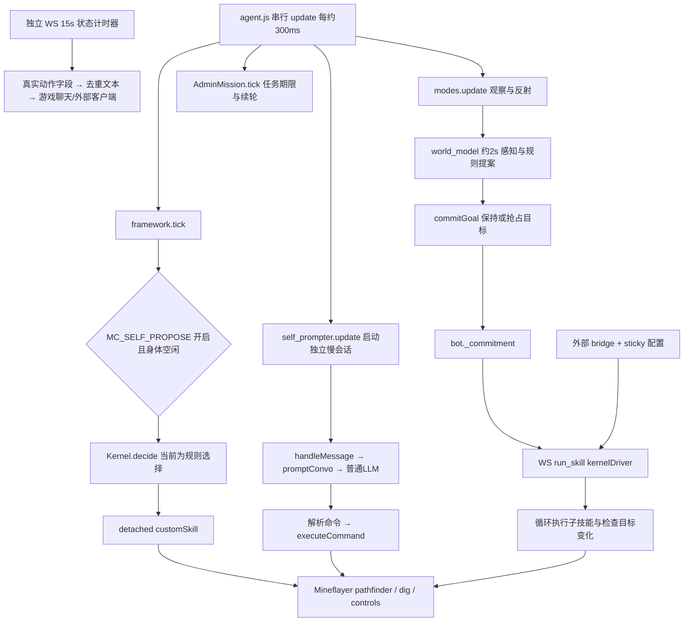

# mc-agent-neko 源码研究：持续动作、卡住恢复与直播表达

研究日期：2026-09-24，Asia/Shanghai。问题是：桐人为什么会长时间站定，哪些机制能让它在慢模型等待期间继续有意义地玩，并自然地向观众解释当前行为。

## 1. 版本、方法和结论边界

| 项目 | 本次记录 |
| --- | --- |
| 仓库 | [wehos/mc-agent-neko](https://github.com/wehos/mc-agent-neko) |
| 固定 HEAD | `23f5971203e3f4d15ef416ff8e5cc67965845d82` |
| 提交时间、标题 | `2026-07-16T14:13:15-07:00`；Merge pull request #12 from wehos/codex/chat-admin-at-neko |
| 本地副本 | `runtime/research-20260924/mc-agent-neko/`，只在目录不存在时克隆；研究结束时工作树干净 |
| 许可证 | [MIT；Copyright (c) 2024 Kolby Nottingham][license]。移植源代码需保留许可通知 |
| 本项目对照版本 | `5682e5ae58189b0e86b47f72838a6c7582eedfe3`；本文本轮 motor occurrence、turnEnded 等对照均已在该提交中 |
| 实际验证 | Node `v22.22.1` 的语法解析；源码调用点、开关、输出协议交叉检查；读取已有测试 |
| 原始记录 | `runtime/research-20260924/mc-agent-neko-static-evidence.json`：HEAD、文件 SHA256/行数、语法检查退出码、搜索范围、模板大小。runtime 为本地证据，不依赖它公开复查 |

未安装外部依赖，未执行上游启动脚本、测试脚本或导入其模块，未接入第三方游戏/模型/API。`node --check` 仅解析，不执行待查文件。README/HANDOFF 用作定位索引；结论以实现和实际调用点为准。本文没有实测 Neko 的游戏胜率、模型延迟、连续直播质量，也没有把源码注释中的历史战报当作本次运行结果。

### 最重要的五个发现

1. **持续玩主要依靠程序技能和独立调度。** 300ms 主循环与长时间技能分离；技能自己循环采集、走路、检查中断。已有技能执行时可以继续；空队列等待模型时，没有机制保证身体总在动。[主循环][agent-tick]、[独立派发][kernel-dispatch]。
2. **有两条自主执行路径，必须分别看。** 内置 kernel 的空闲提案由 `MC_SELF_PROPOSE=1` 开启，默认关闭；`world_model → commitment → 外部 sticky kernelDriver` 则是另一条可持续执行的路径，需要监督进程和运行态配置。不能把两条路径合并成一个已经完整接通的“快慢脑”。[内置开关][flags]、[外置驱动][driver]。
3. **本次未发现 Jev 集成。** 351 个被审查的跟踪文本文件内 `jev` 字面搜索为零；实际执行链也未见 System One 接口。`Kernel.decide` 仍直接选规则提案；`llm_gate` 缺少 `wireLlm` 调用。不过身体仲裁器确实会异步调用普通聊天模型，不能因此说全仓没有 LLM 仲裁。[decide][decide]、[gate][llmgate]、[真实仲裁请求][arbiter-llm]。
4. **有独立于主会话的事实状态广播。** 每 15 秒采样睡眠、战斗、挖掘、寻路状态，变化才发，可直接镜像游戏聊天。它解决“模型没说话时观众完全不知道在做什么”的一部分问题；这是模板状态播报，尚不能证明自然主播表达。[接线与广播][status-timer]、[状态生成][status-build]。
5. **最值得移植的是任务进展检查与行为分类。** 成功返回还会核对世界变化；MOVE 与 DIG/WAIT/HOLD 分开判定。我们已有完成回执、位移唤醒、库存目标验证，但异步 motor 主分支没有调用旧 `_check_stagnation`；这是一项具体缺口，不能简化成“我们没有快执行/没有进度检查”。详见第 8 节。

## 2. 实际调用链：谁调度谁

主循环只允许一个 `update()` 同时运行：`await modes.update()`，不等待 `self_prompter.update()` 启动的会话，调用任务 housekeeping，再 `await framework.tick()`。300ms 是目标间隔；当扫描或单拍耗时超过它时，下拍顺延，不能宣称严格的 300ms 实时保证。[agent.js 1453–1483、1601–1620][agent-tick]

`ModeController.update` 先运行 always observer，再运行允许打断当前动作的模式。各模式有异常隔离，长动作从 `execute(...)` 启动；调用方没有 `await execute(...)`，所以这部分不会把整个身体技能留在主 update 中等待。观察器本身仍被 await，同步重扫描依然可能卡事件循环。已有每 mode 耗时与 event-loop 探针正是为区分这些来源。[modes 调度][modes-update]、[模式动作入口][modes-execute]

### 2.1 内置 kernel 路径

`_survivalTick` 先处理任务独占、紧急反射、身体 busy 等门，再检查 `selfProposeEnabled()`。开启后才走 `proposeTasks → commitGoal → decide → _commit`。`decide` 当前不调用模型；FREE_PLAY 甚至明确返回不派发。派发前同步设置身体 owner，再以独立 async 函数运行 `customSkill`，完成后才结算进展。因此长技能不会被主循环 await 到结束。[kernel 生存路径][kernel-survival]、[规则 decide][decide]、[detached 派发][kernel-dispatch]

### 2.2 外部 supervisor / sticky 路径

`world_model` 模式每约 2 秒更新 `bot._world`，随后直接计算提案并 `commitGoal`；该调用不受前述 kernel 空闲派发开关控制。外部 `bridge.mjs` 读取运行态 `sticky_skill.json`，发送 `run_skill`。若配置成 `kernelDriver`，该技能从 `bot._commitment` 取 `skill/args/id` 并执行，不等慢模型。[world_model 接线][world-wiring]、[bridge][bridge-send]、[kernelDriver][driver]

`kernelDriver` 的具体续动作规则是：没有目标等 1.5 秒；反射忙等 0.8 秒；子技能完成后清空本地 lastSkill，下轮可再次执行同一 commitment；正常间隔 1.5 秒；最多 5000 次循环。子技能期间每 1 秒检测 commitment kind/id 改变并设置中断标记。它还包含“到下界后附近采少量地狱岩”“物资齐全就造门”的固定策略，因此并非一个纯粹通用的目标执行器。[driver 100–244][driver-loop]

bridge 重连 3.5 秒后重挂；收到普通技能结果 8 秒后重挂，忙拒绝 30 秒后重试；另有空闲超过 40 秒、每 30 秒检查的保活。`watchdog.ps1` 会保活 bridge，但 clone 中没有跟踪的 `sticky_skill.json`，所以仅凭仓库无法断言某实例当前采用哪一个 sticky 技能。[bridge 结果处理][bridge-rearm]、[重连和兜底][bridge-reconnect]、[watchdog][watchdog]

**对我们意味着什么：** 可以移植“已确认结束后依据新鲜目标再调度”的监督思想；不能移植“连接恢复就重发技能”的协议。桐人有跨进程、RCON、原生任务和 lost-ACK，未知结果必须核对原 action/request ID。重新连接不是动作尚未执行的证据。

## 3. 慢脑、所谓快脑与 Jev 的真相

### 3.1 慢脑实际做什么

`AdminMission._drive` 启动一次 admin 会话，之后 self-prompter 持有目标循环调用 `handleMessage('system', ...)`。`handleMessage` 加入历史和行为摘要，等待 `promptConvo`，解析 `!command` 并执行。持续目标是“再问一次模型/继续程序技能”，不是每个游戏 tick 都重新规划。[任务驱动][mission-drive]、[self-prompter][selfprompt]、[命令会话][handle-message]

self-prompter 在 supervised skill 占有身体时暂停问模型，并且不把这段等待计作三次无命令失败。三次无命令后由 AdminMission 判断结束/无法完成/继续，普通自提示则停止；ACTIVE 状态空闲约 2 秒会再启动。任务对象会在 await 后重新核对 identity，避免旧任务完成时复活旧目标。[self-prompter][selfprompt]、[任务续轮与判定][mission-tick]

这避免了“技能还在做，认知层却认为无动作”的误判。但它不能保证等待模型时有工作：若尚未提交技能，或 `newAction` 正在生成代码、身体没有在执行任务，身体仍可能空闲。`coder` 的 `_newActionActive` 会保护代码生成阶段不被某些自主派发/重连抢占，这本身就是有意等待。[coder][coder]

### 3.2 三种容易被混淆的“快决策”

| 机制 | 输入/输出 | 真实接线 |
| --- | --- | --- |
| `proposeTasks/commitGoal` | world/vitals/资源/时间 → 排序任务、保持 commitment 或抢占 | world_model 和 kernel 均有调用；程序规则，非 Jev |
| `Kernel.decide` / `llm_gate` | 提案或队列头 → 选择/允许继续 | decide 当前选现有 commitment；gate 默认关闭且没有 `wireLlm` 调用，不能当成已启用模型判断 |
| `arbiter.resolve/askLLM` | holder、claimant、生命状态、冲突片段 → holder/claimant、是否沉淀规则 | 模式/内核争用身体时真实调用；先救命底线和矩阵，再异步普通 chat_model，超时保留 holder |

规则 commitment 对未完成目标保持粘性；紧急任务和更高优先级夜间计划有受限抢占，skill 与 args 同时更新。它的价值是减少目标抖动；其任务优先级和资源阶梯高度 Minecraft 生存化，不能原样用于本项目带法术、伙伴和直播意图的世界。[commitGoal][commit-goal]

真实的 arbiter 模型调用有 4 秒超时、在途去重与缓存；等待时返回 pending，调用方保留原 owner。裁决的输入是紧凑冲突，而不是整段角色历史。某些规则可持久化，但禁止自动持久化通配家族规则及压制救命反射的规则。这是可学习的设计，也说明不可把一次情境判断升级成无条件权限。[resolve][arbiter-resolve]、[askLLM][arbiter-llm]

### 3.3 本项目已经有真正的 Jev 链路

本项目 [system_one.py](../../world/survival/system_one.py) 使用 `https://api.typesafe.ai/v1/systemone`，默认 `jev-latest`。`choose` 发送当前 state 和 `questions.action` 的 choice/instructions/criteria；接收 `answers.action.choice/confidence/probabilities`，只取原始候选里的动作。候选限制 2–8 个，问题最多 500 字符、附加 context 最多 2048 字节、打包 state 最多 8192 字节，检查概率和时效，低置信度或空动作候选升级交给慢层。

[policy_worker.py](../../world/survival/policy_worker.py) 是单槽后台推理，不拥有执行权限；主线程消费时重新校验 body/目标前提。[tests/test_system_one.py](../../tests/test_system_one.py) 已含阻塞请求不阻塞 ticks、状态陈旧/目标改变不得执行等回归。因此没有理由为了“接上 Neko 快脑”替换当前模型或 API。要评估的是：候选是否有用、技能是否能续步、队列是否为空、返回结果是否过期，以及切回慢层时有没有已经授权的身体工作可继续。

## 4. 身体连续执行、打断与“返回成功但没进展”

### 4.1 程序技能比高频提示更重要

`customSkill` 按安全文件名寻找维护的 JS 技能，动态加载，传入真实 bot、skills、world、Vec3 等。以 `chopWood` 为例，一次调用内部反复找目标、清库存空间、采集、核对库存增长，并检查死亡和执行代际；不需要每砍一个方块都重新问 LLM。[加载技能][custom-skill]、[采集循环][chop-loop]

这和我们已有 QuickJS `next(state, memory) → action/observe/wait/choose/done/replan` 的原则相近。Neko 的代码直接拥有宿主/文件系统能力，本项目 [skill_library.py](../../world/survival/skill_library.py) 通过受限运行时和 motor 发动作。可以移植技能分段和 checkpoint，不能把外部 JS 直接装成我们身体控制器。

### 4.2 进度检查分三层，强度不同

| 位置 | 实际判定 | 优点与局限 |
| --- | --- | --- |
| kernel `_settleDispatch` | 显式失败连续 3 次冷却；正常返回后比较位置、按物品计数的库存签名、维度；连续 4 次无变化释放 commitment/冷却 | 不相信单个成功布尔值。位移阈值 6 格；任意库存变化也算变化，非目标达成证明；快照取不到会视为有变化 |
| sticky `kernelDriver` | 同技能 90 秒无横向大于 8 格移动、无下降大于 4 格、无指定矿/木资源增长，才考虑迁移/避夜，另有 120 秒冷却 | 排除了泥土/圆石等“垃圾库存增长”假进展；有夜守/战斗/深层挖矿豁免。策略强依赖其生存目标，仍可能误判别的任务 |
| AdminMission deadline | 每 15 秒比较库存总数量和维度；变化延长期限 | 不是目标相关度量：丢物也可能续期，等数量交换/建造进展可能看不见 |

对应实现：[kernel 结算][kernel-settle]、[driver 防空转][driver-loop]、[任务期限][mission-tick]。同一项目内这些判据并不统一，不能把其中最强的一处当成所有入口都有的能力。

`ActionManager._executeAction` 只 await 动作函数，未读取返回值；不抛异常就可能返回 `success:true`，即使动作函数返回 false。WS `runSkill` 也会将非抛错的子技能结果包成 `ok:true` 并带 raw result。所以上述“世界变化再验证”确有必要，单看外层 ok 不够。[ActionManager][action-result]、[WS runSkill][ws-runskill]

### 4.3 为什么原地不动不能直接认定卡死

`stall_recovery` 用带 owner 和租期的 intent 标识 MOVE、DIG、INTERACT、WAIT、HOLD、WORK、COMBAT、TRANSITION；过期 intent 失效，嵌套 intent 能恢复父级。只有 MOVE 启用位移监测；睡眠、挖掘、打开交互界面都可能合理静止。恢复之后也核对真实位移，默认 1.5 格。[行为分类与租期][stall]

对应测试覆盖 idle 被围仍是 HOLD、挖掘优先、窗口交互/工作不能误判 MOVE、嵌套租约恢复，以及 0.2 格和 1.6 格位移边界。此次读取测试，没有运行它们。[stall 测试][stall-test]

动作取消是合作式：`interrupt_code`、owner 标签、代际检查共同防旧动作写回；`raceInterrupt` 将工作与每 200ms 中断检测/死亡/超时竞争，并尝试停挖掘。Promise.race 本身不会撤销所有已经发生的动作；Neko 的动作闭包恢复、WS 重挂不等于我们 exact-ID、bridge epoch 和未知回执的持久恢复协议。[中断 helper][race-interrupt]、[ActionManager stop][action-stop]

## 5. 感知、记忆与提示词：不能仅凭模板短就判断快

`world_model` 维护结构化时间、位置、mobility、vitals、threat、kit、landmarks 等状态；提案从这些字段导出。部分扫描通过 worker 做计算，快照分片、取消和 bot 失效检查减轻主事件循环压力。worker 不是另一个能同时抢身体的玩家线程。[world_model 接线][world-wiring]、[扫描 worker 边界][scan]

提示词不是只有 `neko.json`。本次只解析该文件的 `conversing` 字符串，得到 **1841 字符/1841 UTF-8 字节**，但仍包含 `$COMMAND_DOCS/$EXAMPLES/$INVENTORY/$MEMORY/$NAME/$SELF_PROMPT/$STATS`。`replaceStrings` 会展开状态、库存、附近实体/方块、全部未屏蔽命令说明和自定义技能目录；历史和 examples 另行传入。这个数字不是实际请求长度，也不是 token 数，无法用于证明它比桐人更快。[模板展开][prompt-expand]、[命令文档展开][command-docs]

`promptConvo` 先等待 cooldown，再构建 prompt、请求模型，最多尝试 3 次；较新的消息会让旧生成结果被丢弃。真实耗时需拆成 cooldown、上下文构建、供应商请求、重试和执行，不能只比较 system prompt 字符数。[模型请求][prompt-convo]

历史到阈值后切块并通过模型摘要，摘要约束 500 字符；这会增加另一种模型调用。`memory_bank` 主要记录命名地点坐标，并非完整的证据来源/时效数据库。AdminMission 刻意不持久化：save 会清除该任务的 self-prompt 状态，崩溃后不自动复活任务。外部 sticky 保活与任务记忆恢复是不同机制。[历史与摘要][history]、[地点记忆][memory-bank]

本项目应继续保留事实、候选记忆、旧目标和当前权限的边界；旧记忆里的“向东去负 X”不能变成导航权威。方向应从当前坐标到目标的 `dx/dz` 计算，并校验实际下一段可站立目标。Neko 的固定生存 milestone、矿点 oracle 和外部监督策略不能证明其人格记忆更可靠。

## 6. “边玩边说”到底实现到哪一步

### 6.1 三条输出通路

1. **主会话文字前缀。** `handleMessage` 得到完整模型答复后，先把命令前的自然语言交给 `routeResponse`，再 await 执行动作。能产生“我要做什么”与动作的时间重叠，但同一 handleMessage 不会在长技能中自行持续生成新解说。[命令执行顺序][handle-message]
2. **独立声音队列。** `openChat` 在 `settings.speak` 开启时把文本交给 speak；远端音频准备与身体动作可以并行，播放队列串行。当前跟踪 settings 的 `speak=false`、`chat_ingame=false`，不能用代码存在证明某部署在自然说话。[openChat][open-chat]、[音频队列][speak]、[settings][settings]
3. **独立状态广播。** `setAgent` 启动 `startStatusNLTimer`。默认 `STATUS_NL=1`，每 15s 从真实身体状态造一段中文，去重，纯空闲持续至少 8s 才切为空闲描述；广播到外部客户端，并在默认 `DEBUG_CHAT=1` 时调用 `bot.chat`。这条路径绕过 `chat_ingame=false`，因此“settings 关闭聊天”不代表整个项目无公屏。[timer 与镜像][status-timer]、[状态构造][status-build]

第三条是真实的调度差异，适合用于改善直播可解释性。不过 `_statusNL` 在没有真实动作时会退回目标短语/“按指令行动”；目标还存在不意味着动作正在发生。它也刻意排除了饥饿字段，因此不适合我们当前饥饿/库存救急的直播事实表达。移植时应明确区分：**正在执行、等待终态、刚刚完成、计划下一步、正在等待/休息**。

### 6.2 聊天输入也有分流

游戏中的 `@neko` 或 `!` 指令进入 admin mission；普通真人聊天约 3s 合并为 `ingame_chat`，转给外部 WS 客户端。过滤自身/系统/非在线玩家消息。这个实现证明有桥接接口，不能证明外部 N.E.K.O. 应用已在仓库内部完成自然回复；本次没有运行或研究那套外部客户端。[游戏输入路由][chat-route]、[路由测试][chat-test]

桐人的 [chat.py](../../world/survival/chat.py) 已有 `say`、发送状态、音频状态分离和 narration_context；伙伴协作另走 `party_send`。当前缺口主要是表达机会是否真正被消费，而不是缺少发送工具。建议以刚确认的转折事件生成简短 narration opportunity，由现有角色生成自己的话；无确认的施法不能说已命中，已送服务器不能说观众已读。模板状态可以展示在观察面板，不能直接冒充角色的感受和决定。

## 7. 外部监督、默认开关与运行前提

| 配置/机制 | 本固定版本源码状态 | 不能据此推出什么 |
| --- | --- | --- |
| framework | agent 默认启用且 live；显式环境开关可关闭/改 shadow | 框架启用不意味着 kernel 空闲提案也启用 |
| `MC_SELF_PROPOSE` | 只有值为 `1` 才开 | 未设置时仍可能有外置 sticky driver 或 admin mission 工作 |
| `MC_FOOD_INSTINCTS` | 默认关闭，launcher/watchdog 也明确设 0 | 不能把饥饿救急行为拿来直接与我们的生存策略对比 |
| `taskqLive` / `llmGate` | tracked decision-config 未开启；代码默认关 | 存在队列/门控代码不等于正式执行路径 |
| sticky driver | bridge/driver 源码存在；sticky 配置属于运行态，不在 clone 中 | 无法从仓库认定某场直播究竟由谁持续驱动 |
| overseer | 有 snapshot 工具；watchdog 检查 `overseer.mjs` 是否存在才启动，该风险引擎文件不在本 clone | 不代表仓库具备完整、常驻、可复现的外部风险监督 |
| 模型声音 / 状态聊天 | speak 默认关；状态镜像默认开 | 公屏文字不等于 LLM 自然解说或语音已播放 |

证据：[framework 实际接线][agent-tick]、[flags][flags]、[tracked config][decision-config]、[watchdog guard][watchdog]、[settings][settings]。部分文件注释仍描述旧默认值；上表以执行表达式和调用点为准。

监督侧值得借鉴的是 `overseer-snapshot` 将当前快照时效与历史聚合分开，避免历史异常被当成当前现场。但仓库还有 `bot-medic`，包含给物品、替换装备、清理物品、keepInventory 的外部命令和机器特定路径。**没有证据证明本次该脚本在运行**；其存在足以说明不能把 README/注释中的长期生存成绩直接当作纯原版、自主模型、不受干预的性能基准。[快照工具][overseer]、[medic 源码][medic]

## 8. 与桐人当前实现逐项对照

本节针对固定本项目提交 `5682e5a`；后续修改请重新定位，不把本文作为永远有效的行号清单。

| 维度 | Neko 的实际机制 | 本项目已有能力 / 具体差距 |
| --- | --- | --- |
| 慢模型等待 | 主 tick 独立；长技能程序继续 | [controller.py](../../world/survival/controller.py) 2815 起 asyncMotor 分支先 motor_tick，再轮询/提交原生 Qwen；已有身体与认知分离，问题可能是空队列、短动作或轮次权限，而非没有异步架构 |
| 多步身体工作 | customSkill 内部循环，driver 连续派子技能 | [skill_library.py](../../world/survival/skill_library.py)、controller.tick_skill 已有受限程序续步；应检查角色实际是否使用并持续产出有效步，而非重建 Mineflayer 身体 |
| 快模型 | 规则提案、普通 chat_model 身体仲裁；未见 Jev | [system_one.py](../../world/survival/system_one.py)、[policy_worker.py](../../world/survival/policy_worker.py) 已有真正 Jev 候选分类和新鲜度门，应测候选价值和超时期间的身体覆盖 |
| 原地工作分类 | MOVE/DIG/WAIT 等有租期的 intent | 当前原生任务状态能显示具体动作；可将分类统一投影给监督和观众，避免挖矿、吃东西、等待回执被判成卡死 |
| 动作成功与事实变化 | kernel/driver 二次核对世界变化 | motor_progress_wake 已检查本人 confirmed completed、位移大于 1.5 格或 inventoryDelta；[practice.py](../../world/survival/practice.py) 有 objectiveObserved，不能说我们完全缺少客观进度 |
| 目标级停滞 | 两种 driver 都有各自停滞阀，AdminMission 有期限 | **controller._check_stagnation 仅在后面的 legacy 分支、brainProtocol != 1 时调用；asyncMotor 分支未调用。** 当前异步路径没有自动继承旧目标停滞提示；应补有限、事实驱动的审计入口 |
| 同参后续动作 | driver 可再次调用相同技能；无统一 durable occurrence 协议 | [motor_mailbox.py](../../world/survival/motor_mailbox.py) 已用 nextRepeat.previousRequestId/previous_request_id 区分确认完成后的新动作与网络重试；pending/unknown 不能借新 token 重发，这项应保留 |
| 中断/恢复 | 协作标记、owner、generation、重连重挂 | 本项目原生 exact-ID/epoch、lost-ACK 对账更适合跨进程；不要因 Neko 更常重试就解除 unknown 暂停 |
| 对观众表达 | 独立状态广播 + 可选 TTS + 主响应前缀 | 本项目 say 已能与身体分开，仍主要依赖认知主动调用；可增加事实事件驱动的叙述机会与面板可解释性，不将自动旁白算作角色自主发言 |
| 内存与提示词 | 有模板、动态命令说明、摘要、结构化世界；无可用实际 token 账单 | 本项目已投影 motor brief、保留精确失败码；应测同 fixture 的实际请求字节、工具 schema、角色/记忆/回执占比，不能凭模板长度诊断 |

停滞缺口的精确定位：`controller.py:1098` 定义 motor_progress_wake；`:2213` 定义 `_check_stagnation`；`:2815` 为 asyncMotor 分支，`:2860` 才在另一分支调用 `_check_stagnation`。建议将“无目标进展”作为后续受控实现，不在本次研究中直接改生产源码。

## 9. 可移植的最小方案与验证切口

### P0：把任务进展审计接到异步主路径

每个 goal/skill episode 保存带时间的事实基线与自己拥有的请求 ID，只在已确认终结、收到新鲜世界快照后评估：有意义位移、目标资源增减、生命/饥饿改善、已确认交互阶段推进。连续无进展产生一次 bounded replan 提示；不把调度次数、LLM 自述或仅有 completed 字段当进展。

先补离线用例：0.97 格目标已在到达容差内且前后位置一致；confirmed completed 却没有目标变化；正常挖掘/睡眠/明确等待；库存增加的是无关物品；unknown/lost-ACK；目标切换和旧 episode 晚回包。未知结果保持对账，不由停滞检测生成重复动作。阈值应按 intent/原生动作语义设定，不能直接复制 Neko 的 6/8 格、3/4 次或 90 秒。

### P1：让身体已有技能覆盖慢模型等待

优先让经过验证的程序完成数秒至几十秒、有安全落脚点和中断检查的动作段；Qwen 决定目的和变化，程序处理重复步骤。需要模型新判断时返回 choose/replan，同时保持明确“当前是否仍有已授权工作”。禁止为了看起来活跃随机微移、无意义丢捡或反复施法。

验证：人为让慢请求等待 5–15 秒，检查已有技能是否继续产生真实目标进展；当前工作自然结束后不能越权自造下一个目标；危险事件/停机撤权及时中止；相同 completed occurrence 后的后续动作只有明确 predecessor 才产生一次新效果。

### P1：叙述机会由事实触发，语音不占身体

将开播首次真实行动、阶段完成、失败后换办法、伙伴互动、长时间没有发言作为有限机会，携带事实时间、动作 ID、delivery 状态和一句待解释的问题。合并短时间事件、限频；状态未变化时不重复提醒。只由现有角色选择是否以及如何说，或者把模板状态展示为系统观察字幕。

验证：模型慢请求/长技能期间身体不因 TTS 停止；say unknown 只查询原 message ID；一次事件不重复发送；等待任务不能被播成已经成功；同维度玩家能看到文本与音频播放证据分别核验。测试指标包括首次确认文本时间、每分钟真实发言次数、文本与身体工作的重叠时长，不能用工具调用次数代替观众可感知输出。

### P2：用分阶段指标决定是否继续压缩提示词

记录 perception/build-context/queue-age/native-submit/首 token/工具轮次/motor-dispatch/native-terminal 的耗时，以及 body-working、waiting-for-model、waiting-for-native、resting、blocked/unknown 的时间占比。对同一真实 fixture 比较输入字节与供应商返回 token 统计；保留精确 ID、失败码和纠错候选。只有这样才能区分提示词负担、模型推理慢、动作过短、回执丢失和调度空窗。

### 不直接移植的部分

- 不更换 Qwen 原生角色/API 或 Forge 身体；不把外部 Mineflayer 技能直接导入宿主。
- 不照搬生存 milestone、关闭饥饿反射、原世界矿点 oracle、给物品/keepInventory 等运行假设。
- 不把 bridge 保活重发当成丢 ACK 的安全处理，也不让 unknown 通过新 id 绕过。
- 不把模板播报或 owner 锁“仍存在”当成自然直播和目标进展的证据。

## 10. 本次实际证据清单与仍未知项

已读的核心文件包括：agent/self_prompter/admin_mission/action_manager、kernel/world_model/contracts/llm_gate/arbiter、modes、stall_recovery、skills/chopWood、prompter/history/memory_bank、speak、ws_server、bridge/kernelDriver、扫描/telemetry、watchdog、overseer-snapshot/bot-medic、settings，以及聊天/停滞/重连等测试。关键结论均有下列固定提交链接。

实际执行的是文件清单/字符串搜索/哈希统计与 `node --check`：初始 8 个核心调度模块语法检查通过；追加检查 bridge、kernelDriver、ws_server、speak 后共 **12/12 解析通过**。这不是执行正确性测试，更不是实机验收。读取的 reconnect 测试主要断言源码结构，不能等价为网络故障后的端到端恢复证据。[重连测试][reconnect-test]

未验证：Neko 当下线上配置、sticky 目标、外部 N.E.K.O. 对话客户端、实际提示词 token/延迟、资源成绩、完整模组兼容性。我们的结论是明确的设计差异及下一步验证方案，不能得出“换成它就会一直动、一定更好看”。

## 固定源码索引

[license]: https://github.com/wehos/mc-agent-neko/blob/23f5971203e3f4d15ef416ff8e5cc67965845d82/LICENSE#L1-L21
[agent-tick]: https://github.com/wehos/mc-agent-neko/blob/23f5971203e3f4d15ef416ff8e5cc67965845d82/src/agent/agent.js#L1453-L1620
[modes-update]: https://github.com/wehos/mc-agent-neko/blob/23f5971203e3f4d15ef416ff8e5cc67965845d82/src/agent/modes.js#L7341-L7383
[modes-execute]: https://github.com/wehos/mc-agent-neko/blob/23f5971203e3f4d15ef416ff8e5cc67965845d82/src/agent/modes.js#L7198-L7285
[flags]: https://github.com/wehos/mc-agent-neko/blob/23f5971203e3f4d15ef416ff8e5cc67965845d82/src/agent/framework/contracts.js#L220-L267
[kernel-survival]: https://github.com/wehos/mc-agent-neko/blob/23f5971203e3f4d15ef416ff8e5cc67965845d82/src/agent/framework/kernel.js#L187-L294
[decide]: https://github.com/wehos/mc-agent-neko/blob/23f5971203e3f4d15ef416ff8e5cc67965845d82/src/agent/framework/kernel.js#L328-L343
[kernel-dispatch]: https://github.com/wehos/mc-agent-neko/blob/23f5971203e3f4d15ef416ff8e5cc67965845d82/src/agent/framework/kernel.js#L346-L495
[kernel-settle]: https://github.com/wehos/mc-agent-neko/blob/23f5971203e3f4d15ef416ff8e5cc67965845d82/src/agent/framework/kernel.js#L500-L590
[world-wiring]: https://github.com/wehos/mc-agent-neko/blob/23f5971203e3f4d15ef416ff8e5cc67965845d82/src/agent/modes.js#L6631-L6680
[commit-goal]: https://github.com/wehos/mc-agent-neko/blob/23f5971203e3f4d15ef416ff8e5cc67965845d82/src/agent/framework/world_model.js#L1564-L1632
[driver]: https://github.com/wehos/mc-agent-neko/blob/23f5971203e3f4d15ef416ff8e5cc67965845d82/bots/_supervisor/skills/kernelDriver.js#L28-L105
[driver-loop]: https://github.com/wehos/mc-agent-neko/blob/23f5971203e3f4d15ef416ff8e5cc67965845d82/bots/_supervisor/skills/kernelDriver.js#L100-L244
[bridge-send]: https://github.com/wehos/mc-agent-neko/blob/23f5971203e3f4d15ef416ff8e5cc67965845d82/bots/_supervisor/bridge.mjs#L151-L225
[bridge-rearm]: https://github.com/wehos/mc-agent-neko/blob/23f5971203e3f4d15ef416ff8e5cc67965845d82/bots/_supervisor/bridge.mjs#L132-L148
[bridge-reconnect]: https://github.com/wehos/mc-agent-neko/blob/23f5971203e3f4d15ef416ff8e5cc67965845d82/bots/_supervisor/bridge.mjs#L274-L319
[watchdog]: https://github.com/wehos/mc-agent-neko/blob/23f5971203e3f4d15ef416ff8e5cc67965845d82/watchdog.ps1#L213-L245
[mission-drive]: https://github.com/wehos/mc-agent-neko/blob/23f5971203e3f4d15ef416ff8e5cc67965845d82/src/agent/admin_mission.js#L350-L413
[mission-tick]: https://github.com/wehos/mc-agent-neko/blob/23f5971203e3f4d15ef416ff8e5cc67965845d82/src/agent/admin_mission.js#L414-L480
[selfprompt]: https://github.com/wehos/mc-agent-neko/blob/23f5971203e3f4d15ef416ff8e5cc67965845d82/src/agent/self_prompter.js#L60-L130
[handle-message]: https://github.com/wehos/mc-agent-neko/blob/23f5971203e3f4d15ef416ff8e5cc67965845d82/src/agent/agent.js#L983-L1215
[coder]: https://github.com/wehos/mc-agent-neko/blob/23f5971203e3f4d15ef416ff8e5cc67965845d82/src/agent/coder.js#L37-L90
[llmgate]: https://github.com/wehos/mc-agent-neko/blob/23f5971203e3f4d15ef416ff8e5cc67965845d82/src/agent/framework/llm_gate.js#L44-L72
[arbiter-resolve]: https://github.com/wehos/mc-agent-neko/blob/23f5971203e3f4d15ef416ff8e5cc67965845d82/src/agent/framework/arbiter.js#L206-L247
[arbiter-llm]: https://github.com/wehos/mc-agent-neko/blob/23f5971203e3f4d15ef416ff8e5cc67965845d82/src/agent/framework/arbiter.js#L289-L358
[custom-skill]: https://github.com/wehos/mc-agent-neko/blob/23f5971203e3f4d15ef416ff8e5cc67965845d82/src/agent/library/skills.js#L6691-L6731
[chop-loop]: https://github.com/wehos/mc-agent-neko/blob/23f5971203e3f4d15ef416ff8e5cc67965845d82/bots/_supervisor/skills/chopWood.js#L1388-L1435
[action-result]: https://github.com/wehos/mc-agent-neko/blob/23f5971203e3f4d15ef416ff8e5cc67965845d82/src/agent/action_manager.js#L142-L168
[action-stop]: https://github.com/wehos/mc-agent-neko/blob/23f5971203e3f4d15ef416ff8e5cc67965845d82/src/agent/action_manager.js#L26-L65
[race-interrupt]: https://github.com/wehos/mc-agent-neko/blob/23f5971203e3f4d15ef416ff8e5cc67965845d82/src/agent/library/skills.js#L1208-L1228
[ws-runskill]: https://github.com/wehos/mc-agent-neko/blob/23f5971203e3f4d15ef416ff8e5cc67965845d82/src/websocket/ws_server.js#L650-L748
[stall]: https://github.com/wehos/mc-agent-neko/blob/23f5971203e3f4d15ef416ff8e5cc67965845d82/src/agent/stall_recovery.js#L1-L134
[stall-test]: https://github.com/wehos/mc-agent-neko/blob/23f5971203e3f4d15ef416ff8e5cc67965845d82/test/stall_recovery.sim.test.mjs#L1-L90
[scan]: https://github.com/wehos/mc-agent-neko/blob/23f5971203e3f4d15ef416ff8e5cc67965845d82/src/utils/block_scan.js
[prompt-expand]: https://github.com/wehos/mc-agent-neko/blob/23f5971203e3f4d15ef416ff8e5cc67965845d82/src/models/prompter.js#L154-L217
[command-docs]: https://github.com/wehos/mc-agent-neko/blob/23f5971203e3f4d15ef416ff8e5cc67965845d82/src/agent/commands/index.js#L260-L296
[prompt-convo]: https://github.com/wehos/mc-agent-neko/blob/23f5971203e3f4d15ef416ff8e5cc67965845d82/src/models/prompter.js#L245-L293
[history]: https://github.com/wehos/mc-agent-neko/blob/23f5971203e3f4d15ef416ff8e5cc67965845d82/src/agent/history.js#L1-L118
[memory-bank]: https://github.com/wehos/mc-agent-neko/blob/23f5971203e3f4d15ef416ff8e5cc67965845d82/src/agent/memory_bank.js
[open-chat]: https://github.com/wehos/mc-agent-neko/blob/23f5971203e3f4d15ef416ff8e5cc67965845d82/src/agent/agent.js#L1278-L1330
[speak]: https://github.com/wehos/mc-agent-neko/blob/23f5971203e3f4d15ef416ff8e5cc67965845d82/src/agent/speak.js#L8-L130
[settings]: https://github.com/wehos/mc-agent-neko/blob/23f5971203e3f4d15ef416ff8e5cc67965845d82/settings.js#L41-L66
[status-timer]: https://github.com/wehos/mc-agent-neko/blob/23f5971203e3f4d15ef416ff8e5cc67965845d82/src/websocket/ws_server.js#L156-L220
[status-build]: https://github.com/wehos/mc-agent-neko/blob/23f5971203e3f4d15ef416ff8e5cc67965845d82/src/websocket/ws_server.js#L242-L322
[chat-route]: https://github.com/wehos/mc-agent-neko/blob/23f5971203e3f4d15ef416ff8e5cc67965845d82/src/agent/agent.js#L189-L244
[chat-test]: https://github.com/wehos/mc-agent-neko/blob/23f5971203e3f4d15ef416ff8e5cc67965845d82/test/ingame_chat_routing.test.mjs#L1-L90
[decision-config]: https://github.com/wehos/mc-agent-neko/blob/23f5971203e3f4d15ef416ff8e5cc67965845d82/bots/_supervisor/decision-config.json#L1-L4
[overseer]: https://github.com/wehos/mc-agent-neko/blob/23f5971203e3f4d15ef416ff8e5cc67965845d82/bots/_supervisor/overseer-snapshot.mjs#L1-L65
[medic]: https://github.com/wehos/mc-agent-neko/blob/23f5971203e3f4d15ef416ff8e5cc67965845d82/bots/_supervisor/bot-medic.mjs#L1-L95
[reconnect-test]: https://github.com/wehos/mc-agent-neko/blob/23f5971203e3f4d15ef416ff8e5cc67965845d82/test/reconnect-lifecycle.test.mjs#L1-L22
