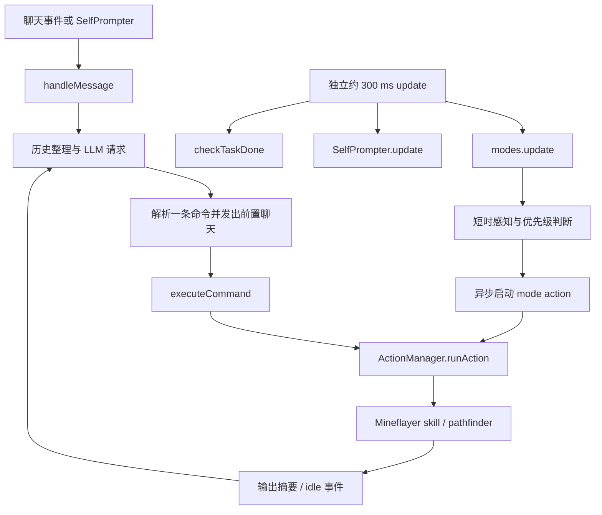

# Mindcraft 源码研究：慢模型等待期间，身体如何继续游戏

研究日期：2026-09-24，Asia/Shanghai。目标是解释桐人直播中的站定与慢回合，识别可复用的并行机制；本报告没有修改生产代码或运行态。

## 1. 版本、方法与证据边界

| 项目 | 记录 |
| --- | --- |
| 官方仓库 | [mindcraft-bots/mindcraft](https://github.com/mindcraft-bots/mindcraft) |
| 获取方式 | 目录不存在时执行 `git clone --depth 1`；默认 `develop` 分支 |
| 精确 HEAD | `5f3acc87b479864124173de444f31fa5538f94a6` |
| 提交时间 | `2026-06-08T22:21:33-07:00` |
| 提交标题 | Merge pull request #787 from fank/feat/dashboard-agent-status |
| 本地副本 | `runtime/research-20260924/mindcraft/`，研究后 Git 工作树干净 |
| 许可证 | [MIT，Copyright (c) 2024 Kolby Nottingham](https://github.com/mindcraft-bots/mindcraft/blob/5f3acc87b479864124173de444f31fa5538f94a6/LICENSE#L1-L21)；移植代码须保留相应通知 |
| 本项目比较基线 | 主工作树 HEAD `59df0aa7472dbda6c56ac84317a31a51d0a4e483` 加本轮尚未提交的修复；下文明确引用工作树源码，不把它当成该 HEAD 的原始内容 |
| 离线验证时间 | `2026-09-24T07:12:21.081Z`，即北京时间 15:12:21 |
| 验证环境 | Node `v22.22.1`；未安装外部依赖、未运行项目启动脚本、未接入 Minecraft 或模型供应商 |

证据分三类：**源码事实**可由固定提交链接复查；**离线测证**只证明模拟 I/O 下的时序；**现场事实**由本轮主代理的只读生产检查提供，不能与离线结果混为一谈。未测 Mindcraft 的真实游戏胜率、延迟、直播质量或 Forge 模组兼容性。

## 2. 结论先行

1. **Mindcraft 的身体反射独立于语言模型请求。** 约 300 ms 的更新循环检查 modes；是否空闲只取决于 `actions.executing`，不取决于 LLM 是否正在生成。长反射动作以不等待其完成的方式启动，模型等待期间可以转头、拾取、战斗或避险。四项离线验证覆盖了这里的关键时序。
2. **它的普通规划链仍然串行。** self-prompt 内部等待 `handleMessage`；消息处理等待 LLM，再等待动作，再请求 LLM。它没有消除所有动作之间的思考空窗，也没有全局保证“只要模型在想，身体就一定有有意义的事情可做”。
3. **它的动作粒度更接近完整意图。** 一次 `goToCoordinates` 驱动寻路到目标；`collectBlocks(type,n)` 在本地逐块执行；`followPlayer` 是持续跟随。相比每 16–24 格重新问一次模型，持续的已授权目标更容易覆盖模型延迟。
4. **本项目已有真正的异步基础。** `asyncMotor` 分支先推进 motor、再处理 Qwen 结果；PolicyWorker 把 Jev 推理放在独立线程；Numen 的游戏刻调度独立于 Python 与 Qwen。问题不能概括为“整个系统都是同步的”。
5. **本轮现场存在更直接的候选失效故障。** 主代理 15:11 只读看到 `base_eat` 虽 active/promoted，运行却拒绝 `matching_passed_tests_required`，路由候选变成空集。源码确认候选生成会吞掉这一类异常。先恢复经过真实重测的技能可执行性，才能讨论覆盖率。
6. **保留本项目更严格的副作用边界。** Mindcraft 的函数返回、内存中断和进程重启策略不能替代 actionId、原生终态、epoch、租约与 unknown 闸门。可以学习持续执行与事件表达，不能照搬它的成功判定和重启续跑。

## 3. 实际调用链



这张图的“独立”指 JavaScript 事件循环中的不同异步链，并非多个 CPU 线程。同步重计算、慢 `mode.update` 或异常仍可能延迟更新；代码的 300 ms 是目标周期，不是实时保证。

### 3.1 初始化、更新与消息入口

- `Agent.start()` 建立 ActionManager、Prompter、History、Coder、NPCController 与 SelfPrompter，创建 Mineflayer 身体并初始化 modes。生成式模型和身体动作管理器是两个对象。[初始化源码](https://github.com/mindcraft-bots/mindcraft/blob/5f3acc87b479864124173de444f31fa5538f94a6/src/agent/agent.js#L22-L125)
- 聊天事件调用 `handleMessage` 后不等待整个回合完成；更新循环在 `startEvents` 另行启动。每次更新串行执行 modes、self-prompt 调度、任务完成检查；`isIdle()` 只返回 `!actions.executing`。[聊天入口](https://github.com/mindcraft-bots/mindcraft/blob/5f3acc87b479864124173de444f31fa5538f94a6/src/agent/agent.js#L157-L189)、[更新循环与 idle 定义](https://github.com/mindcraft-bots/mindcraft/blob/5f3acc87b479864124173de444f31fa5538f94a6/src/agent/agent.js#L500-L528)
- `handleMessage` 等待 `promptConvo`，收到命令后等待 `executeCommand`。后者再等待命令的 `perform`。因此 await 使控制权返回事件循环，却没有使同一条规划链中的后续步骤提前执行。[规划与执行](https://github.com/mindcraft-bots/mindcraft/blob/5f3acc87b479864124173de444f31fa5538f94a6/src/agent/agent.js#L298-L380)、[命令执行入口](https://github.com/mindcraft-bots/mindcraft/blob/5f3acc87b479864124173de444f31fa5538f94a6/src/agent/commands/index.js#L212-L233)

### 3.2 SelfPrompter 不等于另一个身体控制器

`startLoop` 有 `loop_active` 防重入；循环里等待一次 `handleMessage(...,-1)`。`-1` 在消息处理器转换为无限命令轮数，所以一次 self-prompt 可以包含多次 LLM→工具往返。连续三次没有命令才停止；使用过命令后等待 2 秒。更新器在空闲且循环不运行时恢复 self-prompt。默认 profile 的模型冷却另有 3 秒。[SelfPrompter](https://github.com/mindcraft-bots/mindcraft/blob/5f3acc87b479864124173de444f31fa5538f94a6/src/agent/self_prompter.js#L56-L106)、[命令轮数转换](https://github.com/mindcraft-bots/mindcraft/blob/5f3acc87b479864124173de444f31fa5538f94a6/src/agent/agent.js#L254-L267)、[默认 profile](https://github.com/mindcraft-bots/mindcraft/blob/5f3acc87b479864124173de444f31fa5538f94a6/profiles/defaults/_default.json#L1-L8)

`stopLoop()` 设 interrupt 后每 500 ms 等循环退出，不能直接撤销供应商正在进行的请求。`promptConvo` 用最近请求的时间戳丢弃过期回答，最多尝试三次；它不是严格的单槽请求队列，也不是已发网络请求的取消机制。[停止逻辑](https://github.com/mindcraft-bots/mindcraft/blob/5f3acc87b479864124173de444f31fa5538f94a6/src/agent/self_prompter.js#L108-L146)、[回答失效逻辑](https://github.com/mindcraft-bots/mindcraft/blob/5f3acc87b479864124173de444f31fa5538f94a6/src/models/prompter.js#L204-L262)

**可迁移点：** 认知的新旧版本、身体是否忙、当前持续目标应各自建模。旧认知失效不能自动停止仍然有效且已授权的身体任务；新认知只能在原有动作边界提交替换。

### 3.3 反射模式：短判断，长动作另起链

ModeController 按固定数组顺序检查 `on / paused / active / interruptible`。某模式启动动作后设 active，后续低优先级模式当次不再执行。mode 的 `update` 可以是 async，但作者明确要求不要长于约 100 ms；长动作走 `execute`，调用处不 await。`execute` 可以请求停止 self-prompt 循环，再经同一个 ActionManager 抢占身体。[模式约定](https://github.com/mindcraft-bots/mindcraft/blob/5f3acc87b479864124173de444f31fa5538f94a6/src/agent/modes.js#L13-L23)、[启动与重规划](https://github.com/mindcraft-bots/mindcraft/blob/5f3acc87b479864124173de444f31fa5538f94a6/src/agent/modes.js#L306-L332)、[调度门](https://github.com/mindcraft-bots/mindcraft/blob/5f3acc87b479864124173de444f31fa5538f94a6/src/agent/modes.js#L399-L411)

| 模式 | 源码行为 | 对直播的意义与限制 |
| --- | --- | --- |
| self_preservation | 水下跳跃、坠落方块避让、着火求水、低血受伤逃离 | 无需先等模型批准一条新工具；属于预置生存权限 |
| unstuck | 正在执行动作但位置长期不变时尝试走开；默认约 20 秒，黑曜石翻倍 | idle 不计入 stuck，因此模型空等不会被误称为寻路卡住 |
| self_defense / cowardice | 对近敌战斗或逃离；survival profile 默认关闭 cowardice | 不代表精密策略学习；是人工编写的反射 |
| hunting / item_collecting / torch_placing | 空闲时狩猎、等待约 2 秒后拾取、按冷却放火把 | 可填充思考空窗，但会消耗物资或改变世界，不能默认导入我们的授权面 |
| idle_staring | 看附近实体，或在几秒间隔改变视线 | 不推进任务，但能减少直播中“身体完全冻结”的观感 |

依据：[生存与脱困](https://github.com/mindcraft-bots/mindcraft/blob/5f3acc87b479864124173de444f31fa5538f94a6/src/agent/modes.js#L25-L139)、[战斗与闲时工作](https://github.com/mindcraft-bots/mindcraft/blob/5f3acc87b479864124173de444f31fa5538f94a6/src/agent/modes.js#L140-L237)、[空闲视线](https://github.com/mindcraft-bots/mindcraft/blob/5f3acc87b479864124173de444f31fa5538f94a6/src/agent/modes.js#L259-L294)、[survival profile](https://github.com/mindcraft-bots/mindcraft/blob/5f3acc87b479864124173de444f31fa5538f94a6/profiles/defaults/survival.json#L1-L14)。

检查路线的 `isClearPath` 也会等待一次 pathfinder 调用，传入 100 ms 预算。因此“模式不等待长动作”不等于整个更新函数绝无慢操作。[路径预检](https://github.com/mindcraft-bots/mindcraft/blob/5f3acc87b479864124173de444f31fa5538f94a6/src/agent/library/world.js#L390-L404)

自动进食来自载入的 `mineflayer-auto-eat` 插件，并配置 `startAt:14` 等选项。此研究没有安装或审计插件内部，不能声称已验证其与所有战斗/移动的互斥。[插件加载](https://github.com/mindcraft-bots/mindcraft/blob/5f3acc87b479864124173de444f31fa5538f94a6/src/utils/mcdata.js#L117-L121)、[进食配置](https://github.com/mindcraft-bots/mindcraft/blob/5f3acc87b479864124173de444f31fa5538f94a6/src/agent/agent.js#L191-L198)

### 3.4 动作执行、取消与恢复

普通命令由 `runAsAction` 包装，交给 ActionManager。新动作先等待旧动作 stop，再清理标志并执行。stop 每 300 ms 请求中断，10 秒不结束就退出进程。`requestInterrupt` 具体调用停止挖掘、采集、寻路和战斗；不是单纯改一个布尔值。[命令包装](https://github.com/mindcraft-bots/mindcraft/blob/5f3acc87b479864124173de444f31fa5538f94a6/src/agent/commands/actions.js#L6-L25)、[动作管理](https://github.com/mindcraft-bots/mindcraft/blob/5f3acc87b479864124173de444f31fa5538f94a6/src/agent/action_manager.js#L18-L150)、[具体中断](https://github.com/mindcraft-bots/mindcraft/blob/5f3acc87b479864124173de444f31fa5538f94a6/src/agent/agent.js#L233-L245)

动作正常返回会发 idle；idle 事件清控制、清寻路、恢复 modes，一秒后尝试恢复 `resume_func`。只有少数命令主动设置 resume，例如 followPlayer。恢复函数在 self-prompt active 时通常不自动重启，除非是新的显式 resume 请求。这里是重新调用保留函数，不是带原生 actionId 的续传。[idle](https://github.com/mindcraft-bots/mindcraft/blob/5f3acc87b479864124173de444f31fa5538f94a6/src/agent/agent.js#L488-L497)、[resume 条件](https://github.com/mindcraft-bots/mindcraft/blob/5f3acc87b479864124173de444f31fa5538f94a6/src/agent/action_manager.js#L38-L59)、[follow 命令](https://github.com/mindcraft-bots/mindcraft/blob/5f3acc87b479864124173de444f31fa5538f94a6/src/agent/commands/actions.js#L102-L124)

需要特别保留的差异：ActionManager 没有把 actionFn 的 false 返回值当成失败，只要不抛异常，外层就可返回 `success:true`；命令包装还会丢弃内部技能返回值。离线测试证实了这一点。我们的 `completionConfirmed` 和实际库存/位置验收更强，不能换成此模式。

失败恢复包括异常输出交回模型、反射结束后的自动消息、快速动作循环检测以及进程重启。AgentProcess 只在先前进程至少运行约 10 秒且退出条件满足时重启，加载历史重新提示；这不证明先前动作没有副作用。[进程恢复](https://github.com/mindcraft-bots/mindcraft/blob/5f3acc87b479864124173de444f31fa5538f94a6/src/process/agent_process.js#L14-L57)

### 3.5 持续任务为何能减少空窗

- **导航：** `goToPosition` 在同一个动作里等待 `goToGoal→pathfinder.goto`；期间每秒检查挖掘工具，另有 200 ms 门口脱困检查。没有本项目 gateway 的每步 24 格边界。它还会回退到可破坏地形的寻路，这部分不能照搬。[导航整体](https://github.com/mindcraft-bots/mindcraft/blob/5f3acc87b479864124173de444f31fa5538f94a6/src/agent/library/skills.js#L1070-L1113)、[门检查及到达验收](https://github.com/mindcraft-bots/mindcraft/blob/5f3acc87b479864124173de444f31fa5538f94a6/src/agent/library/skills.js#L1116-L1235)
- **采集：** `collectBlock(type,num)` 本地循环，逐次找新目标、检查工具、采集、处理满背包等异常与 interrupt；无需每一块都找 LLM。[采集闭环](https://github.com/mindcraft-bots/mindcraft/blob/5f3acc87b479864124173de444f31fa5538f94a6/src/agent/library/skills.js#L417-L529)
- **跟随：** `GoalFollow` 绑定玩家实体，500 ms 检查距离并调整哪些 modes 暂停；直到中断。[持续跟随](https://github.com/mindcraft-bots/mindcraft/blob/5f3acc87b479864124173de444f31fa5538f94a6/src/agent/library/skills.js#L1331-L1394)
- **NPC 子系统：** idle 后等待 5 秒，若配置了物资/建造目标再驱动 `executeNext / executeGoal`；默认 NPCData 的 goals 为空，routine 与自动设目标关闭，不能说默认所有机器人都有完整日常自主循环。[NPC 入口](https://github.com/mindcraft-bots/mindcraft/blob/5f3acc87b479864124173de444f31fa5538f94a6/src/agent/npc/controller.js#L68-L106)、[目标执行](https://github.com/mindcraft-bots/mindcraft/blob/5f3acc87b479864124173de444f31fa5538f94a6/src/agent/npc/controller.js#L150-L206)、[默认状态](https://github.com/mindcraft-bots/mindcraft/blob/5f3acc87b479864124173de444f31fa5538f94a6/src/agent/npc/data.js#L1-L10)

真正可移植的单位是“模型指定目标，程序持续观察并推进，遇到不适用条件归还控制”。不是自动替模型选择路线、采集目标或战斗策略。

## 4. 聊天与上下文：直播效果来自哪里

### 4.1 说话跟动作连在同一条输出上

模型输出命令前的人话在动作调用之前交给 `routeResponse`；该调用不阻塞动作。普通人话进入 `openChat`，翻译后发到游戏聊天或指定玩家私聊，可另外触发 TTS。mode 也可用 `say` 发出简短行为提示并记录行为日志。[前置话语](https://github.com/mindcraft-bots/mindcraft/blob/5f3acc87b479864124173de444f31fa5538f94a6/src/agent/agent.js#L340-L364)、[聊天出口](https://github.com/mindcraft-bots/mindcraft/blob/5f3acc87b479864124173de444f31fa5538f94a6/src/agent/agent.js#L384-L429)、[模式话语](https://github.com/mindcraft-bots/mindcraft/blob/5f3acc87b479864124173de444f31fa5538f94a6/src/agent/modes.js#L7-L11)

这里没有本项目那样的观众在场/真实发送回执保证。翻译也可能延迟，所以调用次序不能证明玩家一定先听到再看见动作。可学的是“行动意图自然附带简短表达”，不应把控制台最终答案自动当作游戏发言，更不能伪造已发送记录。

### 4.2 历史短，但压缩本身也会花一个模型请求

默认 `max_messages=15`；达到阈值时移出约 5 条，并避免留下 assistant 开头的孤立片段。通过模型把旧记忆和片段压缩，主记忆正文截至 500 字符，再把原记录写入完整历史。工具活动摘要保留约 500 字符的首尾，mode 日志只给最近约 500 字符。[配置](https://github.com/mindcraft-bots/mindcraft/blob/5f3acc87b479864124173de444f31fa5538f94a6/settings.js#L43-L53)、[历史压缩与持久化](https://github.com/mindcraft-bots/mindcraft/blob/5f3acc87b479864124173de444f31fa5538f94a6/src/agent/history.js#L19-L101)、[动作摘要](https://github.com/mindcraft-bots/mindcraft/blob/5f3acc87b479864124173de444f31fa5538f94a6/src/agent/action_manager.js#L152-L166)

`History.add` 会等待压缩请求；消息处理的一些路径 await add，另一些没有等待。因此压缩可以增加认知延迟，不能仅凭较短 history 推断响应更快。本研究的第四个 mock 证明：等待摘要期间，独立 update 仍返回。没有测真实 token 数或供应商延迟。

系统提示仍注入当前 stats、inventory、命令文档与例子；它不是只给模型一个极小状态向量。过时回答丢弃与 promptCoding 的单独占用标志，也不等于整个系统只允许一个模型请求。[提示展开](https://github.com/mindcraft-bots/mindcraft/blob/5f3acc87b479864124173de444f31fa5538f94a6/src/models/prompter.js#L131-L201)、[模型请求与摘要](https://github.com/mindcraft-bots/mindcraft/blob/5f3acc87b479864124173de444f31fa5538f94a6/src/models/prompter.js#L214-L290)

`!newAction` 可生成多步 JS，最多尝试 5 次，经 lint 和 SES compartment 执行；配置默认禁用。不要为连续直播启用未验证的任意代码，把已有技能测试/晋升和权限界限替换掉。[代码生成入口](https://github.com/mindcraft-bots/mindcraft/blob/5f3acc87b479864124173de444f31fa5538f94a6/src/agent/commands/actions.js#L30-L51)、[生成执行循环](https://github.com/mindcraft-bots/mindcraft/blob/5f3acc87b479864124173de444f31fa5538f94a6/src/agent/coder.js#L31-L114)、[compartment 构造](https://github.com/mindcraft-bots/mindcraft/blob/5f3acc87b479864124173de444f31fa5538f94a6/src/agent/coder.js#L159-L200)

## 5. 与千灯纪工作树逐层比较

| 层 | 本项目已有实现及位置 | 与 Mindcraft 的实际差距 |
| --- | --- | --- |
| 原生物理执行 | `world/numen-src/api/common/src/main/java/com/dwinovo/numen/task/CompanionBrain.java:111`，TaskSelector.java:48 | 已在游戏 tick 中选择 reflex→sync→current→idle。抢占时冻结未获身体的任务预算；不是等待 Qwen 才 tick |
| 生存反射 | `world/numen-src/core/common/src/main/java/com/dwinovo/numen/core/NumenCore.java:78`，CoreReflexes.java:24 | 已登记摔落、换气、自卫、脱困。不能凭类注释中的“进食”就声称自动进食已启用；当前 fast 状态明确报告 automaticFoodReflex=false |
| 持续任务 | CompanionBrain.java:43，`.../core/task/move/FollowCompanionTask.java`、`.../mine/MineCompanionTask.java` | 原生已有常驻/多步任务与持久化。先复用适用能力，不需重写一套 Mineflayer 身体 |
| motor 与慢脑 | `world/survival/controller.py:2815`，`motor_loop.py:235` | asyncMotor 先 motor_tick 后 poll_model；LLM pending 不排斥已授权技能/动作的执行 |
| 外层采样 | `world/survival/service.py:149`、`:207` | asyncMotor 目标约 1 秒；policy pending 约 250 ms。相同 Python tick 仍串行进行观测、对账、路由与 backend GET；慢 I/O 可推迟后续 tick，虽然原生已在途动作仍继续 |
| 快模型 | `world/survival/policy_worker.py:22`，`system_one.py:123`、`:188` | 独立单槽推理线程、HTTP 2 秒超时；已有 Jev 候选分类。Jev 不拥有身体，不生成任意新目标，不是逐游戏刻反射 |
| 多步程序 | `world/survival/controller.py:1678`，`fast_execution.py:11`、`:49` | 测试过的 next(state,memory) 能等待、感知、选择或执行；直接 action 步无须每步 Qwen。包含 choose 的步骤仍受 Jev latency 和 5 秒新鲜度限制 |
| 路由可用性 | `world/survival/skill_router.py:26`、`:98`，`skill_library.py:531`、`:597` | 必须 active、有 routing、初始 memory={} 能给出 action，并满足测试凭证。任何一个不满足都可能没有候选；候选异常当前会静默跳过 |
| 导航粒度 | `world/survival/numen_gateway.py:1343` | 普通 goto 水平距离超过 24 格会拒绝；一段结束后若无程序/队列延续，就需认知续接。当前 motor_progress 唤醒减少 review 等待，但仍不能抵消下一次 LLM 延迟 |
| 身体工作记忆 | `world/survival/embodiment.py:49` | 已分离观测时间、意图来源、最近回执与部分环境；这比把历史状态混作现况更严格，应保留 |
| 动作安全 | motor_mailbox、numen_gateway、controller 的 actionId/lease/epoch/unknown | 本项目跨进程、RCON 与 HTTP，需确定性对账；Mindcraft 内存变量及函数完成语义不足以替换 |
| 直播聊天 | `world/survival/controller.py:1936`，`world/survival/chat.py` | 已提供 narration 事实与 say；普通最终文本在控制台。应让模型在阶段变化时自然选择发言，不能把沉默误归于没有聊天工具 |

### 5.1 本轮现场证据与源码因果

主代理在 **2026-09-24 15:11** 的只读检查报告：桐人 HP 5、饥饿 14、持有面包；`skill_router.candidates=[]`。`library.read(base_eat)` 显示 active/promoted，但运行原版本抛出 `matching_passed_tests_required`；旧 `skillRouteLast` 仍停在 9 月 21 日，而今天 motor 抢占的 Jev 调用确有约 289 ms 结果。

源码可重建的链是：

```text
已晋升索引
  → candidates 调用 library.run
  → _tested 比较 version / passed / kernelVersion / engineVersion / cases
  → matching_passed_tests_required
  → candidates 捕获 ValueError 等并 continue
  → 无候选，不提交路由 Jev
  → motor idle，等待慢脑提供新动作
```

因此“Jev 今天能调用”不证明“快技能今天能执行”；“技能 active”也不证明当前执行内核认可其测试报告。此段是同轮协作提供的生产事实，原始私有运行快照不复制进公开文档。

**后续实际验证：** 主代理在受控维护中使用 `runtime/revalidate_livestream_programs.py` 对 **38 个晋升版本、200 个 fixture 案例**真实重测，全部通过，source/head 字节未改，零模型调用、零世界动作；原 HP 5 / hunger 14 条件下候选恢复为 `base_eat`。备份和报告归档于 `server/survival-agent-state/survival/maintenance/livestream-program-revalidation-1790233944/`。这条干预证据进一步支持“执行 kernel 变化使原测试凭证失效→静默排除”的因果判断；它仍不等于实服已连续进食或直播已流畅。

### 5.2 对空窗的正确分类

建议区分四种情况，避免统一标成“模型慢”：

1. **有原生任务且有进展：** 即使 Python/LLM 没返回，身体已在工作；应减少观察轮询与重复命令。
2. **有原生任务但没进展：** 需要原生寻路/脱困/精确取消证据，不能自动认定成功或重放。
3. **没有原生任务，但有可执行程序：** 查测试凭证、路由候选、policy 新鲜度和队列边界；这是当前已发现的真实故障切口。
4. **没有任务也没有可执行程序：** 已授权行为覆盖不足，需模型给出持续意图；多开线程、加快 idle tick 或降低 review 时间都不能凭空产生行动。

## 6. 最小可移植方案：保持目标由 Agent 决定

以下是建议，不是本报告已实施内容。优先级依赖真实边界证据；不增加固定游玩路线，不擅自扩大原生权限。

### P0：让已有快技能的失效原因可见，并真实重测

- 路由候选查询增加有界诊断：active 数、eligible 数、按原因计数和少量 `name/version/rejectionCode`。`matching_passed_tests_required` 不应在公开状态中表现为普通“无技能可用”。
- 部署内核/engine 变化时审计当前 promoted 版本；用原 fixtures 真实执行并保存新报告。不能改报告版本字段冒充重测，也不能关闭 `_tested`。
- 区分 no matching intent、precondition unmet、test receipt stale、program error、Jev unavailable。只有真的有候选才说在“选技能”。
- 回归：active 但旧 kernel 测试报告的技能须被拒绝且原因可见；原源码真实重测后可候选；未知副作用仍不放行。

另一个缓存切口是：当前 `_catalog_signature` 只包含 active version 与 routing，真实重测不改它们；相同 goal/body 的 `skillRouteAttempt` 可能仍命中旧的无候选结果。最小修复应把测试资格的语义摘要写入有界 catalog 索引（version/kernel/engine/passed/有效案例），由 test/rebuild/promote 更新；签名纳入该摘要与当前执行 kernel，排除纯 testedAt 变化。保持 `motorRoutedPrograms` 的 goal/version 使用上限，不让重测购买已执行 craft 的再次自动尝试。读取继续走现有约 30 秒索引缓存，不每 tick 遍历目录或测试报告。主代理已将此列为后续独立修复，本研究完成时尚未把它当成已上线能力。

### P1：模型提交持续目标，motor 在已授权范围内继续

复用现有 immutable skill/version 与 job memory。持续任务记录至少包含目标、授权版本、完成条件、预算/期限、可用动作、当前原生 actionId、最近确认进展与退出原因。模型可以更新目标；motor 只在确定边界接纳更新。

- 优先选择已有原生持续任务，例如跟随、限定数量采集；普通安全步行也可由经过测试的目标程序逐段推进。
- 每次派发仍做当前身体、区域、目标落点与租约检查；一段 confirmed 后才能生成下一段。
- 遇到未知地形、无法确认落点、失败、目标条件变化则交回慢脑。不要为了“始终在动”让程序自动选新游玩目标。
- pending/unknown/dispatching 时不得再派；模型慢请求结束并不等于身体目标结束。停止/替换必须绑定当前版本与精确动作边界。
- 回归：把 Qwen 固定挂起 60 秒，已授权程序仍在合法场景完成多段；同一边界只提交一次；unknown 时零新增副作用；旧模型答案不能改写新 goal revision。

### P2：保留独立快循环，并把耗时 I/O 从其关键路径分离

已存在的 PolicyWorker 是正确方向。先测 `motorTimingMs` 分段，再决定哪些只读调用需要可合并的后台槽；不能盲目再开一个会竞争 action.lock 的身体派发线程。

- 控制器消费最新且带 observedAt/bodyUuid/epoch 的只读结果；慢 GET 的超时不应剥夺已授权原生任务的执行权。
- 认知与反射的 stale-result 处理分开：认知结果按 goal revision/authority 失效，policy 结果按短时身体前提失效。
- 若连续任务使位置一直变化，不能直接复用要求身体距离变化≤0.5格的 `same_body` 来接受途中任意改向；需要专门的只读诊断或保留边界选择。
- 回归：模拟 backend GET 延迟/超时，原生任务继续推进、心跳可以明确报告等待来源、对账不重投；不能把网络等待伪装成 body_idle。

### P3：把聊天当作行动的表达，独立于身体互斥

保留模型决定的短句，优先在出发、发现、受阻、完成或脱险时使用既有 say。模型工具计划可同时携带“要做什么”与“向观众说什么”，聊天执行不能占用唯一的身体动作槽。若采用事件自动旁白，只能描述真实已发生事实，并用事件 cursor 去重；不自动宣称成功，不重复固定口号。

回归：身体正在执行时 say 仍可发送；无人接收明确 not_sent；同一事件最多一次；向结衣通信仍走 party 工具，公屏一句问话不冒充伙伴消息送达。

### P4：测持续性，而不是只数模型或工具调用

建议新增只读指标：已授权目标但无身体工作时长、confirmed 动作间隙的 P50/P95、期间候选拒绝原因、native 进展与 Python 采样间隔、每分钟有效阶段发言、重复请求比例、实际 context bytes。单纯“HP 不下降”“有 heartbeat”“Jev 289 ms”都不能证明直播流畅。

合理验收场景：慢脑等待至少 60 秒，已有授权任务仍有世界内进展；被动休息/睡眠不被节奏调度打断；卡路时能解释具体失败；未知结果阻断新副作用；观众能从简短真实发言理解当前阶段。

## 7. 本次离线测证

执行文件：`runtime/research-20260924/mindcraft-timing-mock.mjs`；结果：`runtime/research-20260924/mindcraft-timing-results.json`。

```powershell
node runtime/research-20260924/mindcraft-timing-mock.mjs
```

**4/4 通过，进程 exit 0。** 测试直接导入无外部依赖的原 ActionManager、SelfPrompter；从已审阅 Agent 源码提取 update 方法；modes/History 只去掉 import/export 声明，将 I/O 依赖替换为内存 mock。原副本没有修改。

| 探针 | 实际观察 | 能证明什么 |
| --- | --- | --- |
| LLM promise 未完成，调用 10 次原 update | 10 次任务检查、10 次真实 idle_staring 分支 look；只一个 self-prompt | 慢模型不阻断此更新与姿态链 |
| LLM 未完成，hunting 启动一个悬挂动作 | 10 次 update 返回，attack 调用 1 次，action 仍 executing；mode 请求 stopLoop 却不等待 provider | 长 mode action 不被 mode.update await，active 门避免同模式重复派发 |
| actionFn 返回 false | ActionManager 返回 success=true | 外层 success 仅表示正常返回，不能作为世界完成回执 |
| History.add 达到压缩阈值，摘要 promise 未完成 | add 尚未返回，10 次 update 已返回；释放摘要后保存 memory | 摘要影响消息链，不必阻断身体更新链 |

这些是离散、受控时序验证。10 次传入 delta=300 并非测得真实三秒流畅度；没有运行路径规划、真实敌人、网络提供商或自动进食插件，也没有证明所有并发入口都无竞态。

## 8. 不适合直接照搬的部分与仍未回答的问题

- Mineflayer 是客户端机器人，本项目是 Forge/Numen 原生身体和多种模组能力；直接替换会改变权限、装备/法术语义和原生回执，研究没有给出兼容证明。
- Mindcraft 一些寻路会挖/搭，cheat 模式支持传送；都不是当前安全步行的等价实现。
- 模式默认狩猎、拾取、放火把属于预写行为选择；本项目用户要求角色自主，不应把这些策略硬塞进每个空闲窗口。
- `stay` 会暂停包括生存模式在内的多种反射；本项目休息语义与安全反射边界必须独立核对，不能按名字直接迁移。[stay 实现](https://github.com/mindcraft-bots/mindcraft/blob/5f3acc87b479864124173de444f31fa5538f94a6/src/agent/library/skills.js#L1475-L1497)
- 快速 kill/restart、重新调用 resume 函数缺少我们对未知副作用的持久化约束。生产中的请求不明时必须继续只读对账。
- 历史压缩会额外调用模型，也可能丢失关键结构化意图。不能以 500 字符摘要替代持久 goal/epoch/action receipt。
- 仍需本项目实测：恢复快技能测试凭证后能减少多少站定；授权目标程序能覆盖多少实际场景；Qwen provider 延迟、上下文体积、只读 I/O 分别占多少；发言的真实可听见比例。此报告不把这些未测效果写成已改善。

**推荐顺序：先修已证实的技能测试凭证/诊断缺口，再验证已有 native 与 fast program 的连续执行；随后以模型授权目标扩展持续性，并用原生进展和动作间隙验收。** Mindcraft 最有价值的启发是身体持续执行与认知规划分开，而本项目已具备大半底座，当前重点是让它们之间的授权与反馈真正连通。
