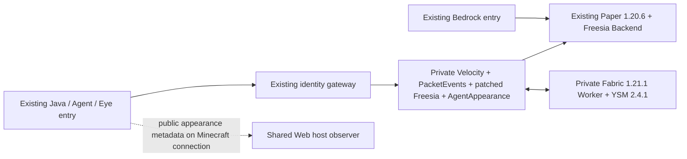

# Optional YSM bridge for the Paper server

Status (2026-10-11): deployed behind the existing identity gateway, with the existing maintenance lock, Watchdog and stopped E/F backups. Proxy bridge 0.3.0 supplies Web/camera assets and private state to the [Geyser Bedrock adapter](../geyser-ysm/README.md). Production unmodified Mineflayer, original UUIDs and exact model bundle delivery are verified; Bedrock geometry/UV/texture delivery is verified in isolation. Remote Web hosts need their own update. Native Java pixel parity, full animation/equipment parity and phone/Xbox device visuals remain unaccepted. See [adaptation status](../../docs/YSM_ADAPTATION.md) and [lifecycle](../../docs/YSM_LIFECYCLE.md).

## Runtime



All new listeners bind to loopback. The Worker Minecraft and controller ports are internal services, not additional public interfaces. Keep the existing identity gateway, exact Agent source bindings, reserved Goddess identity and registered Eye pairs. Do not expose the offline Paper/Velocity backend directly.

The candidate uses `kick_if_ysm_not_installed=false`. Vanilla Java, unmodified Mineflayer and Eye clients can continue playing without downloading model caches. A Java client that renders YSM needs the matching mod and loader; the tested protocol fixture uses Java 1.21.1. It is not an actual modded Java renderer.

The Geyser entry remains on Paper. The deployed adapter converts supported original YSM geometry and textures into Bedrock player skins, bound to native UUID and Java entity ID. It lets Bedrock viewers see assigned Java/Agent models. Assigning a model to a Bedrock player and full native animation remain separate unfinished capabilities.

## Versions and sources

- [Freesia release v2.5.1+2.4.1](https://github.com/YesSteveModel/Freesia/releases/tag/v2.5.1%2B2.4.1), source commit `5ca1e0e7399ed6826fed160baad139e82e6a6242`. Local patches are based on this release, not upstream main.
- YSM Fabric **1.21.1 / 2.4.1**, [Modrinth artifact](https://modrinth.com/mod/yes-steve-model/version/1cHRrrpZ), SHA-256 `ec51cfae84d219a45fac5098a31bfe980bcb7c2d8b413e8fffbd05a411a85680`.
- YSM channel `yes_steve_model:2_4_0`; protocol handshake **2.4.0**, artifact version **2.4.1**. Do not alias it to the separate native 2.6.5 integration.
- Fabric Loader **0.16.13**, Fabric API **0.115.4+1.21.1**, Java **21**.
- Velocity **3.4.0-SNAPSHOT build 563**, PacketEvents **2.8.0**.
- Backend **2.5.1+2.4.1** successfully loads in the isolated Paper **1.20.6** copy. Its upstream plugin metadata contains a literal `${version}`; that is not a different release.

Exact official artifact URLs and SHA-256 values are in [dependencies.json](dependencies.json). No third-party binaries, private models or world data are distributed here.

## Local changes

The full modified MPL-2.0 files are under `src/`, alongside the upstream [LICENSE](LICENSE).

1. Optional Worker failures do not kick the gameplay connection. A failed mapper is marked unavailable, and client model messages are ignored while no mapper exists.
2. Recover optional mappers every five seconds, at most 40 attempts per sweep. Controller registration can precede the Worker's Minecraft listener. Restore each player's real Paper entity ID; do not create another gameplay entity.
3. Restrict the proxy's YSM plugin-message interception to the YSM channel.
4. Make the Worker controller reconnect asynchronously, with one connect in flight, a connection timeout and a bounded pending queue. The lifecycle addon retries once after server startup and closes controller event loops on normal shutdown.
5. Publish a bounded, read-only projection of the actual Worker NBT through the existing Minecraft connection. No fake YSM handshake is added to ordinary clients.

`bridge/` implements `AgentAppearance`. `worker/` implements the Fabric lifecycle addon. The patched Freesia code is MPL-2.0; retain its license and provide these modified source files if redistributing the binaries. Model redistribution permissions are independent of Freesia's license.

## Commands

Players and Agents:

```text
/appearance status
/appearance list
```

Console only:

```text
appearance admin set <online-player> alex gsl
appearance admin set <online-player> steve tartaric_acid
appearance admin set <online-player> default_boy blue
appearance admin set <online-player> default_boy red
```

Assignment is deliberately limited to the verified bundled catalog. A request acknowledgment is not success: confirm the returned actual Worker state. An ordinary player cannot assign someone else's model. Custom models require permission checks, original asset export and renderer support before expanding this catalog.

## Metadata contract

`mcagent:appearance` carries UTF-8 JSON, at most 2048 bytes, on the existing player connection. State contains:

- `schemaVersion=1`, `type=state`, `source=freesia_worker`, random proxy `epoch`;
- `playerUuid`, public `playerName`, pinned `ysmVersion`, `protocolVersion`, `jarSha256`;
- `available`, and when available the actual Paper `entityId`, `modelId`, `texture`, `mandatory`, `animation`;
- unavailable reason `YSM_WORKER_STATE_UNAVAILABLE` (also covers a model state not yet received), or `YSM_WORKER_STATE_UNSUPPORTED` for a state outside the bounded projection;
- `type=remove` when a previously delivered owner leaves or changes backend.

Poll once per second; send changes immediately and refresh unchanged state every five seconds. Maximum 40 online players. Metadata is public appearance, **not** proof that a recipient tracks that entity. The Web host must bind the UUID and entity ID against its own existing Mineflayer connection. It expires records after 15 seconds and resets on login, respawn and disconnect. It does not write native YSM packets or open another Minecraft account.

The shared Web source is `mc-visual-console/packages/modern-viewer/renderer-src/host/viewer-appearance.mjs`. The renderer supports original geometry/UV/textures and bounded numeric animation tracks through the source bundles below. Unknown Molang/controllers/equipment are not complete native parity; `completeEntityParityVerified=false` remains explicit.

## Build

Place the pinned official artifacts from `dependencies.json` in a private dependency directory. Initialize a separate Fabric 1.21.1 / Loader 0.16.13 server with the pinned Fabric API once to generate the intermediary and processed API cache. Its cache is used only as a compile classpath; it is not a production world.

```powershell
python build.py --dependencies <private-dependencies> --output <new-private-build-directory> --jdk <jdk-21> --worker-cache <initialized-fabric-lab>
```

Use a fresh output directory. The script verifies input JAR digests, records source and cache hashes, and produces:

- `Freesia-Velocity-2.5.1+2.4.1-af1.jar`
- `Freesia-Worker-2.5.1+2.4.1-af1.jar`
- `AgentAppearance-0.3.0.jar`
- `AgentAppearance-WorkerCleanup-0.1.0.jar`
- `build-manifest.json`

The script does not install, download, restart or modify a production server. Keep generated outputs outside Git. See [Paper YSM adaptation](../../docs/YSM_ADAPTATION.md) for acceptance and remaining work.

## Deployment and rollback

This module is not wired into the production maintenance task. Before deployment, add the private Proxy/Worker to the existing single-instance supervisor and Watchdog, validate the original identity and Geyser routes, and perform the normal E/F backups and restart announcement. Preserve all original UUIDs, inventories, skills, ownership rules, ledgers and worlds. No `/reload` or server-core replacement.

Rollback restores the prior gateway backend route and removes only the newly added bridge services/plugin; preserve the existing Paper data and retain YSM assignments as separate appearance data. Rebuild and verify the matching Web consumer independently. Publishing source alone never updates a remote Agent's Web view.

References: [Freesia architecture/configuration](https://yesstevemodel.github.io/wiki/freesia-plugin/), [Geyser entity API](https://geysermc.org/wiki/geyser/custom-entities/).

## Public source catalog (0.2.0)

Set private `plugins/agentappearance/models.json` `publicModelRoot` to the Worker’s actual `yes_steve_model/custom` absolute directory. Public spec2/free=true folder and ZIP changes stabilize over two scans and generate original-byte, per-file-hashed Web bundles; catalog changes trigger native YSM model reload once per source revision. Encrypted `.ysm` needs distributable source. Viewer subscribers request bounded bundles over `mcagent:ysm_asset`; no HTTP endpoint. See the source guide above for source rights, budgets, unsupported animation, and deployment boundaries.

## Private Bedrock projection (0.3.0)

Optional `bedrockStateFile` in the same private model configuration opts into an atomic local snapshot, written once per poll from actual Worker-confirmed state. It includes the proxy epoch, timestamp, native player UUID/entity ID, original model revision and pinned YSM profile; maximum 40 rows/96 KiB. The parent directory must exist. There is no listener or client-submitted assignment input. The Geyser extension expires the file after 15 seconds and uses its own tracked native entity to decide whether to apply or restore an appearance. See the extension README for its separate version pin and installation gates.
