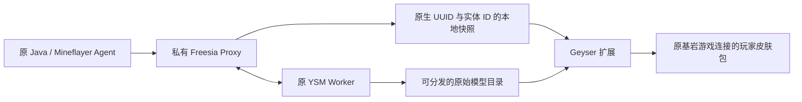

# YSM 原模型到基岩玩家外观

状态（2026-10-11）：**正式已启用扩展0.1.0**，随私有Proxy/Worker桥接发布。生产加载和原认证入口核验通过；实际基岩协议几何/UV/RGBA验证来自隔离服。完整YSM动画、控制器、装备与手机/Xbox真机画面尚未验收。见 [当前状态](../../docs/YSM_ADAPTATION.md) 和 [维护](../../docs/YSM_LIFECYCLE.md)。

## 链路



复用 `freesia-optional` 的原模型目录、实际 Worker 状态和摘要。每五秒扫描、两次稳定摘要后自动转换；用户模型的新增、替换和删除都沿用已有热重载触发器。没有 HTTP 服务、新公网端口或客户端模组。普通 Mineflayer 不订阅就不接收原资产包，原客户端无须更新。

扩展只在接收者 Geyser 连接实际缓存了同一个 **UUID、Java 实体 ID 和有效实体实例** 时应用。跨下线、重生和实体重建重新绑定。模型移除、资源不可用或状态超过十五秒未更新时恢复该角色原皮肤/披风/几何。默认皮肤和有纹理属性的皮肤分别走 Geyser 原生路径；没有纹理属性的离线 Agent 使用同一原生默认皮肤，解决该路径不触发换肤事件的问题。

当前扩展用于**基岩玩家看见通过私有 Proxy 分配的 Agent/Java 角色模型**。直接进入 Paper 的基岩玩家自己领取 YSM 模型还没有分配入口；不能把两个方向混称为全部完成。

## 支持范围

- 原 `minecraft:geometry`，保留骨骼、方块、pivot、rotation、UV，只改几何命名空间以绑定实际资源补丁。
- PNG 的 RGBA 和透明度保持原像素；支持 64×32、64×64、128×64、128×128，宽高须与几何声明一致。更大贴图明确不可用，不能缩图后冒充原 UV。
- 单个几何、最多 512 骨骼/4096 方块/512 KiB 几何 JSON；继承原目录的单模型 8 MiB 原资源限制。只处理 `spec:2`、`free:true` 的可分发原始文件夹/ZIP，不解密 `.ysm`。
- 目前是原模型基础姿态；完整原生动作、Molang、控制器及装备表现未实现。状态明确返回 `fullAnimationParity:false`、`deviceVisualsVerified:false`。
- 锁定已安装 Geyser **2.11.3-b1249 / git-master-f66329d**。使用内部玩家实体 API，升级 Geyser 必须重新构建验收；版本不匹配只禁用扩展，保留原 Geyser 游戏入口。
- 一个后台资源线程；每秒一次有界刷新，在 Geyser 自己的事件循环发包。每接收者四次/秒，全局三十二次/秒；转换缓存最多 32 项/32 MiB，当前使用集合另外限制为 32 项/32 MiB。

## 构建与配置

```powershell
python build.py --geyser <Geyser-Spigot.jar> --gson <gson-2.10.1.jar> --jdk <jdk-21> --output <新的仓库外目录>
```

脚本校验依赖摘要，输出 `AgentAppearance-Bedrock-0.1.0.jar` 和源码/产物清单，不执行安装或重启。配套 Proxy 桥版本为 **AgentAppearance 0.3.0**。

1. 在私有 Proxy 的 `plugins/agentappearance/models.json` 追加 `bedrockStateFile`：绝对本地文件路径，父目录已存在；保留原 `publicModelRoot`。两端同机，以原文件权限限制写入。
2. 把扩展 JAR 放入 `plugins/Geyser-Spigot/extensions/`。首次启动默认禁用。
3. 配置 `plugins/Geyser-Spigot/extensions/ysmbedrock/config.json`：

```json
{
  "enabled": true,
  "modelsConfig": "E:/MC/private/ysm/proxy/plugins/agentappearance/models.json",
  "stateFile": "E:/MC/private/ysm/appearance-state.json"
}
```

这是路径示例；须指向该实例实际的私有模型配置与快照文件。扩展状态在同目录 `status.json`，管理员可用 `/ysmbedrock status` 查询。`bindings/projected` 是私有运维诊断，不是玩家位置广播。

控制台仍用 `appearance admin set <在线玩家> <模型> <贴图>` 分配，最终以 Worker 实际状态及扩展 `applied` 为准。原生 YSM 会拒绝重复内容的模型；自定义测试/上传须使用独立有效模型，不能把同内容改文件夹名当成原生模型已加载。热重载期间分配失败要待 Worker 完成再重试。

## 验收与上线

原骨骼/UV/像素、实际 Cloudburst 编解码、状态摘要/过期与身份约束通过 11 项检查。实际 Geyser + Bedrock 协议 **2193 / 1.26.51** 客户端登录、收原模型包、换贴图、上传、替换、删除、过期恢复、原 Mineflayer CLI 等通过 14 项。该客户端是仅隔离服允许的自签名协议夹具，**不是微软认证登录或手机/Xbox 显示验收**；正式认证设置未改。

正常全栈冷重启后原UUID/模型分配、原几何/贴图重新投递、更新epoch/实体绑定及CLI六项通过。实际带纹理属性的角色另外三项外观检查通过：原皮肤→YSM→过期恢复原纹理URL/几何→恢复YSM。该账号探针出现旧物品组件的 `PartialReadError`；不经过Proxy、没有基岩连接的隔离Paper直连基线也复现，未改物品数据，不能把外观检查称为全部物品协议验收。

原始回执、失败尝试和正常冷重启检查在私有 `E:/MC/research/bedrock-ysm-20261010`。早期事件路径失败、测试把重复原模型复制成新模型后原生拒绝，以及重载完成前分配失败均保留。候选摘要见 [清单](../../manifests/ysm-bedrock-candidate-20261010.json)。

正式服整个 Proxy/Worker 拓扑仍未启用。发布须先接入原单实例维护、Watchdog 和双盘快照，核验原身份网关及 Floodgate 路由，再按 [维护流程](../../docs/OPERATIONS.md) 预告重启；不要只放 JAR 就声称 YSM 上线。回退恢复旧入口与扩展前外观路径，不回滚玩家物资/世界。正式服务未变动，本轮无需重启正式服。

来源：[Geyser 扩展](https://geysermc.org/wiki/geyser/extensions/)、[锁定版换肤事件](https://github.com/GeyserMC/Geyser/blob/f66329d9d21b3c836edc014fbb9d8312fbe34285/api/src/main/java/org/geysermc/geyser/api/event/bedrock/SessionSkinApplyEvent.java)、[原生皮肤发包](https://github.com/GeyserMC/Geyser/blob/f66329d9d21b3c836edc014fbb9d8312fbe34285/core/src/main/java/org/geysermc/geyser/skin/SkinManager.java)。
